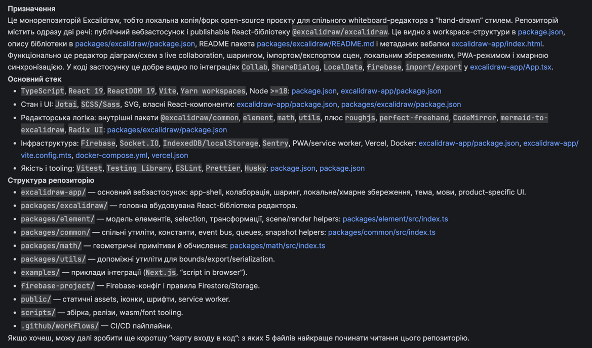
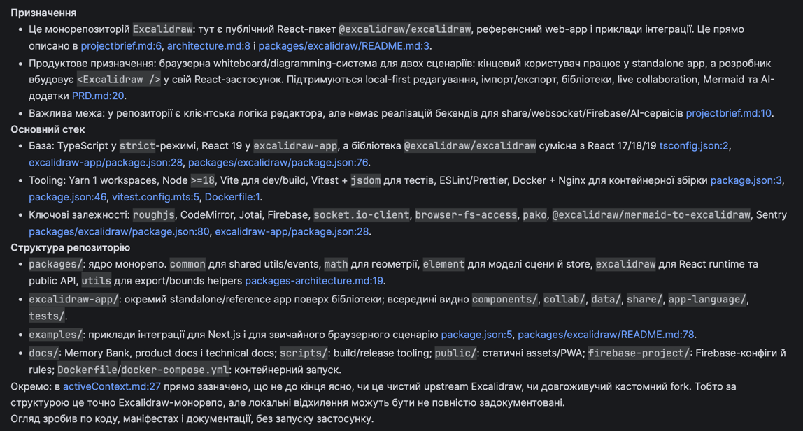

# Домашнє завдання: вплив Memory Bank на контекст агента

У цьому каталозі зібрані матеріали для порівняння відповіді агента до та після додавання Memory Bank у проєкт.

## Матеріали

- [Відповідь агента до Memory Bank](docs/home-work/start.md)
- [Скріншот відповіді до Memory Bank](docs/home-work/start.png)
- [Відповідь агента після Memory Bank](docs/home-work/finish.md)
- [Скріншот відповіді після Memory Bank](docs/home-work/finish.png)
- [Порівняння та оцінка результату](docs/home-work/result.md)

## До додавання Memory Bank

## Після додавання Memory Bank

## Короткий підсумок

За результатом аналізу, більш точний контекст проєкту дає відповідь після додавання Memory Bank.

- `start.md` — 7/10
- `finish.md` — 9/10

`start.md` краще працює як швидкий технічний огляд, але `finish.md` точніше описує межі репозиторію, ролі його частин і ключові архітектурні акценти, тому краще передає реальний контекст проєкту.
