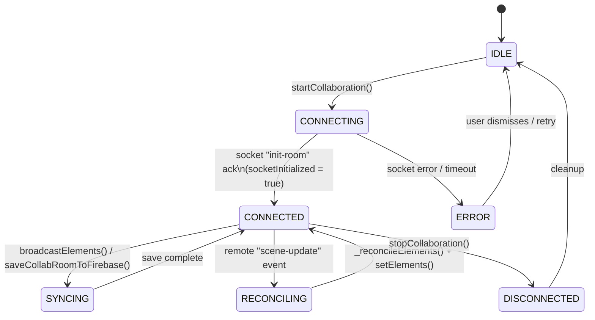
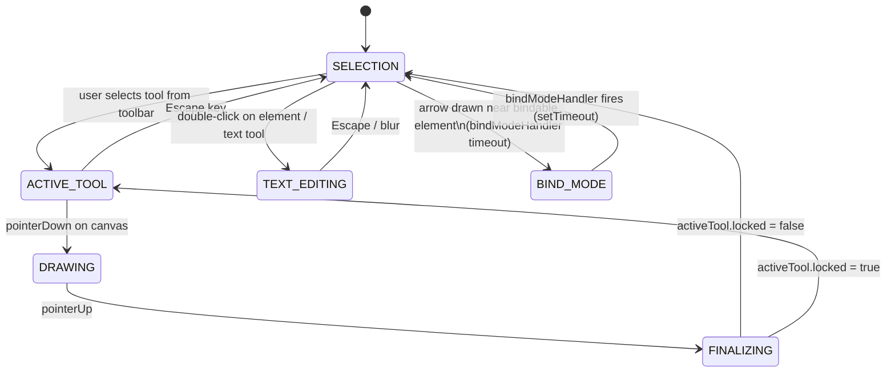
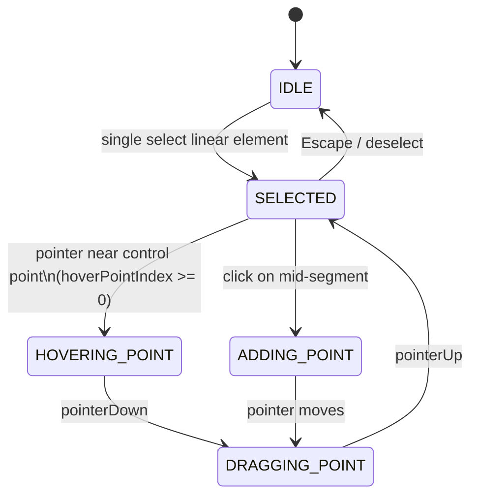
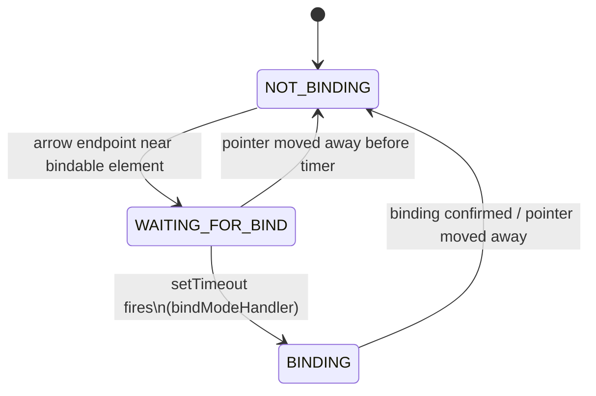

# Decision Log — Undocumented Behaviors & Technical Debt

> **Audience**: Senior engineers, architects, and technical leads.
> **Scope**: Source files under `excalidraw-app/` and `packages/` (per `docs/scopes/application.scope.md`).
> **Generated**: 2026-03-28

---

## Table of Contents

1. [Implicit State Machines](#1-implicit-state-machines)
2. [Non-obvious Side Effects](#2-non-obvious-side-effects)
3. [Initialization Order Dependencies](#3-initialization-order-dependencies)
4. [Hidden Assumptions & Constraints](#4-hidden-assumptions--constraints)
5. [Annotated Findings (HACK / FIXME / TODO / NOTE)](#5-annotated-findings)

---

## 1. Implicit State Machines

### 1.1 Collaboration Lifecycle State Machine

The collaboration session in `excalidraw-app/collab/Collab.tsx` is driven by socket events and a series of side-effect-heavy async operations. There is no single explicit state object; state is inferred from a combination of Jotai atoms (`isCollaboratingAtom`, `collabErrorIndicatorAtom`) and instance flags (`socketInitialized`, `isSyncing`).



**Key implicit transitions:**
- `CONNECTING → CONNECTED` is confirmed only after the server `"init-room"` message sets `portal.socketInitialized = true` (line 751 of Collab.tsx). Nothing else gates this.
- `restoreElements()` runs **before** reconciliation (line 762), not after. The comment admits this is wrong but required because running it after would re-generate ephemeral state (e.g., `appState.newElement`), breaking in-progress drawing.
- `LocalData.pauseSave("collaboration")` is called on start but there is no guaranteed symmetric resume on error paths — the pause can be left active if an exception is thrown mid-startup.

---

### 1.2 Active Tool / Drawing State Machine

Located in `packages/excalidraw/components/App.tsx`. The tool state is held in `appState.activeTool` and `appState.preferredSelectionTool`, with transitions triggered by user input events.



**Implicit logic:** `bindModeHandler` is a `ReturnType<typeof setTimeout>` stored as a class instance property. The transition **back** from `BIND_MODE` to `SELECTION` is purely time-driven — no event. This is a hidden timing assumption: if the system is frozen (e.g., long GC pause), the bind mode timer may fire at an unexpected time, leaving the arrow bound to a wrong target.

---

### 1.3 Linear Element Editor State Machine

`packages/element/src/linearElementEditor.ts` manages a multi-step editing workflow for lines and arrows.



**Hidden assumption:** `selectedPointsIndices` and `hoverPointIndex` are both stored in `appState.selectedLinearElement`. They must be kept in sync on every pointer event. If the pointerUp handler fires without a matching pointerDown (e.g., during mobile scroll), `hoverPointIndex` can remain non-negative while no drag is active, causing phantom hover rendering.

---

### 1.4 Bind Mode Timer (Implicit Async State)



The timer is reset on every pointer move, creating a debounce pattern that is **not** documented as a deliberate state transition. If two concurrent pointer devices are active (e.g., stylus + touch), they share the same `bindModeHandler` reference, potentially cancelling each other's binding.

---

## 2. Non-obvious Side Effects

---

### Found: Raw `mutateElement()` calls bypass history and multiplayer sync

- **File**: `packages/excalidraw/components/App.tsx`
- **Comment**: `// NOTE: We use the raw mutateElement() because we don't want history entries or multiplayer updates`
- **Code**:
  ```typescript
  // Lines 11376, 11386, 11401, 11412
  mutateElement(bindable, this.scene.getElementsMapIncludingDeleted(), {
    boundElements: bindable.boundElements!.filter((e) => e.id !== element.id),
  });
  ```
- **Detected Behavior**: Directly mutates elements in place without triggering the Store's capture pipeline, so the change is invisible to undo/redo history and does not propagate to collab peers.
- **Implicit Logic**: The caller assumes these mutations are "cleanup-only" operations that do not need versioning. If called at the wrong time (e.g., during an active collaboration session where a peer has a stale `boundElements` array), the remote state and local state diverge silently.
- **Risk**: **Silent state divergence in collab.** After an arrow is deleted locally, its former binding targets have `boundElements` cleaned up via raw mutation — collaborators never see this cleanup. Their elements retain stale `boundElements` entries until the next full reconciliation.
- **Type**: NOTE → design constraint; deeper architectural issue with the "silent mutation" pattern.

---

### Found: FileManager won't retry failed saves

- **File**: `excalidraw-app/data/FileManager.ts`
- **Comment**: `// NOTE if errored during save, won't retry due to this check`
- **Code**:
  ```typescript
  if (fileData && !this.isFileSavedOrBeingSaved(fileData)) {
    addedFiles.set(element.fileId, files[element.fileId]);
    this.savingFiles.set(element.fileId, this.getFileVersion(fileData));
  }
  ```
- **Detected Behavior**: Once a file is added to `savingFiles`, it is treated as "in progress" and skipped on subsequent save attempts. If the save throws (network error, Firebase quota), the file ID remains in `savingFiles` but is never moved to the "saved" set. All future calls to `saveFiles()` will silently skip it.
- **Implicit Logic**: The assumption is that saves never fail, or that the app lifetime is short enough that a retry isn't needed. Neither is safe for a collaborative web app.
- **Risk**: **Permanent data loss for image elements in collab sessions.** Images embedded after a transient network error will never be uploaded to Firebase, causing broken image references for all collaborators.
- **Type**: NOTE → silent failure; potential data loss bug.

---

### Found: `isSomeElementSelected` module-level memoization is not instance-safe

- **File**: `packages/element/src/selection.ts`
- **Comment**: `// FIXME move this into the editor instance to keep utility methods stateless`
- **Code**:
  ```typescript
  export const isSomeElementSelected = (function () {
    let lastElements: readonly NonDeletedExcalidrawElement[] | null = null;
    let lastSelectedElementIds: AppState["selectedElementIds"] | null = null;
    let isSelected: boolean | null = null;
    // ...
  })();
  ```
- **Detected Behavior**: The memoization cache is shared across **all** Excalidraw instances in the same JS module scope. If two `<Excalidraw>` components are mounted simultaneously (e.g., in a dashboard), they share and clobber each other's cached selection state.
- **Implicit Logic**: Assumes single-instance usage. Any multi-instance scenario (e.g., embedding multiple canvases, library preview rendering) will produce stale/incorrect selection results.
- **Risk**: **Incorrect selection behavior in multi-instance deployments.** The bug manifests as "ghost selections" or selections that toggle unexpectedly across unrelated canvases.
- **Type**: FIXME → global state that should be instance-scoped.

---

### Found: `restoreElements` runs before reconciliation in collab

- **File**: `excalidraw-app/collab/Collab.tsx`
- **Comment**: `// NOTE ideally we restore _after_ reconciliation but we can't do that as we'd regenerate even elements such as appState.newElement which would break the state`
- **Code**:
  ```typescript
  remoteElements = restoreElements(remoteElements, existingElements);
  let reconciledElements = reconcileElements(existingElements, remoteElements, appState);
  ```
- **Detected Behavior**: Remote elements are restored (IDs normalized, missing fields populated) before being merged with local elements. This means garbage-collected or partially missing fields are regenerated in the remote payload before conflict resolution, potentially overwriting valid local fields with defaults.
- **Implicit Logic**: `restoreElements` is idempotent and safe to call early only if `appState.newElement` is not yet in the scene. This is true only if the user is **not** currently drawing when the remote update arrives. Under concurrent drawing, remote restore can regenerate the in-progress element with default values.
- **Risk**: **Drawing corruption under concurrent collab.** If a remote scene update arrives while the local user is mid-draw, the `newElement` in `appState` can be replaced with a restored default, dropping the in-progress shape.
- **Type**: NOTE → ordering constraint with known trade-off.

---

### Found: Deletion during restore doesn't record to store

- **File**: `packages/excalidraw/data/restore.ts`
- **Comment**: `// TODO: we should not do this since it breaks sync / versioning when we exchange / apply just deltas and restore the elements (deletion isn't recorded)`
- **Code**:
  ```typescript
  element = { ...element, originalText: text, isDeleted: true };
  element = bumpVersion(element);
  ```
- **Detected Behavior**: Elements with truncated text are silently deleted during restore by setting `isDeleted: true` and bumping the version. This mutation is not captured by the Store, so it does not produce a delta, does not enter undo history, and is not broadcast to collab peers.
- **Implicit Logic**: Restore is assumed to be a "safe normalization pass." In practice it changes element lifecycle state, which breaks delta-based sync protocols.
- **Risk**: **Deleted elements reappear for collaborators.** Peers who receive a delta-only sync after this restore will see elements that the local client has already deleted but never broadcast.
- **Type**: TODO → known design violation; breaks delta sync.

---

### Found: Collab `LocalData.pauseSave` may not be resumed on error

- **File**: `excalidraw-app/collab/Collab.tsx`
- **Comment**: `// TODO: 'ImportedDataState' type here seems abused`
- **Code**:
  ```typescript
  this.setIsCollaborating(true);
  LocalData.pauseSave("collaboration");
  const { default: socketIOClient } = await import("socket.io-client");
  ```
- **Detected Behavior**: `LocalData.pauseSave` is called optimistically before the async socket import. If the dynamic import fails (network timeout, CDN unavailable), `pauseSave` remains active but `stopCollaboration()` is never called to resume it.
- **Implicit Logic**: Assumes the async import always succeeds. The local persistence layer stays paused indefinitely, preventing auto-save.
- **Risk**: **Loss of auto-save on collaboration startup failure.** User edits made after a failed collab start are never persisted locally.
- **Type**: TODO (type abuse) → also a latent control-flow bug.

---

## 3. Initialization Order Dependencies

---

### Found: Wheel/touch events must be registered imperatively, not via React

- **File**: `packages/excalidraw/components/App.tsx`
- **Comment**: `// NOTE wheel, touchstart, touchend events must be registered outside of react because react binds them passively (so we can't preventDefault on them)`
- **Code**:
  ```typescript
  private handleInteractiveCanvasRef = (canvas: HTMLCanvasElement | null) => {
    if (canvas !== null) {
      this.interactiveCanvas = canvas;
      this.interactiveCanvas.addEventListener(EVENT.TOUCH_START, this.onTouchStart, { passive: false });
      this.interactiveCanvas.addEventListener(EVENT.TOUCH_END, this.onTouchEnd);
    }
  };
  ```
- **Detected Behavior**: `touchstart` and `wheel` events are attached imperatively in the canvas ref callback using `{ passive: false }`. This is the only way to call `preventDefault()` on these events (React 17+ makes all event listeners passive by default for performance).
- **Implicit Logic**: The canvas ref callback is the **only** safe place to attach these listeners. Attaching them in `componentDidMount` or `useEffect` risks a race with React's reconciliation. The ref callback fires synchronously when the DOM node is available.
- **Initialization Order**: `this.interactiveCanvas` must be set (via the ref callback) before any touch/wheel handling logic. Nothing enforces this at the type level — `this.interactiveCanvas` is typed as `HTMLCanvasElement | null`.
- **Risk**: If React replaces the canvas node during re-mount (e.g., due to Strict Mode double-invoke), the old listeners are removed correctly, but a bug in the cleanup path would leave orphaned event listeners that fire against a detached DOM node.
- **Type**: NOTE → architecture constraint; correct but fragile.

---

### Found: `flushSync` required for bind mode state visibility

- **File**: `packages/excalidraw/components/App.tsx`
- **Comment**: `// NOTE: We need the flushSync here for the delayed bind mode change to see the right state (specifically the newElement)`
- **Code**:
  ```typescript
  flushSync(() => {
    this.setState((prevState) => {
      let linearElementEditor = null;
      // ... creates LinearElementEditor using element
    });
  });
  ```
- **Detected Behavior**: `flushSync` forces React to synchronously flush the pending state update before returning control. Without it, the `bindModeHandler` setTimeout fires against stale `this.state.newElement`.
- **Implicit Logic**: The delayed bind mode change and the element creation setState must be committed in the correct order within the same synchronous tick. This is a timing dependency between a `setTimeout` callback and React's deferred rendering.
- **Risk**: **React 18 Concurrent Mode incompatibility.** `flushSync` suppresses concurrent features for the wrapped update. If the app is migrated to concurrent rendering with transitions, this pattern will need to be rethought — it cannot be replaced by a transition without re-evaluating the bind mode timer architecture.
- **Type**: NOTE → timing dependency; coupled to React rendering model.

---

### Found: `Scene.getScene()` static accessor used as workaround

- **File**: `packages/element/src/elbowArrow.ts`
- **Comment**: `// TODO (dwelle,mtolmacs): Remove this once Scene.getScene() is removed`
- **Code**:
  ```typescript
  // 0. During all element replacement in the scene, we just need to renormalize the arrow
  // TODO (dwelle,mtolmacs): Remove this once Scene.getScene() is removed
  if (elementsMap.size === 0 && areUpdatedPointsValid) {
    return normalizeArrowElementUpdate(/* ... */);
  }
  ```
- **Detected Behavior**: When `elementsMap.size === 0`, the function short-circuits to a normalization-only path. This special case exists because `Scene.getScene()` is a static singleton accessor that returns a globally registered scene — when no scene is registered (e.g., during tests or server-side rendering), `elementsMap` will be empty.
- **Implicit Logic**: An empty `elementsMap` is used as a sentinel for "no scene context available." This conflates two distinct states: (a) scene is not yet initialized, (b) scene has zero elements. A scene with zero elements should still route through normal processing.
- **Risk**: **Wrong routing for empty scenes.** A legitimate scene with no elements will take the normalization-only path and skip binding resolution. This can silently drop arrow binding on scenes that have just been cleared.
- **Type**: TODO → architectural workaround; depends on removal of global singleton.

---

### Found: Library migration adapter active since 2024-03-11

- **File**: `excalidraw-app/App.tsx`
- **Comment**: `// TODO maybe remove this in several months (shipped: 24-03-11)`
- **Code**:
  ```typescript
  useHandleLibrary({
    excalidrawAPI,
    adapter: LibraryIndexedDBAdapter,
    // TODO maybe remove this in several months (shipped: 24-03-11)
    migrationAdapter: LibraryLocalStorageMigrationAdapter,
  });
  ```
- **Detected Behavior**: Every app startup runs the `LibraryLocalStorageMigrationAdapter` to migrate library data from `localStorage` to IndexedDB. Once migrated, `localStorage` is empty and this adapter is a no-op — but it still runs the detection logic on every load.
- **Implicit Logic**: The migration adapter is assumed to be safe to run repeatedly (idempotent). If a regression causes it to re-read stale/corrupted `localStorage` data, it will overwrite the IndexedDB library on every load.
- **Risk**: **Ongoing startup overhead.** More critically, a regression in the adapter could corrupt user libraries on upgrade. The adapter has now been running for over a year without removal.
- **Type**: TODO → time-bounded workaround, deadline long past.

---

## 4. Hidden Assumptions & Constraints

---

### Found: Hit-test threshold has a hardcoded FP precision floor

- **File**: `packages/excalidraw/components/App.tsx`
- **Comment**: `// NOTE: Here be dragons. Do not go under the 0.63 multiplier unless you're willing to test extensively. The hit testing starts to become unreliable due to FP imprecision under 0.63 in high zoom levels.`
- **Code**:
  ```typescript
  getElementHitThreshold(element: ExcalidrawElement) {
    return Math.max(
      element.strokeWidth / 2 + 0.1,
      0.85 * (DEFAULT_COLLISION_THRESHOLD / this.state.zoom.value),
    );
  }
  ```
- **Detected Behavior**: The hit threshold is dynamically computed based on zoom level but has a hard lower bound enforced by `Math.max`. The 0.63 multiplier referenced in the comment is not in the current code (it has been updated to 0.85), but the constraint — "do not make the multiplier too small" — remains.
- **Implicit Logic**: At high zoom values, the threshold approaches zero. Floating-point arithmetic in the collision detection routines starts producing false negatives (misses on valid hits) below a certain threshold. The precise value depends on the collision math, not the threshold alone.
- **Risk**: Changing `DEFAULT_COLLISION_THRESHOLD` or adding device-pixel-ratio scaling could push the effective threshold below the safe floor without triggering any test failures, causing "unclickable" elements at high zoom.
- **Type**: NOTE → magic constant with undocumented origin.

---

### Found: `positionElementsOnGrid` is self-admitted vibe-coded

- **File**: `packages/element/src/positionElementsOnGrid.ts`
- **Comment**: `// TODO rewrite (mostly vibe-coded)`
- **Code**:
  ```typescript
  export const positionElementsOnGrid = <TElement extends ExcalidrawElement>(
    elements: TElement[] | TElement[][],
    centerX: number,
    centerY: number,
    padding = 50,
  ): TElement[] => {
    const numColumns = Math.max(1, Math.ceil(Math.sqrt(numUnits)));
    // ...
  };
  ```
- **Detected Behavior**: Grid layout uses `Math.ceil(Math.sqrt(N))` columns, approximating a square arrangement with no regard for aspect ratios, element sizes, or available canvas space.
- **Implicit Logic**: Assumes all atomic units have roughly equal bounding boxes. For a mix of large frames and small shapes, the grid will produce overlapping or wildly misaligned placements.
- **Risk**: **AI-generated element positioning is incorrect for heterogeneous scenes.** This function is used in the AI/flowchart features. Incorrect placement during AI generation results in users manually repositioning elements after every generation.
- **Type**: TODO → acknowledged low-quality implementation.

---

### Found: `isElementInFrame` is O(n) and identified as bottleneck

- **File**: `packages/element/src/frame.ts`
- **Comment**: `// TODO: this a huge bottleneck for large scenes, optimise`
- **Code**:
  ```typescript
  export const isElementInFrame = (
    element: ExcalidrawElement,
    allElementsMap: ElementsMap,
    appState: StaticCanvasAppState,
    opts?: { targetFrame?: ExcalidrawFrameLikeElement; checkedGroups?: Map<string, boolean> },
  ) => { ... }
  ```
- **Detected Behavior**: Called for every render to determine frame membership. For large scenes (thousands of elements), this scales quadratically when called across all elements.
- **Implicit Logic**: The function traverses group hierarchies and element maps on every call. There is no caching or dirty-flag mechanism.
- **Risk**: **Render jank in large scenes.** Users with scenes of 500+ elements in frames will experience increasing frame drop as the scene grows, particularly during drag operations which trigger continuous re-renders.
- **Type**: TODO → known performance bottleneck, no mitigation in place.

---

### Found: Snapping gap limit is arbitrarily large

- **File**: `packages/excalidraw/snapping.ts`
- **Comment**: `// TODO increase or remove once we optimize`
- **Code**:
  ```typescript
  // do not compute more gaps per axis than this limit
  const VISIBLE_GAPS_LIMIT_PER_AXIS = 99999;
  ```
- **Detected Behavior**: Gap snapping is limited to 99,999 candidates per axis. This is effectively unlimited for typical scenes but exists to prevent O(n²) blowup for very large element counts.
- **Implicit Logic**: The limit is a safety valve, not a deliberate UX choice. At exactly 99,999 gaps, snapping silently stops computing additional candidates, meaning snapping behavior degrades invisibly for extreme scenes.
- **Risk**: **Silent snapping degradation.** There is no UI indication when the limit is hit; the user just gets fewer snap points without explanation.
- **Type**: TODO → placeholder limit with no measurement-backed value.

---

### Found: Elbow arrow normalization overflow guard is temporary

- **File**: `packages/element/src/elbowArrow.ts`, `packages/element/src/newElement.ts`, `packages/element/src/shape.ts`, `packages/excalidraw/data/restore.ts`, `packages/utils/src/shape.ts`
- **Comment**: `// NOTE (mtolmacs): This is a temporary check to see if the normalization creates an overly large arrow. This should be removed once we have an answer.`
- **Code** (representative, from `elbowArrow.ts:2119`):
  ```typescript
  if (
    offsetX < -MAX_POS || offsetX > MAX_POS ||
    offsetY < -MAX_POS || offsetY > MAX_POS ||
    // ...
  ) {
    // log error, skip rendering
  }
  ```
- **Detected Behavior**: Five separate files contain independent overflow guards for element positions/sizes exceeding 1e6 units. When triggered, the guards either skip rendering (shape.ts), log errors (newElement.ts, elbowArrow.ts), or reset arrow points to a safe default (restore.ts).
- **Implicit Logic**: There is an unresolved bug in the elbow arrow normalization algorithm that can produce coordinates of astronomical magnitude. The guards are stopgaps while the root cause is being investigated. The root cause is tracked but has not been fixed.
- **Risk**: **Elbow arrows silently disappear.** When the overflow condition is hit, arrows are rendered as empty shapes. From the user's perspective the arrow vanishes with no error. The `console.error` calls are the only signal, invisible to end users.
- **Type**: NOTE (TEMPORARY) → active bug under investigation; five separate workarounds across the codebase.

---

### Found: Delta comparison logic is suspected wrong

- **File**: `packages/element/src/delta.ts`
- **Comment**: `// TODO: this seems wrong, we are already doing this comparison generically above, hence instead we should check whether elements are actually visible`
- **Code** (lines 842, 853):
  ```typescript
  case "lockedMultiSelections":
    if (!isShallowEqual(prevLockedUnits, nextLockedUnits)) {
      visibleDifferenceFlag.value = true;
    }
    break;
  case "activeLockedId":
    if (prevHitLockedId !== nextHitLockedId) {
      visibleDifferenceFlag.value = true;
    }
    break;
  ```
- **Detected Behavior**: The `filterInvisibleChanges` function is supposed to suppress no-op state updates from being recorded as history entries. The comparisons for `lockedMultiSelections` and `activeLockedId` may be redundant with a generic comparison run earlier, meaning changes that are visually identical (same render output) are still recorded as separate undo entries.
- **Implicit Logic**: The function's contract is "return true only if the change is visible to the user." If the comparison is wrong, it returns true for invisible changes, polluting undo history with empty entries.
- **Risk**: **Phantom undo entries.** Users pressing Ctrl+Z may see undo steps that appear to do nothing, eroding trust and obscuring actual changes in the undo stack.
- **Type**: TODO → suspected correctness bug in history filtering.

---

### Found: `StoreChange` excludes binary files — not a drop-in `onChange` replacement

- **File**: `packages/element/src/store.ts`
- **Comment**: `// TODO: we might need to have binary files here as well, in order to be drop-in replacement for onChange`
- **Code**:
  ```typescript
  export class StoreChange {
    private constructor(
      public readonly elements: Record<string, OrderedExcalidrawElement>,
      public readonly appState: Partial<ObservedAppState>,
    ) {}
  }
  ```
- **Detected Behavior**: `StoreChange` tracks element and appState changes but does not include binary file changes (images, fonts). The public `onChange` callback in the Excalidraw API receives all three. Any consumer relying on `StoreChange` as an `onChange` equivalent will miss image upload/removal events.
- **Implicit Logic**: The design assumes binary files change infrequently and can be handled separately. This assumption breaks down in image-heavy collaborative scenes where file uploads are frequent.
- **Risk**: **Missed file change events for `StoreChange` consumers.** Any plugin or integration that hooks into store increments rather than the raw `onChange` API will have an incomplete view of scene state.
- **Type**: TODO → incomplete abstraction.

---

### Found: `textWysiwyg` theme updates rely on `onChangeEmitter`, not Store

- **File**: `packages/excalidraw/wysiwyg/textWysiwyg.tsx`
- **Comment**: `// FIXME after we start emitting updates from Store for appState.theme`
- **Code**:
  ```typescript
  const unsubOnChange = app.onChangeEmitter.on((elements) => {
    if (app.state.theme !== LAST_THEME) {
      updateWysiwygStyle();
    }
  });
  ```
- **Detected Behavior**: The WYSIWYG text editor listens for theme changes via the `onChangeEmitter` (which fires on every element change), polling `app.state.theme` each time. This is a polling pattern masquerading as an event listener.
- **Implicit Logic**: Theme changes are not emitted as discrete events from the Store. The listener fires thousands of times per editing session (once per element mutation) to catch a theme change that happens at most once per session.
- **Risk**: **Performance regression in text-heavy sessions.** Every element mutation during text editing triggers a theme comparison. Also, if the theme is changed while no elements are being mutated (e.g., from an external API call), the style update is deferred until the next element change, causing a brief visual flash.
- **Type**: FIXME → workaround for missing Store event; performance and correctness concern.

---

### Found: `UIOptions` normalization missing in parent component

- **File**: `packages/excalidraw/index.tsx`
- **Comment**: `// FIXME normalize/set defaults in parent component so that the memo resolver compares the same values`
- **Code**:
  ```typescript
  const UIOptions: AppProps["UIOptions"] = {
    ...props.UIOptions,
    canvasActions: {
      ...DEFAULT_UI_OPTIONS.canvasActions,
      ...canvasActions,
    },
  };
  ```
- **Detected Behavior**: `UIOptions` is rebuilt from `props.UIOptions` on every render of the `Excalidraw` component. The resulting object is always a new reference, so any `React.memo` or `useMemo` dependency on `UIOptions` will always see a "changed" value, defeating memoization.
- **Implicit Logic**: Consumers who pass a stable `UIOptions` object (e.g., defined outside the component) still cause unnecessary re-renders of all memoized children because the normalization step creates a new object.
- **Risk**: **Unnecessary re-renders on every parent render.** This affects the toolbar, panels, and any other memoized child. In high-frequency update scenarios (collab, animations), this can add significant rendering overhead.
- **Type**: FIXME → performance issue from incorrect memoization boundary.

---

### Found: `colors.ts` has a circular dependency workaround

- **File**: `packages/common/src/colors.ts`
- **Comment**: `// FIXME can't put to utils.ts rn because of circular dependency`
- **Code**:
  ```typescript
  const pick = <R extends Record<string, any>, K extends readonly (keyof R)[]>(
    source: R,
    keys: K,
  ) => { ... }
  ```
- **Detected Behavior**: A generic `pick` utility is defined inline in `colors.ts` because moving it to `utils.ts` creates a circular import cycle. This is a symptom of `colors.ts` and `utils.ts` importing each other (directly or transitively).
- **Implicit Logic**: The module dependency graph has a cycle that prevents utility functions from living in their natural home. The workaround duplicates logic and makes the cycle harder to resolve over time.
- **Risk**: **Module initialization order is unpredictable** in environments where circular dependencies cause one module to see an incomplete export of another. Any new import added to `utils.ts` could inadvertently trigger a circular dependency failure at runtime.
- **Type**: FIXME → module architecture issue.

---

## 5. Annotated Findings

> Summary table of all flagged comments by category and risk level.

| File | Line | Type | Brief Description | Risk |
|------|------|------|-------------------|------|
| `excalidraw-app/App.tsx` | 417 | TODO | Library migration adapter still active since 2024-03-11 | Medium |
| `excalidraw-app/collab/Collab.tsx` | 499 | TODO | `ImportedDataState` type abused; also latent pause/resume bug | High |
| `excalidraw-app/collab/Collab.tsx` | 762 | NOTE | `restoreElements` before reconciliation — known ordering violation | High |
| `excalidraw-app/data/FileManager.ts` | 107 | NOTE | Failed saves never retried → silent data loss | High |
| `packages/common/src/colors.ts` | 116 | FIXME | `pick` utility trapped by circular dependency | Low |
| `packages/common/src/constants.ts` | 123 | TODO | Font ID should be a hash, not an integer | Low |
| `packages/common/src/points.ts` | 67 | TODO | Free drawing shake due to rounding | Medium |
| `packages/element/src/Scene.ts` | 179 | NOTE | `selectedElementIds` optional due to missing App coupling | Low |
| `packages/element/src/delta.ts` | 726 | TODO | Empty undo/redo entries from deleted element references | Medium |
| `packages/element/src/delta.ts` | 842, 853 | TODO | Wrong/redundant comparison in `filterInvisibleChanges` | Medium |
| `packages/element/src/delta.ts` | 1422 | TODO | No semantic/syntactic validation before applying element deltas | High |
| `packages/element/src/delta.ts` | 1738 | TODO | Bound arrows sometimes redrawn incorrectly | Medium |
| `packages/element/src/delta.ts` | 1882 | TODO | Missing `startBinding`/`endBinding` in `BoundElement` context | Medium |
| `packages/element/src/delta.ts` | 1970 | TODO | Precise binding check is expensive; no optimization | Medium |
| `packages/element/src/elbowArrow.ts` | 995, 1059 | TODO | `Scene.getScene()` singleton workaround | Medium |
| `packages/element/src/elbowArrow.ts` | 2119 | NOTE | Temporary overflow check for normalization bug | High |
| `packages/element/src/frame.ts` | 752 | TODO | `isElementInFrame` O(n) bottleneck | High |
| `packages/element/src/frame.ts` | 912 | TODO | Frame naming logic applies to all frames, not just AI frames | Low |
| `packages/element/src/newElement.ts` | 103 | NOTE | Temporary large position/size guard | Medium |
| `packages/element/src/positionElementsOnGrid.ts` | 6 | TODO | Vibe-coded grid layout | Medium |
| `packages/element/src/selection.ts` | 138 | FIXME | Module-level memoization breaks multi-instance | High |
| `packages/element/src/shape.ts` | 899 | NOTE | Temporary guard for oversized elbow arrow shapes | High |
| `packages/element/src/sizeHelpers.ts` | 27 | TODO | Invisible elements leak into store / export / collab | High |
| `packages/element/src/store.ts` | 109 | TODO | `scheduleCapture()` called too broadly; error-prone | Medium |
| `packages/element/src/store.ts` | 434 | TODO | `StoreChange` missing binary files | Medium |
| `packages/element/src/store.ts` | 980, 981 | TODO | Deep clone strategy in snapshots unresolved | Low |
| `packages/element/src/textMeasurements.ts` | 31, 98 | FIXME | Misleadingly named exported functions | Low |
| `packages/element/src/typeChecks.ts` | 212 | TODO | Distance calculation approximation in type checking | Low |
| `packages/excalidraw/actions/actionAlign.tsx` | 50 | TODO | Frame alignment disabled silently | Low |
| `packages/excalidraw/actions/actionDistribute.tsx` | 43 | TODO | Frame distribution disabled silently | Low |
| `packages/excalidraw/actions/actionFinalize.tsx` | 142, 232 | TODO | Invisible elements recorded by store; restoreable via undo | High |
| `packages/excalidraw/actions/actionFinalize.tsx` | 346 | TODO | Over-captures on finalize causing inconsistencies | Medium |
| `packages/excalidraw/components/App.tsx` | 689 | TODO/HACK | Touch/pointer event unification incomplete | Medium |
| `packages/excalidraw/components/App.tsx` | 6043 | NOTE | Hit-test FP threshold magic constant 0.85 | Medium |
| `packages/excalidraw/components/App.tsx` | 7126 | HACK | Mobile linear element transform handles disabled | Low |
| `packages/excalidraw/components/App.tsx` | 8758 | FIXME | Bare FIXME — text binding container resolution | Medium |
| `packages/excalidraw/components/App.tsx` | 9216 | NOTE | `flushSync` timing dependency for bind mode | High |
| `packages/excalidraw/components/App.tsx` | 10007 | NOTE | Hacky `frameId` reset during duplicate | Low |
| `packages/excalidraw/components/App.tsx` | 11376–11412 | NOTE | Raw `mutateElement` bypasses history/collab | High |
| `packages/excalidraw/components/App.tsx` | 11754 | NOTE | Imperative event registration required for touch/wheel | Medium |
| `packages/excalidraw/components/EyeDropper.tsx` | 105 | FIXME | Eye dropper preview not repositioned at viewport edge | Low |
| `packages/excalidraw/data/library.ts` | 253 | TODO | Library jotai store not scoped per Excalidraw instance | Medium |
| `packages/excalidraw/data/restore.ts` | 408 | TODO | Silent deletion during restore breaks delta sync | High |
| `packages/excalidraw/data/restore.ts` | 502 | TODO | Arrow and linear element types not separated | Low |
| `packages/excalidraw/data/restore.ts` | 765 | NOTE | Temporary fix for large unbound elbow arrows | High |
| `packages/excalidraw/fonts/Fonts.ts` | 339 | TODO | Font ID number type blocks custom font support | Medium |
| `packages/excalidraw/index.tsx` | 105 | FIXME | `UIOptions` rebuilt each render — breaks memoization | Medium |
| `packages/excalidraw/snapping.ts` | 44 | TODO | Snap gap limit is arbitrary; degrades silently | Low |
| `packages/excalidraw/wysiwyg/textWysiwyg.tsx` | 964 | FIXME | Theme polling in `onChangeEmitter` instead of Store event | Medium |
| `packages/math/src/point.ts` | 26, 30 | TODO | Point type migration in progress; dual overloads | Low |
| `packages/utils/src/shape.ts` | 198 | NOTE | Temporary guard for null `Drawable` in shape ops | Medium |
| `packages/utils/src/shape.ts` | 361 | TODO | Rounded rectangle implementation is placeholder | Low |

---

## Appendix: High-Risk Issue Clusters

### Cluster A: Elbow Arrow Overflow (5 files)
The same root cause — unbounded coordinate generation in the normalization algorithm — is guarded independently in:
- `packages/element/src/newElement.ts:103`
- `packages/element/src/elbowArrow.ts:2119`
- `packages/element/src/shape.ts:899`
- `packages/excalidraw/data/restore.ts:765`
- `packages/utils/src/shape.ts:198`

**Recommended action**: Track down the normalization bug (likely in `updateElbowArrowPoints` or `generateElbowArrowShape`), fix the root cause, and remove all five guards together.

---

### Cluster B: Delta/Store Integrity (6 locations, tracked as #7348)
Issues tagged `// TODO: #7348` represent a known gap in the undo/redo + collab delta system:
- `delta.ts:726` — empty undo entries
- `delta.ts:1422` — missing semantic validation
- `delta.ts:1882` — missing arrow rebind context
- `actionFinalize.tsx:142, 232` — invisible elements in store
- `restore.ts:408` — deletion not recorded

**Recommended action**: These should be addressed together as part of issue #7348; fixing one in isolation may shift the bug to another location.

---

### Cluster C: Multi-Instance Isolation
Three issues break `<Excalidraw>` multi-instance correctness:
- `selection.ts:138` — module-level selection cache
- `data/library.ts:253` — jotai store not per-instance
- `index.tsx:105` — `UIOptions` memo breaks

**Recommended action**: Audit all module-level caches and singletons against the multi-instance embedding use case.

---

## 6. Related Documentation

| Document | Location | Relationship |
|---|---|---|
| **Technical Architecture** | [`docs/technical/architecture.md`](../technical/architecture.md) | Authoritative system design reference; many findings in this log are rooted in architectural trade-offs documented there (storage model, reconciliation algorithm, encryption design) |
| **Product Requirements Document** | [`docs/product/PRD.md`](../product/PRD.md) | Product-level requirements that constrain how technical debt items may be resolved — e.g., API stability requirements limit how quickly internal refactors can land |
