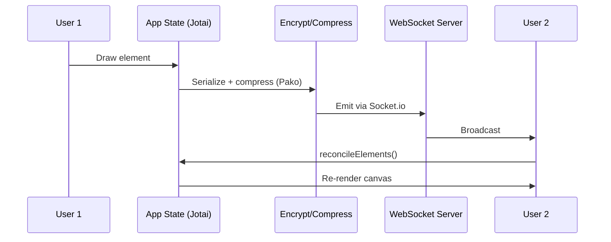
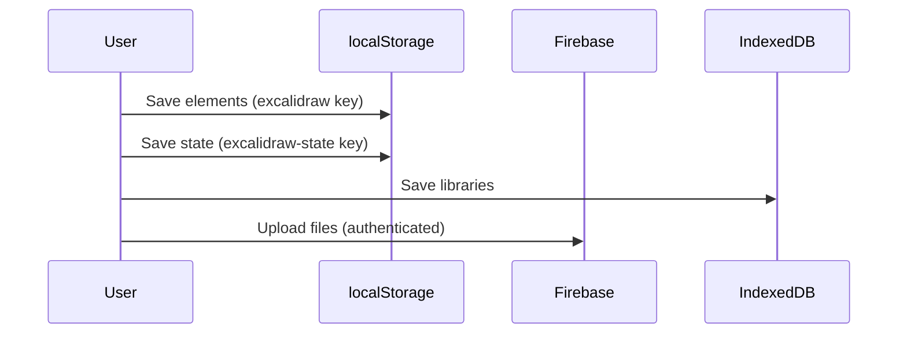
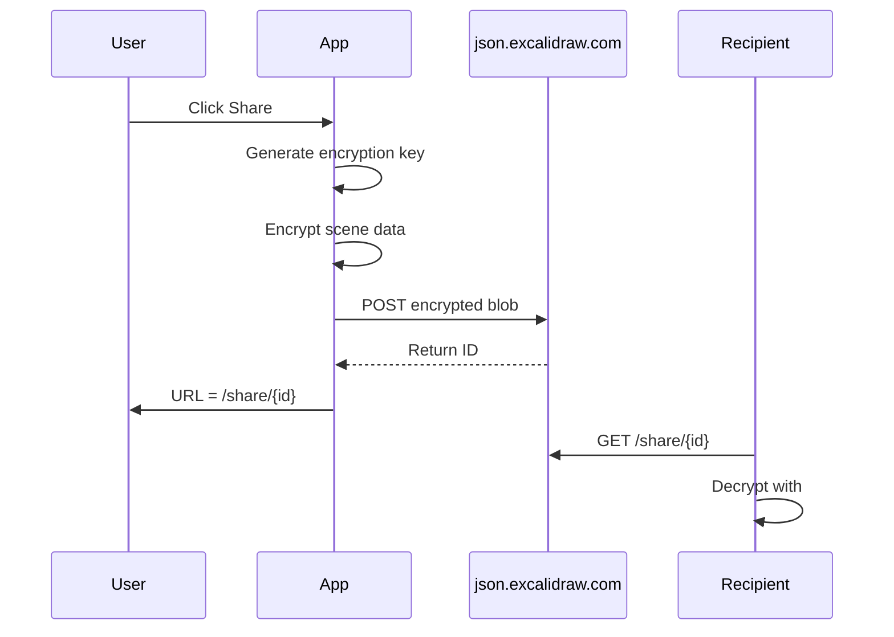

# System Patterns

> See also: [architecture.md](../technical/architecture.md) for component hierarchy and rendering pipeline.

## Core Design Patterns

### 1. Monorepo with Yarn Workspaces
Five packages share one `yarn.lock` and can reference each other via `@excalidraw/*` path aliases without publishing to NPM during development.

### 2. Jotai Wrapper Pattern
Direct Jotai imports are **banned by ESLint**. All state access goes through:
- `excalidraw-app/app-jotai.ts` — app-level atoms
- `packages/excalidraw/editor-jotai.ts` — editor-level atoms

**Why:** Allows swapping the state library in one place without touching consumers.

### 3. Single-Entry-Point Package Exports
Each package exposes one `index.ts`. Deep imports (e.g., `@excalidraw/excalidraw/types/element`) are forbidden. This enforces a stable public API.

### 4. Action System
Canvas operations are modeled as **actions** (`packages/excalidraw/actions/`). Each action has:
- `name` — unique identifier
- `perform()` — execution function
- Optional `keyTest`, `contextItemLabel`, `PanelComponent`

This decouples UI from business logic and enables keyboard shortcuts, context menus, and command palette from a single definition.

## Data Flows

### Real-time Collaboration



### Persistence Flow



### Share Link Flow



## Key Data Structures

### Element
All canvas objects are plain objects conforming to `ExcalidrawElement`:
```ts
{
  id: string               // unique ID
  type: ElementType        // "rectangle" | "ellipse" | "text" | ...
  x, y: number             // position
  width, height: number    // dimensions
  angle: number            // rotation in radians
  strokeColor, fillColor   // visual properties
  groupIds: string[]       // grouping
  version: number          // for CRDT reconciliation
  versionNonce: number     // tie-breaking for reconciliation
}
```

### Scene Reconciliation (CRDT-like)
`reconcileElements()` merges remote elements with local state using `version` + `versionNonce`. Higher version wins; equal versions use `versionNonce` as tiebreaker.

### Collaboration User
```ts
{
  socketId: string
  pointer: { x, y, tool }   // cursor position
  button: "up" | "down"
  selectedElementIds: {}
  username: string
}
```

## Rendering Architecture

```
Scene State (Jotai)
    │
    ▼
renderer/
    ├── interactiveScene.ts  (interactive canvas — selections, handles)
    ├── staticScene.ts       (static canvas — final element rendering)
    ├── staticSvgScene.ts    (SVG export renderer)
    └── renderNewElementScene.ts (in-progress element preview)
    │
    ├──► Rough.js (hand-drawn stroke paths)
    ├──► Perfect-freehand (freedraw strokes)
    └──► HTML Canvas 2D API
```

The renderer is **pure** — given the same scene state it produces the same visual output. No side effects.

## Font Management
Fonts (Virgil, Cascadia, Assistant) are:
1. Loaded from CDN or self-hosted via `window.EXCALIDRAW_ASSET_PATH`
2. Subsetted per character set used in the scene
3. Embedded in exported SVGs

## Error Handling
- `TopErrorBoundary.tsx` — catches React render errors in the app
- Sentry integration — reports runtime errors to monitoring
- Graceful degradation — missing Firebase config → collaboration disabled silently

## Encryption Pattern
```
key = generateEncryptionKey()       // random bytes → base64url
iv  = generateIV()                  // random bytes
ciphertext = AES-GCM.encrypt(plaintext, key, iv)
shareUrl = `${origin}/share/${id}#${key}`
                                    // key is ONLY in the fragment (never sent to server)
```

## PWA Caching Strategy
| Asset Type | Strategy | TTL |
|------------|----------|-----|
| Fonts | CacheFirst | 90 days |
| Locales | StaleWhileRevalidate | 30 days |
| CodeMirror chunk | CacheFirst | 60 days |
| App shell | NetworkFirst | — |
