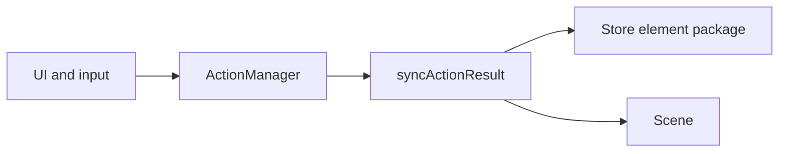

# System patterns

Monorepo layout, package boundaries, and editor/runtime patterns. Verified against workspace manifests, [`scripts/buildPackage.js`](../../scripts/buildPackage.js), and [`docs/findings/`](../findings/) (cross-check code in cited paths when extending behavior).

## Details

For detailed architecture → see [`docs/technical/architecture.md`](../technical/architecture.md).

For product goals and traceability to behavior → see [`docs/product/PRD.md`](../product/PRD.md).

For UX scenarios aligned with the PRD → see [`productContext.md`](./productContext.md).

For domain glossary → see [`docs/product/domain-glossary.md`](../product/domain-glossary.md).

For local development workflow → see [`docs/technical/dev-setup.md`](../technical/dev-setup.md).

Package-level deep dives → see [**Where to go deeper**](#where-to-go-deeper) below and [`docs/findings/`](../findings/).

---

## Monorepo layout

- **Yarn workspaces** (root [`package.json`](../../package.json)): `excalidraw-app`, `packages/*`, `examples/*`.
- **Host app** consumes workspace packages; **examples** demonstrate embedding.
- Root **`build:packages`** order matches dependency direction: **common → math → element → excalidraw** (same file `scripts` section). **`@excalidraw/utils`** (`0.1.2`) lives under `packages/utils` but has **no** dedicated root `build:utils` script—build when working on that package via `yarn --cwd ./packages/utils build:esm` if needed.

---

## Package boundaries

| Package | Responsibility (summary) |
|---------|---------------------------|
| `@excalidraw/common` | Cross-cutting constants, colors (`tinycolor2`), input keys, `Emitter`, `AppEventBus`, layout/env helpers, small structures. May **`import type`** upward into element/excalidraw for typed constants (see [`docs/findings/common-package-architecture.md`](../findings/common-package-architecture.md)). |
| `@excalidraw/math` | Geometry / vector math used by element and renderer. |
| `@excalidraw/element` | Element model, **Scene**, **Store**, mutations, undo-related plumbing at the data layer. |
| `@excalidraw/utils` | Shared utility functions (separate version line `0.1.2`). |
| `@excalidraw/excalidraw` | React **Excalidraw** shell: **`App`** class, **actions**, **renderers**, **data** I/O, i18n, fonts, subset/WASM integration. |

[`packages/excalidraw/package.json`](../../packages/excalidraw/package.json) **`exports`** expose subpaths for `./common/*`, `./element/*`, `./math/*`, `./utils/*` (types + dev/prod JS) so consumers can import from the published package surface.

---

## Library build pattern

- **`build:esm`** for **common / math / element / excalidraw**: [`scripts/buildPackage.js`](../../scripts/buildPackage.js) (**esbuild**, sass) + **`gen:types`**.
- **`@excalidraw/utils`**: [`scripts/buildUtils.js`](../../scripts/buildUtils.js) (**esbuild**) + **`gen:types`**.
- **Dual bundles**: `development` / **production** entries in `exports` → `dist/dev` vs `dist/prod` plus `dist/types`.

---

## Editor architecture (`@excalidraw/excalidraw`)

Condensed from [`docs/findings/excalidraw-package-architecture.md`](../findings/excalidraw-package-architecture.md) and entry layout:

| Concern | Pattern | Location (typical) |
|---------|---------|---------------------|
| Public API | `Excalidraw` wrapper, providers, default chrome | `packages/excalidraw/index.tsx` |
| Orchestration | **`App`** class component owns scene, store, history, canvas, APIs | `packages/excalidraw/components/App.tsx` |
| Commands | **`Action`** definitions, **`ActionManager`**, keyboard / palette routing | `packages/excalidraw/actions/` |
| Apply pipeline | **`syncActionResult`** merges elements, `appState`, files; schedules **Store** capture | `App` + action types |
| Scene data | **`Scene`**, **`Store`**, **`History`** (deltas, capture semantics) | `@excalidraw/element` (used by `App`) |
| Secondary UI state | **Jotai** scoped store (`editor-jotai.ts`) | Editor-local atoms; **not** primary scene source of truth |
| React context | **`UIAppState`**, **`ExcalidrawAPIContext`**, selector hooks | `context/`, `hooks/` |
| Rendering | **Static** vs **interactive** canvas layers, viewport culling, throttled static draw | `scene/Renderer.ts`, `renderer/staticScene.ts`, `renderer/interactiveScene.ts` |

### Command flow (high level)

Actions return **`ActionResult`** (elements, partial `appState`, `captureUpdate`, etc.); **`syncActionResult`** applies changes and coordinates undo semantics (`IMMEDIATELY` / `NEVER` / `EVENTUALLY` per findings).

---

## Cross-cutting patterns

- **Unidirectional commands** for feature work: prefer actions + `syncActionResult` over ad hoc scattered mutations (low-level pointer code still calls scene APIs directly inside `App`).
- **Type-only coupling** in `common` avoids runtime cycles while sharing typed literals.
- **Font pipeline**: subsetting via WASM under `packages/excalidraw/subset/` (see [`docs/findings/project-overview.md`](../findings/project-overview.md)).

---

## Where to go deeper

| Topic | Document |
|-------|----------|
| `excalidraw` internals | [`docs/findings/excalidraw-package-architecture.md`](../findings/excalidraw-package-architecture.md) |
| `common` | [`docs/findings/common-package-architecture.md`](../findings/common-package-architecture.md) |
| `element` | [`docs/findings/element-package-architecture.md`](../findings/element-package-architecture.md) |
| `math` | [`docs/findings/math-package-architecture.md`](../findings/math-package-architecture.md) |
| Repo scale / stack overview | [`docs/findings/project-overview.md`](../findings/project-overview.md) |
