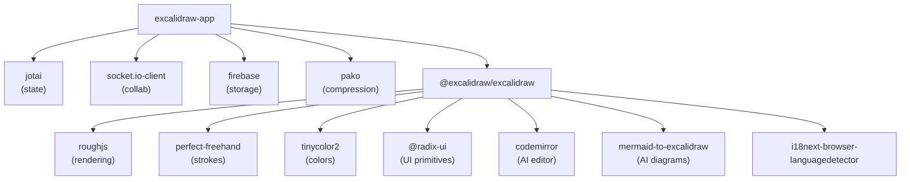

# Dependency Map

> All external libraries analyzed from `package.json`. Purpose and criticality annotated. Evidence-based.

---

## Rendering & Graphics

| Package | Version | Role | Criticality |
|---------|---------|------|-------------|
| `roughjs` | 4.6.4 | Generates hand-drawn/sketchy paths on HTML Canvas. Core visual differentiator. | **Critical** |
| `perfect-freehand` | 1.2.0 | Produces smooth, pressure-sensitive freehand stroke paths. Used by freedraw tool. | **Critical** |
| `tinycolor2` | 1.6.0 | Color parsing, manipulation, and conversion utilities (HEX, RGB, HSL). | Important |

## State Management

| Package | Version | Role | Criticality |
|---------|---------|------|-------------|
| `jotai` | 2.11.0 | Atom-based global state. Wrapped via `app-jotai.ts` and `editor-jotai.ts`. ESLint prevents direct imports. | **Critical** |

## Real-time Collaboration

| Package | Version | Role | Criticality |
|---------|---------|------|-------------|
| `socket.io-client` | 4.7.2 | WebSocket client for real-time multi-user collaboration. Connects to `oss-collab.excalidraw.com`. | **Critical** |

## Backend & Storage

| Package | Version | Role | Criticality |
|---------|---------|------|-------------|
| `firebase` | 11.3.1 | Auth + Firestore + Cloud Storage. Used for file persistence, library management, and collab room data. | **Critical** |
| `browser-fs-access` | 0.38.0 | Progressive File System Access API wrapper — falls back to `<input>` for older browsers. Used for file open/save dialogs. | Important |

## Data Processing

| Package | Version | Role | Criticality |
|---------|---------|------|-------------|
| `pako` | 2.0.3 | zlib-compatible compression. Compresses scene data before upload/share. | **Critical** |

## UI Components & Primitives

| Package | Version | Role | Criticality |
|---------|---------|------|-------------|
| `radix-ui` | 1.4.3 | Accessible, unstyled UI primitives (popover, etc.). Used for color pickers, tooltips, etc. | Important |
| `clsx` | 1.1.1 | Conditional CSS class string construction. Used throughout components. | Minor |

## Code Editor (AI Features)

| Package | Version | Role | Criticality |
|---------|---------|------|-------------|
| `@codemirror/view` | — | CodeMirror 6 editor view. Powers the text input in TTD dialog. | Moderate |
| `@codemirror/state` | — | CodeMirror 6 state management. | Moderate |
| `@codemirror/lang-javascript` | — | JS syntax highlighting in Diagram-to-Code plugin. | Low |
| `@uiw/codemirror-theme-github` | — | GitHub theme for CodeMirror editor. | Low |
| `mermaid-to-excalidraw` | — | Converts Mermaid diagram syntax to Excalidraw JSON elements. Split into its own Vite chunk. | Moderate |

## Internationalization

| Package | Version | Role | Criticality |
|---------|---------|------|-------------|
| `i18next-browser-languagedetector` | 6.1.4 | Detects browser language for auto-selecting locale. | Important |

## Monitoring & Analytics

| Package | Version | Role | Criticality |
|---------|---------|------|-------------|
| `@sentry/browser` | 9.0.1 | Error tracking and performance monitoring. Production only. | Moderate |
| `@sentry/vite-plugin` | — | Uploads sourcemaps to Sentry on release builds. | Moderate |

## Utilities

| Package | Version | Role | Criticality |
|---------|---------|------|-------------|
| `uqr` | 0.1.2 | QR code generation for share links. | Low |
| `nanoid` | — | Unique ID generation (used alongside crypto for room IDs). | Moderate |
| `tunnel-rat` | — | Portal/tunnel utility for React rendering to detached DOM nodes. | Low |
| `open-color` | — | Open-source color palette used for default color pickers. | Low |
| `lodash` / `lodash-es` | — | Utility functions (debounce, throttle, etc.). | Moderate |

---

## Build & Dev Dependencies

| Package | Version | Role |
|---------|---------|------|
| `vite` | 5.0.12 | Dev server and production bundler |
| `@vitejs/plugin-react` | — | Vite plugin for React (JSX transform, Fast Refresh) |
| `vite-plugin-pwa` | — | PWA manifest and service worker generation |
| `vite-plugin-svgr` | — | Import SVG files as React components |
| `vite-plugin-checker` | — | TypeScript type-checking during dev server |
| `vite-plugin-ejs` | — | EJS templating in `index.html` |
| `vite-plugin-html` | — | HTML minification and transformation |
| `vite-plugin-sitemap` | — | Auto-generate sitemap.xml |
| `esbuild` | 0.19.10 | Used for package builds (fast JS transform) |
| `typescript` | 5.9.3 | Type checking (strict mode) |
| `sass` | 1.51.0 | SCSS stylesheet compilation |
| `vitest` | 3.0.6 | Unit test runner |
| `@vitest/coverage-v8` | 3.0.7 | Code coverage via V8 engine |
| `@testing-library/react` | 16.2.0 | DOM testing utilities |
| `vitest-canvas-mock` | — | Mock `HTMLCanvasElement` for tests |
| `eslint` | — | Code linting |
| `prettier` | 2.6.2 | Code formatting |
| `husky` | 7.0.4 | Git hooks (pre-commit) |
| `lint-staged` | 12.3.7 | Run linters on staged files only |
| `@size-limit/preset-big-lib` | — | Monitor bundle size of library builds |

---

## Dependency Graph (Key Runtime Dependencies)

---

## Security Notes

- `pako` + native `crypto.subtle` (AES-GCM) are used for encryption — no third-party crypto libs
- Firebase SDK handles authentication tokens — no custom auth implementation
- Socket.io payload is always encrypted before transmission
- No payment/billing libraries detected in the codebase

## Upgrade Risks

| Package | Risk | Reason |
|---------|------|--------|
| `roughjs` | **High** | Core rendering — any API change breaks all shapes |
| `socket.io-client` | **High** | Collaboration protocol tightly coupled to version |
| `firebase` | **Medium** | Firebase v9+ uses modular API; already on v11 |
| `jotai` | **Medium** | Wrapped — migration is isolated to wrapper files |
| `pako` | **Low** | Stable zlib API |
