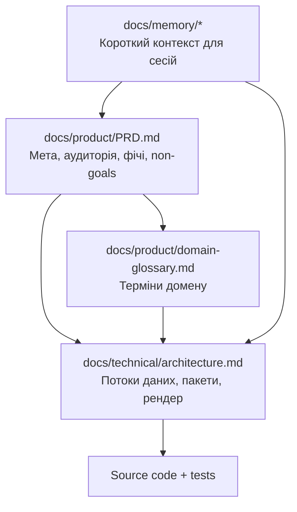

# Spec-Driven Development (SSD) — як працювати з цим репозиторієм

## Ідея

**SSD** тут означає: спочатку зафіксувати **що** і **навіщо** (продуктова специфікація та домен), потім **як устроєно** (архітектура), і лише тоді змінювати код і тести. Документи специфікації — **джерело істини для агентів і людей**; PR і рефакторинги повинні бути **зв’язані** з оновленням спеки, якщо змінюється поведінка або контракти.

## Шари документації

## Memory Bank vs SSD-спека

| Шар | Файли | Роль |
| --- | --- | --- |
| **Memory Bank** | Усі файли в `docs/memory/` (див. `projectbrief.md` — таблиця) | Стабільний контекст + **activeContext** / **progress** / **decisionLog** для поточної роботи; основні три файли залишаються «ядром» для коротких сесій |
| **Продуктова спека** | `docs/product/PRD.md`, `domain-glossary.md` | Вимоги і доменні значення термінів |
| **Технічна спека** | `docs/technical/architecture.md` | Структура системи, потоки, межі пакетів |

## Мінімальний workflow зміни

1. Уточнити в **PRD** або **глосарії**, якщо змінюється поведінка з точки зору користувача або термінологія.
2. Оновити **architecture.md**, якщо змінюються потоки даних, новий пакет або публічний API.
3. Оновити **Memory Bank** (`techContext` / `systemPatterns` / `projectbrief`), якщо змінились команди, патерни або мета; значні рішення — у **`decisionLog.md`**; поточну задачу — у **`activeContext.md`**.
4. Імплементація + тести (`yarn test:all` перед PR).

## Трасування (traceability)

- В PRD фічі формулюють **спостережувану поведінку**; у глосарії — **ідентифікатори з коду** (`AppState`, `ExcalidrawElement`, …).
- У `architecture.md` — **де в коді** реалізовано потік (файли/пакети).

## Коли оновлювати цей файл

При зміні **процесу** команди (наприклад, новий обов’язковий артефакт спеки, інший інструмент) — додати підрозділ тут, щоб агенти й нові учасники бачили актуальні правила.
