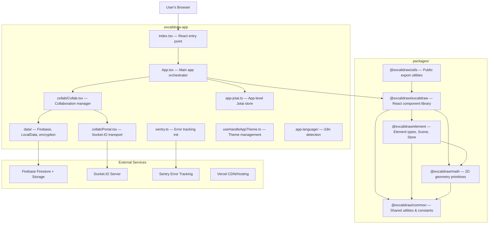
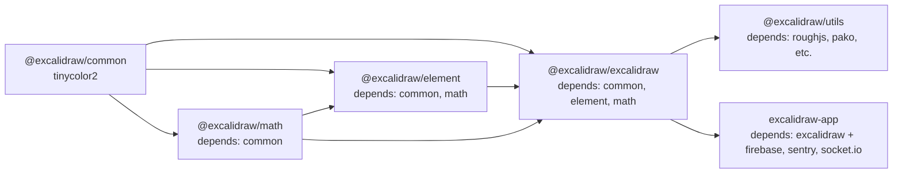

# Detailed Architecture

This document contains only facts verified from the source code. File paths are referenced for every claim.

## High-Level Architecture



## Package Dependencies



Derived from each package's `package.json` dependencies:

| Package | Internal Dependencies |
|---------|----------------------|
| `@excalidraw/common` | none |
| `@excalidraw/math` | `@excalidraw/common` |
| `@excalidraw/element` | `@excalidraw/common`, `@excalidraw/math` |
| `@excalidraw/excalidraw` | `@excalidraw/common`, `@excalidraw/element`, `@excalidraw/math` |
| `@excalidraw/utils` | runtime: `roughjs`, `pako`, etc.; types only from excalidraw packages |
| `excalidraw-app` | all packages + `firebase`, `socket.io-client`, `@sentry/browser`, `jotai` |

Build order is enforced in root `package.json` script `build:packages`:
`common → math → element → excalidraw` (see `package.json` line 62).

## Data Flow

### User Input → State Changes

1. **Pointer/keyboard events** are captured by the `App` class component in `packages/excalidraw/components/App.tsx`. The `App` component registers handlers directly on the canvas elements and the document.

2. **Tool selection** determines behavior: the `activeTool` field of `AppState` (see `packages/excalidraw/types.ts` line 342) controls which tool processes input. Tool types include `selection`, `rectangle`, `arrow`, `freedraw`, `text`, `eraser`, `hand`, `laser`, etc. (see `ToolType` in `packages/excalidraw/types.ts` line 155).

3. **Element creation**: On pointer down with a shape tool, a new element is created via `newElement()` functions in `packages/element/src/newElement.ts`. The element is stored in `appState.newElement` during creation and finalized on pointer up.

4. **Element mutation**: Changes to existing elements go through `mutateElement()` in `packages/element/src/mutateElement.ts`, which updates properties in-place and bumps the `version` and `versionNonce` fields.

5. **Action dispatch**: Complex operations (copy, paste, align, distribute, group, etc.) are handled by the **Action system**. The `ActionManager` in `packages/excalidraw/actions/manager.tsx` maintains a registry of `Action` objects. Each action's `perform()` function receives current elements and appState, and returns an `ActionResult` containing new elements and/or appState changes plus a `CaptureUpdateAction` directive.

### State Changes → Re-render

1. **`App.updateScene()`** applies `ActionResult` to the internal state, updates the `Scene` instance, and triggers re-render.

2. **Store commit**: After state update, `Store.commit()` (see `packages/element/src/store.ts` line 189) is called. It:
   - Flushes any queued micro-actions
   - Creates a `StoreSnapshot` of current state
   - Computes a `StoreChange` (diff between previous and current snapshot)
   - Emits either a `DurableIncrement` (captured for undo) or `EphemeralIncrement` (not captured)

3. **History recording**: `History.record()` (see `packages/excalidraw/history.ts` line 112) listens for `DurableIncrement` events and pushes `HistoryDelta` entries onto the undo stack. Non-empty element changes reset the redo stack.

4. **Canvas render**: The render is throttled via `throttleRAF` (see `packages/common/src/utils.ts`). Two canvas layers are rendered separately:
   - **Static canvas** (`packages/excalidraw/renderer/staticScene.ts`) — draws grid, all visible elements, link handles
   - **Interactive canvas** (`packages/excalidraw/renderer/interactiveScene.ts`) — draws selection rectangles, transform handles, collaborator cursors and pointers, binding indicators

### Collaboration Data Flow

1. **Local change** → `Collab` detects scene version change via `getSceneVersion()` (see `excalidraw-app/collab/Collab.tsx`)

2. **Serialization** → elements are filtered to syncable elements (non-deleted or recently deleted, see `getSyncableElements()` in `excalidraw-app/data/index.ts`), then serialized to JSON

3. **Encryption** → data is encrypted via `encryptData()` (`packages/excalidraw/data/encryption.ts`) using the room key derived from the URL hash

4. **Transport** → `Portal.broadcastScene()` (see `excalidraw-app/collab/Portal.tsx`) emits via Socket.IO using `WS_EVENTS.SERVER_VOLATILE` or `WS_EVENTS.SERVER` depending on the subtype (`SCENE_INIT`, `SCENE_UPDATE`, `MOUSE_LOCATION`, etc. — see `WS_SUBTYPES` in `excalidraw-app/app_constants.ts`)

5. **Remote receive** → `Portal` socket listener receives encrypted payload → `decryptData()` → `Collab.handleRemoteSceneUpdate()`

6. **Reconciliation** → `reconcileElements()` (`packages/excalidraw/data/reconcile.ts`) merges remote elements with local elements using `version` and `versionNonce` for conflict resolution. Element ordering uses `fractional-indexing` via the `index` field (see `FractionalIndex` in `packages/element/src/types.ts` line 33)

7. **Version bump** → `bumpElementVersions()` ensures reconciled elements have higher versions than existing ones (see `excalidraw-app/collab/Collab.tsx` line 773)

8. **Scene update** → `excalidrawAPI.updateScene()` with `CaptureUpdateAction.NEVER` to avoid adding remote changes to local undo stack

### File Import/Export

- **JSON format**: Elements are serialized via `serializeAsJSON()` (`packages/excalidraw/data/json.ts`). The format includes `type: "excalidraw"`, `version`, `source`, `elements[]`, and `appState` subset
- **PNG export**: Scene rendered to canvas → exported as PNG with optional metadata embedded as PNG text chunks (see `packages/excalidraw/scene/export.ts`)
- **SVG export**: Elements converted to SVG via `exportToSvg()` (re-exported from `@excalidraw/utils/export`)
- **Import**: `loadFromBlob()` in `packages/excalidraw/data/blob.ts` detects file type and delegates to appropriate parser
- **Library format**: Library items stored in IndexedDB via `LibraryIndexedDBAdapter` (see `excalidraw-app/data/LocalData.ts`). Serialized via `serializeLibraryAsJSON()`

## State Management

### AppState

- **Definition**: `interface AppState` in `packages/excalidraw/types.ts` (line 272), ~130 lines, 80+ fields
- **Key field groups**:
  - **UI state**: `contextMenu`, `isLoading`, `errorMessage`, `openMenu`, `openPopup`, `openSidebar`, `openDialog`, `showWelcomeScreen`
  - **Active tool**: `activeTool` (type + locked + lastActiveTool + fromSelection), `preferredSelectionTool`
  - **Current item defaults**: `currentItemStrokeColor`, `currentItemBackgroundColor`, `currentItemFillStyle`, `currentItemFontFamily`, `currentItemFontSize`, etc.
  - **Viewport**: `scrollX`, `scrollY`, `zoom`, `width`, `height`, `offsetLeft`, `offsetTop`
  - **Editing state**: `newElement`, `resizingElement`, `multiElement`, `selectionElement`, `editingTextElement`, `editingGroupId`
  - **Selection**: `selectedElementIds`, `selectedGroupIds`, `selectedLinearElementId`
  - **Collaboration**: `collaborators` (Map), `userToFollow`
  - **Visual**: `theme`, `viewBackgroundColor`, `frameRendering`, `gridSize`
  - **Export**: `exportBackground`, `exportEmbedScene`, `exportWithDarkMode`, `exportScale`
- **Defaults**: `getDefaultAppState()` in `packages/excalidraw/appState.ts`

### Elements

- **Type**: `ExcalidrawElement` — discriminated union on the `type` field (see `packages/element/src/types.ts`)
- **Variants**: `selection`, `rectangle`, `diamond`, `ellipse`, `embeddable`, `iframe`, `image`, `frame`, `magicframe`, `freedraw`, `line`, `arrow`, `text`
- **Base fields** (from `_ExcalidrawElementBase`): `id`, `x`, `y`, `width`, `height`, `angle`, `strokeColor`, `backgroundColor`, `fillStyle`, `strokeWidth`, `strokeStyle`, `roughness`, `opacity`, `seed`, `version`, `versionNonce`, `index` (FractionalIndex), `isDeleted`, `groupIds`, `frameId`, `boundElements`, `updated`, `link`, `locked`, `customData`
- **Lifecycle**: Created via `newElement*()` functions → mutated via `mutateElement()` → soft-deleted by setting `isDeleted: true` → garbage collected after `DELETED_ELEMENT_TIMEOUT` (24 hours, see `excalidraw-app/app_constants.ts` line 8)
- **Scene**: `Scene` class in `packages/element/src/Scene.ts` manages the element array, provides filtered views (`getNonDeletedElements`), selected element queries, and emits change callbacks
- **Ordering**: `syncMovedIndices()` and `syncInvalidIndices()` maintain fractional index ordering (see `packages/element/src/fractionalIndex.ts`)

### ActionManager

- **Definition**: `ActionManager` class in `packages/excalidraw/actions/manager.tsx`
- **Registration**: Actions are registered via `registerAction()`, stored in `actions` record keyed by `ActionName` (see `packages/excalidraw/actions/types.ts` for the full `ActionName` union — ~50 action names)
- **Action interface** (from `packages/excalidraw/actions/types.ts`):
  - `name: ActionName` — unique identifier
  - `perform: ActionFn` — executes the action, receives `(elements, appState, formData, app)` and returns `ActionResult`
  - `keyTest?: (event) => boolean` — keyboard shortcut test
  - `PanelComponent?: React.FC` — optional UI for the properties panel
  - `trackEvent?` — analytics tracking config
- **Dispatch cycle**: `executeAction()` → `action.perform()` → `ActionResult` → `updater()` applies to scene → `Store.commit()` → render

### Jotai Atoms

**App-level** (`excalidraw-app/app-jotai.ts`):
- Creates `appJotaiStore` via `createStore()` from Jotai
- Custom `useAtomWithInitialValue` hook for lazy initialization
- Key atoms defined in consuming files:
  - `collabAPIAtom` (in `excalidraw-app/collab/Collab.tsx`) — stores the Collab API reference
  - `isCollaboratingAtom` (in `excalidraw-app/collab/Collab.tsx`) — boolean
  - `isOfflineAtom` (in `excalidraw-app/collab/Collab.tsx`) — offline detection
  - `shareDialogStateAtom` (in `excalidraw-app/share/ShareDialog.tsx`)
  - `collabErrorIndicatorAtom` (in `excalidraw-app/collab/CollabError.tsx`)
  - `localStorageQuotaExceededAtom` (in `excalidraw-app/data/LocalData.ts`)

**Editor-level** (`packages/excalidraw/editor-jotai.ts`):
- Uses `jotai-scope`'s `createIsolation()` for provider/store isolation
- Creates `editorJotaiStore` via `createStore()`
- Library atoms use this store (see `packages/excalidraw/data/library.ts` line 28)

**Relationship to AppState**: Jotai atoms handle cross-component state that lives outside the core `AppState` object. The `AppState` is managed imperatively by the `App` class component, while Jotai atoms manage app-shell concerns (collab, sharing, errors). There is no direct synchronization between the two — they serve different purposes.

## Rendering Pipeline

### React Component Tree

```
<StrictMode>                          (excalidraw-app/index.tsx)
  <ExcalidrawApp>                     (excalidraw-app/App.tsx)
    <Provider store={appJotaiStore}>  (excalidraw-app/app-jotai.ts)
      <TopErrorBoundary>              (excalidraw-app/components/TopErrorBoundary.tsx)
        <ExcalidrawAPIProvider>        (packages/excalidraw/index.tsx)
          <Excalidraw>                (packages/excalidraw/index.tsx — memoized)
            <EditorJotaiProvider>     (packages/excalidraw/editor-jotai.ts)
              <InitializeApp>         (packages/excalidraw/components/InitializeApp.tsx)
                <App>                 (packages/excalidraw/components/App.tsx — class component)
                  ├── Static canvas   (renders elements)
                  ├── Interactive canvas (renders selection/cursors)
                  ├── UI overlays     (toolbars, panels, dialogs)
                  └── Children        (MainMenu, WelcomeScreen, Footer, etc.)
```

### Canvas Management

- The `App` class component creates and manages two `<canvas>` elements
- **Static canvas**: Renders all scene elements (shapes, text, images). Rendering performed by `_renderStaticScene()` in `packages/excalidraw/renderer/staticScene.ts`
- **Interactive canvas**: Renders selection UI, resize handles, collaborator cursors, binding previews, snapping guides. Rendering performed by `renderInteractiveScene()` in `packages/excalidraw/renderer/interactiveScene.ts`
- Canvases are sized to fill the viewport, with `devicePixelRatio` scaling for HiDPI

### Render Trigger

1. State update (via `updateScene()`, `setState()`, or action execution)
2. `App` component's render cycle triggers
3. Render calls are throttled via `throttleRAF` (uses `requestAnimationFrame`)
4. Global flag `window.EXCALIDRAW_THROTTLE_RENDER = true` is set at module load (see `excalidraw-app/App.tsx` line 155)

### Element Drawing

1. For each visible element, `renderElement()` (`packages/element/src/renderElement.ts`) is called
2. Element shape is generated via Rough.js (`packages/element/src/shape.ts`) using the element's `seed` for deterministic randomness
3. Shape is cached after first render — subsequent renders reuse the cached shape unless the element changes
4. Frame clipping is applied if elements are inside frames (see `shouldApplyFrameClip()` in `packages/element/src/frame.ts`)
5. Dark mode filter applied when theme is dark (see `applyDarkModeFilter()` in `packages/common/`)

### Hit Testing and Bounds

- `packages/element/src/bounds.ts` — computes element bounding boxes (`getElementAbsoluteCoords()`)
- `packages/element/src/collision.ts` — hit testing for point-in-element detection
- `packages/element/src/distance.ts` — distance calculations for binding and snapping
- `packages/element/src/resizeTest.ts` — determines which resize handle is under cursor

## Library and Application Boundary

The boundary between `packages/excalidraw` (library) and `excalidraw-app` (application) is:

- **Library** (`@excalidraw/excalidraw`): Provides the `<Excalidraw>` React component, all drawing/editing functionality, data import/export, action system, renderer, i18n. No knowledge of Firebase, Socket.IO, or Sentry. Exports a public API via `packages/excalidraw/index.tsx` (~100 named exports including components, hooks, functions, types).

- **Application** (`excalidraw-app`): Provides collaboration infrastructure (Firebase + Socket.IO), error tracking (Sentry), PWA registration, app-level state atoms, share dialog, custom stats, theme handling, language detection, and branding (welcome screen, menus, footer). Consumes the library's `ExcalidrawImperativeAPI` for programmatic control.

The imperative API (`ExcalidrawImperativeAPI` defined in `packages/excalidraw/types.ts`) provides methods like `updateScene()`, `addFiles()`, `getSceneElementsIncludingDeleted()`, enabling the app layer to drive the library without direct internal access.

## Cross-References

- For system patterns overview → see [`docs/memory/systemPatterns.md`](../memory/systemPatterns.md)
- For tech stack → see [`docs/memory/techContext.md`](../memory/techContext.md)
- For domain glossary → see [`docs/product/domain-glossary.md`](../product/domain-glossary.md)
- For key decisions → see [`docs/memory/decisionLog.md`](../memory/decisionLog.md)
- For project brief → see [`docs/memory/projectbrief.md`](../memory/projectbrief.md)
