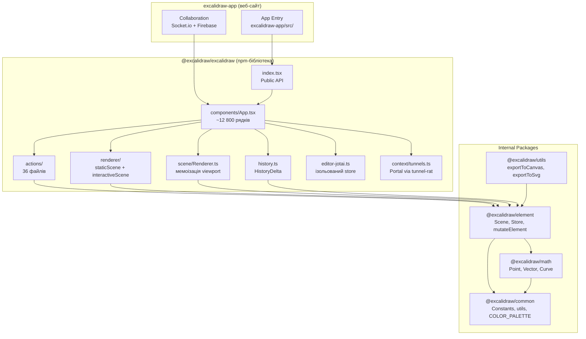
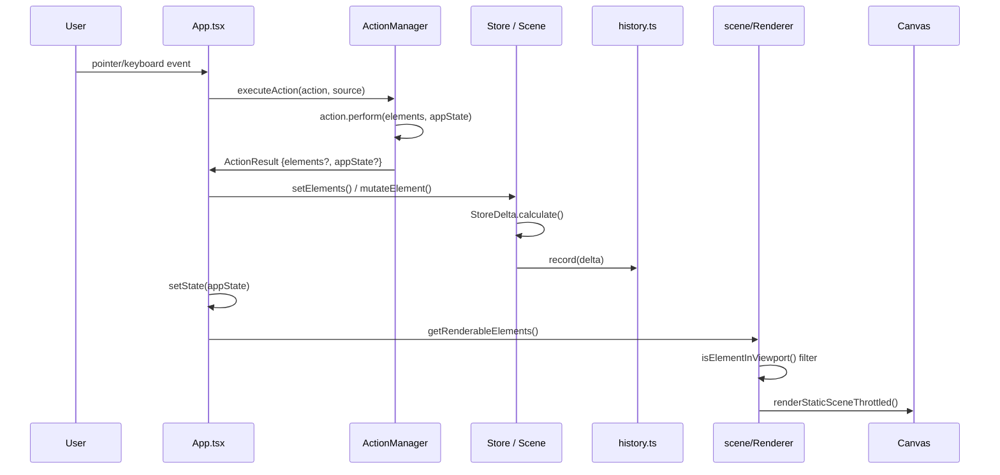
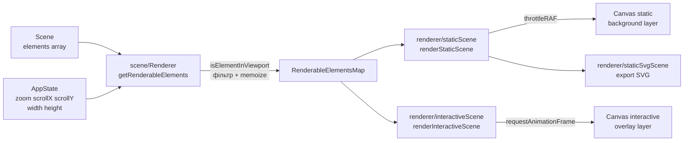
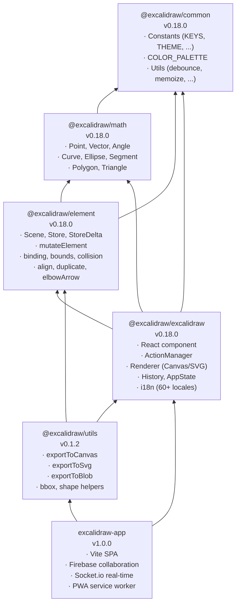

# Architecture — Excalidraw

## 1. High-level Architecture



**Ключові точки:**
- `excalidraw-app` — веб-сайт, залежить від бібліотеки як від workspace-пакету
- `@excalidraw/excalidraw` — публічна npm-бібліотека, точка входу `index.tsx`
- `components/App.tsx` (~12 800 рядків) — центральний оркестратор
- Пакети `element`, `math`, `common` — не мають залежностей від UI-рівня

---

## 2. Data Flow



**`ActionResult`** (`actions/types.ts`):
```typescript
type ActionResult = {
  elements?: readonly ExcalidrawElement[] | null;
  appState?: Partial<AppState> | null;
  files?: BinaryFiles | null;
  captureUpdate: CaptureUpdateActionType;
  replaceFiles?: boolean;
} | false;
```

**`ActionSource`** — звідки прийшла дія:
```typescript
type ActionSource = "ui" | "keyboard" | "contextMenu" | "api" | "commandPalette";
```

**Правило immutability** — елементи змінюються лише через:
```typescript
// packages/element/src/mutateElement.ts
mutateElement(element, { x: 10, y: 20 });
// Ніколи: element.x = 10
```

**Soft-delete** — елементи не видаляються з масиву, лише:
```typescript
mutateElement(element, { isDeleted: true });
// Перед рендером: getNonDeletedElements(elements)
```

---

## 3. State Management

### 3.1 AppState — React state в App.tsx

Визначений у `packages/excalidraw/appState.ts`, ініціалізується через `getDefaultAppState()`:

```typescript
export const getDefaultAppState = (): Omit<AppState, "offsetTop" | "offsetLeft" | "width" | "height"> => ({
  theme: THEME.LIGHT,
  collaborators: new Map(),
  activeTool: { type: "selection", customType: null, locked: false, ... },
  currentItemStrokeColor: DEFAULT_ELEMENT_PROPS.strokeColor,
  currentItemFillStyle: DEFAULT_ELEMENT_PROPS.fillStyle,
  zoom: { value: 1 as NormalizedZoomValue },
  scrollX: 0,
  scrollY: 0,
  isLoading: false,
  gridModeEnabled: false,
  // ... ~60 полів
});
```

Конфіг збереження `APP_STATE_STORAGE_CONF` (`appState.ts`) визначає для кожного поля:
- `browser` — зберігати в localStorage
- `export` — включати при export
- `server` — синхронізувати через collaboration

### 3.2 Jotai — ізольований atomic store

```typescript
// packages/excalidraw/editor-jotai.ts
import { createStore } from "jotai";
import { createIsolation } from "jotai-scope";

const jotai = createIsolation();
export const EditorJotaiProvider = jotai.Provider;
export const { useAtom, useSetAtom, useAtomValue, useStore } = jotai;
export const editorJotaiStore = createStore();
```

- `createIsolation()` — кожен `<Excalidraw>` отримує свій незалежний Jotai store
- **ESLint-правило**: заборонено `import { atom } from "jotai"` напряму, тільки через `editor-jotai.ts`
- Використовується для UI-атомів: sidebar стан, dialog стан, Laser pointer тощо

### 3.3 Store / Scene — елементи

```typescript
// packages/element/src/Scene.ts
class Scene {
  private elements: OrderedExcalidrawElement[] = [];
  private callbacks: Set<SceneStateCallback>;

  getNonDeletedElements(): NonDeletedExcalidrawElement[]
  getElementsIncludingDeleted(): readonly OrderedExcalidrawElement[]
  replaceAllElements(elements): void
  addCallback(cb): SceneStateCallbackRemover
}
```

- `Scene` зберігає всі елементи, включно з `isDeleted: true`
- `Store` відстежує snapshots і генерує `StoreDelta` при кожній зміні
- Fractional indices (`syncInvalidIndices`, `syncMovedIndices`) визначають z-order

### 3.4 ActionManager

```typescript
// packages/excalidraw/actions/manager.tsx
export class ActionManager {
  actions: Record<ActionName, Action>;
  updater: (result: ActionResult | Promise<ActionResult>) => void;

  constructor(
    updater: UpdaterFn,
    getAppState: () => AppState,
    getElementsIncludingDeleted: () => readonly OrderedExcalidrawElement[],
    app: AppClassProperties,
  )

  registerAction(action: Action): void
  executeAction(action, source: ActionSource, value?): ActionResult
  renderAction(name: ActionName): JSX.Element   // рендер кнопки з hotkey
  isActionEnabled(action, { elements, appState }): boolean
}
```

36 зареєстрованих actions (`actions/types.ts` → `ActionName` union):
`copy`, `cut`, `paste`, `sendBackward`, `bringForward`, `sendToBack`, `bringToFront`,
`copyStyles`, `pasteStyles`, `selectAll`, `deleteSelectedElements`, `duplicateSelection`,
`group`, `ungroup`, `gridMode`, `zenMode`, `viewMode`, `flipHorizontal`, `flipVertical`,
`align*`, `distribute*`, `undo`, `redo`, `saveToActiveFile`, `loadScene`, `exportImage`...

### 3.5 History

```typescript
// packages/excalidraw/history.ts
export class HistoryDelta extends StoreDelta {
  applyTo(
    elements: SceneElementsMap,
    appState: AppState,
    snapshot: StoreSnapshot,
  ): [SceneElementsMap, AppState, boolean]

  static calculate(prevSnapshot, nextSnapshot): HistoryDelta
}
```

- Зберігає **diff**, не snapshot — ефективно для великих сцен
- Undo/redo через `CaptureUpdateAction` — кожен `ActionResult` вказує чи записувати в history
- `excludedProperties: new Set(["version", "versionNonce"])` при apply — collaboration-safe

---

## 4. Rendering Pipeline



### Два canvas-шари

| Canvas | Файл | Зміст | Частота |
|---|---|---|---|
| static | `renderer/staticScene.ts` | Сітка, елементи, фрейми | Throttled rAF |
| interactive | `renderer/interactiveScene.ts` | Курсори колабораторів, laser pointer, selection box | кожен rAF |

### staticScene — деталі рендеру

```typescript
// renderer/staticScene.ts
// Порядок рендеру:
// 1. bootstrapCanvas() — reset transform, clear
// 2. strokeGrid() — якщо gridModeEnabled (GridLineColor per theme)
// 3. renderElement() per element (через @excalidraw/element)
//    └── RoughJS для generic shapes
//    └── perfect-freehand для freedraw
// 4. Frame clip regions (shouldApplyFrameClip)
// 5. External/element link overlays (EXTERNAL_LINK_IMG, ELEMENT_LINK_IMG)
```

### Renderer.getRenderableElements — мемоізація

```typescript
// scene/Renderer.ts
export class Renderer {
  public getRenderableElements = memoize(({ elementsMap, zoom, ... }) => {
    // 1. Фільтр isElementInViewport()
    // 2. Повертає RenderableElementsMap (branded type)
  });
}
```

`memoize` з `@excalidraw/common` — перераховується лише якщо змінились zoom/scroll/elements.

### SVG Export

```typescript
// renderer/staticSvgScene.ts + packages/utils/src/export.ts
exportToSvg(elements, appState, files) → SVGSVGElement
exportToCanvas(elements, appState, files) → HTMLCanvasElement
exportToBlob(...) → Blob   // PNG
```

---

## 5. Package Dependencies



### Що НЕ можна імпортувати

| З | Не можна імпортувати |
|---|---|
| `@excalidraw/common` | будь-який інший `@excalidraw/*` |
| `@excalidraw/math` | `@excalidraw/element`, `@excalidraw/excalidraw` |
| `@excalidraw/element` | `@excalidraw/excalidraw` |
| будь-який пакет | `excalidraw-app` |

### Yarn Workspaces конфіг (`package.json` root)

```json
"workspaces": ["excalidraw-app", "packages/*", "examples/*"]
```

### TypeScript path aliases (`tsconfig.json` root)

```json
"paths": {
  "@excalidraw/common":     ["./packages/common/src/index.ts"],
  "@excalidraw/element":    ["./packages/element/src/index.ts"],
  "@excalidraw/math":       ["./packages/math/src/index.ts"],
  "@excalidraw/utils":      ["./packages/utils/src/index.ts"],
  "@excalidraw/excalidraw": ["./packages/excalidraw/index.tsx"]
}
```

### Build pipeline (`scripts/buildPackage.js`)

Пакети збираються суворо в порядку залежностей:
1. `@excalidraw/common` → `scripts/buildBase.js`
2. `@excalidraw/math` → `scripts/buildBase.js`
3. `@excalidraw/element` → `scripts/buildBase.js`
4. `@excalidraw/excalidraw` → `scripts/buildPackage.js` (cjs + esm + types)

Виходи: `packages/*/dist/` (CJS + ESM), `packages/excalidraw/types/` (`.d.ts`, у `.gitignore`)

---

## Джерела

| Факт | Файл |
|---|---|
| Component tree | `packages/excalidraw/index.tsx` |
| AppState fields | `packages/excalidraw/appState.ts` |
| ActionManager API | `packages/excalidraw/actions/manager.tsx` |
| ActionResult type | `packages/excalidraw/actions/types.ts` |
| HistoryDelta | `packages/excalidraw/history.ts` |
| Scene / Store | `packages/element/src/Scene.ts` |
| Renderer memoize | `packages/excalidraw/scene/Renderer.ts` |
| staticScene render | `packages/excalidraw/renderer/staticScene.ts` |
| Tunnels list | `packages/excalidraw/context/tunnels.ts` |
| Jotai isolation | `packages/excalidraw/editor-jotai.ts` |
| Package versions | `packages/*/package.json` |
