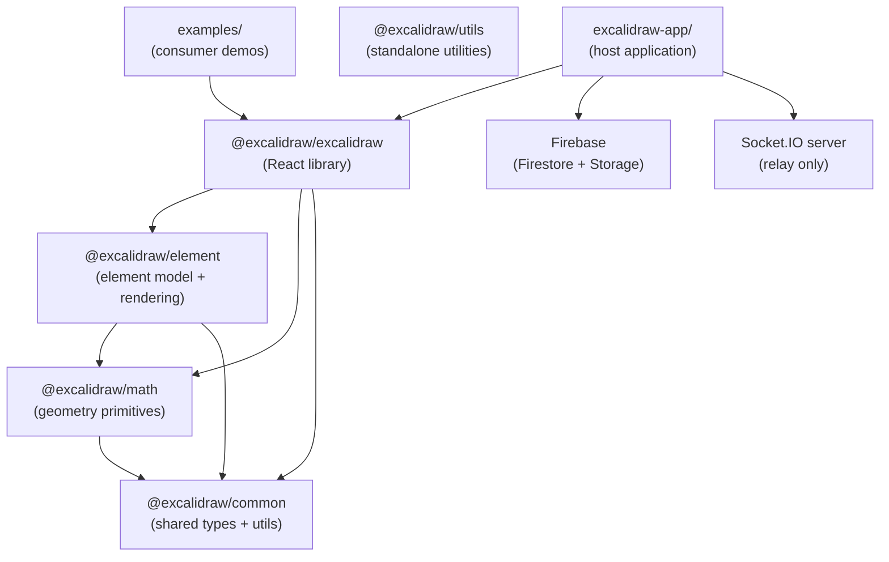
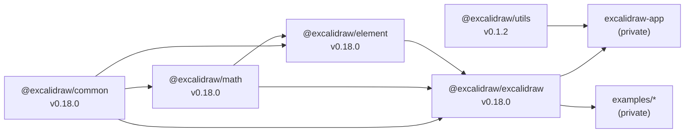

# Excalidraw Technical Architecture

> All claims are verified against source code. Where a conclusion is inferred from code structure rather than an explicit comment, it is labelled **Inference from source**.

---

## High-level Architecture

The repository is a Yarn 1.22.22 classic monorepo (`workspaces` in root `package.json`) that contains three distinct tiers:

| Tier | Location | Role |
| --- | --- | --- |
| **Host application** | `excalidraw-app/` | Deployable web app (excalidraw.com). Adds collaboration, Firebase persistence, PWA, i18n, Sentry. |
| **Core library** | `packages/excalidraw/` | Publishable React component (`@excalidraw/excalidraw`). The public API surface. |
| **Shared packages** | `packages/common/`, `packages/math/`, `packages/element/`, `packages/utils/` | Internal sub-libraries consumed by the core library and, via Vite aliases, by the host app. |
| **Examples** | `examples/` | Standalone consumer demos; excluded from root tsconfig. |

The host app does **not** list `@excalidraw/*` packages as npm dependencies. Both TypeScript and Vite resolve them via path aliases pointing directly at TypeScript source, so no build step is required for local development (verified: root `tsconfig.json` `paths` and `excalidraw-app/vite.config.mts` `resolve.alias`).



---

## Data Flow

### Scene update (solo use)

```
Pointer / keyboard event
  → App event handler (App.tsx)
    → ActionManager.executeAction / direct scene mutation
      → action.perform(elements, appState) → ActionResult
        → App.syncActionResult(result)
          ├── scene.replaceAllElements(result.elements)
          ├── this.setState(result.appState)          ← React re-render
          └── store.scheduleAction(captureUpdate)
            → store.commit()
              → StoreSnapshot diff
                ├── DurableIncrement emitted → History.record(inverseDelta)
                └── StoreIncrement emitted  → onIncrement prop callback
```

### Collaboration update

```
Local change detected by App.onChange emitter
  → collabAPI.syncElements(elements)   [excalidraw-app/collab/Collab.tsx]
    → broadcastElements (version-gated: only if sceneVersion increased)
      → portal.broadcastScene(WS_SUBTYPES.UPDATE, deltaElements)
        → JSON.stringify → UTF-8 encode → encryptData(roomKey, bytes) [AES-GCM]
          → socket.emit("server", roomId, encryptedBuffer, iv)

Remote client receives "client-broadcast"
  → decryptData(iv, ciphertext, roomKey)
    → parse JSON → WS_SUBTYPES.UPDATE
      → Collab._reconcileElements(remoteElements)  [reconcile.ts]
        → reconcileElements(local, remote, appState)  [last-writer-wins by version]
          → excalidrawAPI.updateScene({ elements, captureUpdate: NEVER })
```

### Import / Export

- **Export:** `exportToCanvas` → fresh canvas at `exportScale`, synchronous `_renderStaticScene` (no RAF), roughjs draws all geometry. SVG export uses `renderSceneToSvg` (no canvas). Both paths share `ShapeCache`.
- **Import:** `loadFromBlob` / `loadFromJSON` → parse + validate (`isValidExcalidrawData`) → `excalidrawAPI.updateScene()`.
- **Shareable link:** `exportToBackend` → `compressData` + AES-GCM encrypt with one-time key → POST to backend. Key embedded in URL hash.

### Persistence decision tree

```
Collaboration active?
  YES → localStorage writes paused (LocalData.pauseSave("collaboration"))
        elements + appState → Firebase Firestore (encrypted, roomKey)
        image files         → Firebase Storage  (encrypted, roomKey)
        real-time deltas    → Socket.IO          (encrypted, roomKey)
  NO  → elements + appState → localStorage (plain JSON, debounced)
        image files         → IndexedDB (idb-keyval, files-db store)
        library items       → IndexedDB (library-db store)
```

---

## State Management

The `App` class component owns **four distinct state containers**:

### 1. `this.state` — React class state (`AppState`)

Defined in `packages/excalidraw/types.ts`. Contains ~50+ fields covering:

- **Interaction state**: `newElement`, `resizingElement`, `multiElement`, `editingTextElement`, `selectedElementIds`, `activeTool`
- **Viewport**: `scrollX`, `scrollY`, `zoom`, `width`, `height`
- **Appearance**: `theme`, `viewBackgroundColor`, `gridSize`, `gridModeEnabled`
- **Mode flags**: `zenModeEnabled`, `viewModeEnabled`, `objectsSnapModeEnabled`, `isBindingEnabled`
- **UI chrome**: `openDialog`, `openPopup`, `openSidebar`, `toast`, `contextMenu`
- **Collaboration**: `collaborators` (`Map<SocketId, Collaborator>`)

Elements are **not stored in `AppState`**.

`ObservedAppState` (`types.ts`) is the strict subset tracked by the Store for diffing: `name`, `viewBackgroundColor`, `editingGroupId`, `selectedElementIds`, `selectedGroupIds`, `selectedLinearElement`, `croppingElementId`, `lockedMultiSelections`, `activeLockedId`.

### 2. `this.scene` — `Scene` class (element store)

`Scene` (`packages/element/src/Scene.ts`) holds elements separately from React state:

- `elements: readonly OrderedExcalidrawElement[]` — all elements including deleted
- `elementsMap: SceneElementsMap` — Map-keyed version for O(1) lookup
- `nonDeletedElements` / `nonDeletedElementsMap` — filtered live views

Mutations go through `scene.replaceAllElements(nextElements)`. `ActionManager` is given a getter `() => this.scene.getElementsIncludingDeleted()` so actions always read fresh elements.

### 3. `this.store` — `Store` (change detection layer)

`Store` (`packages/element/src/store.ts`) is not a data store in the Redux sense. Its role is:

- Maintains `StoreSnapshot` — an immutable copy of `(SceneElementsMap, ObservedAppState)`.
- On `commit()`, diffs current state against snapshot and emits typed increments:
  - `DurableIncrement` → consumed by `History.record()` → pushed to undo stack
  - `EphemeralIncrement` → consumed by `onIncrement` API → forwarded to collaboration
- Three action modes: `IMMEDIATELY` (snapshot updated, goes to history), `NEVER` (remote/init updates, no history), `EVENTUALLY` (drag frames, no snapshot update — the full drag becomes one undo entry).

### 4. `this.history` — `History` (undo/redo)

`History` (`packages/excalidraw/history.ts`) maintains two stacks of inverse `HistoryDelta` objects. When a `DurableIncrement` arrives from the Store, `History.record(delta)` inverts the delta (so applying it undoes the change) and pushes it to `undoStack`. Undo pops the entry, applies it to current state, pushes an inverted copy to `redoStack`, and schedules a micro-action on the Store. Element `version` and `versionNonce` are excluded during undo application so that undo always increments the element version — required for correct collaboration reconciliation.

### ActionManager lifecycle

```
ActionManager (packages/excalidraw/actions/manager.tsx)
│
├── actions: Record<ActionName, Action>  ← registered at App construction
├── updater = App.syncActionResult       ← writes back to React + Scene
├── getAppState = () => this.state       ← read-only view
└── getElementsIncludingDeleted = () => scene.getElementsIncludingDeleted()

Execution:
  executeAction(action, value)
    → action.perform(elements, appState, value, app) → ActionResult | false
    → this.updater(result)  ← routes back to App.syncActionResult
```

Actions are **pure functions** returning `ActionResult`. They never mutate state directly.

### Jotai atoms — UI-local state

Jotai (`editorJotaiStore`, `appJotaiStore`) handles state that belongs to specific UI components and does not need React class `setState`. Key atoms include: `isSidebarDockedAtom`, `isLibraryMenuOpenAtom`, `activeEyeDropperAtom`, `isCollaboratingAtom`, `isOfflineAtom`, `libraryItemsAtom`, `searchQueryAtom`, `localStorageQuotaExceededAtom`, and several TTD dialog atoms. The bridge from the class component is `App.updateEditorAtom(atom, value)` which calls `editorJotaiStore.set(atom, value)` then `triggerRender()`.

Functional child components subscribe via `useExcalidrawAppState()`, `useExcalidrawElements()`, and `useExcalidrawActionManager()` context hooks.

---

## Rendering Pipeline

### Canvas layers

Three stacked `<canvas>` elements plus one SVG overlay:

| Layer | Purpose | Events |
| --- | --- | --- |
| **StaticCanvas** | All scene elements: shapes, images, text, grid | None (pointer-events: none) |
| **NewElementCanvas** | The element currently being drawn | None |
| **InteractiveCanvas** | Selection handles, snap guides, cursors, scroll bars | All pointer/mouse/touch |
| **SVGLayer** (React SVG) | Animated overlays: laser trail, eraser trail, lasso | None |

### Static canvas call chain

```
React re-render (App.render / setState / scene.triggerUpdate)
  → StaticCanvas component (React.memo)
    → useEffect → renderStaticScene(config, throttleEnabled)
      if throttleEnabled:
        → renderStaticSceneThrottled (throttleRAF wrapper)
          → window.requestAnimationFrame → _renderStaticScene(config)
      else (tests / export):
        → _renderStaticScene(config)  [synchronous]
          → bootstrapCanvas()         [clear + background + dark-mode filter]
          → context.scale(zoom)
          → strokeGrid()
          → visibleElements.forEach(element)
              → renderElement(element, rc, context, renderConfig)
                  → generateElementWithCanvas(element)
                      → document.createElement("canvas")   [per-element offscreen canvas]
                      → drawElementOnCanvas(element, rc, context)
                  → drawElementFromCanvas()
                      → mainContext.drawImage(offscreenCanvas, x, y)
```

The `Renderer` class (`packages/excalidraw/scene/Renderer.ts`) is a **viewport-culling helper**, not a render loop. It filters the full element list to those visible in the current viewport and is called inside `App.render()` to produce `visibleElements` passed as props.

### Interactive canvas — AnimationController loop

```
InteractiveCanvas.useEffect
  → AnimationController.start("animateInteractiveScene", animationFn)
    → requestAnimationFrame(AnimationController.tick)
      → animationFn({ deltaTime })
          → renderInteractiveScene({ ...params, deltaTime })
              → renderSelectionElement, renderTransformHandles, renderSnaps,
                renderScrollBars, renderRemoteCursors, renderBindingHighlights, ...
      → if animations still active: requestAnimationFrame(tick)  [self-perpetuating]
      → else: loop stops
```

`deltaTime` from `performance.now()` enables time-based animations (e.g. binding highlight pulses).

### Roughjs — sketch-style rendering

`RoughGenerator` (singleton from `roughjs/bin/generator`) pre-generates `Drawable` path descriptors for rectangles, diamonds, ellipses, lines, and arrows. These are cached in `ShapeCache` keyed on `element.id + version`. Each element's `seed` field ensures deterministic rendering across re-renders and peers.

At draw time:

```typescript
// packages/element/src/renderElement.ts
const rc = rough.canvas(offscreenCanvas);
rc.draw(ShapeCache.generateElementShape(element, renderConfig));
```

### perfect-freehand — freedraw rendering

Freedraw elements bypass roughjs entirely:

```
element.points (array of [x, y, pressure?])
  → getStroke(points, { simulatePressure, size, thinning, smoothing, ... })
      [perfect-freehand: returns outline polygon]
  → getSvgPathFromStroke(outline)
      [reduce polygon to SVG path string using quadratic bezier curves]
  → stored in ShapeCache as string

At draw time:
  context.fill(new Path2D(shapeString))   ← filled directly, no roughjs
```

---

## Package Dependencies

### Dependency direction (strictly enforced)



The root `build:packages` script enforces build order: `common → math → element → excalidraw`. `@excalidraw/utils` has no internal dependencies and is built independently.

### Per-package responsibilities

| Package | Key external dependencies | Responsibility |
| --- | --- | --- |
| `@excalidraw/common` | `tinycolor2` | Shared constants, utility functions, base types |
| `@excalidraw/math` | _(none)_ | Vector/point math, curve math, geometry primitives; `GlobalPoint`/`LocalPoint` tuple types; `GlobalCoord`/`LocalCoord` object types (TODO: removal in progress) |
| `@excalidraw/element` | _(none beyond internal)_ | `ExcalidrawElement` types, `Scene`, `Store`, element creation/mutation, bounds calculation, arrow binding, elbow arrows, fractional indexing, shape generation (roughjs + perfect-freehand), canvas rendering (`renderElement`), delta diffing, reconciliation |
| `@excalidraw/excalidraw` | `roughjs`, `jotai`, `@radix-ui/*`, `@codemirror/*`, `pako`, `nanoid`, `perfect-freehand` | React component, `App.tsx`, `ActionManager`, `History`, all UI components, i18n, library, export/import orchestration |
| `@excalidraw/utils` | `roughjs`, `perfect-freehand`, `pako`, `browser-fs-access` | Standalone utility exports for host app consumers (`exportToCanvas`, `exportToBlob`, `exportToSvg`, `loadFromBlob`, `getCommonBounds`) |
| `excalidraw-app` | `firebase 11`, `socket.io-client 4`, `@sentry/browser 9`, `idb-keyval 6` | Collaboration, persistence, PWA, share links, i18n detection, Sentry error tracking |

### Resolution mechanism

Neither TypeScript Project References (`composite`/`references`) nor npm symlinks are used for dev. Both `tsconfig.json` at root and `excalidraw-app/vite.config.mts` map `@excalidraw/*` imports via regex aliases to TypeScript source files. Published packages use conditional exports (`development`/`production`/`default`) for tree-shaking by consumers.

---

## Source Evidence

Key files and directories inspected:

```
# Root configuration
package.json
tsconfig.json
packages/tsconfig.base.json
excalidraw-app/vite.config.mts

# Package manifests
packages/common/package.json
packages/math/package.json
packages/element/package.json
packages/excalidraw/package.json
packages/utils/package.json
excalidraw-app/package.json

# Entry points and public API
packages/excalidraw/index.tsx
excalidraw-app/App.tsx
excalidraw-app/index.tsx

# State management
packages/excalidraw/types.ts             (AppState, ObservedAppState)
packages/excalidraw/components/App.tsx   (class structure, syncActionResult, store/history wiring)
packages/excalidraw/actions/manager.tsx  (ActionManager)
packages/excalidraw/actions/types.ts     (Action, ActionResult)
packages/excalidraw/store.ts             (Store, StoreSnapshot, DurableIncrement, EphemeralIncrement)
packages/excalidraw/history.ts           (History, HistoryDelta, undo/redo stacks)
packages/excalidraw/editor-jotai.ts      (editorJotaiStore, jotai isolation)
packages/element/src/Scene.ts            (Scene class, element arrays/maps)
packages/element/src/types.ts            (ExcalidrawElement union type)
packages/element/src/store.ts            (Store implementation)
packages/element/src/delta.ts            (StoreDelta, ElementsDelta, AppStateDelta)

# Rendering pipeline
packages/excalidraw/scene/Renderer.ts
packages/excalidraw/renderer/staticScene.ts
packages/excalidraw/renderer/interactiveScene.ts
packages/excalidraw/renderer/animation.ts         (AnimationController)
packages/excalidraw/animation-frame-handler.ts
packages/excalidraw/scene/export.ts
packages/element/src/renderElement.ts
packages/element/src/shape.ts                     (ShapeCache, roughjs, perfect-freehand)

# Collaboration and data flow
excalidraw-app/collab/Collab.tsx
excalidraw-app/collab/Portal.tsx
excalidraw-app/data/firebase.ts
excalidraw-app/data/LocalData.ts
excalidraw-app/data/localStorage.ts
packages/excalidraw/data/reconcile.ts
packages/excalidraw/data/encrypt.ts
packages/excalidraw/data/index.ts
packages/excalidraw/data/json.ts
packages/excalidraw/data/blob.ts
```
