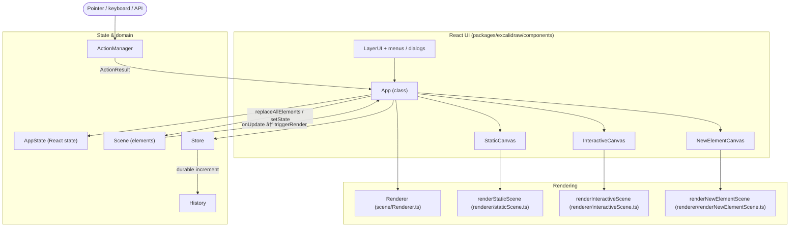
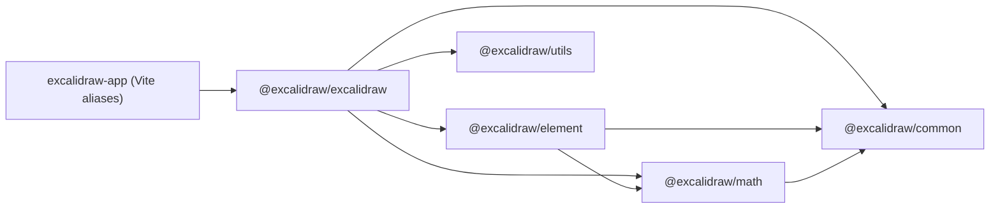

# Architecture

## Details

### Technical Details
For system architecture, components and data flow:
→ docs/technical/architecture.md

Use when:
- modifying system structure
- adding new services
- understanding dependencies

---

### Product Context
For domain concepts and business terminology:
→ docs/product/domain-glossary.md

Use when:
- working with business logic
- naming entities
- understanding domain rules

This document describes runtime structure **as implemented in this repository** (key files cited). It is not a product roadmap.

---

## High-level Architecture

The codebase is a **Yarn workspace monorepo**. The embeddable editor lives in `packages/excalidraw/`. The standalone product shell is `excalidraw-app/`, which imports `@excalidraw/*` packages; in dev/build those imports are resolved to `../packages/*` via Vite `alias` entries in `excalidraw-app/vite.config.mts` (e.g. `@excalidraw/excalidraw` → `../packages/excalidraw/index.tsx`).

Inside `@excalidraw/excalidraw`, a **class component** `App` (`packages/excalidraw/components/App.tsx`) orchestrates:

- React **state** typed as `AppState` (`packages/excalidraw/types.ts`)
- A **`Scene`** instance (from `@excalidraw/element`) holding the ordered element graph
- A **`Store`** (from `@excalidraw/element`, `packages/element/src/store.ts`) that emits increments for undo/redo
- **`History`** (`packages/excalidraw/history.ts`) recording durable deltas
- **`ActionManager`** (`packages/excalidraw/actions/manager.tsx`) executing **actions** that return **`ActionResult`** (`packages/excalidraw/actions/types.ts`)

Shell UI is composed through **`LayerUI`** and canvas subcomponents under `packages/excalidraw/components/`.

### Diagram (runtime, editor package)

---

## Data Flow

### 1. Action execution

1. **`ActionManager`** (`packages/excalidraw/actions/manager.tsx`) holds registered **`Action`** objects (`this.actions`). It receives an **`updater`** callback in the constructor; that callback is the editor’s handler for **`ActionResult`** (wired to **`syncActionResult`** in `App.tsx`).
2. Actions are invoked with current **`elements`**, **`appState`**, optional **`formData`**, and **`app`** (`ActionFn` in `packages/excalidraw/actions/types.ts`).
3. Each action returns **`ActionResult`** or **`false`**. A successful result includes optional **`elements`**, **`appState`**, **`files`**, and a required **`captureUpdate`** field of type **`CaptureUpdateActionType`** (from `@excalidraw/element`).

### 2. Applying results: `syncActionResult`

`App.syncActionResult` (`packages/excalidraw/components/App.tsx`, ~2735–2816):

1. If **`actionResult === false`** or the instance is unmounted, return.
2. **`this.store.scheduleAction(actionResult.captureUpdate)`** — records how this update should participate in store capture (`IMMEDIATELY`, `EVENTUALLY`, or `NEVER`; see `CaptureUpdateAction` in `packages/element/src/store.ts`).
3. If **`actionResult.elements`** is set, **`this.scene.replaceAllElements(actionResult.elements)`**.
4. If **`actionResult.files`** is set, files are merged (and images refreshed) via **`addMissingFiles`** / cache helpers.
5. If **`actionResult.appState`** (or related UI fields) requires it, **`this.setState`** merges partial **`AppState`** (with controlled props for view/zen mode, theme, etc., as in the same block).
6. If nothing in the scene/React layer was marked as updated, **`this.scene.triggerUpdate()`** is called so subscribers still run.

### 3. Scene → render

`App` registers **`this.scene.onUpdate(this.triggerRender)`** in **`componentDidMount`** (`packages/excalidraw/components/App.tsx`, ~3109). Scene updates therefore schedule a re-render path that refreshes derived data (e.g. visible elements) and canvas props.

### 4. Store commit and history

- In **`componentDidUpdate`**, **`this.store.commit(elementsMap, this.state)`** runs (`packages/excalidraw/components/App.tsx`, ~3509), aligning the **`Store`** snapshot with the current scene elements map and **`AppState`** after React has applied state.
- In **`componentDidMount`**, **`this.store.onDurableIncrementEmitter.on((increment) => { this.history.record(increment.delta); })`** (`packages/excalidraw/components/App.tsx`, ~3098–3100) connects durable store increments to **`History.record`**.

### 5. External consumers

When **`!this.state.isLoading`**, **`componentDidUpdate`** calls **`this.props.onChange?.(elements, this.state, this.files)`** and triggers **`onChangeEmitter`** with the same (`packages/excalidraw/components/App.tsx`, ~3511–3518).

---

## State Management

### `AppState`

- Defined and extended in **`packages/excalidraw/types.ts`** (e.g. viewport, tool, selection, dialogs, theme, **`newElement`**, collaboration-related fields).
- Held as **`this.state`** on **`App`**. Updates typically flow from **`syncActionResult`** **`setState`** merges or from handlers (pointer, keyboard, lifecycle).

### Elements (scene graph)

- Not stored only in React state: the authoritative ordered list lives in **`Scene`** (`@excalidraw/element`, `packages/element/src/Scene.ts`).
- Actions return new **`elements`** arrays; **`scene.replaceAllElements`** replaces the scene content from **`syncActionResult`**.
- **`Renderer`** (`packages/excalidraw/scene/Renderer.ts`) is constructed with a **`Scene`** and computes **visible** / renderable element sets using viewport data from **`AppState`** (zoom, scroll, dimensions).

### `ActionManager`

- **Class** **`ActionManager`** (`packages/excalidraw/actions/manager.tsx`): **`registerAction` / `registerAll`**, **`handleKeyDown`**, **`executeAction`**, **`renderAction`**, **`isActionEnabled`**, etc.
- Constructor parameters: **`updater`** (`ActionResult` → void), **`getAppState`**, **`getElementsIncludingDeleted`**, **`app`** (**`AppClassProperties`**).
- **`ActionResult`** shape (`packages/excalidraw/actions/types.ts`): optional **`elements`**, **`appState`**, **`files`**, required **`captureUpdate`**, optional **`replaceFiles`**.
- **`executeAction`** (`packages/excalidraw/actions/manager.tsx`, ~132–143): reads current elements and **`appState`**, **`trackAction`** (analytics), then **`this.updater(action.perform(elements, appState, value, this.app))`**.
- **`handleKeyDown`**: filters registered actions by **`keyTest`**, **`keyPriority`**, **`UIOptions.canvasActions`**, and **`viewModeEnabled`**; on a single match, **`preventDefault`/`stopPropagation`** and **`updater(perform(...))`** (~89–129).
- **`renderAction`**: returns a **`PanelComponent`** for UI-driven actions; **`updateData`** calls **`perform`** with form state and forwards the result through **`updater`** (~148–190).

### `Store` and `CaptureUpdateAction`

- **`Store`** (`packages/element/src/store.ts`): owns **`scheduleAction`**, **`scheduleMicroAction`**, **`commit`**, emitters **`onDurableIncrementEmitter`** and **`onStoreIncrementEmitter`**, and **`snapshot`** / **`StoreSnapshot`**.
- **`CaptureUpdateAction`** (same file): string constants **`IMMEDIATELY`**, **`NEVER`**, **`EVENTUALLY`** with comments describing undo-stack behavior (immediate vs never vs batched capture).

### `History`

- **`History`** / **`HistoryDelta`** in **`packages/excalidraw/history.ts`** extend **`StoreDelta`** from **`@excalidraw/element`** and implement **`applyTo`** for elements and **`AppState`** for undo/redo.
- **`History`** (`packages/excalidraw/history.ts`, ~90+): holds **`undoStack`** and **`redoStack`** of **`HistoryDelta`**, **`onHistoryChangedEmitter`**, **`record(delta)`** (skips empty or already **`HistoryDelta`** deltas; pushes **`HistoryDelta.inverse(delta)`** to undo), **`undo` / `redo`**, **`clear`**.
- **`History`** is constructed with a reference to the same **`Store`** instance used by **`App`** (`constructor(private readonly store: Store)`).

### Supplemental: Jotai

- **`editor-jotai.ts`** and atoms (e.g. sidebar / eye dropper) are used from components such as **`LayerUI`**; this is auxiliary UI state, separate from the **`Scene` / `Store`** pipeline (see imports from **`../editor-jotai`** in `packages/excalidraw/components/LayerUI.tsx`).

---

## Rendering Pipeline: React → canvas

### Composition order in `App` render

Under the main editor UI, **`App`** renders (`packages/excalidraw/components/App.tsx`, ~2295–2374):

1. **`StaticCanvas`** — **`canvas={this.canvas}`**, **`rc={this.rc}`** (Rough.js canvas), **`elementsMap`**, **`allElementsMap`**, **`visibleElements`**, **`sceneNonce`**, **`selectionNonce`**, **`scale={window.devicePixelRatio}`**, **`appState={this.state}`**, **`renderConfig`** (image cache, grid, background, theme, etc.).
2. **`NewElementCanvas`** — only when **`this.state.newElement`** is set; passes **`renderNewElementScene`** input (new element preview).
3. **`InteractiveCanvas`** — **`canvas={this.interactiveCanvas}`**, **`app={this}`**, selection and pointer handlers, **`renderInteractiveSceneCallback`**, scrollbars flag, etc.

### Static layer

- **`StaticCanvas`** (`packages/excalidraw/components/canvases/StaticCanvas.tsx`) mounts the **`HTMLCanvasElement`** into a wrapper and calls **`renderStaticScene`** from **`packages/excalidraw/renderer/staticScene.ts`** inside **`useEffect`**, passing canvas, **`RoughCanvas`**, scale, maps, **`visibleElements`**, **`StaticCanvasAppState`**, and **`StaticCanvasRenderConfig`**.

### New element layer

- **`NewElementCanvas`** (`packages/excalidraw/components/canvases/NewElementCanvas.tsx`) uses a local **`canvas`** ref and **`renderNewElementScene`** (`packages/excalidraw/renderer/renderNewElementScene.ts`) with **`appState.newElement`**.

### Interactive layer

- **`InteractiveCanvas`** (`packages/excalidraw/components/canvases/InteractiveCanvas.tsx`) calls **`renderInteractiveScene`** from **`packages/excalidraw/renderer/interactiveScene.ts`** with **`InteractiveCanvasRenderConfig`**, including selection and remote pointer state; uses **`AnimationController`** (`packages/excalidraw/renderer/animation`).

### Element-level drawing

- **`renderElement`** is imported from **`@excalidraw/element`** inside **`staticScene.ts`** (and related render paths), connecting package **`element`** geometry and element types to canvas drawing.

---

## Package Dependencies

Facts below are taken from **`package.json`** `dependencies` / workspace layout and from import paths in **`packages/excalidraw`**.

### `@excalidraw/excalidraw` (`packages/excalidraw/package.json`)

Declared **`dependencies`** include at least:

- **`@excalidraw/common`**, **`@excalidraw/element`**, **`@excalidraw/math`** (version **0.18.0** in this file)
- Editor UI libs (e.g. **`roughjs`**, **`jotai`**, **`sass`**, CodeMirror packages, etc.) as listed in the same **`dependencies`** object

**`exports`** in this **`package.json`** expose subpaths such as **`./common/*`**, **`./element/*`**, **`./math/*`**, **`./utils/*`** for types and bundles.

Source files import **`@excalidraw/utils`** (e.g. **`packages/excalidraw/index.tsx`** re-exports from **`@excalidraw/utils/export`** and **`@excalidraw/utils/withinBounds`**). The workspace package is **`packages/utils`** (`"name": "@excalidraw/utils"` in `packages/utils/package.json`). It is not listed in the **`dependencies`** block of **`packages/excalidraw/package.json`** in this snapshot; resolution in the monorepo uses the workspace + build pipeline.

### `@excalidraw/element` (`packages/element/package.json`)

- **`dependencies`**: **`@excalidraw/common`**, **`@excalidraw/math`** (0.18.0).
- Contains **`Scene`**, **`Store`**, **`CaptureUpdateAction`**, element mutation and rendering helpers consumed by **`packages/excalidraw`**.

### `@excalidraw/math` (`packages/math/package.json`)

- **`dependencies`**: **`@excalidraw/common`** **0.18.0** only (`packages/math/package.json`).

### `@excalidraw/common` (`packages/common/package.json`)

- Shared constants, utilities, **`Emitter`**, etc., imported across **`element`**, **`excalidraw`**, and **`math`**.

### `@excalidraw/utils` (`packages/utils/package.json`)

- **`"name": "@excalidraw/utils"`**; used from **`packages/excalidraw`** source for export helpers and bounds (see grep hits under **`packages/excalidraw/`** for **`@excalidraw/utils`**).

### `excalidraw-app`

- **`excalidraw-app/package.json`** lists React, Firebase, socket.io-client, Sentry, etc.; it does **not** list **`@excalidraw/excalidraw`** as a semver dependency. The app resolves **`@excalidraw/excalidraw`** and sibling packages through **`excalidraw-app/vite.config.mts`** **`resolve.alias`** to **`../packages/...`**.

### Dependency direction (summary)

---

## Related documentation

- Deeper narrative Memory Bank: `docs/memory/systemPatterns.md`, `docs/memory/techContext.md`
- Dependency list (maintenance): `docs/reference/dependency-map.md`

