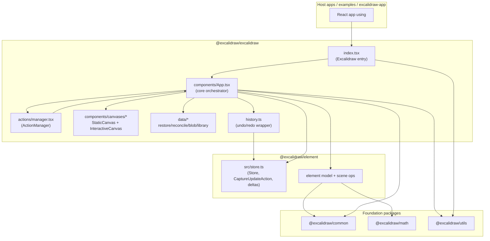
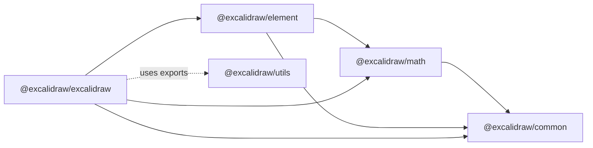

# Excalidraw Monorepo Architecture

## Scope and sources

This document describes architecture based on repository source code only.

Primary verified sources:

- `package.json` (root workspaces and scripts)
- `packages/excalidraw/index.tsx`
- `packages/excalidraw/components/App.tsx`
- `packages/excalidraw/actions/manager.tsx`
- `packages/excalidraw/components/canvases/StaticCanvas.tsx`
- `packages/excalidraw/components/canvases/InteractiveCanvas.tsx`
- `packages/excalidraw/history.ts`
- `packages/element/src/store.ts`
- `packages/common/package.json`
- `packages/math/package.json`
- `packages/element/package.json`
- `packages/utils/package.json`
- `packages/excalidraw/package.json`

---

## High-level Architecture

At workspace level (`package.json` root), the monorepo has three workspace groups:

- `packages/*` for reusable libraries
- `excalidraw-app` for the product application shell
- `examples/*` for integration examples

Inside `packages/*`, the main layering is:

- `@excalidraw/common`: shared constants/utilities
- `@excalidraw/math`: geometry and math utilities
- `@excalidraw/element`: element model, scene/store primitives, mutation/delta logic
- `@excalidraw/utils`: export and helper utilities
- `@excalidraw/excalidraw`: React editor package that composes all above

`@excalidraw/excalidraw` is the package that exposes:

- `Excalidraw` React component
- API hooks/providers (`ExcalidrawAPIProvider`, `useExcalidrawAPI`, state hooks)
- UI primitives (Sidebar, MainMenu, Footer, dialogs)
- data helpers (restore/reconcile/load/export helpers)

### Mermaid diagram

---

## Data Flow: how data moves through the system

## 1) Initialization flow

- Host renders `<Excalidraw />` from `packages/excalidraw/index.tsx`.
- `ExcalidrawBase` wraps editor with:
  - `EditorJotaiProvider` (`editor-jotai.ts`)
  - `InitializeApp` (loads language in `components/InitializeApp.tsx`)
  - `App` class component (`components/App.tsx`)
- `App` constructor initializes:
  - React `this.state` (`AppState` + default values from `getDefaultAppState`)
  - `Scene`, `Renderer`, `ActionManager`, `Store`, `History`, `Library`, `Fonts`
  - imperative API object from `createExcalidrawAPI()`

## 2) User interaction to state update

- Input events (pointer/keyboard/wheel/copy/paste/etc.) are handled in `App.tsx` handlers.
- Keyboard and UI actions pass through `ActionManager`:
  - `handleKeyDown(...)` matches registered action by predicate
  - `executeAction(...)` runs explicit action
- Each action receives current:
  - `elements` (`getElementsIncludingDeleted`)
  - `appState` (`getAppState`)
  - optional payload
- Action returns `ActionResult` (or promise), forwarded to `App.syncActionResult(...)`.

## 3) Action result application

Inside `syncActionResult(...)` in `App.tsx`:

- schedules capture policy in store:
  - `this.store.scheduleAction(actionResult.captureUpdate)`
- applies scene changes:
  - `scene.replaceAllElements(actionResult.elements)` if present
- applies appState changes:
  - `this.setState(...)` merge with normalized/controlled flags
- applies files:
  - `addMissingFiles(...)`, image cache refresh
- if no effective updates, triggers `scene.triggerUpdate()`

## 4) Commit and outgoing notifications

During `componentDidUpdate(...)`:

- `appStateObserver.flush(prevState)` notifies state subscriptions
- `this.store.commit(elementsMap, this.state)` executes queued store actions
- if not loading:
  - `props.onChange(elements, appState, files)`
  - `onChangeEmitter.trigger(elements, appState, files)`
- `onScrollChange` and other emitters are triggered when relevant state fields changed.

## 5) External API-driven updates

Imperative API from `createExcalidrawAPI()` includes:

- `updateScene(...)`
- `mutateElement(...)`
- `applyDeltas(...)`
- read methods (`getSceneElements`, `getAppState`, `getFiles`, etc.)
- subscription methods (`onChange`, `onIncrement`, `onStateChange`, etc.)

`updateScene(...)` in `App.tsx`:

- optionally schedules `store.scheduleMicroAction(...)` with capture mode
- applies partial `appState`, `elements`, `collaborators`
- integrates remote or host-triggered changes into same commit pipeline

---

## State Management (detailed)

The editor uses multi-layer state management composed of React state + scene model + store/history + isolated jotai atoms.

## A) `appState` (React component state in `App.tsx`)

- `App` extends `React.Component<AppProps, AppState>`.
- Initial state is built from:
  - `getDefaultAppState()`
  - controlled props (`theme`, `viewModeEnabled`, `zenModeEnabled`, `gridModeEnabled`)
  - viewport dimensions and offsets
- This state includes:
  - interaction/tool flags
  - selection and editing metadata
  - viewport/camera values (`scrollX`, `scrollY`, `zoom`, dimensions)
  - dialogs/popups/sidebar controls
  - collaborators and presentation flags

Context exposure in `App.tsx`:

- `ExcalidrawAppStateContext` for current appState
- `ExcalidrawSetAppStateContext` for mutating state
- `ExcalidrawElementsContext` for non-deleted scene elements
- `ExcalidrawActionManagerContext` for invoking actions
- `ExcalidrawAPIContext` for imperative API

## B) `elements` and scene model

- Elements are maintained in `Scene` (`this.scene`) in `App.tsx`.
- Scene writes:
  - `replaceAllElements(...)`
  - `mutateElement(...)`
  - insert/remove helpers from actions and app logic
- Scene reads:
  - `getElementsIncludingDeleted()`
  - `getNonDeletedElements()`
  - `get...Map...()` variants for render and operations

Design note:

- `appState` and `elements` are synchronized but distinct.
- Rendering receives both:
  - scene-derived maps/lists
  - appState-derived viewport/UI flags

## C) `ActionManager`

`packages/excalidraw/actions/manager.tsx` responsibilities:

- registry of actions by name
- action dispatch by keyboard and explicit API/UI calls
- gating by:
  - UI option flags (`canvasActions`)
  - action predicates
  - view-mode compatibility
- analytics tracking around actions (`trackAction(...)`)
- rendering action-specific panel components via `renderAction(...)`

Update contract:

- action perform function returns `ActionResult`
- manager forwards result to updater callback (provided by `App`: `syncActionResult`)

## D) `Store` and capture modes (`@excalidraw/element/src/store.ts`)

`Store` is a snapshot/increment engine with three capture modes:

- `IMMEDIATELY`:
  - creates durable increment
  - goes to undo/redo through history recording path
- `NEVER`:
  - emits ephemeral increment
  - not undoable
- `EVENTUALLY`:
  - emits ephemeral increment without snapshot promotion until later durable capture

Scheduling model:

- macro action queue: `scheduleAction(...)`
- micro action queue: `scheduleMicroAction(...)`
- commit point: `commit(elements, appState)`
  - flushes micro actions first
  - then resolves one macro action by precedence

## E) `History` (`packages/excalidraw/history.ts`)

- `History` listens to durable increments and records inverse deltas.
- Maintains `undoStack` and `redoStack`.
- `undo(...)` / `redo(...)`:
  - apply `HistoryDelta` to elements/appState
  - schedule immediate micro action for synchronization
  - emit history state changes

## F) Jotai editor-local atoms

- `index.tsx` wraps app with `EditorJotaiProvider` and `editorJotaiStore`.
- `App.updateEditorAtom(...)` sets jotai atom and triggers render.
- This is used for local editor UI states that are not part of core `AppState` contract.

## G) Lifecycle coupling with state

- `componentDidMount`:
  - subscribes store increments
  - binds scene update callback
  - initializes listeners and scene loading
- `componentDidUpdate`:
  - flushes appState observers
  - commits store
  - emits user callbacks
- `componentWillUnmount`:
  - marks API as destroyed
  - clears listeners/emitters/caches
  - destroys renderer/scene state holders

---

## Rendering Pipeline: React component to canvas

Rendering is layered and split between static scene and interactive overlay.

## 1) React render tree (`App.tsx`)

`App.render()` composes major visual blocks:

- `LayerUI` (menus, dialogs, sidebars, controls)
- `SVGLayer` (laser/lasso/eraser trails overlay)
- `StaticCanvas` (base scene render)
- `NewElementCanvas` (when drawing a new element)
- `InteractiveCanvas` (selection handles, interaction overlay, pointer handling)
- conditional overlays (`FollowMode`, `UnlockPopup`, link popup, embeddables)

Before render, `App` computes renderable subset:

- `sceneNonce = scene.getSceneNonce()`
- `renderer.getRenderableElements(...)` -> `elementsMap`, `visibleElements`

## 2) Static canvas path (`components/canvases/StaticCanvas.tsx`)

- Synchronizes DOM canvas dimensions with appState + device scale.
- Mounts actual canvas node inside wrapper once.
- Calls `renderStaticScene(...)` with:
  - canvas + roughjs context
  - renderable element maps/lists
  - appState subset and render config
- Wrapped in `React.memo` with custom `areEqual` based on:
  - scene nonce / maps / visible list
  - selected relevant appState fields

## 3) Interactive canvas path (`components/canvases/InteractiveCanvas.tsx`)

- Builds render params from:
  - visible/selected elements
  - collaborator cursors and selection metadata
  - viewport state and editor interface
- Starts animation loop via `AnimationController.start(...)` (if not running)
- Calls `renderInteractiveScene(...)` each animation tick
- Canvas receives pointer/click/contextmenu handlers from `App.tsx`
- Also wrapped with `React.memo` and interactive-specific state comparator

## 4) Scene-driven rerender bridge

- `componentDidMount`: `this.scene.onUpdate(this.triggerRender)`
- `triggerRender(...)`:
  - `force=true` -> `scene.triggerUpdate()`
  - else -> `setState({})` to schedule React render

This makes scene mutations observable by React rendering without duplicating all state in React.

---

## Package Dependencies: relationships between packages

Based on package manifests:

## Direct dependency graph (workspace packages)

- `@excalidraw/common`
  - no internal workspace deps
- `@excalidraw/math`
  - depends on `@excalidraw/common`
- `@excalidraw/element`
  - depends on `@excalidraw/common`
  - depends on `@excalidraw/math`
- `@excalidraw/utils`
  - no direct deps on internal workspace packages (uses external libs and `@excalidraw/laser-pointer`)
- `@excalidraw/excalidraw`
  - depends on `@excalidraw/common`
  - depends on `@excalidraw/math`
  - depends on `@excalidraw/element`
  - uses exports from `@excalidraw/utils` (e.g. `@excalidraw/utils/export`)

## Mermaid package dependency diagram

## Runtime composition observations from code

- `App.tsx` imports many primitives from `@excalidraw/element` and `@excalidraw/common`.
- `index.tsx` re-exports helpers from:
  - `@excalidraw/element`
  - `@excalidraw/common`
  - `@excalidraw/utils/export`
- This confirms `@excalidraw/excalidraw` is a composition package and primary integration surface.

---

## Notes and constraints

- This document intentionally does not infer behavior not visible in source.
- Statements are limited to code paths present in files listed in the "Scope and sources" section.
