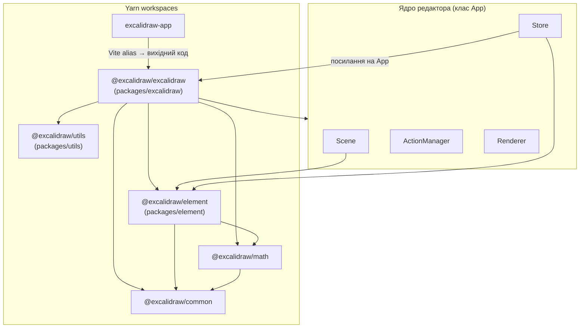

# Архітектура репозиторію (за вихідним кодом)

Документ описує фактичну структуру з коду в цьому репозиторії. Посилання на файли відносні до кореня репозиторію.

**Охоплення:** верхній рівень workspaces, потік даних між `App`, `Scene`, `Store` та `ActionManager`, поділ canvas-рендеру, залежності `package.json` пакетів `packages/*`, а також відмінності між шаром бібліотеки (`packages/excalidraw`) і додатком `excalidraw-app`.

---

## High-level Architecture

Монорепозиторій на Yarn workspaces (`package.json`, поле `workspaces`: `excalidraw-app`, `packages/*`, `examples/*`).

- **`excalidraw-app`** — Vite-додаток, точка входу `excalidraw-app/index.tsx` монтує `ExcalidrawApp` з `excalidraw-app/App.tsx`. У `excalidraw-app/vite.config.mts` налаштовані аліаси `resolve.alias`, які підміняють імпорти `@excalidraw/common`, `@excalidraw/element`, `@excalidraw/excalidraw`, `@excalidraw/math`, `@excalidraw/utils` на вихідні `.ts`/`.tsx` у `packages/`.
- **`packages/excalidraw`** — React-компонент редактора: головний клас `App` у `packages/excalidraw/components/App.tsx`, публічний вхід `packages/excalidraw/index.tsx` (`Excalidraw`, провайдери API тощо).
- **`packages/element`** — домен сцени: `Scene`, `Store`, типи елементів, мутації; `Store` залежить від інстансу `App` (конструктор `constructor(private readonly app: App)` у `packages/element/src/store.ts`).
- **`packages/common`**, **`packages/math`** — спільні константи, утиліти та 2D-математика; `math` залежить від `common` (`packages/math/package.json`).
- **`packages/utils`** — окремий пакет утиліт експорту/геометрії; його імпортують модулі в `packages/excalidraw` (наприклад `exportToCanvas` у `packages/excalidraw/components/ImageExportDialog.tsx`).

---

## Data Flow: рух даних

1. **Ініціалізація сцени.** У `App` після завантаження викликається `initializeScene` (`packages/excalidraw/components/App.tsx`): з `props.initialData` відновлюються елементи через `restoreElements`, стан — через `restoreAppState`, далі викликається `syncActionResult` з `captureUpdate: CaptureUpdateAction.NEVER` (ініціалізація не потрапляє в undo одразу за цим шляхом).

2. **Оновлення з дій користувача.** `ActionManager.executeAction` викликає `action.perform(elements, appState, value, app)`, результат передається в `updater`, який у конструкторі `ActionManager` прив’язаний до `syncActionResult` з `App` (`packages/excalidraw/actions/manager.tsx`, `packages/excalidraw/components/App.tsx`).

3. **`syncActionResult`.** Послідовність у коді `syncActionResult`:
   - `this.store.scheduleAction(actionResult.captureUpdate)`;
   - за наявності `actionResult.elements` — `this.scene.replaceAllElements(actionResult.elements)`;
   - за наявності файлів — `addMissingFiles` / кеш зображень;
   - за зміни `appState` — `this.setState(...)` з урахуванням `viewModeEnabled`/`zenModeEnabled` з пропсів;
   - якщо жодної зміни не було — `this.scene.triggerUpdate()`.

4. **`updateScene` (імперативний API).** Публічний метод `App.updateScene` (`packages/excalidraw/components/App.tsx`): за наявності `captureUpdate` планує мікродію через `this.store.scheduleMicroAction({ action: captureUpdate, elements, appState: observedAppState })`; опційно `setState` для `appState`, `scene.replaceAllElements(elements)`, оновлення `collaborators`.

5. **Після кожного рендеру React.** У `componentDidUpdate` зчитуються `this.scene.getElementsIncludingDeleted()` та `this.scene.getElementsMapIncludingDeleted()`, викликається `this.store.commit(elementsMap, this.state)`. Якщо `!this.state.isLoading`, викликаються `this.props.onChange?.(elements, this.state, this.files)` та `this.onChangeEmitter.trigger(...)`.

6. **Споживачі змін Store.** `ExcalidrawImperativeAPI` експонує `onIncrement: (cb) => this.store.onStoreIncrementEmitter.on(cb)` у `createExcalidrawAPI` (`packages/excalidraw/components/App.tsx`). `History` створюється з `this.store` у тому ж конструкторі.

7. **Допоміжний глобальний стан UI (Jotai).** `packages/excalidraw/editor-jotai.ts`: `createIsolation()` з `jotai-scope`, окремий `createStore()` як `editorJotaiStore`. Частина UI (бібліотека, i18n-код мови тощо) оновлює атоми через `updateEditorAtom` у `App`, який викликає `editorJotaiStore.set` і `this.triggerRender()`.

### Обгортка `Excalidraw` (публічний компонент)

- У `packages/excalidraw/index.tsx` компонент `ExcalidrawBase` обгортає дерево в такому порядку: `EditorJotaiProvider` з `store={editorJotaiStore}` → `InitializeApp` (пропси `langCode`, `theme`) → клас `App` з повним набором `ExcalidrawProps` (`onChange`, `initialData`, `onExcalidrawAPI`, `UIOptions`, обробники вводу тощо).
- `handleExcalidrawAPI` синхронізує API з `ExcalidrawAPISetContext`, щоб хости могли отримати `ExcalidrawImperativeAPI` через `ExcalidrawAPIProvider`.
- Експортований `Excalidraw` — це `React.memo(ExcalidrawBase, areEqual)` з власною функцією порівняння пропсів (зокрема нормалізація `UIOptions` і `canvasActions`).
- З того ж файлу реекспортуються публічні API: функції з `@excalidraw/element` (`getSceneVersion`, `getNonDeletedElements`, …), відновлення даних з `./data/restore`, `reconcileElements`, експорт з `@excalidraw/utils/export`, серіалізація JSON, завантаження з blob тощо (повний перелік — у кінці `packages/excalidraw/index.tsx`).

### Хост-додаток `excalidraw-app`

- `excalidraw-app/App.tsx` імпортує `Excalidraw`, `CaptureUpdateAction`, `reconcileElements`, хелпери відновлення з пакетів `@excalidraw/excalidraw` та `@excalidraw/element`, а також власні модулі колаборації (`collab/Collab.tsx`), Firebase, локальні сховища в `data/`. Це окремий шар поверх бібліотеки; синхронізація сцени з мережею реалізована в цьому додатку, а не в базовому класі `App` як обов’язкова залежність.

---

## State Management: `appState`, елементи, `ActionManager`

### `AppState`

- Тип оголошено як `interface AppState` у `packages/excalidraw/types.ts`. Серед полів (неповний перелік за кодом): контекстне меню та відкриті меню/діалоги/сайдбар; тимчасові елементи створення (`newElement`, `selectionElement`, `multiElement`, `resizingElement`); інструмент `activeTool` і `preferredSelectionTool`; параметри поточного малювання (`currentItem*`); перегляд (`scrollX`/`scrollY`, `zoom`, `viewBackgroundColor`, `viewModeEnabled`, `zenModeEnabled`); виділення (`selectedElementIds`, `selectedGroupIds`, `editingGroupId`); колаборація (`collaborators`, `userToFollow`, `followedBy`); стан пошуку, кадрування, прив’язок (`snapLines`, `suggestedBinding`, `isBindingEnabled`); розміри viewport (`width`, `height`, `offsetTop`, `offsetLeft`); `stats`, `toast`, `fileHandle` тощо.
- Початкові значення (без `offsetTop`/`offsetLeft`/`width`/`height`) задає `getDefaultAppState()` у `packages/excalidraw/appState.ts`; конструктор `App` зливає їх з пропсами (`viewModeEnabled`, `zenModeEnabled`, `gridModeEnabled`, `theme`, `name`, розміри вікна).
- Об’єкт `APP_STATE_STORAGE_CONF` у `packages/excalidraw/appState.ts` для кожного ключа `AppState` зберігає прапорці `browser` / `export` / `server` (чи залишати поле при збереженні в локальне сховище, експорті у файл або для сервера). На основі цього реалізовані `clearAppStateForLocalStorage`, `cleanAppStateForExport`, `clearAppStateForDatabase` — вони відфільтровують поля за відповідним типом сховища.
- Типи `ObservedAppState`, `ObservedStandaloneAppState`, `ObservedElementsAppState` у `packages/excalidraw/types.ts` описують підмножину полів, яка береться до уваги при інкрементальних оновленнях сховища (на кшталт імені, фону, виділення) — використовується в шляху `updateScene` разом із `getObservedAppState`.
- Для рендеру canvas використовуються вужчі типи `StaticCanvasAppState` та `InteractiveCanvasAppState` у `packages/excalidraw/types.ts` — підмножини полів `AppState`, передані відповідно в статичний та інтерактивний шари (`_CommonCanvasAppState` плюс специфічні поля для кожного шару).

### Елементи сцени (`Scene`)

- Клас `Scene` у `packages/element/src/Scene.ts` тримає приватні поля: масив усіх елементів (`elements`), мапи `elementsMap` / `nonDeletedElementsMap`, кешовані списки не видалених елементів і фреймів, кеш `selectedElementsCache` для `getSelectedElements`, а також `sceneNonce`.
- Коментар у коді щодо `sceneNonce`: «Random integer regenerated each scene update… renderer cache-invalidation nonce at the moment» — тобто значення не є версією елементів.
- Оновлення сцени викликає зареєстровані колбеки через `callbacks: Set<SceneStateCallback>`; `triggerUpdate()` виставляє новий `sceneNonce` через `randomInteger()` і викликає всі колбеки. Підписка: `onUpdate(cb)` повертає функцію-ремувер (`packages/element/src/Scene.ts`).
- Публічні методи, на які спирається `App`, включають `getNonDeletedElements`, `getNonDeletedElementsMap`, `getElementsIncludingDeleted`, `getElementsMapIncludingDeleted`, `replaceAllElements`, `mutateElement`, `insertElement`, `triggerUpdate`, `getSceneNonce`, `getSelectedElements` (сигнатури та додаткові методи — у повному файлі класу).

### `Store` (історія та інкременти)

- `packages/element/src/store.ts`: `Store` «захоплює спостережувані зміни та емітує їх як `StoreIncrement`» (коментар у файлі).
- `CaptureUpdateAction` визначає три режими: `IMMEDIATELY`, `NEVER`, `EVENTUALLY` (документація призначення — у JSDoc у цьому ж файлі).
- `commit(elements, appState)` виконується з `App.componentDidUpdate` після оновлення React-стану.
- API `updateScene` документовано в JSDoc у `App.updateScene` щодо параметра `captureUpdate` і зв’язку з undo/redo.

### `ActionManager` та тип `Action`

- У `packages/excalidraw/actions/types.ts` визначено `ActionSource`: `"ui" | "keyboard" | "contextMenu" | "api" | "commandPalette"`.
- `ActionResult` — або `false` (дію заблоковано), або об’єкт з опційними `elements`, `appState`, `files`, `replaceFiles` та обов’язковим `captureUpdate` типу `CaptureUpdateActionType` з `@excalidraw/element`.
- Функція дії має сигнатуру `ActionFn`: приймає поточні впорядковані елементи, `appState`, `formData`, екземпляр `App` (`AppClassProperties`), повертає `ActionResult` або `Promise<ActionResult>`.
- Клас `ActionManager` у `packages/excalidraw/actions/manager.tsx`:
  - поле `actions: Record<ActionName, Action>`;
  - `registerAction` / `registerAll`;
  - `executeAction(action, source, value)` викликає `action.perform(...)` і передає результат у `this.updater` (тобто в `syncActionResult`); для `Promise` результат обробляється асинхронно в конструкторі;
  - `handleKeyDown` фільтрує зареєстровані дії за `keyTest`, пріоритетом `keyPriority` та `UIOptions.canvasActions`, у view mode пропускає лише дії з `viewMode === true`;
  - `renderAction(name, data)` рендерить `PanelComponent` дії, якщо вона є, і передає `updateData`, який знову викликає `perform` через `updater`.
- Модуль `packages/excalidraw/actions/register.ts` експортує `register(action)`, який додає дію до масиву `actions`, зібраного для подальшого імпорту в `actions/index.ts`.
- У конструкторі `App` створюється `new ActionManager(this.syncActionResult, () => this.state, () => this.scene.getElementsIncludingDeleted(), this)`, далі `registerAll(actions)` з `packages/excalidraw/actions/index.ts` та додатково `createUndoAction` / `createRedoAction` для історії.
- Імперативно можна реєструвати дії через `api.registerAction` у `createExcalidrawAPI`.

### `History`

- Клас `History` у `packages/excalidraw/history.ts` приймає в конструкторі `Store`; містить `undoStack` та `redoStack` масивів `HistoryDelta`, емітер `onHistoryChangedEmitter`.
- `HistoryDelta` розширює `StoreDelta` з `@excalidraw/element` і перевизначає `applyTo` для узгодження зі снапшотом історії; при застосуванні до елементів виключаються властивості `version` та `versionNonce` (див. коментар у коді щодо колаборації та undo/redo).
- Очищення історії: `api.history.clear` у `createExcalidrawAPI` викликає `resetHistory` → `this.history.clear()`.

---

## Rendering Pipeline: від React до canvas

1. **Клас `App` (React-компонент)** у рендері передає в дочірні компоненти дані сцени та стану: наприклад, елементи з `this.scene.getNonDeletedElements()`, `sceneNonce` з `this.scene.getSceneNonce()`, стан з `this.state` (фрагменти з `packages/excalidraw/components/App.tsx` навколо JSX з `StaticCanvas` / `InteractiveCanvas`).

2. **`Renderer` (`packages/excalidraw/scene/Renderer.ts`).** Створюється як `new Renderer(this.scene)` у конструкторі `App`. Метод `getRenderableElements` (мемоізований) для поточного `Scene` обчислює `RenderableElementsMap` і список видимих елементів: спочатку відфільтровує елементи з урахуванням `editingTextElement` / `newElement`, потім для viewport викликає `isElementInViewport` з `@excalidraw/element` з параметрами zoom/scroll/розмірів з `AppState`.

3. **Статичний шар — `StaticCanvas` (`packages/excalidraw/components/canvases/StaticCanvas.tsx`).** У `useEffect` викликається `renderStaticScene({ canvas, rc, scale, elementsMap, allElementsMap, visibleElements, appState, renderConfig }, isRenderThrottlingEnabled())`. Розміри canvas виставляються з `appState.width`/`height` і `scale`. DOM: обгортка `div.excalidraw__canvas-wrapper`, canvas з класами `excalidraw__canvas static`.

4. **Інтерактивний шар — `InteractiveCanvas` (`packages/excalidraw/components/canvases/InteractiveCanvas.tsx`).** Рендерить `<canvas className="excalidraw__canvas interactive">` з обробниками подій (pointer, context menu тощо). Після підготовки `InteractiveSceneRenderConfig` (у т.ч. дані колабораторів з `appState.collaborators`) запускається `AnimationController.start` з ключем `INTERACTIVE_SCENE_ANIMATION_KEY`, у кадрі викликається `renderInteractiveScene` з `packages/excalidraw/renderer/interactiveScene.ts` і передається `callback: props.renderInteractiveSceneCallback`.

5. **`renderInteractiveSceneCallback` у `App`** (`private renderInteractiveSceneCallback` у `packages/excalidraw/components/App.tsx`): оновлює глобальні scrollbars, за потреби `setState({ scrolledOutside })`, викликає `scheduleImageRefresh`.

6. **Експорт / SVG.** `packages/excalidraw/scene/export.ts` імпортує `renderStaticScene` з `../renderer/staticScene` та `renderSceneToSvg` з `../renderer/staticSvgScene` для відокремлених шляхів експорту.

7. **Тротлінг статичного шару.** У `packages/excalidraw/renderer/staticScene.ts` експортуються `renderStaticSceneThrottled` (обгортка з `throttleRAF`) та `renderStaticScene`, яка або делегує тротленій версії залежно від прапорця, або викликає внутрішній `_renderStaticScene` безпосередньо — це відповідає другому аргументу виклику з `StaticCanvas` (`isRenderThrottlingEnabled()` з `packages/excalidraw/reactUtils`).

8. **Rough.js.** У конструкторі `App`: `this.canvas = document.createElement("canvas")`, `this.rc = rough.canvas(this.canvas)` — контекст для `renderStaticScene` передається як `rc` типу `RoughCanvas`.

9. **Подвійний canvas.** У розмітці `App` використовуються два canvas-елементи: один для статичного шару (`StaticCanvas`), інший для інтерактивного (`InteractiveCanvas`) — відповідно до поділу `renderStaticScene` / `renderInteractiveScene` у коді.

---

## Package Dependencies: зв’язки між пакетами

Нижче — залежності з полів `dependencies` у `package.json` кожного пакета в `packages/`, плюс факт імпорту вихідного коду там, де пакет не перелічений у JSON, але використовується через workspace / збірку.

| Пакет | Залежності (workspace / npm) |
|--------|---------------------------|
| `@excalidraw/common` | `tinycolor2` |
| `@excalidraw/math` | `@excalidraw/common` |
| `@excalidraw/element` | `@excalidraw/common`, `@excalidraw/math` |
| `@excalidraw/utils` | `@braintree/sanitize-url`, `@excalidraw/laser-pointer`, `browser-fs-access`, `pako`, `perfect-freehand`, PNG-chunk пакети, `roughjs` (повний список — `packages/utils/package.json`) |
| `@excalidraw/excalidraw` | `@excalidraw/common`, `@excalidraw/element`, `@excalidraw/math`, а також зовнішні бібліотеки (наприклад `jotai`, `jotai-scope`, `roughjs`, `radix-ui`, `@codemirror/*` тощо — див. `packages/excalidraw/package.json`) |

Експортні шляхи пакета `@excalidraw/excalidraw` (`packages/excalidraw/package.json`, поле `exports`) включають корінь `.`, а також підшляхи `./common/*`, `./element/*`, `./math/*`, `./utils/*` для типів зібраного дистрибутива.

**Типова напрямленість залежностей:** `common` (база) ← `math` ← `element` ← `excalidraw`; `utils` — окремий набір утиліт, який імпортується з коду `excalidraw`. `element` при цьому містить `Store`, який імпортує тип/клас `App` з `@excalidraw/excalidraw/components/App` (`packages/element/src/store.ts`), тобто на рівні модулів є залежність логіки сховища від шару додатка.

**Збірка пакетів з кореня репозиторію** (`package.json`, скрипт `build:packages`): послідовно `build:common`, `build:math`, `build:element`, `build:excalidraw` (окремо є `build:utils` для `@excalidraw/utils`).

**Додаток `excalidraw-app`:** у власному `package.json` не оголошено залежність `@excalidraw/excalidraw`; підключення до пакетів відбувається через Vite-аліаси до джерел у `packages/`.

**Приклади** у `examples/*` (наприклад `examples/with-nextjs`) підключають збірку workspace через скрипти на кшталт `build:packages` у `package.json` прикладу.

**Скрипти збірки в корені** (`package.json`): `build:common` викликає `yarn --cwd ./packages/common build:esm` (аналогічно `build:math`, `build:element` через `buildBase.js`); `build:excalidraw` використовує `scripts/buildPackage.js`; `build:utils` — `scripts/buildUtils.js` для `@excalidraw/utils`. Команди `test:typecheck` (`tsc`), `test:app` (`vitest`), `test:code` (`eslint`) перевіряють узгодженість монорепозиторію.

**Шрифти в рантаймі редактора.** У конструкторі `App` створюється `new Fonts(this.scene)` (`packages/excalidraw/fonts/Fonts.ts`); після `initializeScene` викликається `this.fonts.loadSceneFonts()` з подальшим `this.fonts.onLoaded` — це частина шляху підготовки тексту до відмальовки.

---

## Додаткові прив’язки (факти з коду)

- `packages/excalidraw/index.tsx` імпортує `EditorJotaiProvider` та `editorJotaiStore` з `./editor-jotai` і обгортає дерево редактора провайдером Jotai.
- `ExcalidrawImperativeAPI` формується в `createExcalidrawAPI` і містить `updateScene`, `getAppState`, `getSceneElements`, доступ до історії, `onChange` / `onIncrement` тощо (`packages/excalidraw/components/App.tsx`).
- Тести посилаються на `renderStaticScene` / `renderInteractiveScene` як на точки рендер-пайплайна (`packages/excalidraw/tests/selection.test.tsx` та ін.).
- Бінарні файли зображень на рівні `App` зберігаються у властивості `files` типу `BinaryFiles` (`Record` за id елемента); `syncActionResult` обробляє `actionResult.files` через `addMissingFiles`. Колбек `onChange` у `componentDidUpdate` передає третім аргументом `this.files`.
- `App.applyDeltas` делегує до `StoreDelta.applyTo` з `@excalidraw/element` для застосування масиву дельт до копії мапи елементів і копії `appState` (публічний API для сценаріїв узгодження/колаборації).
- `excalidraw-app/App.tsx` використовує окремий `app-jotai.ts` (імпорт `Provider`, `useAtom`, `appJotaiStore`) для стану самого веб-додатка (поряд з `@excalidraw/excalidraw`), тобто глобальний стан хоста не змішується з `editorJotaiStore` пакета без явного імпорту.
- Компоненти UI (`packages/excalidraw/components/LayerUI.tsx`, меню, діалоги експорту) отримують `actionManager: ActionManager` пропсом або через контекстні хуки на кшталт `useExcalidrawActionManager` з `packages/excalidraw/components/App` (точний набір імпортів — у відповідних файлах компонентів).

- Еміттери подій на екземплярі `App` (`packages/excalidraw/components/App.tsx`): `onChangeEmitter`, `onPointerDownEmitter`, `onPointerUpEmitter`, `onScrollChangeEmitter`, `onUserFollowEmitter` тощо — дублюють або розширюють колбеки з пропсів для підписників через імперативний API.

- У `componentDidMount` (`packages/excalidraw/components/App.tsx`) підписується `this.scene.onUpdate(this.triggerRender)`, `this.store.onDurableIncrementEmitter` оновлює `history.record`, за наявності `props.onIncrement` — підписка на `store.onStoreIncrementEmitter`, викликається `addEventListeners()` та ініціалізація сцени через `updateDOMRect(this.initializeScene)` (за відсутності web-share target). Метод `addEventListeners` містить ранній вихід `if (this.state.viewModeEnabled) { return; }` перед блоком «edit-mode listeners only».

- `componentWillUnmount` скидає `renderer`, перестворює порожній `Scene` і `Fonts`, очищає емітери store, викликає `removeEventListeners` та інші очищувачі кешів (`ShapeCache`, `SnapCache` тощо) — деталі в тілі методу в `App.tsx`.

- Імперативний API після розмонтування замінює методи `get*` та підписки на помилки з поясненням у `componentWillUnmount` (цикл оновлення `this.api` з прапором `isDestroyed`).
