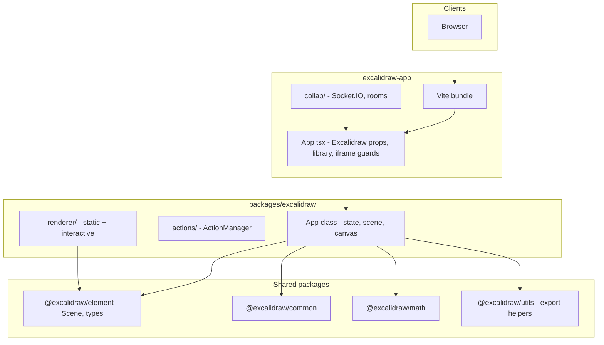
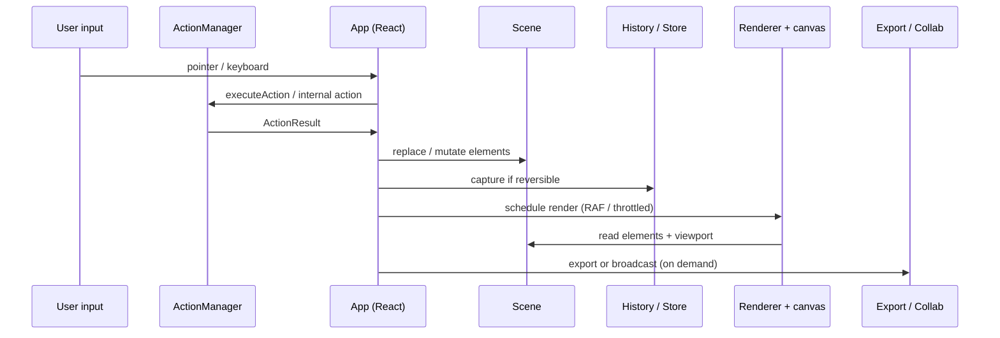
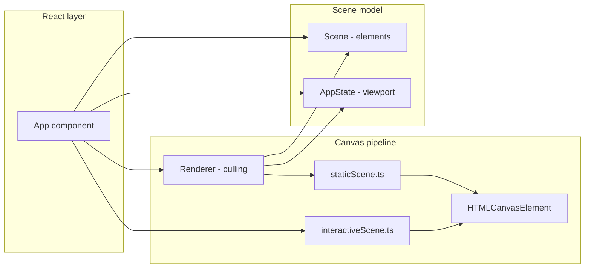
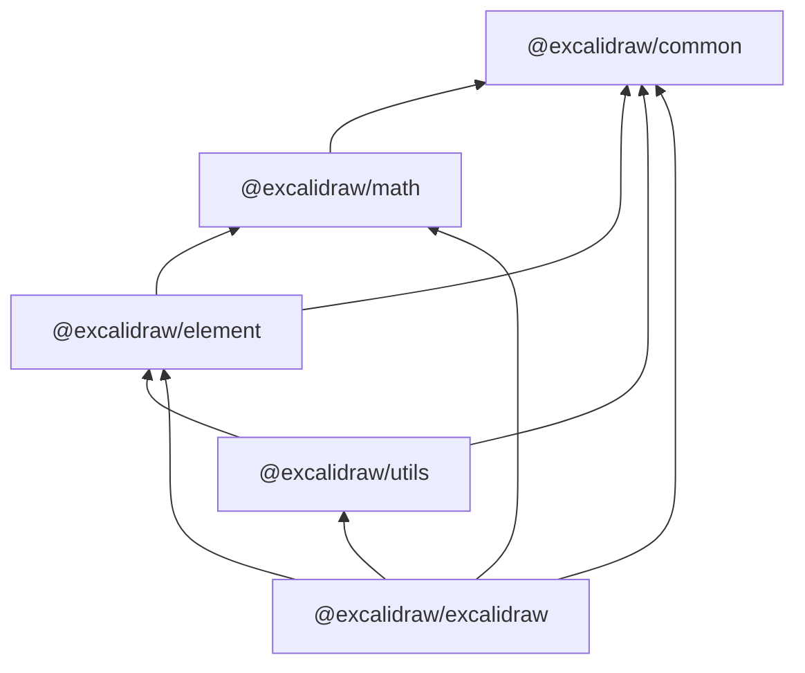

# Technical architecture — Excalidraw monorepo

This document describes how the **editor**, **scene model**, and **web app** fit together in this repository. It is derived from the layout of `packages/*`, `excalidraw-app/`, and the core `App` class in `packages/excalidraw/components/App.tsx`.

---

## 1. High-level architecture

Excalidraw splits into **three conceptual layers**:

1. **Presentation / shell** — React components, menus, hooks, and (in `excalidraw-app`) collaboration wiring, library persistence, and analytics.
2. **Editor core** — A class-based `App` component that owns **`AppState`**, **`Scene`** (elements), **`ActionManager`**, **`Store`**, **`History`**, **`Renderer`**, and canvas primitives (**Rough.js** `rough.canvas`).
3. **Shared libraries** — Type definitions, geometry, math, and serialization helpers in `@excalidraw/element`, `@excalidraw/common`, `@excalidraw/math`, and `@excalidraw/utils`.

The **hosted product** adds `excalidraw-app/` (Vite entry, Socket.IO + optional Firebase, Sentry, PWA plugins). The **embeddable product** is primarily `@excalidraw/excalidraw` consumed from `packages/excalidraw/`.

### 1.1 System context (Mermaid)

### 1.2 Runtime objects in the editor core

In `App`’s constructor (`packages/excalidraw/components/App.tsx`), the following are created together:

- **`Scene`** (`@excalidraw/element`) — holds the ordered element list, maps, selection caches, and invalidation nonce.
- **`ActionManager`** — registers all actions from `actions/index` plus undo/redo; receives `syncActionResult` to apply mutations.
- **`Store`** + **`History`** — back undo/redo and structured updates.
- **`Renderer`** (`packages/excalidraw/scene/Renderer.ts`) — computes **visible / renderable** elements from `Scene` + `AppState` (viewport, zoom, scroll).
- **`rough.canvas`** — bound to the interactive `HTMLCanvasElement` for drawing.

---

## 2. Data flow

Data moves **inward** from user input and **outward** to export, collaboration, and persistence.

### 2.1 Input path (user → scene)

1. **Pointer / keyboard** events are handled on the editor `App` (and delegated helpers). Tools interpret gestures (e.g. create element, resize, drag).
2. **Actions** encapsulate discrete operations: **ActionManager** looks up an action by name, runs its `perform`, and passes the resulting **`ActionResult`** to the updater (`syncActionResult`), which updates **`AppState`**, **`Scene`** (elements), or both.
3. **History** records reversible updates via the **`Store`** when the action requests capture (not every `AppState` field participates—see changelog notes on collaborators and partial `AppState`).

### 2.2 Output path (scene → file / network)

1. **Export** — Public APIs and utilities (`exportToSvg`, `exportToCanvas`, `renderSceneToSvg` in `renderer/staticSvgScene.ts`) take **elements + `AppState` + files** and produce **SVG** or **canvas** pixels without going through React reconciliation for the heavy lifting.
2. **Collaboration** (`excalidraw-app`) — When enabled, `Collab` / `Portal` broadcast scene updates over **Socket.IO**; binary assets may use **Firebase** storage paths keyed by room id (see `excalidraw-app/collab/`).
3. **Local persistence** — Library items and scene snapshots can be persisted via **IndexedDB** / **localStorage** adapters in the app shell (`useHandleLibrary`, `LocalData`).

### 2.3 Data-flow diagram (Mermaid)

---

## 3. State management

Three concepts must stay distinct: **`AppState`**, **elements inside `Scene`**, and **`ActionManager`**.

### 3.1 `AppState`

- **What it is** — React `App` component state (`packages/excalidraw/types.ts`): zoom, scroll, selection ids, active tool, theme, view/zen modes, dimensions, dialogs, etc.
- **Role** — Drives **UI** and **viewport**; combined with elements to decide what is visible and how exports are framed.
- **Mutation** — Typically via `setState` after an action or internal handler; **not** every field is undoable.

### 3.2 Elements and `Scene`

- **What they are** — `OrderedExcalidrawElement[]` with stable ordering and fractional indices; `Scene` maintains **non-deleted maps**, **frames**, and **selection caches** (`packages/element/src/Scene.ts`).
- **Role** — **Authoritative drawing data** for serialization, hit testing, and export.
- **Mutation** — Through controlled APIs (`replaceAllElements`, mutations via `mutateElement`, etc.) triggered from `App` / actions—not arbitrary cross-package writes.

### 3.3 `ActionManager`

- **What it is** — `packages/excalidraw/actions/manager.tsx`: registry of **`Action`** objects (`perform`, `keyTest`, `trackEvent`, …).
- **Role** — **Single entry** for menu items, command palette, keyboard shortcuts, and programmatic operations so behavior stays consistent.
- **Dependencies** — Constructed with:

  - `getAppState: () => AppState`
  - `getElementsIncludingDeleted: () => OrderedExcalidrawElement[]`
  - `app: AppClassProperties` (the editor instance surface)

### 3.4 Jotai and React scope

The **`ExcalidrawBase`** wrapper (`packages/excalidraw/index.tsx`) and many components use **Jotai** for editor-scoped atoms (e.g. UI that does not belong in the legacy `AppState` shape). **Jotai does not replace `Scene`/`AppState`** for the document model; it complements React-local concerns.

---

## 4. Rendering pipeline

Rendering is split into **static** (scene content) and **interactive** (selection handles, drag, etc.) passes, both targeting **Canvas 2D**.

### 4.1 From React `App` to pixels

1. **`App`** (class component) owns refs to **canvas** elements and calls into render routines when state changes (including throttled paths).
2. **`Renderer.getRenderableElements`** (`packages/excalidraw/scene/Renderer.ts`) filters **`Scene`** non-deleted elements by **viewport** (`isElementInViewport` from `@excalidraw/element`) and by **editing** state (e.g. skip in-canvas text that is being edited in WYSIWYG).
3. **`renderStaticSceneThrottled`** (`packages/excalidraw/renderer/staticScene.ts`) draws **grid**, **elements** (via `renderElement` from `@excalidraw/element`), **frames**, and related decorations using **Rough.js** and 2D context setup (`bootstrapCanvas`, theme, zoom).
4. **`renderInteractiveScene`** (`packages/excalidraw/renderer/interactiveScene.ts`) draws **selection**, **handles**, **linear point editing**, scrollbars, and other **ephemeral** overlays that are not part of the static scene export.

### 4.2 SVG export path (parallel track)

For **vector export**, `renderSceneToSvg` and related helpers (`renderer/staticSvgScene.ts`) build an **SVG DOM** from the same logical scene, keeping **visual parity** with the canvas path as closely as possible (subject to known limitations in changelog).

### 4.3 Rendering pipeline (Mermaid)

---

## 5. Package dependencies

Workspace packages are wired via **Yarn workspaces** and **TypeScript path aliases** (`packages/tsconfig.base.json`).

### 5.1 Dependency graph (Mermaid)

### 5.2 Responsibilities (summary)

| Package | Responsibility |
|---------|------------------|
| `@excalidraw/common` | Shared utilities, constants, env helpers (e.g. `isRunningInIframe`), theming helpers. |
| `@excalidraw/math` | Vector/matrix math for transforms and intersections. |
| `@excalidraw/element` | **`Scene`**, element types, bindings, linear/frame logic, `renderElement` for canvas/SVG. |
| `@excalidraw/utils` | Export helpers (`exportToSvg`, `exportToCanvas`, etc.) and shared non-React utilities. |
| `@excalidraw/excalidraw` | Full editor UI, **`App`**, **`ActionManager`**, renderers, public React API. |

### 5.3 Application layer

| Package / app | Responsibility |
|---------------|------------------|
| `excalidraw-app` | Vite shell, collaboration, library persistence adapters, production integrations (Sentry, PWA, analytics). |
| `examples/*` | Minimal integration samples (Next.js, script tag). |

---

## 6. Related documentation

- **Onboarding**: `docs/technical/dev-setup.md`
- **Memory Bank**: `docs/memory/techContext.md`, `docs/memory/systemPatterns.md`
- **Known doc/code gaps**: `docs/memory/decisionLog.md` (UB-* entries)
- **Product**: `docs/product/PRD.md`

---

## 7. CodeRabbit note

This file is listed in **`.coderabbit.yaml`** under `path_instructions` (`docs/technical/architecture.md`) and in **`pre_merge_checks`** as **“Technical architecture doc”** (required sections: High-level Architecture, Data Flow, State Management, Rendering Pipeline, Package Dependencies; length guidance **100–700** lines in checks, **200–500** in path instructions).
