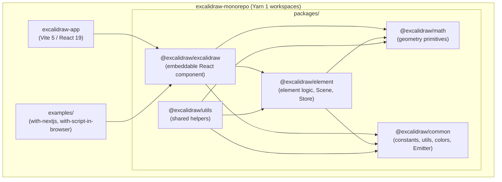
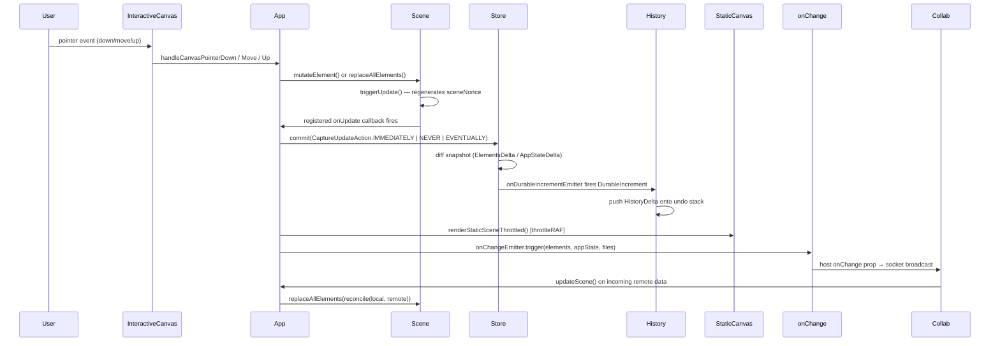
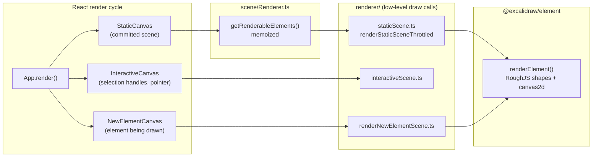
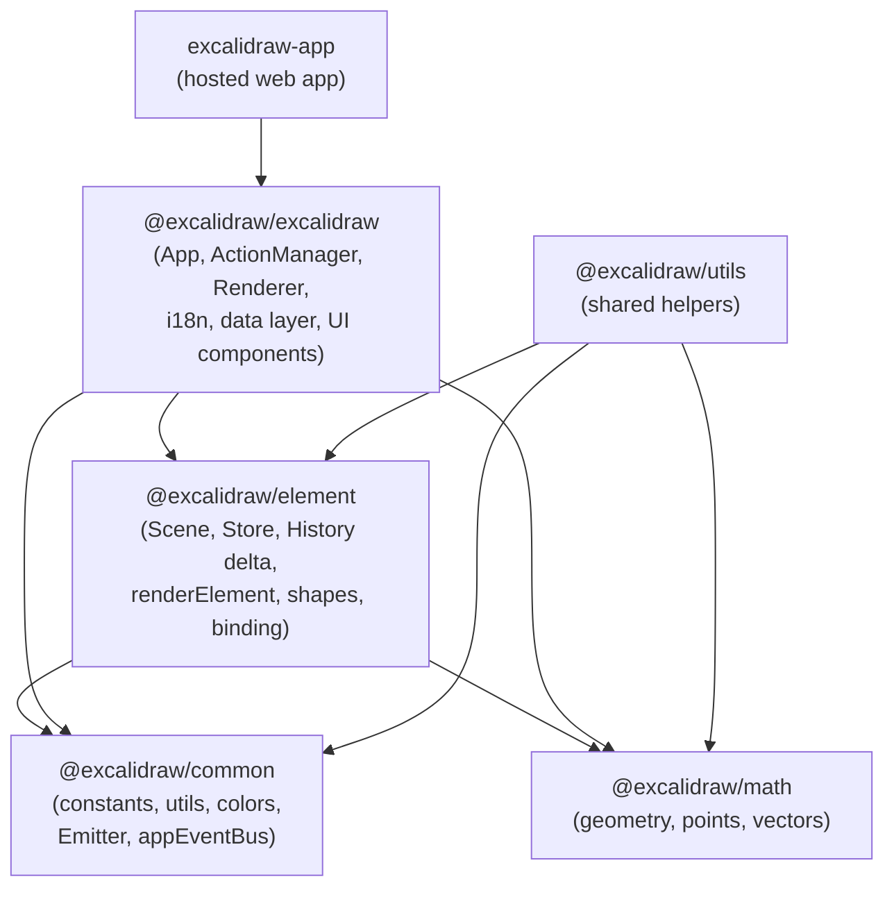

# Excalidraw Monorepo — Architecture

> All facts in this document are traced to source files in the repository.
> Package versions come from `packages/*/package.json` and root `package.json`.

---

## 1. High-level Architecture

The repository is a **private Yarn 1 monorepo** (`packageManager: yarn@1.22.22`) with three workspace groups:

| Workspace | Role |
|-----------|------|
| `excalidraw-app/` | Full hosted web application (Vite 5, React 19, Firebase, Socket.IO) |
| `packages/*` | Publishable libraries (`@excalidraw/*`) |
| `examples/*` | Embedding demos (e.g. `with-nextjs`, `with-script-in-browser`) |



**Runtime requirements:** Node >= 18.0.0 (enforced in `engines` of root and `excalidraw-app/package.json`). CI uses Node 20.x (`test.yml`).

**Build targets:**
- Web app: `excalidraw-app/build/` (Vite production build, `vercel.json` `outputDirectory`)
- Library: `packages/excalidraw/dist/` (ESM via `scripts/buildPackage.js` + esbuild)
- Docker: multi-stage — Node 18 build → nginx:1.27-alpine serving `excalidraw-app/build/`

---

## 2. Data Flow

The diagram below shows how a user action travels from input to screen and then to persistence or collaboration peers.



### Key data flow facts

- **Pointer events** are handled imperatively in `App` (`handleCanvasPointerDown`, etc.), not through the actions system. The actions system handles discrete commands only.
- **`Scene.mutateElement()`** calls `mutateElement()` from `@excalidraw/element/src/mutateElement.ts`, increments the element's `version`/`versionNonce`, then calls `triggerUpdate()` if `informMutation: true` and the version actually changed.
- **`Store.commit()`** diffs the previous `StoreSnapshot` against the current state and emits either a `DurableIncrement` (captured in history) or `EphemeralIncrement` (drag/resize, never recorded).
- **`CaptureUpdateAction`** const object (`as const`) in `packages/element/src/store.ts` has three values: `IMMEDIATELY` (undo-able at once), `NEVER` (remote updates, scene init), `EVENTUALLY` (async multi-step, captured with next `IMMEDIATELY`).
- **`onChangeEmitter`** in `App` is the primary hook for both host `onChange` prop and the collaboration socket adapter.
- **Reconciliation** for real-time collaboration merges incoming elements via `data/reconcile.ts` before calling `App.updateScene()`.

### Local persistence

| Data | Storage | Key (from `app_constants.ts`) |
|------|---------|-------------------------------|
| Elements JSON | `localStorage` | `STORAGE_KEYS.LOCAL_STORAGE_ELEMENTS` |
| AppState JSON | `localStorage` | `STORAGE_KEYS.LOCAL_STORAGE_APP_STATE` |
| Binary files | IndexedDB (`idb-keyval`) or Firebase Storage | `LocalData.fileStorage` |

Debounced local save fires after **300 ms** (`SAVE_TO_LOCAL_STORAGE_TIMEOUT`). Full scene sync to collaboration peers repeats every **20 000 ms** (`SYNC_FULL_SCENE_INTERVAL_MS`). Cursor position syncs at **33 ms** intervals (`CURSOR_SYNC_TIMEOUT` ≈ 30 fps).

---

## 3. State Management

State is split across three distinct layers that coexist in the editor.

### 3.1 `AppState` — primary source of truth

`App` (`packages/excalidraw/components/App.tsx`) is a **class component** (`React.Component<AppProps, AppState>`). `AppState` is defined in `packages/excalidraw/types.ts` and instantiated via `getDefaultAppState()` from `packages/excalidraw/appState.ts`.

Selected fields from `getDefaultAppState()`:

| Field | Default | Purpose |
|-------|---------|---------|
| `activeTool` | `{type: "selection", …}` | Currently selected drawing tool |
| `theme` | `THEME.LIGHT` | Light / dark rendering |
| `collaborators` | `new Map()` | Remote cursor/presence data |
| `scrollX`, `scrollY` | `0` | Canvas viewport offset |
| `zoom` | `{value: 1}` | Canvas zoom level |
| `editingTextElement` | `null` | Element being edited in WYSIWYG |
| `newElement` | `null` | Element in-progress of creation |
| `selectedElementIds` | `{}` | Set of selected element IDs |
| `currentItemStrokeColor` | `DEFAULT_ELEMENT_PROPS.strokeColor` | Tool stroke color |

`AppState` is **not** exported to the host app in full — `cleanAppStateForExport()` strips runtime-only fields before serialization (`data/json.ts`).

### 3.2 `Scene` — element store (`@excalidraw/element`)

`Scene` (`packages/element/src/Scene.ts`) is a plain class (not React) that holds the canonical element list.

```
Scene
  ├── elements: readonly OrderedExcalidrawElement[]   (all, including deleted)
  ├── elementsMap: SceneElementsMap                   (Map<id, element>)
  ├── nonDeletedElements: NonDeletedExcalidrawElement[]
  ├── nonDeletedElementsMap: NonDeletedSceneElementsMap
  ├── frames / nonDeletedFramesLikes
  ├── sceneNonce: number                              (random integer, cache-bust key)
  └── callbacks: Set<SceneStateCallback>              (update subscribers)
```

Primary mutation methods:

- `replaceAllElements(nextElements)` — full replace; runs `syncInvalidIndices` (fractional ordering), rebuilds all maps, fires `triggerUpdate()`.
- `mutateElement(element, updates, options)` — delegates to `@excalidraw/element/mutateElement`, then conditionally fires `triggerUpdate()`.
- `insertElement(element)` / `insertElementAtIndex(element, index)` — targeted insertion.
- `triggerUpdate()` — regenerates `sceneNonce` (random integer) and fires all registered callbacks.

`App` registers itself as an `onUpdate` subscriber so every `triggerUpdate()` results in a React re-render and a canvas repaint.

### 3.3 `Store` — snapshot and undo driver (`@excalidraw/element`)

`Store` (`packages/element/src/store.ts`) captures element/appState changes as delta objects.

```
Store
  ├── snapshot: StoreSnapshot              (last committed state)
  ├── onDurableIncrementEmitter            (→ History)
  ├── onStoreIncrementEmitter              (→ public onIncrement API)
  ├── scheduledMacroActions: Set           (pending CaptureUpdateAction)
  └── scheduledMicroActions: queue
```

`Store.commit(action, elements, appState)` diffs the incoming state against `snapshot`, produces an `ElementsDelta` + `AppStateDelta`, and emits a `DurableIncrement` (for `IMMEDIATELY`) or an `EphemeralIncrement` (for drag/resize).

### 3.4 `History` — undo/redo

`History` (`packages/excalidraw/history.ts`) subscribes to `Store.onDurableIncrementEmitter` and maintains two stacks of `HistoryDelta` objects. `HistoryDelta.applyTo(elements, appState, snapshot)` applies the delta and returns the next `[SceneElementsMap, AppState, boolean]`, excluding `version`/`versionNonce` to keep collaboration identity consistent.

### 3.5 `ActionManager` — command registry

`ActionManager` (`packages/excalidraw/actions/manager.tsx`) owns a flat `Record<ActionName, Action>` registry. It provides:

- `registerAction(action)` / `registerAll(actions[])`
- `executeAction(action, source, value)` — calls `action.perform(elements, appState, formData, app)` and pipes the `ActionResult` to the `updater` callback (which is `App.syncActionResult`).
- `handleKeyDown(event)` — scans all registered actions by `keyPriority`, finds the unique match, prevents default, calls `perform`.
- `renderAction(name)` — renders the action's `PanelComponent` inline.

`ActionResult` interface (from `actions/types.ts`):

```typescript
type ActionResult = {
  elements?: readonly ExcalidrawElement[] | null;
  appState?: Partial<AppState> | null;
  files?: BinaryFiles | null;
  captureUpdate: CaptureUpdateActionType;
  replaceFiles?: boolean;
} | false;
```

`App.syncActionResult` merges `ActionResult.elements` into `Scene`, merges `ActionResult.appState` via `setState`, and forwards `captureUpdate` to `Store`.

### 3.6 Jotai — scoped UI atoms

`packages/excalidraw/editor-jotai.ts` uses `jotai-scope@0.7.2`'s `createIsolation()` to produce an isolated store per editor instance, preventing atom leakage between multiple embeds.

```typescript
// editor-jotai.ts
const jotai = createIsolation();
export const EditorJotaiProvider = jotai.Provider;
export const editorJotaiStore = createStore();
```

Notable atoms (defined close to their usage):

| Atom | File |
|------|------|
| `isSidebarDockedAtom` | `components/Sidebar/Sidebar.tsx` |
| `isLibraryMenuOpenAtom` | `components/LibraryMenu.tsx` |
| `libraryItemsAtom` | `data/library.ts` |
| `activeEyeDropperAtom` | `components/EyeDropper.tsx` |
| `activeConfirmDialogAtom` | `components/ActiveConfirmDialog.tsx` |
| `convertElementTypePopupAtom` | `components/ConvertElementTypePopup.tsx` |
| `searchItemInFocusAtom` | `components/SearchMenu.tsx` |
| `editorLangCodeAtom` | `i18n.ts` |
| `localStorageQuotaExceededAtom` | `excalidraw-app` |

`App` bridges Jotai ↔ class state via `updateEditorAtom()` + `triggerRender()`.

### 3.7 React Contexts

`App.render()` wraps descendants in nested providers to avoid prop-drilling:

| Context | Exported hook | Contents |
|---------|--------------|----------|
| `ExcalidrawAPIContext` | `useExcalidrawAPI()` | Imperative API handle |
| `AppContext` | `useApp()` | `App` class instance |
| `ExcalidrawAppStateContext` | `useExcalidrawAppState()` | `AppState` (read) |
| `ExcalidrawSetAppStateContext` | `useExcalidrawSetAppState()` | `setState` setter |
| `ExcalidrawElementsContext` | `useExcalidrawElements()` | Current non-deleted elements |
| `ExcalidrawActionManagerContext` | `useExcalidrawActionManager()` | `ActionManager` |
| `AppPropsContext` | `useAppProps()` | `ExcalidrawProps` |
| `EditorInterfaceContext` | `useEditorInterface()` | `editorInterface` form factor |
| `ExcalidrawContainerContext` | `useExcalidrawContainer()` | DOM container ref + dimensions |
| `ExcalidrawAPISetContext` | — | Setter for imperative API reference |

---

## 4. Rendering Pipeline

The editor uses **three separate HTML canvas elements** stacked on top of each other.



### Step-by-step pipeline for `StaticCanvas`

1. **`Scene.triggerUpdate()`** fires registered callbacks in `App`.
2. **`App`** calls `this.renderer.getRenderableElements(zoom, scrollX, scrollY, height, width, editingTextElement, newElementId, sceneNonce)`.
3. **`Renderer.getRenderableElements()`** (memoized via `memoize()` from `@excalidraw/common`):
   - Calls `scene.getNonDeletedElements()`.
   - Filters out the element being edited in WYSIWYG and the in-progress `newElement`.
   - Filters to viewport-visible elements via `isElementInViewport()`.
   - Cache is keyed on `sceneNonce` (the random integer from `triggerUpdate()`), so any scene mutation busts the cache.
4. **`renderStaticSceneThrottled`** (`renderer/staticScene.ts`) — throttled via `throttleRAF` (from `@excalidraw/common`):
   - `bootstrapCanvas()` — sets canvas DPR scaling.
   - Draws grid lines if `appState.gridSize` is set.
   - Iterates `visibleElements`; for each element calls `renderElement(element, elementsMap, …, rc, context, renderConfig, appState)` from `@excalidraw/element/src/renderElement.ts`.
   - Frame clipping applied via `context.save()` / `context.restore()` when `appState.frameRendering.clip` is true.
   - Renders pending flowchart nodes last.
5. **`renderElement()`** (`packages/element/src/renderElement.ts`) dispatches to the element-type-specific draw function, which calls RoughJS (`roughjs@4.6.4`) for hand-drawn shapes and raw `CanvasRenderingContext2D` calls for text and images.

### `window.EXCALIDRAW_THROTTLE_RENDER`

The hosted `excalidraw-app/App.tsx` sets `window.EXCALIDRAW_THROTTLE_RENDER = true` before mounting. This flag is checked in `reactUtils.ts` (`isRenderThrottlingEnabled()`) and controls whether React render cycles are throttled via batched RAF updates. Note that `renderStaticSceneThrottled` in `staticScene.ts` uses `throttleRAF` unconditionally regardless of this flag.

### Export path (SVG)

For SVG/PNG export (`scene/export.ts`), the pipeline bypasses canvas throttling: `exportToSvg()` calls the functions in `renderer/staticSvgScene.ts` which produces an `SVGElement` tree instead of painting a canvas context.

---

## 5. Package Dependencies

### Internal dependency graph



### External dependency highlights (from `packages/excalidraw/package.json`)

| Dependency | Version | Role |
|-----------|---------|------|
| `roughjs` | 4.6.4 | Hand-drawn shape generation |
| `perfect-freehand` | 1.2.0 | Freehand stroke smoothing |
| `jotai` | 2.11.0 | Scoped UI atom state |
| `jotai-scope` | 0.7.2 | Per-editor atom isolation |
| `fractional-indexing` | 3.2.0 | Z-order fractional indices |
| `@excalidraw/mermaid-to-excalidraw` | 2.1.1 | Mermaid diagram import |
| `radix-ui` | 1.4.3 | Accessible UI primitives |
| `@codemirror/view` (+ state, language, commands) | ^6.0.0 | Code editor for embeddable content |
| `tunnel-rat` | 0.1.2 | React portal tunnelling (`tunnels.ts`) |
| `nanoid` | 3.3.3 | Element ID generation |
| `pako` | 2.0.3 | gzip compression for export payloads |
| `lodash.throttle` / `lodash.debounce` | 4.1.1 / 4.0.8 | RAF throttle, debounced saves |
| `sass` | 1.51.0 | Component styles |

### Web app additional dependencies (from `excalidraw-app/package.json`)

| Dependency | Version | Role |
|-----------|---------|------|
| `firebase` | 11.3.1 | Cloud persistence + file storage |
| `socket.io-client` | 4.7.2 | Real-time collaboration transport |
| `@sentry/browser` | 9.0.1 | Error reporting (disabled in Docker builds) |
| `idb-keyval` | 6.0.3 | IndexedDB key-value store for files |
| `i18next-browser-languagedetector` | 6.1.4 | Auto-detect locale |
| `vite-plugin-pwa` | 0.21.1 | Service worker / PWA registration (root devDependency) |

### Build toolchain per target

| Target | Bundler | Config file |
|--------|---------|-------------|
| `excalidraw-app` | Vite 5.0.12 + `@vitejs/plugin-react` | `excalidraw-app/vite.config.mts` |
| `@excalidraw/excalidraw` | esbuild 0.19.10 (via `scripts/buildPackage.js`) | `packages/excalidraw/package.json` `build:esm` |
| `@excalidraw/element` / `@excalidraw/common` / `@excalidraw/math` | esbuild (via `scripts/buildBase.js`) | per-package `build:esm` |
| `@excalidraw/utils` | esbuild (via `scripts/buildUtils.js`) | `packages/utils/package.json` `build:esm` |
| Tests | Vitest 3.0.6 + jsdom | `vitest.config.mts` (repo root) |

Build order enforced by `yarn build:packages` root script: `build:common` → `build:math` → `build:element` → `build:excalidraw`.
