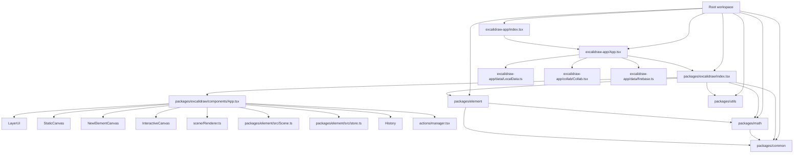

# Architecture

## High-level Architecture

The root `package.json` defines a Yarn workspaces monorepo with three workspace groups:

- `excalidraw-app`
- `packages/*`
- `examples/*`

The runtime is split into a standalone application and a reusable editor package:

- `excalidraw-app/` contains the standalone web app
- `packages/excalidraw/` contains the public React package
- `packages/common/`, `packages/math/`, `packages/element/`, and `packages/utils/` provide supporting layers

The app and test/build tooling resolve internal package imports directly to source files via `tsconfig.json`, `vitest.config.mts`, and `excalidraw-app/vite.config.mts`.

`excalidraw-app/index.tsx` mounts `ExcalidrawApp` and registers the service worker.
`excalidraw-app/App.tsx` renders the app shell and embeds the reusable `<Excalidraw />` component.
`packages/excalidraw/index.tsx` exports the public component and related APIs.
`packages/excalidraw/components/App.tsx` is the central editor runtime controller.

## Main Runtime Layers

### Standalone app layer

`excalidraw-app/App.tsx` adds application-specific behavior around the editor package.
From the source file, this includes:

- scene initialization
- local storage restore
- backend share-link import
- collaboration room handling
- Firebase file loading
- tab synchronization
- app theme and language handling
- share and export dialogs

### Public editor package layer

`packages/excalidraw/index.tsx` exports:

- `Excalidraw`
- `ExcalidrawAPIProvider`
- hooks such as `useEditorInterface()` and `useExcalidrawAPI()`
- restore and reconciliation helpers
- export helpers
- UI components such as `Sidebar`, `MainMenu`, `WelcomeScreen`, and `CommandPalette`

### Editor runtime layer

`packages/excalidraw/components/App.tsx` constructs and owns:

- React `state`
- `Library`
- `ActionManager`
- `Scene`
- `Renderer`
- `Store`
- `History`
- `Fonts`
- the imperative API object

### Domain/model layer

`packages/element` provides:

- `Scene`
- `Store`
- element creation helpers
- mutation helpers
- selection helpers
- bounds and collision helpers
- frame logic
- rendering helpers such as `renderElement`

### Shared utility layers

`packages/common` provides shared constants, utilities, event helpers, and editor interface helpers. `packages/math` provides geometry operations used by the editor runtime. `packages/utils` provides helper exports used by the public package.

## Data Flow

## Startup flow

`excalidraw-app/index.tsx`:

1. imports `ExcalidrawApp`
2. sets `window.__EXCALIDRAW_SHA__`
3. calls `registerSW()`
4. mounts the React tree with `createRoot(...).render(...)`

`ExcalidrawApp` in `excalidraw-app/App.tsx`:

1. creates app-level Jotai provider state
2. creates `ExcalidrawAPIProvider`
3. renders `ExcalidrawWrapper`
4. passes `initialData`, callbacks, and app-specific UI into `<Excalidraw />`

## Scene input flow

`initializeScene(...)` in `excalidraw-app/App.tsx` reads scene sources from:

- `window.location.search`
- `window.location.hash`
- browser local storage via `importFromLocalStorage()`
- backend share data via `importFromBackend(...)`
- collaboration link data via `getCollaborationLinkData(...)`

It then normalizes incoming data with:

- `restoreElements(...)`
- `restoreAppState(...)`
- `reconcileElements(...)`
- `bumpElementVersions(...)`

The resulting scene becomes the editor's `initialData`.

## Editor mutation flow

There are two main mutation entrypoints inside the reusable editor package.

### Action-driven flow

1. A keyboard shortcut, menu item, toolbar control, or other UI path triggers an action
2. `ActionManager` runs `action.perform(elements, appState, value, app)`
3. `ActionManager` forwards the `ActionResult` to `App.syncActionResult(...)`
4. `syncActionResult(...)` schedules capture on the `Store`
5. `syncActionResult(...)` updates scene elements, files, and `appState`
6. rendering is invalidated

### Imperative API flow

1. host code or the standalone app calls `excalidrawAPI.updateScene(...)`
2. `updateScene(...)` may call `store.scheduleMicroAction(...)`
3. `updateScene(...)` updates `appState`, collaborators, and/or scene elements
4. rendering is invalidated

`updateScene(...)` supports the following capture modes:

- `CaptureUpdateAction.IMMEDIATELY`
- `CaptureUpdateAction.NEVER`
- `CaptureUpdateAction.EVENTUALLY`

## Persistence flow

In `excalidraw-app/App.tsx`, the `onChange(...)` handler receives:

- elements
- appState
- files

That handler:

- syncs elements to collaboration when collaboration is active
- calls `LocalData.save(...)` when saving is not paused
- updates image status after file save completion

`LocalData.save(...)` in `excalidraw-app/data/LocalData.ts` writes elements and app state to `localStorage`, saves binary files through IndexedDB-backed storage, and updates browser state version keys for cross-tab synchronization.

## Collaboration flow

`excalidraw-app/collab/Collab.tsx` builds a `CollabAPI` with methods including:

- `startCollaboration`
- `stopCollaboration`
- `syncElements`
- `fetchImageFilesFromFirebase`
- `onPointerUpdate`
- `setUsername`

The collaboration module uses:

- `Portal`
- `socket.io-client`
- Firebase helpers from `excalidraw-app/data/firebase.ts`

Remote collaboration state enters the editor through `appState.collaborators`.
`InteractiveCanvas.tsx` turns that data into:

- remote pointer viewport coordinates
- remote pointer button state
- remote selected element overlays
- remote usernames
- remote user states

## State Management

## Overview

State is not stored in a single structure. The source code uses several cooperating runtime objects:

- React `state` on `App`
- `Scene`
- `Store`
- `History`
- `ActionManager`
- editor-scoped Jotai atoms
- multiple emitters and contexts

## `appState`

`App` initializes React state in the constructor using `getDefaultAppState()`.
The constructor then overrides or extends that state with:

- `theme`
- `exportWithDarkMode`
- `isLoading`
- canvas offsets
- `viewModeEnabled`
- `zenModeEnabled`
- `objectsSnapModeEnabled`
- `gridModeEnabled`
- `name`
- `width`
- `height`

`syncActionResult(...)` merges `actionResult.appState` into the current state. `updateScene(...)` also updates React state when `sceneData.appState` is supplied. `App` also exposes app-state observation through `appStateObserver`, `onStateChange`, and the imperative API.

The canvas components use reduced app-state subsets for memoization rather than consuming the full state object.

## Elements and `Scene`

`Scene` in `packages/element/src/Scene.ts` stores:

- all elements including deleted
- non-deleted elements
- maps for fast lookup
- frame collections
- a selected-elements cache
- `sceneNonce` for renderer cache invalidation

`Scene` exposes methods including `getElementsIncludingDeleted()`, `getElementsMapIncludingDeleted()`, `getNonDeletedElements()`, `getNonDeletedElementsMap()`, `getSelectedElements(...)`, `replaceAllElements(...)`, and `mutateElement(...)`.

`App.syncActionResult(...)` and `App.updateScene(...)` both replace scene elements through `scene.replaceAllElements(...)`.
`Renderer.getRenderableElements(...)` reads from `scene.getNonDeletedElements()`.

## `ActionManager`

`ActionManager` is constructed with:

- `this.syncActionResult`
- a getter for current `appState`
- a getter for elements including deleted
- the `App` instance

It stores registered actions in `actions` and provides:

- `registerAction(...)`
- `registerAll(...)`
- `handleKeyDown(...)`
- `executeAction(...)`
- `renderAction(...)`
- `isActionEnabled(...)`

`handleKeyDown(...)` sorts actions by `keyPriority`, filters by `keyTest(...)`, checks view-mode compatibility, prevents default browser behavior, and executes the matching action.

`renderAction(...)` renders a panel component for actions that expose `PanelComponent`.

## `Store`

`Store` in `packages/element/src/store.ts` maintains:

- `onDurableIncrementEmitter`
- `onStoreIncrementEmitter`
- scheduled macro actions
- scheduled micro actions
- `snapshot`

Its source comment describes it as a store that captures observed changes and emits store increments.

`App.syncActionResult(...)` calls `store.scheduleAction(...)`.
`App.updateScene(...)` may call `store.scheduleMicroAction(...)`.

`Store.commit(...)` flushes micro actions and executes one scheduled macro action. `emitDurableIncrement(...)` triggers both `onDurableIncrementEmitter` and `onStoreIncrementEmitter`.

## `History`

`App` constructs history with `new History(this.store)`.
In `componentDidMount()`, durable increments are recorded into history:

- `this.store.onDurableIncrementEmitter.on((increment) => { this.history.record(increment.delta); })`

Undo and redo actions are registered with `createUndoAction(this.history)` and `createRedoAction(this.history)`.

## Rendering Pipeline

## React composition

The `render()` output of `packages/excalidraw/components/App.tsx` includes:

- `LayerUI`
- `StaticCanvas`
- `NewElementCanvas` when `this.state.newElement` exists
- `InteractiveCanvas`

Before rendering those components, `App` passes:

- `elementsMap`
- `allElementsMap`
- `visibleElements`
- `selectedElements`
- `sceneNonce`
- `selectionNonce`
- `appState`
- render configuration objects

## Renderable element selection

`Renderer` in `packages/excalidraw/scene/Renderer.ts` computes:

- a renderable `elementsMap`
- a `visibleElements` array

It does this by:

1. reading `scene.getNonDeletedElements()`
2. excluding the current new element
3. excluding the text element currently being edited
4. checking visibility with `isElementInViewport(...)`

## Static canvas

`StaticCanvas.tsx`:

- resizes the shared static canvas
- mounts that canvas into a wrapper
- calls `renderStaticScene(...)`

`renderStaticScene(...)` in `packages/excalidraw/renderer/staticScene.ts` bootstraps the canvas, uses the shared `RoughCanvas`, renders grid lines when configured, renders visible elements, renders link icons, and applies frame clipping where needed.

## New element canvas

`NewElementCanvas.tsx` calls `renderNewElementScene(...)`.
`renderNewElementScene(...)` bootstraps its own canvas, applies zoom, skips invisibly small elements, optionally clips to a frame, and renders `newElement` through `renderElement(...)`.

## Interactive canvas

`InteractiveCanvas.tsx` is the interaction and overlay layer. It reads collaborators from `appState`, computes remote pointer viewport coordinates, computes remote selected element overlays, reads selection color from CSS, stores renderer parameters in a ref, and starts `AnimationController.start(...)`.

The animation loop calls `renderInteractiveScene(...)`. The interactive renderer draws transient state such as selection visuals, transform handles, linear point editing overlays, binding highlights, remote cursors, and scrollbars.

## Render invalidation

`App.triggerRender(...)`:

- calls `scene.triggerUpdate()` when forced
- otherwise calls `setState({})`

`componentDidMount()` subscribes scene updates with `this.scene.onUpdate(this.triggerRender)`.

That ties scene changes directly to rerendering.

## Package Dependencies

## Internal package relationships

The package manifests define this internal dependency structure:

- `@excalidraw/common`: no internal Excalidraw package dependencies
- `@excalidraw/math`: depends on `@excalidraw/common`
- `@excalidraw/element`: depends on `@excalidraw/common` and `@excalidraw/math`
- `@excalidraw/excalidraw`: depends on `@excalidraw/common`, `@excalidraw/element`, and `@excalidraw/math`

`packages/utils/package.json` defines its own dependencies, and `packages/excalidraw/index.tsx` re-exports helper functionality from `@excalidraw/utils/export`.

## Application relationships

`excalidraw-app/App.tsx` imports from:

- `@excalidraw/excalidraw`
- `@excalidraw/common`
- `@excalidraw/element`

This places the standalone app above the reusable editor package and the lower-level domain packages.

## Example relationships

The examples provide consumer setups:

- `examples/with-nextjs` builds workspace packages and runs a Next.js app
- `examples/with-script-in-browser` depends on `@excalidraw/excalidraw` and also includes a workspace package build script

## Summary

From the source code, the system is layered as:

- shared utilities in `common`
- geometry in `math`
- scene and element domain logic in `element`
- the React editor runtime in `excalidraw`
- the standalone product shell in `excalidraw-app`
