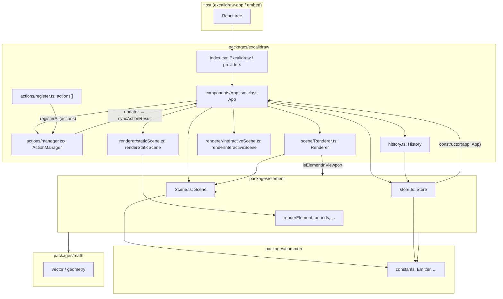
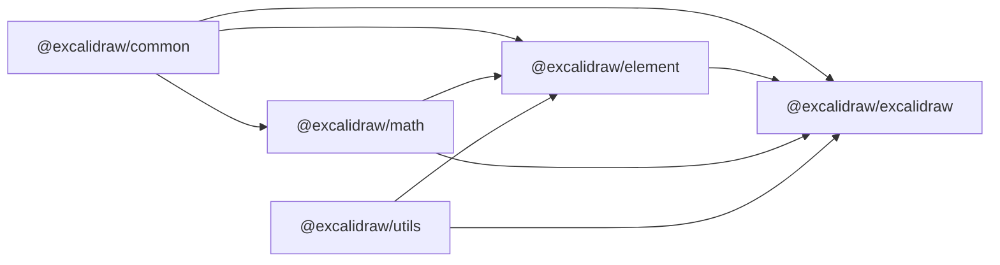

# Architecture

Документ описує архітектуру редактора в межах репозиторію. Кожне твердження спирається на наявний source code (шляхи файлів від кореня репозиторію).

---

## High-level Architecture

Монорепозиторій (`package.json`, `name`: `excalidraw-monorepo`) містить:

- **`excalidraw-app`** — Vite-застосунок, який монтує обгортку над пакетом редактора.
- **`packages/excalidraw`** — публічний React-API (`Excalidraw`), класовий кореневий компонент `App`, дії, рендерери, сцену на рівні застосунку редактора.
- **`packages/element`** — модель елементів, `Scene`, `Store` / знімки / дельти, експорт функцій на кшталт `renderElement`.
- **`packages/common`** — спільні константи, утиліти, події.
- **`packages/math`** — геометрична математика; залежить від `common`.
- **`packages/utils`** — експорт у файли, shape helpers, bbox, `LineSegment` тощо. Код у **`packages/element`** і **`packages/excalidraw`** імпортує `@excalidraw/utils` і підшляхи (`export`, `withinBounds`, `shape`, …). У **`packages/element/package.json`** та **`packages/excalidraw/package.json`** у `dependencies` зазначено **`@excalidraw/utils`: `0.1.2`** (версія збігається з `packages/utils/package.json`; у монорепо використовується Yarn 1 — запис `workspace:*` у цьому дереві не застосовується).

Кореневий компонент редактора — **class `App`** у `packages/excalidraw/components/App.tsx` (`extends React.Component<AppProps, AppState>`). Він тримає:

- React **state** типу `AppState`;
- екземпляр **`Scene`** (з `@excalidraw/element`);
- **`Store`** та **`History`**, створені з посиланням на `this` (`App`);
- **`ActionManager`**, якому передається `syncActionResult` як updater;
- DOM **`canvas`** для статичного шару та окремий **`interactiveCanvas`**;
- **`rough.canvas`** (`this.rc`) для Rough.js;
- **`Renderer`**, що залежить від `Scene`.

### Діаграма (mermaid)

---

## Data Flow

### 1. Ініціалізація `App`

У конструкторі `App` (`packages/excalidraw/components/App.tsx`):

- `this.state` збирається з `getDefaultAppState()` (`packages/excalidraw/appState.ts`) та пропсів (`viewModeEnabled`, `zenModeEnabled`, `theme`, `name`, …).
- Створюються `this.actionManager = new ActionManager(this.syncActionResult, () => this.state, () => this.scene.getElementsIncludingDeleted(), this)`.
- `this.scene = new Scene()`.
- `this.store = new Store(this)`; `this.history = new History(this.store)`.
- `this.actionManager.registerAll(actions)` — масив збирається через `register()` у `packages/excalidraw/actions/register.ts`; додатково реєструються undo/redo через `createUndoAction` / `createRedoAction`.

### 2. Виконання дії (Action)

- **`ActionManager.executeAction`** (`packages/excalidraw/actions/manager.tsx`): читає `elements` через `getElementsIncludingDeleted()`, `appState` через `getAppState()`, викликає `action.perform(elements, appState, value, this.app)`, результат передає в `this.updater` (тобто в `syncActionResult`). Асинхронні результати обробляються через `isPromiseLike` у конструкторі.
- **`handleKeyDown`**: фільтрує дії з `keyTest`, сортує за `keyPriority`, викликає `perform` і той самий `updater`.
- **`renderAction`**: ренерить `PanelComponent` дії; `updateData` знову викликає `perform` → `updater`.

Тип результату **`ActionResult`** (`packages/excalidraw/actions/types.ts`): об’єкт з опційними `elements`, `appState`, `files`, обов’язковим `captureUpdate: CaptureUpdateActionType`, або `false`.

`CaptureUpdateActionType` визначено в `packages/element/src/store.ts` як `CaptureUpdateAction` (`IMMEDIATELY`, `NEVER`, `EVENTUALLY`).

### 3. Застосування результату дії — `syncActionResult`

`syncActionResult` у `App` обгорнутий у `withBatchedUpdates` (`packages/excalidraw/components/App.tsx`):

- Викликає `this.store.scheduleAction(actionResult.captureUpdate)`.
- Якщо є `actionResult.elements` — `this.scene.replaceAllElements(actionResult.elements)`.
- Якщо є `actionResult.files` — оновлення файлів/кешу зображень (методи `App`).
- Якщо є зміни `appState` (або спеціальні гілки) — `this.setState` з мержем у попередній `AppState`.
- Якщо жодна гілка не позначила `didUpdate`, викликається `this.scene.triggerUpdate()`.

### 4. Після оновлення React — `componentDidUpdate`

У методі **`componentDidUpdate`** (`packages/excalidraw/components/App.tsx`) після того, як React застосував оновлення до дерева, виконується низка кроків, зокрема:

- оновлення спостерігачів (`this.appStateObserver.flush`), embeddables та інша логіка реакції на зміну пропсів/стейту;
- **`this.store.commit(elementsMap, this.state)`** — фіксація поточної мапи елементів і `AppState` у Store.

Далі, за умови **`!this.state.isLoading`**, зовнішні споживачі отримують **знімок після коміту в Store**: викликаються **`this.props.onChange?.(elements, this.state, this.files)`** та **`this.onChangeEmitter.trigger(elements, this.state, this.files)`** (той самий зміст для пропа й підписників emitter). Коментар у коді пояснює, навіщо блокується нотифікація під час `isLoading` (наприклад, щоб не перезаписати дані з порожньою сценою при ініціалізації).

### 5. Колаборація та хост-застосунок (контекст репозиторію)

`excalidraw-app` передає колбеки та монтує `Collab` тощо (`excalidraw-app/App.tsx`); синхронізація елементів у колабі використовує API з `@excalidraw/excalidraw` (наприклад `reconcileElements`, `restoreElements` у `excalidraw-app/collab/Collab.tsx`). Деталі протоколу колабу виходять за межі ядра `ActionManager` / `Scene`, але **локальні** оновлення все одно проходять через `App` і `Scene`.

---

## State Management

### `AppState` (React state класу `App`)

- Тип оголошено у `packages/excalidraw/types` (імпорти в `appState.ts`, `App.tsx`).
- Початкові значення для більшості полів задає **`getDefaultAppState()`** у `packages/excalidraw/appState.ts` (константи з `@excalidraw/common`: `THEME`, `DEFAULT_ELEMENT_PROPS`, `DEFAULT_FONT_FAMILY`, …).
- У конструкторі `App` додаються поля залежно від вікна та пропсів: `width` / `height` з `window.innerWidth` / `innerHeight`, `offsetTop` / `offsetLeft` через `getCanvasOffsets()`, прапорці режимів перегляду, `isLoading: true`, тощо.

Контексти для дочірніх компонентів у `render()` (`packages/excalidraw/components/App.tsx`), зокрема:

- `ExcalidrawAppStateContext.Provider value={this.state}`
- `ExcalidrawElementsContext.Provider value={this.scene.getNonDeletedElements()}`
- `ExcalidrawActionManagerContext.Provider value={this.actionManager}`
- `ExcalidrawSetAppStateContext.Provider value={this.setAppState}`

### Elements (сцена)

- **Джерело правди по елементах** для редактора — **`Scene`** (`packages/element/src/Scene.ts`): тримає впорядкований список / мапи, методи на кшталт `replaceAllElements`, `getNonDeletedElements`, `getElementsIncludingDeleted`, `getSelectedElements`, `triggerUpdate`, `getSceneNonce`.
- `App` делегує запити до `this.scene` у `render()` та обробниках.
- Клас **`Store`** (`packages/element/src/store.ts`) отримує **`constructor(private readonly app: App)`** — зберігає знімок `StoreSnapshot`, планує `CaptureUpdateAction`, черги micro/macro actions, емітить інкременти через `Emitter` з `@excalidraw/common`. **`History`** (`packages/excalidraw/history.ts`) приймає `Store` у конструкторі й накопичує **`HistoryDelta`** (підклас `StoreDelta` з `element`).

### `ActionManager`

- **Реєстрація:** `registerAction` / `registerAll`; початковий список — експортований масив з `actions/register.ts`.
- **Зв’язок з UI:** `renderAction(name)` повертає React-елемент `PanelComponent`, якщо він є у дії.
- **Зв’язок зі стейтом:** не тримає власного стейту; завжди читає актуальні `elements` і `appState` через замикання, передані в конструктор.
- **Аналітика:** `trackEvent` з `packages/excalidraw/analytics` викликається з `executeAction`, `handleKeyDown`, `renderAction` при наявності `action.trackEvent`.

### Додатковий UI-стан (Jotai)

Окремо від `AppState`, для частини UI використовується Jotai з ізоляцією:

- `packages/excalidraw/editor-jotai.ts` — `createIsolation()` з `jotai-scope`, `EditorJotaiProvider`, `editorJotaiStore`.
- У `App.render()` зустрічається читання `editorJotaiStore.get(convertElementTypePopupAtom)` для відображення панелі.

Це **не** замінює `AppState` / `Scene`, а доповнює локальний UI-стан.

---

## Rendering Pipeline: від React до canvas

### Крок 1: `App.render()`

- Обчислюються **`selectedElements`** через `this.scene.getSelectedElements(this.state)`.
- **`Renderer.getRenderableElements`** (`packages/excalidraw/scene/Renderer.ts`) за `sceneNonce`, zoom, scroll, розмірами вікна, `editingTextElement`, `newElement` повертає **`elementsMap`** та **`visibleElements`**; використовується `isElementInViewport` з `@excalidraw/element`.
- **`allElementsMap`** = `this.scene.getNonDeletedElementsMap()`.
- У дереві рендеру: **`LayerUI`**, контейнери для текстового редактора / контекстного меню, **`SVGLayer`**, діалоги — поверх canvas-шарів.

### Крок 2: Три canvas-шари (умовно)

У `App.render()` (`packages/excalidraw/components/App.tsx`), порядок у JSX:

1. **`StaticCanvas`** — приймає `this.canvas`, `this.rc`, `elementsMap`, `allElementsMap`, `visibleElements`, `appState`, `renderConfig` (imageCache, grid, theme, …), `scale={window.devicePixelRatio}`.
2. **`NewElementCanvas`** — ренериться лише якщо `this.state.newElement`; викликає **`renderNewElementScene`** (`packages/excalidraw/renderer/renderNewElementScene.ts`) на власному `<canvas>`.
3. **`InteractiveCanvas`** — приймає `this.interactiveCanvas`, ті самі мапи / видимі елементи, обробники подій (`onPointerDown`, `onPointerMove`, …), **`renderInteractiveSceneCallback`** з `App`.

### Крок 3: `StaticCanvas` компонент

`packages/excalidraw/components/canvases/StaticCanvas.tsx`:

- `useEffect` виставляє розміри `canvas` з `appState.width` / `height` і `scale`.
- Вставляє DOM-вузол `canvas` у wrapper (`replaceChildren`).
- Викликає **`renderStaticScene({ canvas, rc, scale, elementsMap, allElementsMap, visibleElements, appState, renderConfig }, isRenderThrottlingEnabled())`**.

### Крок 4: `renderStaticScene`

`packages/excalidraw/renderer/staticScene.ts`:

- Експорт **`renderStaticScene`**: за другим аргументом `throttle` або викликає **`renderStaticSceneThrottled`** (`throttleRAF` з `@excalidraw/common`), або синхронно **`_renderStaticScene`**.
- Коментар у коді: *"Static scene is the non-ui canvas where we render elements."*
- **`_renderStaticScene`**: `bootstrapCanvas` для `CanvasRenderingContext2D`, масштаб zoom, опційно сітка (`strokeGrid`), потім для кожного видимого елемента (з фільтрацією iframe-like) викликається **`renderElement`** імпортований з **`@excalidraw/element`** (`import { renderElement } from "@excalidraw/element"`). Rough-контекст передається як `rc`.

### Крок 5: `InteractiveCanvas`

`packages/excalidraw/components/canvases/InteractiveCanvas.tsx`:

- У `useEffect` (після першого mount) збирається конфіг для віддалених курсорів з `appState.collaborators`, викликається **`renderInteractiveScene`** з `packages/excalidraw/renderer/interactiveScene.ts` (великий модуль інтерактивного шару: виділення, ручки, preview, …).

### Експорт / SVG

- Експорт у растровий canvas з коду сцени: **`exportToCanvas`** у `packages/excalidraw/scene/export.ts` викликає **`renderStaticScene`** з підготовленими елементами та `renderGrid: false`.
- Вектор: **`renderSceneToSvg`** у `packages/excalidraw/renderer/staticSvgScene.ts` використовує **`renderElementToSvg`** по елементах.

---

## Package Dependencies

### Залежності за `package.json` (published packages)

| Пакет | Залежить від |
|--------|----------------|
| `@excalidraw/common` | `tinycolor2` |
| `@excalidraw/math` | `@excalidraw/common` |
| `@excalidraw/element` | `@excalidraw/common`, `@excalidraw/math`, `@excalidraw/utils` (`0.1.2`) |
| `@excalidraw/utils` | `@braintree/sanitize-url`, `@excalidraw/laser-pointer`, `browser-fs-access`, `pako`, `perfect-freehand`, PNG chunks, `roughjs` (без `@excalidraw/element` у списку dependencies) |
| `@excalidraw/excalidraw` | `@excalidraw/common`, `@excalidraw/element`, `@excalidraw/math`, **`@excalidraw/utils` (`0.1.2`)**, плюс інші залежності (`jotai`, `roughjs`, `radix-ui`, CodeMirror, …) — повний список у `packages/excalidraw/package.json`. |

### Зв’язок на рівні імпортів (важливі винятки)

- **`packages/element/src/store.ts`** імпортує тип **`App`** з `@excalidraw/excalidraw/components/App` — залежність шару `element` від класу редактора (циклічна пара на рівні модулів).
- **`packages/element/src/Scene.ts`** імпортує **`AppState`** з `../../excalidraw/types` — прив’язка сцени до типів UI-стану редактора.
- **`packages/excalidraw/renderer/staticScene.ts`** імпортує **`renderElement`** з `@excalidraw/element` — фактичний виклик малювання елемента на canvas реалізовано в пакеті `element`.

### Діаграма залежностей пакетів (поля `dependencies` у `package.json`)

Пакет `utils` у своєму `package.json` не залежить від `excalidraw` (ребро `utils → excalidraw` лише як залежність пакета `excalidraw` від `utils`).

### Збірка залежностей між workspace-пакетами

У розробці TypeScript резолвить `@excalidraw/*` у вихідники через `tsconfig.json` `paths`. Vite у `excalidraw-app/vite.config.mts` та Vitest у `vitest.config.mts` дублюють ті самі alias — збірка застосунку й тести йдуть проти `packages/*/src`, а npm-пакети збираються в `dist` через `scripts/buildPackage.js` / `buildBase.js` / `buildUtils.js`.

---

## Покажчики файлів для навігації

| Тема | Файли |
|------|--------|
| Конструктор `App`, поля, `ActionManager`, `Scene`, `Store` | `packages/excalidraw/components/App.tsx` |
| Результат дії, коміт, onChange | `packages/excalidraw/components/App.tsx` (`syncActionResult`, `componentDidUpdate`) |
| Тип `ActionResult`, `Action` | `packages/excalidraw/actions/types.ts` |
| `ActionManager` | `packages/excalidraw/actions/manager.tsx` |
| Реєстрація списку дій | `packages/excalidraw/actions/register.ts` |
| Дефолтний UI state | `packages/excalidraw/appState.ts` |
| Історія | `packages/excalidraw/history.ts` |
| Статичний рендер | `packages/excalidraw/renderer/staticScene.ts`, `packages/excalidraw/components/canvases/StaticCanvas.tsx` |
| Інтерактивний рендер | `packages/excalidraw/renderer/interactiveScene.ts`, `packages/excalidraw/components/canvases/InteractiveCanvas.tsx` |
| Новий елемент | `packages/excalidraw/components/canvases/NewElementCanvas.tsx`, `packages/excalidraw/renderer/renderNewElementScene.ts` |
| Видимі елементи | `packages/excalidraw/scene/Renderer.ts` |
| Store, CaptureUpdateAction | `packages/element/src/store.ts` |
| Scene | `packages/element/src/Scene.ts` |
