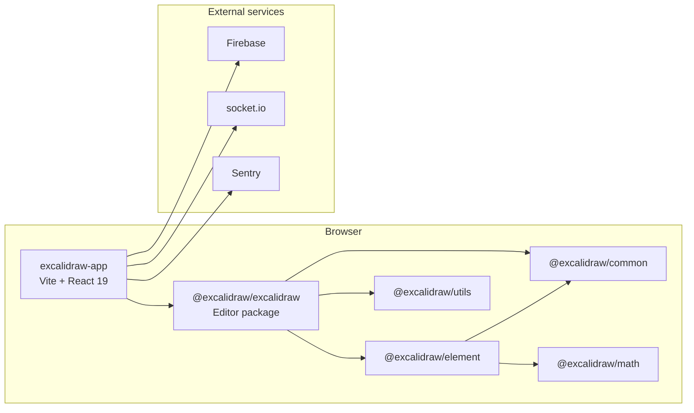
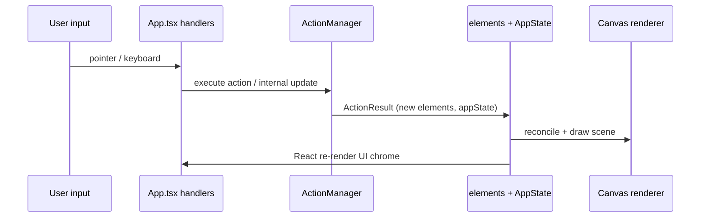
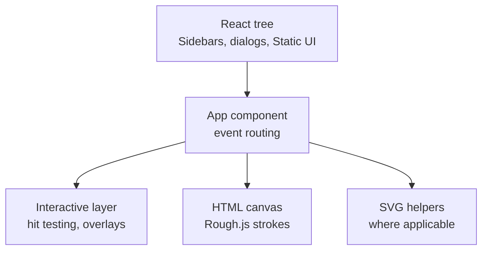

# Architecture — Excalidraw monorepo

Документ відображає фактичну структуру **цього** репозиторію (Excalidraw fork/worktree) станом на аналіз коду й `package.json`. Деталі класів залишено для читання джерел.

## 1. High-level architecture



- **`excalidraw-app`**: точка входу produkt UI, збірка **Vite**, реєстрація PWA, інтеграції.
- **`packages/excalidraw`**: монолітний за обсягом **компонент `App`**, система **actions**, рендер **canvas**, локалізація, діалоги.
- **`packages/element`**: **модель елементів**, геометричні операції над ними (прив’язки, дублювання, перевірки типів).
- **`packages/common`**: константи кольорів, сітки, дефолти елементів, допоміжні функції — мінімальні залежності.
- **`packages/math`**: векторна/геометрична математика для редактора.
- **`packages/utils`**: додаткові утиліти для пакетної збірки.

## 2. Репозиторій (топологія каталогів)

```text
excalidraw-app/          # Prod app: index.tsx → ExcalidrawApp, vite config
packages/
  common/                # @excalidraw/common
  element/               # @excalidraw/element
  excalidraw/            # @excalidraw/excalidraw — основне UI + canvas
  math/                  # @excalidraw/math
  utils/                 # @excalidraw/utils
examples/
  with-script-in-browser/# Приклад вбудовування
firebase-project/        # Конфігурація Firebase (окремо від yarn workspaces у корені — залежить від використання)
scripts/                 # buildPackage.js, buildBase.js, release, locales
```

Workspaces оголошені в **кореневому** `package.json`: `excalidraw-app`, `packages/*`, `examples/*`.

## 3. Data flow — як рухаються дані

### 3.1 Класичний цикл редагування



1. Події (**pointer**, **keyboard**) обробляються в **`packages/excalidraw/components/App.tsx`** (великий класовий компонент і пов’язані хелпери).
2. Логіка, що відповідає абстракції «команда користувача», зосереджена в **`actions/*`**: кожна **Action** повертає **`ActionResult`**.
3. **`ActionManager`** (`actions/manager.tsx`) викликає `updater`, який застосовує зміни до **масиву елементів** і **`AppState`**.
4. **Canvas** отримує актуальні елементи й стан перегляду (zoom, scroll) і перемальовує сцену; паралельно React перемальовує панелі, модалки, контекстне меню.

### 3.2 Елементи сцени

- **Джерело правди**: масив **`OrderedExcalidrawElement`** / `ExcalidrawElement[]` (із позначками `isDeleted` для soft delete).
- **Типи**: дискримінований union у **`packages/element/src/types.ts`** — `rectangle`, `diamond`, `ellipse`, `arrow`, `line`, `freedraw`, `text`, `image`, `frame`, `magicframe`, `embeddable`, `selection` тощо.
- **Інваріант**: елементи мають бути **JSON-serializable** для обміну сценами (див. коментарі біля `ExcalidrawElement` у коді).

### 3.3 Стан UI (`AppState`)

- Повна форма: **`packages/excalidraw/types.ts`** → `interface AppState`.
- Початкові значення: **`packages/excalidraw/appState.ts`** — `getDefaultAppState()`.
- Включає, зокрема: `activeTool`, виділення, `editingTextElement`, режим прив’язок (`isBindingEnabled`, `bindingPreference`), фрейми, експорт, `collaborators`, контекстне меню.

## 4. State management

### 4.1 У пакеті редактора

- **Jotai** (`jotai`, `jotai-scope` у `packages/excalidraw/package.json`) — для частини глобального/скопленого стану, який зручно розділити від пропсів **`App`**.
- **Імперативний шар**: значна логіка тримається на **`AppClassProperties`** і методах класу **`App`**, бо потрібні ref на canvas, throttling подій, інтеграція з браузерними API.

### 4.2 У застосунку `excalidraw-app`

- Файл **`excalidraw-app/app-jotai.ts`** та імпорти в `App.tsx` застосунку визначають **атоми** для топ-рівня (колаборація, налаштування, session-specific state).
- **Firebase** (`excalidraw-app/data/firebase.ts`) — збереження/завантаження залежно від конфігурації.
- **socket.io-client** — мережева синхронізація для collaboration.

Це **не** централізований Redux: поєднання **Jotai + внутрішній стан App + Action pipeline**.

## 5. Rendering pipeline — від React до canvas

Спрощена схема:



1. **React** малює оболонку: панелі інструментів, меню, діалоги (`components/*`).
2. **Canvas** — основна **візуалізація сцени** (ескізний вигляд через **roughjs**).
3. Шари (інтерактивні overlay, снап-лінії) узгоджуються з **`AppState`** та поточним масивом елементів — деталі в `packages/excalidraw/renderer/` та всередині **`App.tsx`** (пошук по репозиторію: `renderer`, `canvas`).

## 6. Action system (детальніше)

- **Реєстрація**: об’єкт `actions` у **`ActionManager`** містить записи типу **`Record<ActionName, Action>`**.
- **Виконання**: методи **`executeAction`** / аналоги з передачею **`ActionSource`** (keyboard, context menu, …).
- **Побічні ефекти**: аналітика **`trackEvent`** з `analytics` при наявності `action.trackEvent`.

Це реалізує **Command pattern** з єдиною точкою застосування змін до сцени.

## 7. Package dependencies (логічні межі)

| Пакет | Залежить від | Не повинен |
| --- | --- | --- |
| `common` | мінімум (напр. `tinycolor2`) | знати про React |
| `math` | зазвичай автономні чисельні типи | імпортувати UI |
| `element` | `common`, `math` | імпортувати `excalidraw` UI |
| `excalidraw` | `element`, `common`, `math`, utils, React ecosystem | циклічно тягнути `excalidraw-app` |
| `excalidraw-app` | `@excalidraw/excalidraw`, Jotai, Firebase, … | дублювати core model у себе |

Фактичні `dependencies` перевіряти в кожному `packages/*/package.json`.

## 8. Збірка та аліаси

- **Розробка**: `yarn start` → Vite у **`excalidraw-app`**.
- **Пакети**: `yarn build:packages` — послідовно **common → math → element → excalidraw** (`scripts` у корені).
- **Vitest**: `vitest.config.mts` мапить `@excalidraw/common`, `@excalidraw/element`, `@excalidraw/excalidraw`, `@excalidraw/math`, `@excalidraw/utils` на **вихідні** `src` / `index.tsx` для тестів без попередньої зборки dist.

## 9. Тестування й якість

- **Unit / component tests**: Vitest, `environment: jsdom`, `@testing-library/react` у пакетах.
- **Глобальний typecheck**: `yarn test:typecheck` → `tsc`.
- **Lint / format**: ESLint, Prettier (`yarn test:code`, `yarn test:other`).

## 10. Розширення й точки входу для змін

- **Нові інструменти / режими**: новий **`Action`**, розширення **`AppState`**, обробники в **`App`**, іконки в UI.
- **Нові типи елементів**: розширення **`packages/element/src/types.ts`**, серіалізація, рендер у canvas, hit testing.
- **Продуктові фічі** (авторизація, шаринг): переважно **`excalidraw-app`**, не ядро пакета — щоб npm-пакет залишався більш універсальним.

---

## Діаграма залежності пакетів (спрощено)

```mermaid
flowchart TB
  subgraph packages_layer [packages]
    C[@excalidraw/common]
    M[@excalidraw/math]
    E[@excalidraw/element]
    X[@excalidraw/excalidraw]
    U[@excalidraw/utils]
  end

  E --> C
  E --> M
  X --> E
  X --> C
  X --> M
  X --> U
```

Для повної клулітини залежностей див. `yarn.lock` та `package.json` кожного workspace.

## 11. Історія змін (undo / redo)

- Дії, що змінюють сцену, інтегруються з **історією**: `packages/excalidraw/actions/actionHistory.tsx` та пов’язані типи.
- Знімки стану узгоджуються з **масивом елементів** і **`AppState`**, щоб скасування повернуло узгоджену пару «сцена + UI».
- При додаванні нових **Actions** важливо оголосити їх через той самий механізм, інакше undo/redo може ігнорувати зміни або ламати чергу.

## 12. Clipboard, файли та імпорт

- **Буфер обміну** (copy/paste) реалізований у модулях на кшталт **`packages/excalidraw/clipboard.ts`**: узгодження з форматом Excalidraw JSON / зображень залежить від контексту ОС і браузера.
- **Зображення**: `packages/excalidraw/data/image.ts` — завантаження, стиснення, вставка на полотно.
- **Імпорт Mermaid**: інтеграція через `@excalidraw/mermaid-to-excalidraw` і UI в **`TTDDialog`** / пов’язані утиліти — користувач вводить текст діаграми, результат конвертується в елементи.

## 13. Локалізація (i18n)

- Файли перекладів: **`packages/excalidraw/locales/*.json`** — ключі рядків для UI.
- Скрипти **`yarn locales-coverage`** / **`locales-coverage:description`** (кореневі `scripts`) допомагають відстежувати повноту перекладів.
- У **`excalidraw-app`** підключено **`i18next-browser-languagedetector`** для визначення мови в браузері.

## 14. Спостереження помилок і продуктивність

- **Sentry** ініціалізується з **`excalidraw-app/sentry.ts`** (імпорт у `excalidraw-app/index.tsx`).
- Збірки для Docker можуть вимикати Sentry (`build:app:docker` з `VITE_APP_DISABLE_SENTRY`).
- Важкі операції (рендер, івенти миші) часто використовують **throttle/debounce** (`lodash.throttle`, `lodash.debounce` у залежностях пакета) — перед зміною вимірюйте регресії на великих сценах.

## 15. PWA та офлайн

- Реєстрація service worker: **`virtual:pwa-register`** у **`excalidraw-app/index.tsx`**.
- Плагін **vite-plugin-pwa** підключений у кореневому ланцюжку Vite (див. конфігурацію `vite` у monorepo).

## 16. Публічний API пакета `@excalidraw/excalidraw`

- Точка входу для споживачів бібліотеки: **`packages/excalidraw/index.tsx`** та `package.json` `exports` (поля `development` / `production` / `types`).
- Збірка **ESM** + **d.ts**: `yarn build:esm` у пакеті — артефакти в `dist/`.
- Інтеграторам не слід імпортувати приватні шляхи, не наведені в `exports`, щоб уникнути поломок при оновленні.

## 17. Практичні зауваги для контриб’юторів

- Перед PR: **`yarn test:all`** (або мінімум `test:typecheck` + релевантний піднабір `test:app`).
- Великий **`App.tsx`**: шукайте логіку за ключовими словами (`onPointerDown`, `actionManager`, `scene`) або використовуйте пошук по репозиторію; винесення без тестів збільшує ризик регресій.
- **Не вводити циклічні залежності** між `element` і `excalidraw` — типи елементів мають залишатися в нижньому шарі.

## 18. Обмеження цього документа

- Не описані конкретні URL бекендів колаборації та схеми правил **Firestore** — вони залежать від деплою; див. `firebase-project/` та змінні середовища.
- Детальні алгоритми снапів і hit-testing краще читати безпосередньо у **`renderer/`** та **`snapping.ts`** у `packages/excalidraw`.

## 19. Розміщення тестів

- **Кореневий Vitest**: `vitest.config.mts`, `setupTests.ts` — глобальні аліаси та моки (у т.ч. canvas де потрібно).
- **Пакет `excalidraw`**: `packages/excalidraw/tests/*.test.tsx` — інтеграційні сценарії UI, історія, регресії; частина **snapshot**-файлів у `tests/__snapshots__/`.
- **Пакет `element`**: `packages/element/tests/*` — чисті функції над елементами без повного React-дерева.
- **Пакет `common`**: `packages/common/tests/*` — утиліти й дрібна логіка.
- **Застосунок**: `excalidraw-app/tests/*` — поведінка обгортки продукту (наприклад, мобільне меню).

Запуск одного файлу: `yarn test:app path/to/file.test.ts` (уточнюйте за документацією Vitest CLI).

## 20. Firebase і `firebase-project/`

- Каталог **`firebase-project/`** містить конфігураційні JSON для **Firestore indexes** тощо; не плутати з runtime-кодом у `excalidraw-app/data/firebase.ts`.
- Реальні ключі та секрети не комітяться; локальна розробка покладається на `.env` / шаблони згідно з практикою upstream (перевірте `.gitignore` і документацію форку).

## 21. Приклади (`examples/`)

- **`with-script-in-browser`**: демонструє вбудовування після **`yarn build:packages`**; має власний Vite-конфіг (`vite.config.mts`).
- При зміні **публічного API** пакета варто перевіряти, чи не зламано цей приклад (імпорти, стилі `index.css`).

## 22. Глосарій посилань

Доменні терміни (**Element**, **AppState**, **Action**, **Collaboration**) узгоджуйте з **`docs/product/domain-glossary.md`**. Продуктові очікування — **`docs/product/PRD.md`**. Методологія специфікацій — **`docs/spec/SSD.md`**. Короткий контекст для агентів — **`docs/memory/`**.
