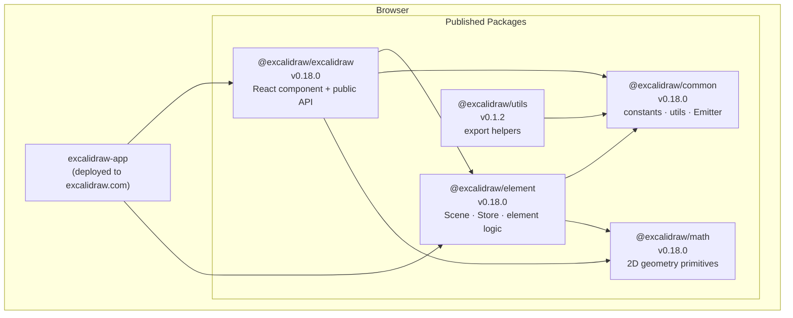
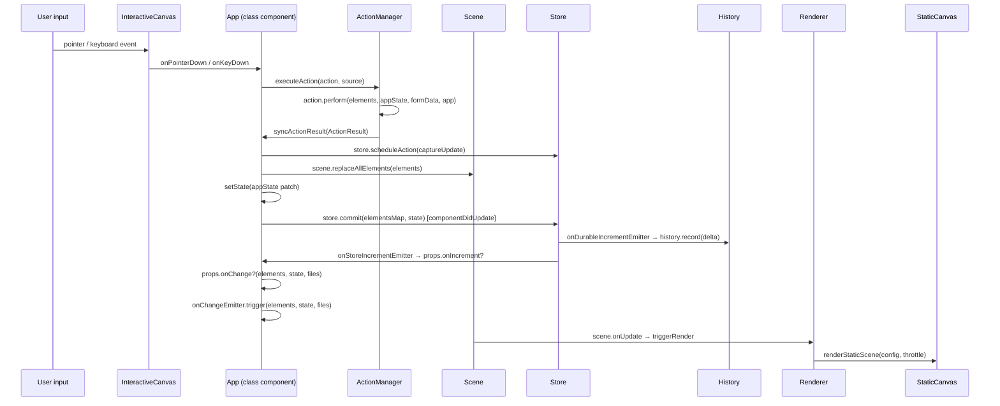
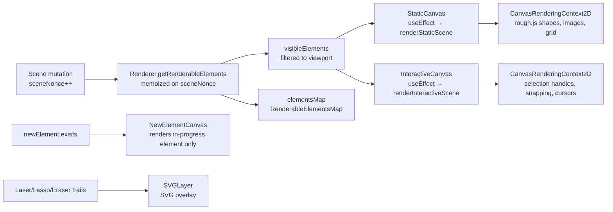

# Architecture

## High-level Architecture

The repository is a Yarn workspaces monorepo. Source is split into a **standalone web application** (`excalidraw-app/`) and a family of **published packages** (`packages/`). The application depends on the packages; the packages never import from the application.



During local development Vite aliases all `@excalidraw/*` imports to the workspace `src/` directories, so no build step is needed between packages.

---

## Package Dependencies

### Dependency rules

- Dependencies always flow **inward**: application → packages, never the reverse.
- `@excalidraw/common` and `@excalidraw/math` have **no cross-package dependencies**; they are the leaves of the graph.
- `@excalidraw/element` imports from `common` and `math` only.
- `@excalidraw/excalidraw` imports from all three sibling packages.
- `@excalidraw/utils` is standalone — it does not depend on `element` or `excalidraw`.

### What each package exports

| Package | Key exports |
|---|---|
| `@excalidraw/common` | `Emitter`, `KEYS`, `CLASSES`, `throttleRAF`, color constants, `arrayToMap`, `memoize`, `isDevEnv`, `AppEventBus`, editor interface helpers |
| `@excalidraw/math` | `Point`, `GlobalPoint`, vector/angle/curve/segment/ellipse/polygon/rectangle math |
| `@excalidraw/element` | `Scene`, `Store`, `CaptureUpdateAction`, `mutateElement`, `renderElement`, element type guards, bounds, binding, grouping, fractional-index ordering, `LinearElementEditor` |
| `@excalidraw/excalidraw` | `<Excalidraw />`, `ExcalidrawAPIProvider`, `ExcalidrawImperativeAPI`, serialization, export (`exportToCanvas`, `exportToSvg`, `exportToBlob`), `reconcileElements`, library helpers, UI slot components (`Sidebar`, `MainMenu`, `Footer`, `WelcomeScreen`) |
| `@excalidraw/utils` | `exportToCanvas`, `exportToSvg`, `exportToBlob`, `exportToClipboard` (standalone, no React required) |

### Build order

Packages must be built in dependency order:

```text
yarn build:common   →   yarn build:math   →   yarn build:element   →   yarn build:excalidraw
```

`@excalidraw/utils` can be built independently (`yarn build:packages` orchestrates all of the above).

---

## Data Flow

### Overview



### Key paths in detail

#### 1. Action dispatch

`ActionManager.executeAction(action, source)` calls `action.perform(elements, appState, formData, app)`. The return value is an `ActionResult`:

```ts
type ActionResult = {
  elements?: readonly ExcalidrawElement[] | null;
  appState?: Partial<AppState> | null;
  files?: BinaryFiles | null;
  captureUpdate: CaptureUpdateActionType;  // IMMEDIATELY | EVENTUALLY | NEVER
} | false;
```

`ActionManager` passes this to `App.syncActionResult` (registered during construction at line 820).

#### 2. syncActionResult (App.tsx line 2735)

`syncActionResult` is wrapped in `withBatchedUpdates`, so it batches scene/state work for the current React update. It does **not** call `store.commit()` directly.

Inside `syncActionResult`, the main steps are:

1. `store.scheduleAction(captureUpdate)` — marks whether the *later* commit should create a durable history entry.
2. `scene.replaceAllElements(actionResult.elements)` — updates the element list in `Scene` immediately.
3. `addMissingFiles(...)` and `addNewImagesToImageCache()` — merge incoming files and warm the image cache when `actionResult.files` is present.
4. `this.setState(appState patch)` — schedules the React state update and render.

This means `syncActionResult` prepares the next render and queues commit-related intent, but the actual store snapshot diff is deferred until `componentDidUpdate`.

#### 3. componentDidUpdate → Store commit (App.tsx line 3509)

After the React render/update cycle completes, `componentDidUpdate` performs the post-render commit step:

```
store.commit(elementsMap, this.state)
```

So the flow is:

`syncActionResult` → batched scene/state updates → React render/update → `componentDidUpdate` → `store.commit(elementsMap, this.state)`

`Store.commit` then compares the new snapshot against the previous one, computes `ElementsDelta` / `AppStateDelta`, and emits:
- `onDurableIncrementEmitter` (when `captureUpdate === IMMEDIATELY`) → `History.record(delta)` pushes an undo entry.
- `onStoreIncrementEmitter` (always) → forwarded to `props.onIncrement` for collaboration.

#### 4. onChange notification

After the store commit:

```ts
this.props.onChange?.(elements, this.state, this.files);
this.onChangeEmitter.trigger(elements, this.state, this.files);
```

`onChangeEmitter` is also exposed as `ExcalidrawImperativeAPI.onChange`.

#### 5. Collaboration data flow (excalidraw-app)

`Collab` (PureComponent) listens on the Socket.io connection. On receiving remote elements it calls `reconcileElements(localElements, remoteElements, appState)` and then pushes the result back via `ExcalidrawImperativeAPI.updateScene({ elements, captureUpdate: CaptureUpdateAction.NEVER })`, which follows the same `syncActionResult` → `Store.commit` path but skips history recording.

---

## State Management

### Four distinct layers

#### Layer 1 — `AppState` (React class state)

Owned by `App`. Initialized from `getDefaultAppState()` in the constructor. Contains all editor UI state:

- `activeTool` — currently selected tool
- `selectedElementIds` — map of selected element IDs
- `zoom`, `scrollX`, `scrollY` — viewport
- `editingTextElement`, `newElement`, `croppingElementId` — in-progress operations
- `openPopup`, `openMenu`, `openDialog` — open UI panels (single values → mutual exclusion)
- `theme`, `gridModeEnabled`, `zenModeEnabled`, `viewModeEnabled`
- `collaborators` — remote cursor positions and names

Updates via `this.setState` (direct) or `setAppState` (exposed via `ExcalidrawSetAppStateContext`).

#### Layer 2 — `Scene` + `Store` (`@excalidraw/element`)

`Scene` owns the element list and maps:
- `getNonDeletedElements()` — ordered array, used in renders
- `getElementsIncludingDeleted()` — full array including soft-deleted
- `sceneNonce` — integer bumped on every mutation; used as memoization cache key in `Renderer`
- `onUpdate(callback)` — subscription for render triggers

`Store` tracks structural changes for undo/redo and collaboration:
- `scheduleAction(CaptureUpdateAction)` — queues whether next commit is durable
- `commit(elementsMap, appState)` — computes deltas and emits increments
- `onDurableIncrementEmitter` — feeds `History`
- `onStoreIncrementEmitter` — feeds `props.onIncrement` (collaboration)

#### Layer 3 — `ActionManager` (command pattern)

Constructed in `App` constructor (line 819). All `Action` objects are registered via `registerAll(actions)` and `registerAction`. Each action:

```ts
type Action = {
  name: ActionName;
  perform: ActionFn;                    // returns ActionResult
  PanelComponent?: React.FC<...>;       // optional UI in properties panel
  predicate?: (...) => boolean;         // whether action is applicable
  trackEvent?: { category, action };    // analytics
};
```

`renderAction(name)` renders the action's `PanelComponent` wired to `executeAction`. This is the mechanism used throughout `Actions.tsx` to render all properties-panel controls.

#### Layer 4 — Jotai atoms (scoped, peripheral)

Defined in `editor-jotai.ts` using `jotai-scope`'s `createIsolation()`. Scoped to `EditorJotaiProvider` — atoms never leak to the global Jotai store. Used only for small UI state that does not affect the scene or history:

| Atom | Location | Purpose |
|---|---|---|
| `editorLangCodeAtom` | `i18n.ts` | Current language code |
| `isSidebarDockedAtom` | `Sidebar/Sidebar.tsx` | Sidebar docked state |
| `isLibraryMenuOpenAtom` | `LibraryMenu.tsx` | Library panel open state |
| `convertElementTypePopupAtom` | `actionToggleShapeSwitch.tsx` | Shape-switch popup |

A second isolation (`tunnelsJotai` in `context/tunnels.ts`) powers `tunnel-rat` portal slots.

---

## Rendering Pipeline

### Overview



### Step-by-step

#### 1. Scene mutation triggers render

Any call to `Scene.replaceAllElements()`, `mutateElement()`, or `Scene.addElement()` bumps `sceneNonce`. `scene.onUpdate(this.triggerRender)` is registered in `componentDidMount`, so every scene change schedules a React re-render of `App`.

#### 2. Renderer.getRenderableElements (memoized)

`Renderer.getRenderableElements` is wrapped in `memoize` (from `@excalidraw/common`). Its cache key includes `sceneNonce`, viewport parameters (`zoom`, `scrollX`, `scrollY`, `width`, `height`), and `editingTextElement`. Cache is invalidated only when one of these changes.

The function:
1. Calls `scene.getNonDeletedElements()`.
2. Builds `RenderableElementsMap` — excludes `newElement` (rendered on its own canvas) and the text element currently being edited inline.
3. Filters to `visibleElements` — elements whose bounding box overlaps the viewport (via `isElementInViewport` from `@excalidraw/element`).

#### 3. StaticCanvas (committed elements)

`StaticCanvas` is a functional component that calls `renderStaticScene` inside `useEffect`. It owns no canvas DOM element directly — the `<canvas>` is created in `App`'s constructor (`this.canvas = document.createElement('canvas')`) and injected into the wrapper div via `wrapper.replaceChildren(canvas)` on first mount.

`renderStaticScene` dispatches to the throttled or immediate variant:

```ts
export const renderStaticSceneThrottled = throttleRAF(...)  // RAF-throttled
export const renderStaticScene = (config, throttle?) => { ... }
```

`_renderStaticScene` (the inner function, line 229) does:
1. `bootstrapCanvas` — sets DPR scale transform.
2. Draws the grid (if enabled) via `strokeGrid`.
3. Iterates `visibleElements` and calls `renderElement(element, rc, context, ...)` for each.

`renderElement` (in `@excalidraw/element/renderElement.ts`) dispatches per element type. Shapes are drawn with `rc.draw(ShapeCache.generateElementShape(...))` using `rough.canvas`.

#### 4. InteractiveCanvas (selection layer)

`InteractiveCanvas` calls `renderInteractiveScene` in its own `useEffect`. This draws:
- Selection bounding boxes and transform handles
- Linear element point handles (when in linear editor mode)
- Snap lines and snap points
- Remote collaborator cursors and usernames
- Scroll bars (if `renderScrollbars` prop is true)

After each render it invokes `renderInteractiveSceneCallback` on `App`, which checks `atLeastOneVisibleElement` to update the "scrolled outside" banner.

#### 5. NewElementCanvas (in-progress element)

Rendered only when `this.state.newElement` is non-null. Uses the same `renderStaticScene` function but with a single-element map. Displayed on top of `StaticCanvas` via z-index.

#### 6. SVGLayer (trails)

`SVGLayer` receives `[laserTrails, lassoTrail, eraserTrail]` arrays and renders them as SVG paths. No canvas involved — purely DOM SVG overlaid on the canvas stack.

#### Canvas coordinate system

All coordinates in `ExcalidrawElement` are in **scene space**. The canvas context is scaled by `window.devicePixelRatio` and offset by `scrollX` / `scrollY` / `zoom.value` so that scene coordinates map to screen pixels. `sceneCoordsToViewportCoords` (from `@excalidraw/common`) converts between the two for pointer events.
