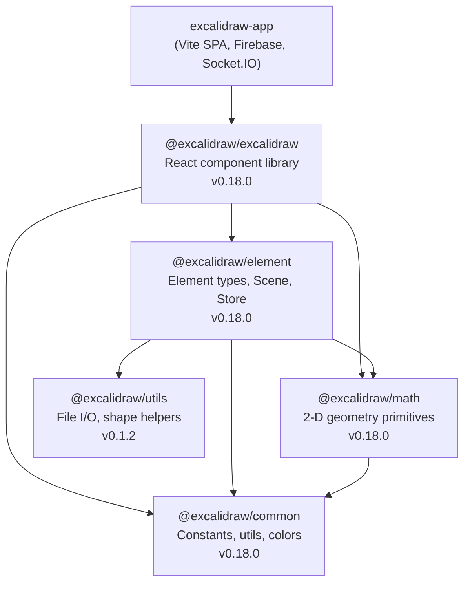
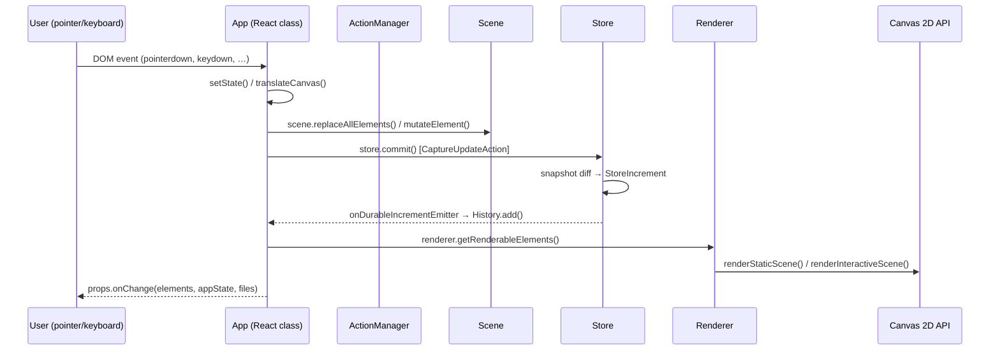
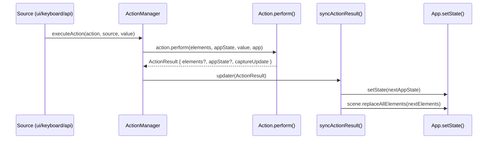
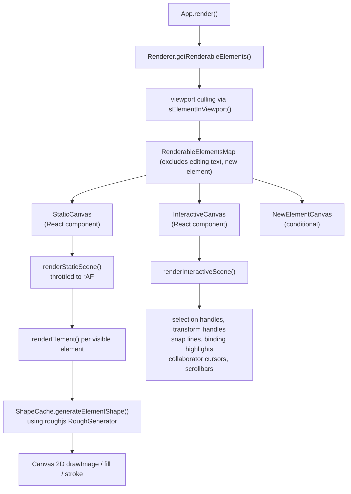
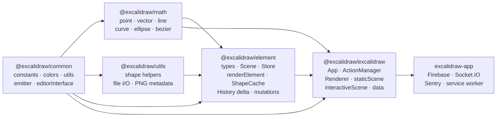

# Excalidraw Architecture

## High-Level Architecture

The repository is a Yarn workspaces monorepo containing five versioned packages
and a standalone application.



The public API is the `<Excalidraw>` React component exported from
`packages/excalidraw/index.tsx`. It wraps a Jotai `EditorJotaiProvider` (scoped
atom store) and the `<App>` class component, which owns all editor logic.

---

## Data Flow

### User Interaction → Canvas Update



### Action Execution Path



### Collaboration Reconciliation

Remote element updates arrive via Socket.IO into `excalidraw-app`, which calls
`api.updateScene({ elements, collaborators })`. The `reconcileElements()`
function in `packages/excalidraw/data/reconcile.ts` decides which version of
each element to keep using `version` and `versionNonce` fields on the element.
Local elements being actively edited are never overwritten
(`shouldDiscardRemoteElement`).

### File / Binary Data

`BinaryFiles` (images) are stored separately from elements in `App.files` (a
`Record<FileId, BinaryFileData>`). An `ExcalidrawImageElement` carries only a
`fileId` reference. Image blobs are cached in `this.imageCache` (a
`Map<FileId, HTMLImageElement>`) populated during rendering.

---

## State Management

### AppState

`AppState` is a large plain object held in the class-component `state` of `App`.
Its default shape is returned by `getDefaultAppState()` in
`packages/excalidraw/appState.ts`. Key categories:

| Group                | Selected fields                                                                          |
| -------------------- | ---------------------------------------------------------------------------------------- |
| **Viewport**         | `scrollX`, `scrollY`, `zoom`, `width`, `height`, `offsetLeft`, `offsetTop`               |
| **Active tool**      | `activeTool` (`type`, `customType`, `locked`, `lastActiveTool`), `penMode`               |
| **Element creation** | `newElement`, `multiElement`, `editingTextElement`, `editingGroupId`                     |
| **Selection**        | `selectedElementIds`, `selectedGroupIds`, `selectedLinearElement`                        |
| **Interaction**      | `isResizing`, `isRotating`, `isCropping`, `croppingElementId`, `cursorButton`            |
| **Appearance**       | `theme`, `currentItemStrokeColor`, `currentItemFillStyle`, `currentItemFontFamily`, etc. |
| **Grid / snap**      | `gridSize`, `gridStep`, `gridModeEnabled`, `isMidpointSnappingEnabled`, `snapLines`      |
| **Export**           | `exportBackground`, `exportScale`, `exportEmbedScene`                                    |
| **Collaboration**    | `collaborators` (Map of SocketId → Collaborator), `userToFollow`                         |
| **UI**               | `openDialog`, `openSidebar`, `showWelcomeScreen`, `toast`, `errorMessage`                |

`AppState` is split into two narrower derived types for the two canvas layers:

- `StaticCanvasAppState` – read by `renderStaticScene()`; includes viewport,
  theme, grid, background color.
- `InteractiveCanvasAppState` – read by `renderInteractiveScene()`; includes
  selection, tool, collaborators, snap lines.

### Elements (Scene)

`Scene` (defined in `packages/element/src/Scene.ts`) is the authoritative store
for `ExcalidrawElement[]`. It is separate from React state to avoid unnecessary
re-renders on element mutations that do not require full React reconciliation.

Key `Scene` methods:

- `replaceAllElements(elements)` — replaces the canonical array, rebuilds
  internal `Map`, fires callbacks.
- `getNonDeletedElements()` / `getNonDeletedElementsMap()` — returns filtered
  live elements.
- `getSelectedElements({ selectedElementIds, … })` — memoized selection query
  with options to include bound text and frame members.
- `addCallback(cb)` / `removeCallback(cb)` — used by `Renderer` and `App` to
  react to scene changes.

Every element is an immutable `Readonly<_ExcalidrawElementBase>` intersection.
`mutateElement()` uses a direct property assignment pattern and bumps `version`
/ `versionNonce` so collaborators can reconcile. Elements carry
fractional-indexing strings (`index: FractionalIndex | null`) for stable
ordering in multiplayer scenarios, maintained by `syncMovedIndices` /
`syncInvalidIndices`.

Element types defined in `packages/element/src/types.ts`:

| Type                              | Description                                                                 |
| --------------------------------- | --------------------------------------------------------------------------- |
| `rectangle`, `diamond`, `ellipse` | Generic shapes                                                              |
| `text`                            | Rich text with font, alignment, container binding                           |
| `image`                           | References a `FileId`; carries scale and optional `ImageCrop`               |
| `freedraw`                        | Array of `LocalPoint[]` stored on the element                               |
| `arrow`, `line`                   | Linear elements with optional `startBinding`/`endBinding` to other elements |
| `frame`, `magicframe`             | Named grouping containers                                                   |
| `embeddable`, `iframe`            | Embedded web content / AI-generated code                                    |
| `selection`                       | Ephemeral selection rectangle (never persisted)                             |

### Store and History

`Store` (in `packages/element/src/store.ts`) is an event-sourcing layer that
sits between the editor and the undo/redo `History`.

- It holds a `StoreSnapshot` — an immutable pair of
  `(SceneElementsMap, ObservedAppState)`.
- On `commit()`, it computes a `StoreDelta` by diffing the current snapshot
  against a new one.
- Emits two event streams:
  - `onDurableIncrementEmitter` — consumed by `History`; only for
    `CaptureUpdateAction.IMMEDIATELY` updates.
  - `onStoreIncrementEmitter` — public API (`api.onIncrement`); includes
    ephemeral increments too.
- `CaptureUpdateAction` enum controls the behavior:
  - `IMMEDIATELY` — captured and pushed onto the undo stack right away.
  - `NEVER` — remote/init updates that should not be undoable.
  - `EVENTUALLY` — intermediate steps captured with the next `IMMEDIATELY`
    commit.

`History` (in `packages/excalidraw/history.ts`) keeps two stacks (`undoStack`,
`redoStack`) of `HistoryDelta` objects. Each delta has a
`.applyTo(elements, appState, snapshot)` method that produces the next state for
undo/redo operations.

### ActionManager

`ActionManager` (in `packages/excalidraw/actions/manager.tsx`) is a registry
that decouples user interaction sources from state mutations.

```
ActionManager {
  actions: Record<ActionName, Action>
  updater: (ActionResult) => void          // = App.syncActionResult
  getAppState: () => AppState
  getElementsIncludingDeleted: () => OrderedExcalidrawElement[]
  app: AppClassProperties
}
```

The `Action` interface (`packages/excalidraw/actions/types.ts`):

- `perform(elements, appState, formData, app): ActionResult | Promise<ActionResult>`
  — pure-ish transform.
- `keyTest(event, appState, elements, app): boolean` — keyboard shortcut
  predicate.
- `PanelComponent` — optional React panel rendered in the sidebar/toolbar.
- `predicate` — whether the action is available in the current context.
- `viewMode` — whether the action is allowed in read-only mode.

`ActionResult` is `{ elements?, appState?, files?, captureUpdate } | false`. The
`updater` applies the result by calling `setState` and
`scene.replaceAllElements`. Over 70 named actions are registered (`ActionName`
union type), covering clipboard, z-index, alignment, export, history, tool
switching, element properties, and more.

---

## Rendering Pipeline



### Canvas Layers

The editor uses **three overlapping `<canvas>` elements** in this stacking order
(bottom to top):

1. **StaticCanvas** (`this.canvas`) — renders all non-deleted visible elements.
   Throttled via `throttleRAF`. Re-renders whenever `sceneNonce` or
   `selectionNonce` changes.
2. **NewElementCanvas** — renders the element currently being drawn
   (`appState.newElement`). Conditionally mounted only when a new element is in
   progress.
3. **InteractiveCanvas** (`this.interactiveCanvas`) — renders selection UI,
   transform handles, snap lines, collaborator cursors, and scrollbars. Handles
   all pointer events.

### Shape Generation and Caching

`renderElement()` (`packages/element/src/renderElement.ts`) dispatches by
element type. For rough-rendered shapes (rectangle, diamond, ellipse, line,
arrow), it uses `ShapeCache.generateElementShape()` which calls `roughjs`'s
`RoughGenerator` to produce drawable paths. The cache key is the element's
`versionNonce`, so the expensive roughjs computation only runs when the element
actually changes.

For `freedraw` elements, `perfect-freehand` converts the raw `LocalPoint[]` into
an SVG path. For `image` elements, the decoded `HTMLImageElement` is drawn via
`context.drawImage()` with optional crop transform.

### Dark Mode

Dark mode is not implemented with CSS variables on the canvas. Instead, after
drawing all elements, a CSS `filter: invert(93%) hue-rotate(180deg)`
(`DARK_THEME_FILTER`) is applied to the static canvas element. A second invert
filter is applied to images to cancel the inversion so photos appear correct.

### Coordinate Systems

Two coordinate spaces exist:

- **Scene coordinates** — the infinite canvas space where elements live (origin
  is arbitrary).
- **Viewport coordinates** — screen pixels relative to the canvas container.

`viewportCoordsToSceneCoords()` and `sceneCoordsToViewportCoords()` (in
`@excalidraw/common`) convert between them using `scrollX`, `scrollY`, and
`zoom.value`. The canvas context is scaled by `window.devicePixelRatio` for
HiDPI displays.

---

## Package Dependencies



### Per-Package Responsibility

| Package                  | Version | Depends on                                                                                       | Purpose                                                                                                                                                                                       |
| ------------------------ | ------- | ------------------------------------------------------------------------------------------------ | --------------------------------------------------------------------------------------------------------------------------------------------------------------------------------------------- |
| `@excalidraw/common`     | 0.18.0  | `tinycolor2` (ext.)                                                                              | Constants (`THEME`, `ARROW_TYPE`, key codes), color palette, utility functions (`arrayToMap`, `throttleRAF`, `Emitter`), `EditorInterface` descriptor                                         |
| `@excalidraw/math`       | 0.18.0  | `@excalidraw/common`                                                                             | Typed primitives: `GlobalPoint`, `LocalPoint`, `Radians`, vectors, line segments, bezier curves, ellipse, rectangle, polygon intersection tests                                               |
| `@excalidraw/utils`      | 0.1.2   | `roughjs`, `perfect-freehand`, PNG libs (ext.)                                                   | Geometric shape helpers (`getCurveShape`, `getFreedrawShape`), file system access wrappers, export helpers                                                                                    |
| `@excalidraw/element`    | 0.18.0  | `@excalidraw/common`, `@excalidraw/math`, `@excalidraw/utils`                                    | `ExcalidrawElement` type hierarchy, `Scene`, `Store`, `ShapeCache`, `renderElement`, element mutation helpers, `LinearElementEditor`, fractional indexing, binding logic, delta/diff for undo |
| `@excalidraw/excalidraw` | 0.18.0  | `@excalidraw/element`, `@excalidraw/common`, `@excalidraw/math`, `roughjs`, `jotai`, `nanoid`, … | `<Excalidraw>` React component, `App` class, `ActionManager`, static/interactive renderers, history, clipboard, fonts, serialisation/restore, i18n, `ExcalidrawImperativeAPI`                 |
| `excalidraw-app`         | 1.0.0   | `@excalidraw/excalidraw`, `firebase`, `socket.io-client`, `jotai`, `idb-keyval`                  | Production application shell: Firebase persistence, Socket.IO collaboration, PWA service worker, Sentry error tracking                                                                        |
