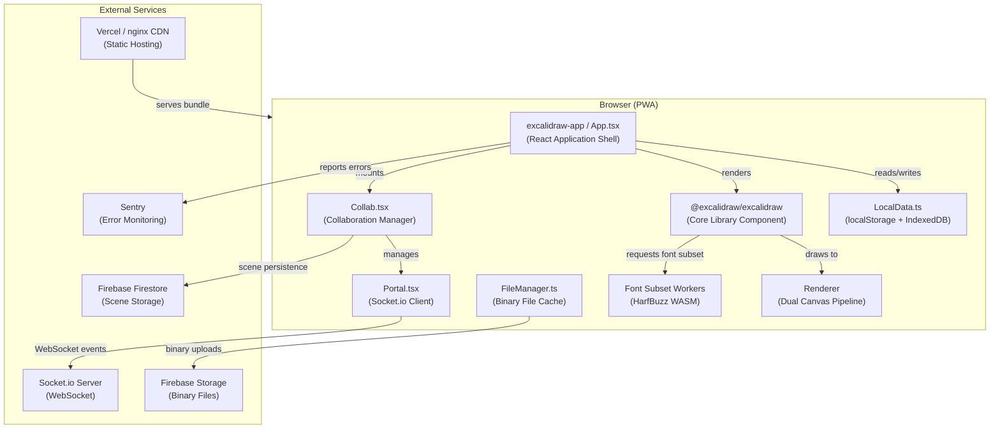
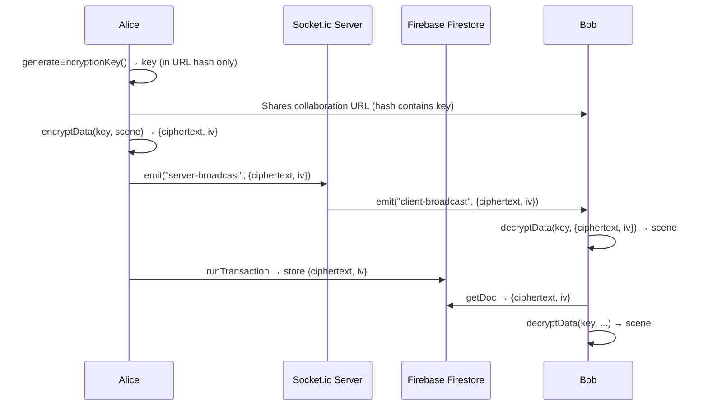
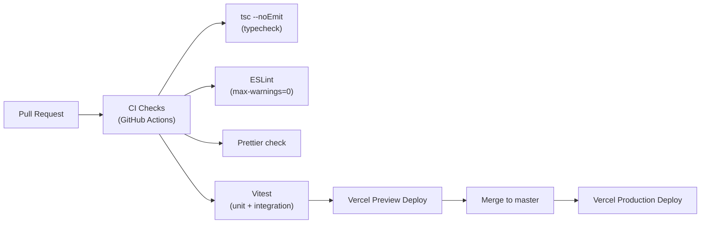
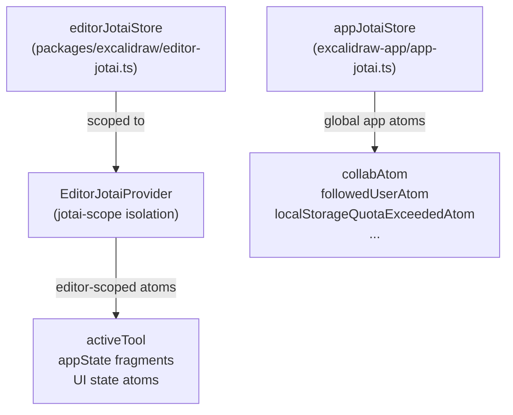
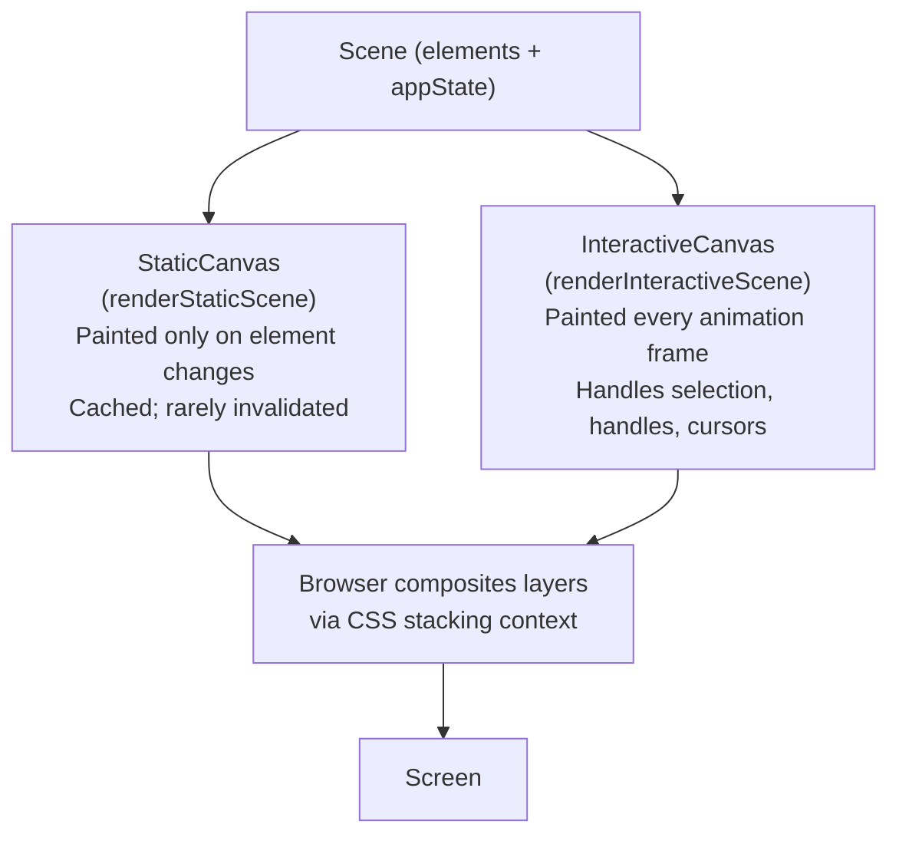
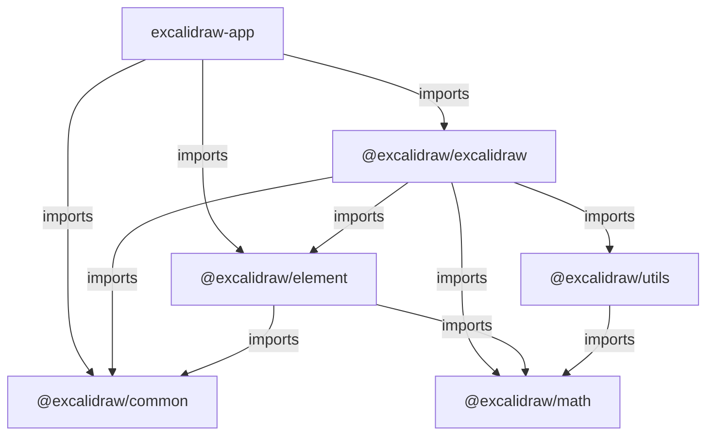
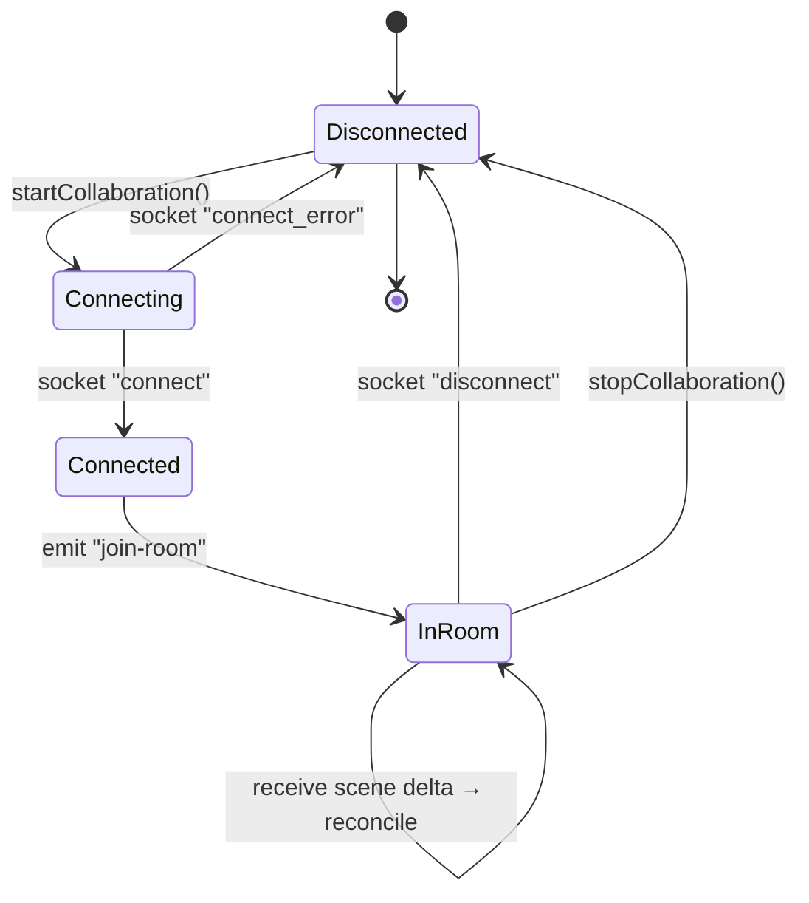

# Excalidraw — Technical Architecture

> **Version:** 0.18.0
> **Audience:** Senior engineers, architects, and technical leads
> **Last updated:** 2026-03-28

---

## Table of Contents

1. [Introduction](#1-introduction)
2. [Architecture Overview](#2-architecture-overview)
3. [Core Components](#3-core-components)
4. [Data Flow](#4-data-flow)
5. [Communication Patterns](#5-communication-patterns)
6. [Data Storage](#6-data-storage)
7. [Security](#7-security)
8. [Observability](#8-observability)
9. [Deployment & Infrastructure](#9-deployment--infrastructure)
10. [Scalability & Availability](#10-scalability--availability)
11. [State Management](#11-state-management)
12. [Rendering Pipeline](#12-rendering-pipeline)
13. [Package Dependencies](#13-package-dependencies)
14. [Key Design Decisions](#14-key-design-decisions)
15. [Future Considerations](#15-future-considerations)
16. [Appendix](#16-appendix)

---

## 1. Introduction

This document describes the technical architecture of **Excalidraw** — an open-source virtual whiteboard application that lets users sketch hand-drawn style diagrams directly in the browser. It serves as the authoritative reference for engineers and architects working on the codebase.

The document covers:

- **System design** — monorepo package layout, major layers, and their boundaries.
- **Component interactions** — how the app shell, core library, real-time collaboration, and persistence tiers communicate.
- **Key design decisions** — rationale behind technology choices, including the end-to-end encrypted collaboration model, dual-canvas rendering, and client-first data strategy.
- **Operational concerns** — deployment topology, observability, security model, and scalability characteristics.

---

## 2. Architecture Overview

Excalidraw is a **client-rendered, monorepo-based Progressive Web Application (PWA)**. There is no bespoke application server; all drawing logic, state management, and rendering execute entirely in the browser. Back-end services are consumed as third-party managed platforms (Firebase, Socket.io collaboration server).

### High-Level System Description

| Tier              | Technology                   | Responsibility                   |
|-------------------|------------------------------|----------------------------------|
| Web client (SPA)  | React 19, TypeScript, Vite   | Drawing UI, state, rendering     |
| Real-time layer   | Socket.io (WebSocket)        | Live multi-user scene sync       |
| Persistence layer | Firebase Firestore + Storage | Collab room scene & file storage |
| Local persistence | `localStorage` + IndexedDB   | Offline data, library, images    |
| CDN / Hosting     | Vercel / nginx (Docker)      | Static asset delivery            |
| Error monitoring  | Sentry                       | Front-end error capture          |

### Textual Diagram Description

> *Component diagram showing: Browser (PWA shell → ExcalidrawApp → Collab module → Portal [Socket.io]) reaching out to a WebSocket collaboration server; ExcalidrawApp → LocalData reaching browser storage (localStorage + IndexedDB); Collab module → Firebase SDK reaching Firebase Firestore (scenes) and Firebase Storage (binary files); Vite build → Vercel CDN for static delivery.*

### Architecture Diagram



---

## 3. Core Components

### 3.1 `excalidraw-app` — Application Shell

**Location:** `excalidraw-app/`

The top-level React application that wires all subsystems together. It is **not** a published package; it is the deployable web app.

| Sub-module            | File(s)                           | Responsibility                                                                 |
|-----------------------|-----------------------------------|--------------------------------------------------------------------------------|
| App entry point       | `App.tsx`, `index.tsx`            | Root React tree, global providers, URL/hash parsing                            |
| Collaboration manager | `collab/Collab.tsx`               | Owns the collaboration lifecycle, scene reconciliation, user presence          |
| WebSocket transport   | `collab/Portal.tsx`               | Socket.io client wrapper; broadcasts and receives encrypted scene deltas       |
| Local persistence     | `data/LocalData.ts`               | Debounced writes to `localStorage` (appState) and IndexedDB (elements, images) |
| File manager          | `data/FileManager.ts`             | Tracks binary file (image) upload status; uploads to Firebase Storage          |
| Firebase adapter      | `data/firebase.ts`                | Firestore CRUD for room scenes; Firebase Storage upload/download               |
| Tab synchronisation   | `data/tabSync.ts`                 | Timestamp-based version vector for cross-tab consistency                       |
| Language detection    | `app-language/`                   | Browser locale detection via `i18next-browser-languagedetector`                |
| Error boundary        | `components/TopErrorBoundary.tsx` | Catches render-phase exceptions; reports to Sentry                             |

**Dependencies:** `@excalidraw/excalidraw`, `firebase`, `socket.io-client`, `jotai`, `@sentry/browser`, `idb-keyval`

---

### 3.2 `@excalidraw/excalidraw` — Core Library

**Location:** `packages/excalidraw/`

The publishable NPM package that exposes the `<Excalidraw>` React component. All drawing, editing, action handling, import/export, and UI live here.

| Sub-module      | Path                                                      | Responsibility                                                                       |
|-----------------|-----------------------------------------------------------|--------------------------------------------------------------------------------------|
| Root component  | `components/App.tsx`                                      | Central orchestrator; owns `appState`, dispatches actions, registers event listeners |
| Action manager  | `actions/manager.tsx`                                     | Registry and executor for all discrete user actions (align, delete, flip, etc.)      |
| Scene renderer  | `renderer/staticScene.ts`, `renderer/interactiveScene.ts` | Dual-canvas drawing pipeline                                                         |
| History         | `history.ts`                                              | Undo/redo via `HistoryDelta` applied to `StoreSnapshot`                              |
| Element store   | `element/src/store.ts`                                    | Append-only delta store with versioned snapshots                                     |
| Data layer      | `data/`                                                   | JSON import/export, encryption, restore, library, filesystem access                  |
| i18n            | `i18n.ts`, `locales/`                                     | Translation strings + runtime locale switching                                       |
| Fonts           | `fonts/`                                                  | Font face definitions; delegates subsetting to WASM workers                          |
| TTD Dialog      | `components/TTDDialog/`                                   | Text-to-Diagram AI chat + Mermaid preview                                            |
| Collab trigger  | `components/live-collaboration/`                          | UI trigger for starting a live session                                               |
| Command palette | `components/CommandPalette/`                              | Keyboard-driven command search                                                       |
| Sidebar         | `components/Sidebar/`                                     | Plugin-extensible panel system                                                       |

**Peer dependencies:** `react ^17‖^18‖^19`, `react-dom` (same range)

---

### 3.3 `@excalidraw/element` — Element Domain

**Location:** `packages/element/`

Pure logic for Excalidraw element types: creation, mutation, bounds, collision, binding, fractional z-indexing, and delta computation. Zero React dependencies. Designed to be tree-shaken.

| Module               | Responsibility                                                     |
|----------------------|--------------------------------------------------------------------|
| `types.ts`           | Canonical TypeScript types for all element shapes                  |
| `store.ts`           | `Store`, `StoreSnapshot`, `StoreDelta` — immutable change tracking |
| `delta.ts`           | Structural diff / patch for element and appState changes           |
| `binding.ts`         | Arrow-to-element binding logic                                     |
| `elbowArrow.ts`      | Automatic elbow/orthogonal arrow routing                           |
| `fractionalIndex.ts` | CRDT-style fractional z-order indices for stable ordering          |
| `Scene.ts`           | In-memory scene container with element map and callbacks           |
| `renderElement.ts`   | Low-level canvas draw calls per element type                       |

---

### 3.4 `@excalidraw/common` — Shared Utilities

**Location:** `packages/common/`

Cross-cutting concerns shared by all packages: constants, color utilities, keyboard key maps, event bus, promise utilities, and generic data structures.

| Module                       | Responsibility                                                          |
|------------------------------|-------------------------------------------------------------------------|
| `appEventBus.ts`             | Typed `Emitter`-based pub/sub bus for cross-component events            |
| `constants.ts`               | App-wide constants (grid size, encryption key bits, theme values, etc.) |
| `utils.ts`                   | General-purpose helpers (debounce, throttle, deep equality, etc.)       |
| `versionedSnapshotStore.ts`  | Generic versioned snapshot container used by the element store          |
| `promise-pool.ts`            | Concurrency-limited async task pool                                     |
| `binary-heap.ts`, `queue.ts` | Data structures for internal algorithms                                 |

---

### 3.5 `@excalidraw/math` — Geometry Primitives

**Location:** `packages/math/`

Self-contained 2D geometry library: points, vectors, lines, segments, curves, polygons, ellipses, and rectangles. No dependencies outside this package. Used heavily by arrow routing, collision detection, and snapping.

---

### 3.6 `@excalidraw/utils` — Export Utilities

**Location:** `packages/utils/`

Thin helpers for bounding-box computations and shape export. Acts as a bridge between `@excalidraw/math` and consumers that only need geometric utilities without full element types.

---

## 4. Data Flow

### 4.1 Local Drawing (No Collaboration)

```
User Interaction (pointer/keyboard)
  → React event handler in App.tsx
  → Action dispatched via ActionManager
  → Element Store mutated (StoreSnapshot updated, StoreDelta computed)
  → appState atom updated via Jotai
  → React re-renders triggered
  → Renderer.updateScene() called
  → StaticCanvas + InteractiveCanvas repainted via requestAnimationFrame
  → Debounced (300 ms) write to localStorage (appState) + IndexedDB (elements, images)
```

### 4.2 Collaborative Drawing

```
Local change confirmed
  → CollabModule.syncScene() called
  → Elements serialised to JSON, GZIP-compressed (pako), AES-GCM encrypted
  → Portal.broadcastScene() emits via Socket.io (WS_EVENTS.SERVER or SERVER_VOLATILE)
  ↓
Socket.io Server
  → Broadcasts to all room members
  ↓
Remote peer receives message
  → Portal socket listener decrypts + decompresses
  → reconcileElements() merges remote elements into local scene
  → App.updateScene() applies reconciled elements
  → Full scene persisted to Firebase Firestore every 20 s (SYNC_FULL_SCENE_INTERVAL_MS)
```

### 4.3 Binary File (Image) Flow

```
User pastes / inserts image
  → Blob reduced + resized (pica / image-blob-reduce)
  → FileManager queues upload
  → Encoded as base64 DataURL, stored locally in IndexedDB (immediate)
  → uploadBytes() sends to Firebase Storage (path: /files/rooms/{roomId}/{fileId})
  → FileStatusStore tracks status (pending → saved)
```

### 4.4 Font Subsetting Flow

```
Text element added / edited
  → Fonts.ts identifies required glyphs
  → WorkerPool spawns short-lived Web Worker (harfbuzz-wasm)
  → Worker subsets font to used glyphs only (HarfBuzz WASM + woff2 encoder WASM)
  → Compressed woff2 blob returned to main thread
  → Canvas font cache updated; element re-rendered
```

### Key Message Formats

| Channel                 | Format                       | Compression | Encryption            |
|-------------------------|------------------------------|-------------|-----------------------|
| Socket.io scene update  | JSON (`ExcalidrawElement[]`) | pako GZIP   | AES-GCM 128-bit       |
| Socket.io cursor update | JSON (`MouseLocation`)       | None        | AES-GCM 128-bit       |
| Firebase Firestore doc  | Binary `Bytes`               | pako GZIP   | AES-GCM 128-bit       |
| Firebase Storage blob   | Raw bytes (`BinaryFileData`) | None        | None (URL-accessible) |
| LocalStorage            | JSON string                  | None        | None                  |
| IndexedDB               | `BinaryFileData` / JSON      | None        | None                  |

---

## 5. Communication Patterns

### 5.1 Synchronous (In-Process)

All drawing logic is synchronous and in-process. React renders occur synchronously on the main thread. Canvas paint calls are batched through `requestAnimationFrame` via `throttleRAF`.

The **ActionManager** pattern is a synchronous command dispatcher: registered actions are invoked with the current `appState` and element map, returning a `ActionResult` that is immediately applied.

The **AppEventBus** (`packages/common/appEventBus.ts`) provides synchronous pub/sub within the `@excalidraw/excalidraw` package for cross-component notifications (e.g., `"render"`, `"history"` events).

### 5.2 Asynchronous

| Mechanism                            | Used For                                                              |
|--------------------------------------|-----------------------------------------------------------------------|
| **Socket.io WebSocket**              | Real-time scene delta broadcast, cursor sync, user follow events      |
| **Firebase SDK (Firestore)**         | Async read/write of full scene snapshots on room join / periodic sync |
| **Firebase SDK (Storage)**           | Async binary file upload / download                                   |
| **Web Workers**                      | Font subsetting (HarfBuzz + woff2 WASM); isolated off-thread compute  |
| **IndexedDB (idb-keyval)**           | Async browser storage for images and library data                     |
| **Promise Pool** (`promise-pool.ts`) | Concurrency-capped parallel async tasks (e.g., multi-file uploads)    |

### 5.3 Real-Time Protocol

Socket.io events used by the collaboration layer:

| Event (client→server)       | Event (server→client)     | Purpose                         |
|-----------------------------|---------------------------|---------------------------------|
| `join-room`                 | `init-room`, `new-user`   | Room lifecycle                  |
| `server-broadcast`          | `client-broadcast`        | Reliable scene delta delivery   |
| `server-volatile-broadcast` | `client-broadcast`        | Best-effort cursor/idle updates |
| `user-follow`               | `user-follow-room-change` | Follow-mode viewport sync       |
| –                           | `room-user-change`        | Collaborator list updates       |

### 5.4 Retry & Resilience

- **Socket.io reconnection** is handled natively by the Socket.io client (exponential back-off).
- **Firebase Firestore** uses the Firebase SDK's built-in offline persistence and retry logic.
- **Tab conflict resolution** uses the `tabSync.ts` timestamp-based version vector: a tab reloads from storage only if another tab has written a newer state version.

---

## 6. Data Storage

### 6.1 `localStorage`

| Key                                  | Contents                              | TTL                       |
|--------------------------------------|---------------------------------------|---------------------------|
| `excalidraw`                         | Serialised `ExcalidrawElement[]` JSON | Indefinite (user-cleared) |
| `excalidraw-state`                   | Serialised `AppState` (subset) JSON   | Indefinite                |
| `excalidraw-theme`                   | `"light"` \| `"dark"`                 | Indefinite                |
| `version-dataState`, `version-files` | Unix timestamp for tab sync           | Indefinite                |

**Quota handling:** A `localStorageQuotaExceededAtom` Jotai atom surfaces quota errors to the UI. The app degrades gracefully by skipping the write rather than crashing.

### 6.2 IndexedDB

| Store                    | Contents                                    | TTL                            |
|--------------------------|---------------------------------------------|--------------------------------|
| `files-db / files-store` | `BinaryFileData` (images) keyed by `FileId` | Cleaned after 1 day of non-use |
| `excalidraw-library`     | Library item `ExcalidrawElement[]`          | Indefinite                     |
| `excalidraw-ttd-chats`   | TTD AI chat history                         | Indefinite                     |

Managed via `idb-keyval`. Auto-purge of stale images runs when `LocalFileManager.clearObsoleteFiles()` is called on scene load.

### 6.3 Firebase Firestore

| Collection path  | Document contents                                       | Access                                            |
|------------------|---------------------------------------------------------|---------------------------------------------------|
| `rooms/{roomId}` | `{ sceneVersion, ciphertext: Bytes, iv: Bytes, nonce }` | AES-GCM encrypted; all collaborators hold the key |

The key is **never** sent to Firebase or the Socket.io server. It lives exclusively in the URL hash fragment, which browsers do not transmit in HTTP requests.

### 6.4 Firebase Storage

| Path prefix                      | Contents                | Max size |
|----------------------------------|-------------------------|----------|
| `/files/shareLinks/{fileId}`     | Share-link binary files | 4 MiB    |
| `/files/rooms/{roomId}/{fileId}` | Collab room image files | 4 MiB    |

Browser-side `Cache-Control: max-age=31536000` (1 year) is set via `FILE_CACHE_MAX_AGE_SEC`.

### 6.5 Service Worker Cache

Managed by Workbox via `vite-plugin-pwa`.

| Cache name | Strategy     | Content                          | Max age            |
|------------|--------------|----------------------------------|--------------------|
| `fonts`    | CacheFirst   | `.woff2` font files, `fonts.css` | 90 days            |
| `locales`  | CacheFirst   | Locale JS chunks                 | 30 days            |
| `chunk`    | CacheFirst   | Lazy JS chunks                   | 90 days            |
| Precache   | NetworkFirst | App shell, core JS/CSS           | Managed by Workbox |

### 6.6 Data Retention

- **Local browser data** is retained until the user clears browser data or the app's auto-purge runs.
- **Firebase Firestore** scenes persist indefinitely per room; there is no built-in TTL.
- **Firebase Storage** files persist indefinitely; stale cleanup is not automated server-side.
- **IndexedDB images** older than 1 day and not referenced by any canvas element are deleted on load.

---

## 7. Security

### 7.1 End-to-End Encryption (E2EE)

All collaboration data is end-to-end encrypted using the **Web Crypto API**:

- **Algorithm:** AES-GCM, 128-bit key
- **Key generation:** `window.crypto.subtle.generateKey()` in the initiating browser
- **Key transport:** Embedded in the URL hash (`#roomId=…&key=…`). The fragment is never sent in HTTP requests, so the server never sees the key.
- **Per-message IV:** A fresh 12-byte IV (`createIV()`) is generated for each encryption operation.
- **Scope:** Socket.io payloads, Firebase Firestore documents. Firebase Storage binary files are **not** encrypted at the application layer (they rely on Firebase security rules and short-lived signed URLs).



### 7.2 Authentication & Authorization

- **Baseline app:** No authentication is required. Any user with a room URL can join.
- **Excalidraw+:** The hosted paid tier sets an `excplus-auth` cookie (`COOKIES.AUTH_STATE_COOKIE`) which the app reads to conditionally enable premium features (export to Excalidraw+, etc.).
- **Firebase Security Rules** must be configured to gate Firestore/Storage access. The open-source deployment leaves this to the operator.

### 7.3 Input Sanitisation

- URLs stored in element `link` properties are sanitised via `@braintree/sanitize-url` to prevent `javascript:` and `data:` protocol injection.
- Embedded iframe `src` values (embeddable elements) are validated against an allow-list before rendering.

### 7.4 Content Security

- Cross-origin embeds are rendered inside sandboxed `<iframe>` elements with restricted permissions.
- SVG export strips potentially dangerous attributes before rendering to avoid XSS via clipboard paste.

### 7.5 Secrets Management

- Firebase configuration is injected at build time via `VITE_APP_FIREBASE_CONFIG` environment variable (JSON string).
- No secrets are hard-coded in source. The `.env` file is gitignored.
- Sentry DSN is hard-coded in `sentry.ts` (non-sensitive public endpoint identifier).

---

## 8. Observability

### 8.1 Error Monitoring (Sentry)

**Package:** `@sentry/browser` v9

| Configuration            | Value                                                                           |
|--------------------------|---------------------------------------------------------------------------------|
| Environment detection    | Hostname match against `excalidraw.com`, `staging.excalidraw.com`, `vercel.app` |
| Disabled in              | Docker builds (`VITE_APP_DISABLE_SENTRY=true`), local dev                       |
| Release tracking         | `VITE_APP_GIT_SHA` (set by Vercel CI)                                           |
| Console capture          | `console.error` captured via `captureConsoleIntegration`                        |
| URL sanitisation         | URL hash fragments stripped in `beforeSend` to avoid leaking encryption keys    |
| Feature flag integration | `featureFlagsIntegration` tracks `COMPLEX_BINDINGS` flag                        |

**Known ignored errors** (noise-reduction):
- Safari `window.__pad` errors
- IndexedDB closing errors
- Dynamic import / fetch failures (SW asset staleness)
- `QuotaExceededError` (localStorage full)

### 8.2 Analytics

`trackEvent(category, action, label?, value?)` — thin wrapper around a configurable analytics backend (disabled by default; enabled by `VITE_APP_ENABLE_TRACKING=true` in production builds). Events are fired for key user interactions: room joins, exports, library usage.

### 8.3 Logging

- Structured `console.warn` / `console.error` throughout the codebase.
- No centralised log aggregation is built in for the open-source deployment.
- Sentry captures all `console.error` calls in production environments.

### 8.4 Metrics & Tracing

There is no built-in Prometheus/Grafana metrics layer or distributed tracing (OpenTelemetry/Jaeger) in the current open-source codebase. Performance-sensitive paths use `performance.mark()` / `performance.measure()` calls for local profiling during development.

The `CustomStats.tsx` component renders live canvas statistics (element count, render time) as a debug overlay, toggled via `actionToggleStats`.

---

## 9. Deployment & Infrastructure

### 9.1 Production Hosting (excalidraw.com)

| Concern               | Solution                                                                                                   |
|-----------------------|------------------------------------------------------------------------------------------------------------|
| Hosting               | **Vercel** — automatic deploys from `master`; preview deploys on PRs                                       |
| CDN                   | Vercel Edge Network — global static asset delivery                                                         |
| Build trigger         | `VITE_APP_GIT_SHA=$VERCEL_GIT_COMMIT_SHA` injected at build time                                           |
| Build command         | `yarn build:app` → Vite production build into `excalidraw-app/build/`                                      |
| Environment variables | Set in Vercel project settings; `VITE_APP_FIREBASE_CONFIG`, `VITE_APP_GIT_SHA`, `VITE_APP_ENABLE_TRACKING` |

### 9.2 Self-Hosted (Docker)

```dockerfile
# Multi-stage build
FROM node:18 AS build
  WORKDIR /opt/node_app
  COPY . .
  RUN yarn                     # install deps
  RUN yarn build:app:docker    # Vite build (Sentry disabled)

FROM nginx:1.27-alpine
  COPY --from=build /opt/node_app/excalidraw-app/build /usr/share/nginx/html
```

- Exposed on port 80 inside the container; mapped to 3000 externally in `docker-compose.yml`.
- No application server — purely static file serving via nginx.
- `VITE_APP_DISABLE_SENTRY=true` is set automatically for Docker builds.

### 9.3 CI/CD Pipeline



Pre-commit hooks (Husky + lint-staged) run ESLint and Prettier on staged files.

### 9.4 Build Output Structure

```
excalidraw-app/build/
  index.html              ← minified HTML shell
  assets/
    index-[hash].js       ← main bundle
    index-[hash].css      ← styles
    mermaid-to-excalidraw-[hash].js   ← lazy chunk
    codemirror.chunk-[hash].js        ← lazy chunk
    locales/[lang]-[hash].js          ← per-locale chunks
  fonts/[Family]/         ← woff2 font files
  service-worker.js       ← Workbox SW
  manifest.webmanifest    ← PWA manifest
```

Source maps are emitted alongside bundles (`build.sourcemap: true`) for Sentry stack-trace de-obfuscation.

---

## 10. Scalability & Availability

### 10.1 Client-Side Scalability

The rendering pipeline is the primary performance bottleneck. Key mitigations:

- **Dual-canvas split:** The `StaticCanvas` is only re-painted when elements change; the `InteractiveCanvas` handles real-time pointer feedback. This eliminates repaints of the static scene on every cursor move.
- **RequestAnimationFrame throttling:** `throttleRAF()` coalesces rapid state changes into single animation frame renders, preventing frame-rate starvation.
- **Fractional indexing:** CRDT-style z-order indices (`fractionalIndex.ts`) avoid full array sorts on every z-order change.
- **WorkerPool:** Font subsetting is offloaded to short-lived Web Workers that auto-terminate after 1 s of inactivity, keeping the main thread free.
- **Code splitting:** Mermaid, CodeMirror, and all non-English locales are lazy-loaded on demand via Vite `manualChunks`.
- **Service Worker caching:** CacheFirst for fonts and chunks means repeat visits load the majority of assets from cache with zero network round-trips.

### 10.2 Collaboration Scalability

- The Socket.io server (not part of this repository) handles fan-out. The open-source project links to a community-maintained server implementation.
- Firebase Firestore handles concurrent writes via **optimistic transactions** (`runTransaction`). The `reconcileElements()` function performs a deterministic CRDT-style merge so concurrent edits from multiple users converge correctly.
- **Cursor updates** use `SERVER_VOLATILE` events (UDP-like, non-reliable) to avoid backpressure on the WebSocket from high-frequency pointer events (~30 fps, `CURSOR_SYNC_TIMEOUT = 33 ms`).
- Full scene syncs are throttled to every 20 s (`SYNC_FULL_SCENE_INTERVAL_MS`) to reduce Firestore write costs.

### 10.3 Availability & Resilience

| Scenario                         | Behaviour                                                                  |
|----------------------------------|----------------------------------------------------------------------------|
| Collaboration server unavailable | App continues in local-only mode; unsaved collab changes are buffered      |
| Firebase Firestore unavailable   | Join/save fails gracefully; existing in-memory scene unaffected            |
| localStorage quota exceeded      | Atom surfaces warning; write skipped; scene safe in memory                 |
| Service worker update            | `registerType: "autoUpdate"` silently refreshes on next visit              |
| Browser offline                  | PWA serves cached shell + assets; local drawing continues; collab disabled |

### 10.4 Disaster Recovery

- All user data is either in **local browser storage** (controlled by the user) or **Firebase** (Google-managed SLA).
- There is no server-side backup of individual room scenes beyond what Firebase Firestore provides.
- Users are encouraged to export `.excalidraw` files locally as their primary backup mechanism.

---

## 11. State Management

### 11.1 Approach: Jotai Atoms + Imperative Store

Excalidraw uses a **hybrid state management model**:

- **Jotai** (`jotai` v2 + `jotai-scope`) for reactive UI state atoms.
- **Imperative element store** (`element/src/store.ts`) for the canonical drawing data, accessed via a versioned snapshot model.

This separates high-frequency, mutation-heavy drawing state from lower-frequency UI state, avoiding unnecessary React re-renders during active drawing.

### 11.2 Jotai Atom Architecture



- **`editorJotaiStore`** is a scoped Jotai store created via `jotai-scope`'s `createIsolation()`. This isolates editor atom state so multiple `<Excalidraw>` instances on the same page do not share atoms.
- **`appJotaiStore`** is a global store for the application shell (collaboration state, quota alerts, etc.).
- Atoms are accessed via `useAtom`, `useAtomValue`, and `useSetAtom` hooks from the respective scoped context.

### 11.3 Element State & Versioned Snapshots

Drawing elements are managed through the **`Store`** class (`element/src/store.ts`):

- Elements are stored as an immutable `SceneElementsMap` (a `Map<string, ExcalidrawElement>`).
- On every change, a `StoreSnapshot` is produced containing the new element map and appState snapshot.
- A `StoreDelta` is computed as the structural diff between old and new snapshots — this is the unit of history and collaboration sync.

### 11.4 History (Undo/Redo)

```
User action
  → StoreSnapshot (before)
  → Mutation applied
  → StoreSnapshot (after)
  → HistoryDelta.calculate(before, after) → delta
  → delta pushed to HistoryStack (max N entries)

Undo
  → delta.applyTo(currentElements, currentAppState, snapshot)
  → Returns [previousElements, previousAppState]
  → Scene updated; new inverse delta pushed to redo stack
```

Key properties:
- Collaboration-aware: `version` and `versionNonce` properties are excluded during undo/redo application to avoid CRDT conflicts.
- History entries carry both element deltas and appState deltas.

### 11.5 Side Effects

Side effects (debounced saves, collaboration broadcasts, analytics) are coordinated through:

- **`useEffect` hooks** in `App.tsx` and `Collab.tsx` that react to Jotai atom changes.
- **`debounce` / `throttleRAF`** from `@excalidraw/common` for rate-limiting.
- **`AppEventBus`** for decoupled cross-component notifications (e.g., scene version changes triggering collab sync).

### 11.6 State Persistence

| State            | Persistence mechanism  | Write timing                       |
|------------------|------------------------|------------------------------------|
| Elements         | IndexedDB (idb-keyval) | Debounced 300 ms after last change |
| AppState (UI)    | localStorage           | Debounced 300 ms after last change |
| Library          | IndexedDB              | On library mutation                |
| Collab username  | localStorage           | On change                          |
| Theme            | localStorage           | On toggle                          |
| TTD chat history | IndexedDB              | On message                         |

### 11.7 Cross-Tab Synchronisation

`tabSync.ts` uses a timestamp-based version vector stored in `localStorage`. When a tab writes to storage, it bumps `version-dataState` / `version-files` to `Date.now()`. Other tabs polling via the `storage` event compare the stored timestamp to their in-memory version; if the stored version is newer, they reload state from storage.

---

## 12. Rendering Pipeline

### 12.1 Dual-Canvas Architecture

Excalidraw uses **two layered `<canvas>` elements** to separate concerns:



- **`StaticCanvas`** renders all non-interactive element appearances: shapes, text, images, grid lines. It is only invalidated when the underlying element data changes.
- **`InteractiveCanvas`** renders transient interaction state: selection boxes, transform handles, binding indicators, collaborator cursors, laser pointer trails. It is repainted on every animation frame during interaction.
- A third **`NewElementCanvas`** is used during active element creation to preview the element being drawn without touching the main canvases.

### 12.2 Render Flow

```
appState / elements change
  → Renderer.updateScene({ elements, appState, files })
  → throttleRAF → renderFrame()
      ├── renderStaticScene(staticCanvas, { elements, appState, ... })
      │     └── For each element: renderElement(context, element, ...)
      │           └── roughjs generator (getShapeForElement) + canvas draw calls
      └── renderInteractiveScene(interactiveCanvas, { appState, selectionElements, ... })
            └── Selection boxes, handles, snapping indicators, cursors
```

### 12.3 Element Rendering

Each element type has a dedicated rendering path in `renderElement.ts` (`packages/element/src/renderElement.ts`):

| Element type                | Renderer                                                           |
|-----------------------------|--------------------------------------------------------------------|
| Rectangle, ellipse, diamond | `roughjs` stroke/fill paths                                        |
| Free-draw                   | `perfect-freehand` smooth Bézier paths                             |
| Line / arrow                | `roughjs` paths + arrowhead geometry from `@excalidraw/math`       |
| Text                        | Canvas `fillText()` with font subsetting                           |
| Image                       | `drawImage()` with crop mask                                       |
| Embeddable / iframe         | Off-canvas `<iframe>` positioned via CSS; canvas shows placeholder |
| Frame                       | Clip-masked sub-canvas region                                      |

Dark mode uses CSS filter inversion (`applyDarkModeFilter`) on the canvas context rather than re-theming individual elements, preserving element colours.

### 12.4 Rendering Mode

Excalidraw is a **pure Client-Side Rendered (CSR)** application:

- No server-side rendering (SSR) or static site generation.
- The HTML shell is minimal (`index.html`); all content is injected by React at runtime.
- The `<Excalidraw>` component is not compatible with SSR environments (it requires `window`, `document`, and canvas APIs). An `index-node.ts` entry point exports a subset of non-DOM utilities for Node.js consumers.

### 12.5 Performance Optimisations

| Technique                            | Applied Where                                                         |
|--------------------------------------|-----------------------------------------------------------------------|
| `React.memo` / `PureComponent`       | Toolbar buttons, sidebar items, collab `Collab.tsx` (class component) |
| `useCallback` / `useRef`             | Event handlers in `App.tsx` to avoid re-registering listeners         |
| `throttleRAF`                        | All canvas render triggers                                            |
| Dual-canvas split                    | Avoids full repaint on cursor move                                    |
| Code splitting (Vite `manualChunks`) | Mermaid, CodeMirror, locales loaded on demand                         |
| Font subsetting (WASM worker)        | Reduces font data to used glyphs only                                 |
| Service Worker CacheFirst            | Zero-network repeat visits for fonts and JS chunks                    |
| Image downscaling (pica)             | Canvas `drawImage()` with resized bitmaps for large images            |
| `jotai-scope` atom isolation         | Prevents cross-instance atom sharing and spurious re-renders          |
| Lazy `import()`                      | AI/TTD dialog, QR code library, collab module                         |

---

## 13. Package Dependencies

### 13.1 `excalidraw-app` Runtime Dependencies

| Package                            | Version | Purpose                                                | Rationale                                                                   |
|------------------------------------|---------|--------------------------------------------------------|-----------------------------------------------------------------------------|
| `firebase`                         | 11.3.1  | Firestore (scene persistence) + Storage (binary files) | Managed BaaS; avoids maintaining a custom sync server                       |
| `socket.io-client`                 | 4.7.2   | WebSocket transport for real-time collaboration        | De-facto standard; automatic reconnection, room concept                     |
| `jotai`                            | 2.11.0  | Reactive atom state management                         | Minimal, TypeScript-first, no boilerplate; avoids Redux complexity          |
| `idb-keyval`                       | 6.0.3   | IndexedDB key-value storage                            | Tiny, promise-based wrapper; avoids heavyweight ORM for simple file storage |
| `@sentry/browser`                  | 9.0.1   | Error capture + source-map de-obfuscation              | Industry standard; integrates with Vercel release tracking                  |
| `react` / `react-dom`              | 19.0.0  | UI framework                                           | Project baseline; concurrent features used in v19                           |
| `@excalidraw/random-username`      | 1.0.0   | Guest collaborator name generation                     | Internal package; deterministic fun names                                   |
| `uqr`                              | 0.1.2   | QR code generation for share links                     | Lightweight, no canvas dependency                                           |
| `i18next-browser-languagedetector` | 6.1.4   | Detect browser locale for i18n                         | Standard companion to i18next                                               |
| `callsites`                        | 4.2.0   | Sentry stack-frame enrichment                          | Provides accurate call-site metadata for `console.error` captures           |

### 13.2 `@excalidraw/excalidraw` Runtime Dependencies

| Package                               | Version        | Purpose                               | Rationale                                                                |
|---------------------------------------|----------------|---------------------------------------|--------------------------------------------------------------------------|
| `roughjs`                             | 4.6.4          | Hand-drawn shape rendering            | Core aesthetic; generates rough SVG/canvas paths                         |
| `perfect-freehand`                    | 1.2.0          | Smooth free-draw stroke rendering     | State-of-the-art pressure-sensitive Bézier strokes                       |
| `jotai` + `jotai-scope`               | 2.11.0 / 0.7.2 | Scoped atom state                     | `jotai-scope` allows multiple isolated `<Excalidraw>` instances          |
| `pako`                                | 2.0.3          | GZIP compression                      | Fast, pure-JS; used to compress scene JSON before encryption             |
| `nanoid`                              | 3.3.3          | ID generation for elements            | URL-safe, collision-resistant, minimal                                   |
| `@excalidraw/mermaid-to-excalidraw`   | 2.1.1          | Mermaid diagram → Excalidraw elements | Internal package for TTD feature                                         |
| `@codemirror/*`                       | ^6.x           | Code editor in TTD dialog             | Extensible, performant; used only in lazy-loaded chunk                   |
| `browser-fs-access`                   | 0.38.0         | Native File System Access API         | Falls back to `<input type="file">`; avoids download hacks               |
| `fractional-indexing`                 | 3.2.0          | CRDT z-order indices                  | Enables stable concurrent z-order edits without full re-sort             |
| `lodash.debounce` + `lodash.throttle` | 4.x            | Rate-limiting utilities               | Individually imported (no full lodash bundle)                            |
| `image-blob-reduce` + `pica`          | 3.0.1 / 7.1.1  | Image resize before upload            | High-quality Lanczos downscaling; prevents oversized uploads             |
| `@braintree/sanitize-url`             | 6.0.2          | URL sanitisation                      | Prevents `javascript:` / `data:` XSS in element links                    |
| `radix-ui`                            | 1.4.3          | Accessible UI primitives              | Headless; styled to match Excalidraw's design language                   |
| `tunnel-rat`                          | 0.1.2          | React portal tunnelling               | Enables `<Sidebar>` / `<Footer>` slot composition across component trees |
| `harfbuzzjs`                          | 0.3.6 (devDep) | HarfBuzz WASM font shaping            | Used to build the font-subsetting WASM worker                            |
| `png-chunk-*`                         | 1.0.x          | PNG metadata read/write               | Stores Excalidraw scene data in PNG `tEXt` chunks for export             |

### 13.3 `@excalidraw/math`

No external runtime dependencies. Pure TypeScript geometry.

### 13.4 Versioning Strategy

- **Semantic versioning** (`semver`) for all `@excalidraw/*` packages.
- **Exact versions** for the app's own dependencies (no `^` / `~` in `excalidraw-app/package.json`) to guarantee reproducible builds.
- **`yarn.lock`** is committed to source control; `yarn --frozen-lockfile` is used in CI.
- **Peer dependency range** for `react` / `react-dom`: `^17.0.2 || ^18.2.0 || ^19.0.0` — allows embedding in projects on different React versions.

### 13.5 Notable Deprecated / Vulnerable Packages (as of writing)

| Package                           | Note                                                                                |
|-----------------------------------|-------------------------------------------------------------------------------------|
| `@vitejs/plugin-react` `3.1.0`    | Older minor; project uses Vite 5 + React 19. Monitor for compatibility updates.     |
| `eslint-config-react-app` `7.0.1` | Create React App config; retained for rule compatibility. CRA itself is deprecated. |
| `pwacompat` `2.0.17`              | Maintained but low activity; monitors for replacements.                             |

---

## 14. Key Design Decisions

### 14.1 Client-First, Zero-Server Architecture

**Decision:** All drawing logic runs in the browser. There is no bespoke application server.

**Rationale:** Eliminates server-side complexity for the core drawing experience. Users retain full ownership of their data. The app works offline as a PWA after first load. Operational costs are near-zero for self-hosters.

**Trade-off:** No server-side search, no cross-device sync without a collaboration session, no server-enforced data model integrity.

---

### 14.2 End-to-End Encryption for Collaboration

**Decision:** Collab room data is AES-GCM encrypted in the browser before being sent to any external service. The key lives only in the URL hash.

**Rationale:** Firebase (and the Socket.io server) are third-party services. E2EE ensures neither can read users' drawings. The hash fragment approach is elegant: sharing the URL automatically shares the key, and no key management infrastructure is needed.

**Trade-off:** Key loss = permanent data loss. There is no recovery mechanism. If the URL is lost and the room is closed, the data is unrecoverable.

---

### 14.3 Dual-Canvas Rendering Split

**Decision:** Separate static element rendering from interactive UI rendering into two layered canvas elements.

**Rationale:** During active drawing or cursor movement, only the interactive canvas needs repainting (~60fps). The static canvas (which is expensive to paint for large scenes) is only invalidated when element data changes. This provides smooth interactions even with hundreds of elements.

**Trade-off:** Increased code complexity; debugging render artefacts requires understanding which canvas is involved.

---

### 14.4 Jotai over Redux for State Management

**Decision:** Use Jotai atoms rather than Redux or Context API.

**Rationale:** Jotai provides granular atom subscriptions — components re-render only when the specific atoms they subscribe to change, unlike Redux where all subscribers re-evaluate on every dispatch. `jotai-scope` enables true component-instance isolation, essential for the publishable `<Excalidraw>` component that can be embedded multiple times.

**Trade-off:** Less established ecosystem than Redux; fewer DevTools integrations. Time-travel debugging is more complex.

---

### 14.5 Monorepo with Yarn Workspaces

**Decision:** Single repository containing the app, core library, and utility packages.

**Rationale:** Enables atomic commits across package boundaries, shared tooling (ESLint, TypeScript, Vitest), and zero-friction internal package development without `npm link` or publish cycles. Vite aliases resolve internal packages directly from source during development.

**Trade-off:** Yarn 1 (Classic) is used, which has known workspace hoisting quirks. Docker build requires the full monorepo context.

---

### 14.6 Firebase over Custom Backend

**Decision:** Use Firebase Firestore + Storage for collaborative scene persistence.

**Rationale:** Eliminates the need to maintain a database server for the open-source project. Firebase's global infrastructure provides low-latency reads and writes for geographically distributed collaborators.

**Trade-off:** Vendor lock-in to Google Firebase. The `VITE_APP_FIREBASE_CONFIG` environment variable approach allows operators to substitute their own Firebase project, but migrating to a different backend would require changes to `firebase.ts`.

---

### 14.7 Roughjs for Hand-Drawn Aesthetics

**Decision:** Use roughjs as the primary shape renderer.

**Rationale:** roughjs generates procedurally imperfect paths that mimic hand-drawn lines, which is Excalidraw's defining visual characteristic. It has a minimal API and integrates directly with the Canvas 2D context.

**Trade-off:** roughjs paths are non-deterministic (they use a seeded PRNG). The `seed` property is stored per-element to ensure shapes render consistently across clients and sessions.

---

## 15. Future Considerations

### 15.1 Server-Side Rendering / SSR Compatibility

The `index-node.ts` entry point exports non-DOM utilities for Node.js, but the main `<Excalidraw>` component is DOM-dependent. Adding SSR support (e.g., for Next.js or Remix) would require abstracting canvas operations behind a renderer interface (similar to React Native's architecture).

### 15.2 Service Mesh / Collaboration Server Scaling

The Socket.io server is not part of this repository. As collab usage grows, introducing a **service mesh** (e.g., Istio) or migrating to a managed real-time platform (e.g., Liveblocks, Ably, PartyKit) would improve operational visibility and horizontal scalability.

### 15.3 CRDT-Native Element Store

The current collaboration model relies on `reconcileElements()` with fractional indexing. A migration to a fully CRDT-native store (e.g., Yjs or Automerge) would eliminate edge cases in concurrent edits, especially for text elements and complex bindings.

### 15.4 WebGPU Renderer

The Canvas 2D renderer is the current bottleneck for very large scenes (10,000+ elements). A WebGPU-based renderer would enable GPU-accelerated instanced rendering, unlocking significantly larger scene sizes.

### 15.5 Offline-First Sync

The current offline story is "last write wins on reconnect." Introducing a proper offline-first sync protocol (CRDTs + background sync via Background Sync API) would provide conflict-free merging when users reconnect after editing offline.

### 15.6 Deprecate Yarn Classic

Yarn 1 (Classic) is in maintenance mode. Migrating to **Yarn Berry (v4)** with Plug'n'Play or **pnpm** would improve install times, stricter hoisting rules, and better monorepo support.

---

## 16. Appendix

### A. Package Dependency Graph



### B. Collaboration Protocol State Machine



### C. Data Storage Decision Matrix

| Data type         | Storage tier                                  | Reason                                            |
|-------------------|-----------------------------------------------|---------------------------------------------------|
| Canvas elements   | IndexedDB                                     | Size; async; survives tab close                   |
| App UI state      | localStorage                                  | Small JSON; sync access                           |
| Binary images     | IndexedDB (local) + Firebase Storage (collab) | Large binary; requires async                      |
| Library items     | IndexedDB                                     | Potentially large; async                          |
| Collab room scene | Firebase Firestore                            | Multi-user, cloud-synced                          |
| Encryption key    | URL hash fragment                             | Never transmitted; browser does not log fragments |
| Theme preference  | localStorage                                  | Tiny; must be read before first paint             |

### D. Related Documents

| Document          | Location                           | Description                                                 |
|-------------------|------------------------------------|-------------------------------------------------------------|
| Application scope | `docs/scopes/application.scope.md` | Packed source-code reference used to generate this document |
| Packages scope    | `docs/scopes/packages.scope.md`    | Packed package-level source detail                          |
| Project scope     | `docs/scopes/project.scope.md`     | High-level project description                              |
| Memory docs       | `docs/memory/`                     | Supplementary domain notes                                  |
| Excalidraw README | `packages/excalidraw/README.md`    | Consumer-facing library documentation                       |
| CHANGELOG         | `packages/excalidraw/CHANGELOG.md` | Version history                                             |

### E. Key Environment Variables

| Variable                    | Required     | Default     | Purpose                                   |
|-----------------------------|--------------|-------------|-------------------------------------------|
| `VITE_APP_FIREBASE_CONFIG`  | Yes (collab) | `{}`        | JSON Firebase project configuration       |
| `VITE_APP_GIT_SHA`          | No           | `undefined` | Injected by CI; used as Sentry release ID |
| `VITE_APP_ENABLE_TRACKING`  | No           | `false`     | Enables analytics event tracking          |
| `VITE_APP_DISABLE_SENTRY`   | No           | `false`     | Disables Sentry in Docker/local builds    |
| `VITE_APP_ENABLE_PWA`       | No           | `false`     | Enables PWA in development mode           |
| `VITE_APP_PORT`             | No           | `3000`      | Dev server port                           |
| `VITE_APP_COLLAPSE_OVERLAY` | No           | `true`      | Vite checker overlay behaviour            |
| `VITE_APP_ENABLE_ESLINT`    | No           | `true`      | Enables ESLint checker in dev server      |
