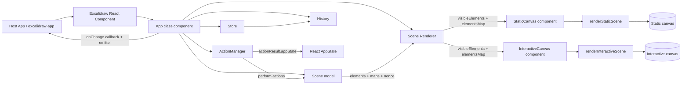

# Excalidraw Monorepo Architecture (Code-Derived)

## High-level Architecture

### Monorepo Layout

- Root package name: `excalidraw-monorepo`.
- Workspace manager: Yarn workspaces (`workspaces`: `excalidraw-app`, `packages/*`, `examples/*`).
- Application entry package for web app: `excalidraw-app`.
- Core editor package: `@excalidraw/excalidraw`.
- Core domain package for element logic: `@excalidraw/element`.
- Shared utilities/constants package: `@excalidraw/common`.
- Math primitives package: `@excalidraw/math`.
- Utility package with export helpers and other helpers: `@excalidraw/utils`.

### Runtime Building Blocks

- React UI shell is built by `Excalidraw` component (`packages/excalidraw/index.tsx`).
- Main stateful runtime class is `App extends React.Component<AppProps, AppState>` (`packages/excalidraw/components/App.tsx`).
- Scene model is managed by `Scene` class (`packages/element/src/Scene.ts`).
- Action dispatch and command/shortcut handling is managed by `ActionManager` (`packages/excalidraw/actions/manager.tsx`).
- Rendering visibility filtering is managed by `Renderer` class (`packages/excalidraw/scene/Renderer.ts`).
- Canvas rendering is split into:
  - static scene renderer (`renderStaticScene`) for element drawing,
  - interactive scene renderer (`renderInteractiveScene`) for UI overlays.

### High-level Mermaid Diagram



### Package/Layer Boundaries

- `@excalidraw/excalidraw` composes UI, app lifecycle, actions, rendering orchestration.
- `@excalidraw/element` owns domain logic for elements, scene container, selection, geometry-aware mutations.
- `@excalidraw/common` provides cross-package constants/helpers/types used by editor and element/math packages.
- `@excalidraw/math` provides geometric primitives and transforms used heavily by renderer and element logic.
- `@excalidraw/utils` provides helper utilities for export/import and other auxiliary operations.

### App Composition Facts

- `Excalidraw` component wraps `App` inside:
  - `EditorJotaiProvider`,
  - `InitializeApp`.
- `Excalidraw` merges incoming `UIOptions` with `DEFAULT_UI_OPTIONS`.
- `Excalidraw` exposes API context via `ExcalidrawAPIContext` / `ExcalidrawAPISetContext`.
- `App` creates internal API object containing methods such as:
  - `updateScene`,
  - `applyDeltas`,
  - `mutateElement`,
  - `resetScene`,
  - `getSceneElements`,
  - `getAppState`,
  - `registerAction`,
  - event subscriptions (`onChange`, `onPointerDown`, `onPointerUp`, etc.).

## Data Flow: як дані рухаються через систему

### 1) Initialization Flow

- `App` constructor initializes `this.state` from `getDefaultAppState()` plus runtime values (`width`, `height`, offsets, theme, flags).
- Constructor creates:
  - `Library`,
  - `ActionManager`,
  - `Scene`,
  - base canvas + roughjs instance (`this.canvas`, `this.rc`),
  - `Renderer`,
  - `Store`,
  - `History`,
  - `Fonts`.
- Actions are registered in `ActionManager` via `registerAll(actions)` plus undo/redo actions.
- On mount:
  - `scene.onUpdate(this.triggerRender)` subscribes render triggering to scene updates.
  - initial data is loaded/restored (`restoreElements`, `restoreAppState`).
  - API and lifecycle callbacks are emitted (`onMount`, `onExcalidrawAPI`).

### 2) User Interaction to State/Scene

- Pointer/keyboard handlers in `App` route interactions.
- Keyboard shortcuts are resolved by `ActionManager.handleKeyDown()`.
- `ActionManager` filters matching actions by:
  - UI options (`canvasActions`),
  - `keyTest`,
  - priority (`keyPriority`).
- If action is valid, `ActionManager` executes `action.perform(...)`.
- Result (`ActionResult`) is passed to `App.syncActionResult`.

### 3) ActionResult Application

- `syncActionResult` can update:
  - elements (`scene.replaceAllElements`),
  - files (`addMissingFiles`, cache updates),
  - appState (`this.setState(...)` merge).
- If no explicit update happened, `scene.triggerUpdate()` is called to refresh rendering.
- `Store.scheduleAction(actionResult.captureUpdate)` captures updates for increment/history pipeline.

### 4) External/Imperative API Data Flow

- Host can call `updateScene({ elements, appState, collaborators, captureUpdate })`.
- `updateScene`:
  - optionally captures micro action to store,
  - updates React `appState` via `setState`,
  - updates `Scene` elements via `replaceAllElements`,
  - updates collaborators via `setState`.
- Host can call `applyDeltas(deltas)`:
  - deltas are squashed,
  - applied to cloned `nextElements` and `nextAppState`,
  - result returned as tuple.

### 5) Scene to Render Data

- During `App.render()`:
  - selected elements are derived by `scene.getSelectedElements(this.state)`.
  - `sceneNonce` is read from `scene.getSceneNonce()`.
  - `renderer.getRenderableElements(...)` derives:
    - `elementsMap`,
    - `visibleElements`.
  - all non-deleted map is read as `scene.getNonDeletedElementsMap()`.
- `LayerUI`, canvas components, overlays consume current state and element collections.

### 6) Commit/Notification Data Flow

- In update lifecycle, `store.commit(elementsMap, this.state)` persists observed state/elements snapshot.
- When not loading:
  - `props.onChange?.(elements, this.state, this.files)` fires,
  - internal `onChangeEmitter.trigger(elements, this.state, this.files)` fires.
- Durable increments from store are recorded into `History` via `history.record(increment.delta)`.

### 7) File/Binary Data Path

- Binary files are tracked in `this.files` map.
- Action results and imports can provide files.
- SVG files are normalized and may have version bumped if dataURL changes.
- Image-related caches (`imageCache`, `ShapeCache`) are updated/cleared across operations.

## State Management: детальний опис (appState, elements, actionManager)

### appState (React state in `App`)

- Type: `AppState` interface in `packages/excalidraw/types.ts`.
- Holds UI, interaction, viewport, tool, selection, collaboration, export, and transient editing state.

### appState Main Domains

- **Tooling state**
  - `activeTool`, `preferredSelectionTool`, `penMode`, `penDetected`.
- **Element interaction state**
  - `newElement`, `multiElement`, `selectionElement`, `resizingElement`,
  - `selectedLinearElement`, `suggestedBinding`, `startBoundElement`.
- **Selection/grouping**
  - `selectedElementIds`, `hoveredElementIds`, `selectedGroupIds`, `editingGroupId`.
- **Viewport/canvas**
  - `zoom`, `scrollX`, `scrollY`, `width`, `height`, `offsetLeft`, `offsetTop`.
- **UI overlays/dialogs**
  - `contextMenu`, `openMenu`, `openPopup`, `openSidebar`, `openDialog`, `toast`.
- **Mode flags**
  - `viewModeEnabled`, `zenModeEnabled`, `gridModeEnabled`, `objectsSnapModeEnabled`.
- **Visual/render flags**
  - `theme`, `viewBackgroundColor`, `frameRendering`, `shouldCacheIgnoreZoom`.
- **Collaboration**
  - `collaborators`, `userToFollow`, `followedBy`.
- **Image/cropping/search/locking**
  - `isCropping`, `croppingElementId`, `searchMatches`, `activeLockedId`, `lockedMultiSelections`.

### appState Defaults and Sanitization

- `getDefaultAppState()` returns base default object (tool defaults, scroll/zoom defaults, flags, etc.).
- AppState storage config (`APP_STATE_STORAGE_CONF`) defines per-key export policy for:
  - browser storage,
  - export payloads,
  - server/database payloads.
- Functions:
  - `clearAppStateForLocalStorage`,
  - `cleanAppStateForExport`,
  - `clearAppStateForDatabase`,
  use this config to strip non-allowed keys.

### elements (Scene-owned source of truth)

- Scene stores:
  - full ordered element list (`elements`, includes deleted),
  - non-deleted list (`nonDeletedElements`),
  - full map (`elementsMap`),
  - non-deleted map (`nonDeletedElementsMap`),
  - frame collections (`frames`, `nonDeletedFramesLikes`),
  - `sceneNonce` for renderer cache invalidation.
- Scene update primitive: `replaceAllElements(nextElements)`.
- `replaceAllElements`:
  - validates/syncs indices (`validateFractionalIndices`, `syncInvalidIndices`),
  - rebuilds maps and frame collections,
  - triggers scene update (`triggerUpdate`).
- Selection caching:
  - `getSelectedElements()` caches by selected IDs + option hash.
- Mutation path:
  - `mutateElement()` delegates to element-level mutate logic,
  - triggers update only when version changed and mutation should inform.

### actionManager (Command dispatcher)

- Holds registry: `actions: Record<ActionName, Action>`.
- Constructed with:
  - updater callback (`syncActionResult` bridge),
  - `getAppState`,
  - `getElementsIncludingDeleted`,
  - `app` instance.
- Main responsibilities:
  - register actions (`registerAction`, `registerAll`),
  - keyboard dispatch (`handleKeyDown`),
  - direct execution (`executeAction`),
  - UI action rendering (`renderAction` for panel components),
  - gating via action predicates (`isActionEnabled`).
- Keyboard flow includes:
  - candidate filtering by key tests and canvas action toggles,
  - `viewModeEnabled` guard for non-view actions,
  - event preventDefault/stopPropagation,
  - updater invocation with `action.perform(...)` result.

### Store + History Integration

- `Store` tracks captured updates/increments.
- `History` subscribes to durable increments and records deltas.
- Undo/redo are regular actions registered into `ActionManager`.
- `captureUpdate` strategy controls what becomes undoable.

## Rendering Pipeline: від React component до canvas

### Step 1: React render phase in `App.render()`

- `App.render()` reads selection via `scene.getSelectedElements`.
- Reads `sceneNonce` from scene.
- Calls `renderer.getRenderableElements(...)` with viewport+state context.
- Receives:
  - `elementsMap` (renderable, filtered),
  - `visibleElements` (viewport-filtered).
- Computes `allElementsMap = scene.getNonDeletedElementsMap()`.
- Renders UI tree and canvas layers (including `LayerUI`, SVG trail layer, etc.).

### Step 2: Renderability and visibility derivation (`Renderer`)

- `Renderer.getRenderableElements` is memoized.
- Internally:
  - excludes current `newElementId`,
  - excludes currently edited text element from static render map,
  - computes viewport visibility with `isElementInViewport`.
- Uses scene nonce and viewport/app-state params for cache invalidation.

### Step 3: Static canvas pipeline (`StaticCanvas` -> `renderStaticScene`)

- `StaticCanvas` syncs HTML canvas CSS size and pixel buffer size with `scale`.
- `renderStaticScene(...)` is called (optionally throttled).
- Static renderer flow:
  - bootstraps context (`bootstrapCanvas`),
  - applies zoom transform,
  - optionally draws grid (`strokeGrid`),
  - renders visible non-iframe elements via `renderElement`,
  - renders bound text with containers,
  - renders link icons where applicable,
  - renders iframe-like elements on top,
  - draws pending flowchart nodes.
- Frame clipping logic is applied via `frameClip` when frame rendering clip is enabled.

### Step 4: Interactive canvas pipeline (`InteractiveCanvas` -> `renderInteractiveScene`)

- `InteractiveCanvas` builds render config including:
  - remote collaborator pointers/usernames/buttons,
  - remote selected element IDs,
  - selection color and scrollbar setting.
- Starts animation loop through `AnimationController` keyed by `INTERACTIVE_SCENE_ANIMATION_KEY`.
- Every frame calls `renderInteractiveScene(...)`.
- Interactive renderer overlays include:
  - selection rectangle,
  - transform handles,
  - linear point handles,
  - crop handles,
  - binding highlights,
  - frame/element highlight boxes,
  - search match highlights,
  - snapping guides,
  - remote cursors,
  - scrollbars.

### Step 5: Callback bridge back to App

- `renderInteractiveScene` invokes callback with:
  - `atLeastOneVisibleElement`,
  - `elementsMap`,
  - optional `scrollBars`.
- `App.renderInteractiveSceneCallback`:
  - updates global scrollbar reference,
  - computes `scrolledOutside`,
  - schedules image refresh.

### Step 6: Re-render triggers

- Scene changes call `scene.triggerUpdate()` -> callbacks -> `App.triggerRender`.
- `triggerRender(force)`:
  - if forced: triggers scene update,
  - otherwise: `setState({})` to refresh React render cycle.
- Resize, pointer interactions, action results, and updateScene all feed this loop.

## Package Dependencies: взаємозв'язки між packages

### Workspace Dependency Topology

- Root workspace contains:
  - `excalidraw-app`,
  - `packages/common`,
  - `packages/math`,
  - `packages/element`,
  - `packages/excalidraw`,
  - `packages/utils`,
  - examples.

### Direct Internal Package Dependencies (from package manifests)

- `@excalidraw/common`
  - no internal `@excalidraw/*` dependencies.
- `@excalidraw/math`
  - depends on `@excalidraw/common`.
- `@excalidraw/element`
  - depends on `@excalidraw/common`,
  - depends on `@excalidraw/math`.
- `@excalidraw/excalidraw`
  - depends on `@excalidraw/common`,
  - depends on `@excalidraw/element`,
  - depends on `@excalidraw/math`.
- `@excalidraw/utils`
  - no direct internal monorepo deps listed in its package manifest.

### App-to-Package Wiring in Development

- `excalidraw-app/vite.config.mts` defines aliases mapping package names to local source:
  - `@excalidraw/common` -> `../packages/common/src/*`,
  - `@excalidraw/element` -> `../packages/element/src/*`,
  - `@excalidraw/excalidraw` -> `../packages/excalidraw/*`,
  - `@excalidraw/math` -> `../packages/math/src/*`,
  - `@excalidraw/utils` -> `../packages/utils/src/*`.
- This means app dev build consumes monorepo source directly via Vite aliases.

### Cross-package Runtime Usage Patterns

- `packages/excalidraw` imports domain and rendering primitives heavily from:
  - `@excalidraw/element`,
  - `@excalidraw/common`,
  - `@excalidraw/math`.
- `packages/element` exports `Scene` and element operations consumed by `packages/excalidraw`.
- `packages/excalidraw/index.tsx` re-exports several APIs from `@excalidraw/element` and `@excalidraw/common`.

### Build/Publish Structure

- Root scripts build packages individually:
  - `build:common`,
  - `build:math`,
  - `build:element`,
  - `build:excalidraw`.
- `@excalidraw/excalidraw` exports typed entrypoints and scoped subpaths (`./common/*`, `./element/*`, `./math/*`, `./utils/*`).
- Package builds output `dist/dev`, `dist/prod`, and `dist/types` style artifacts.

### Dependency Graph (Internal Packages)

```mermaid
flowchart LR
  common[@excalidraw/common]
  math[@excalidraw/math]
  element[@excalidraw/element]
  excalidraw[@excalidraw/excalidraw]
  utils[@excalidraw/utils]
  app[excalidraw-app]

  math --> common
  element --> common
  element --> math
  excalidraw --> common
  excalidraw --> element
  excalidraw --> math

  app --> excalidraw
  app --> element
  app --> common
  app --> math
  app --> utils
```

