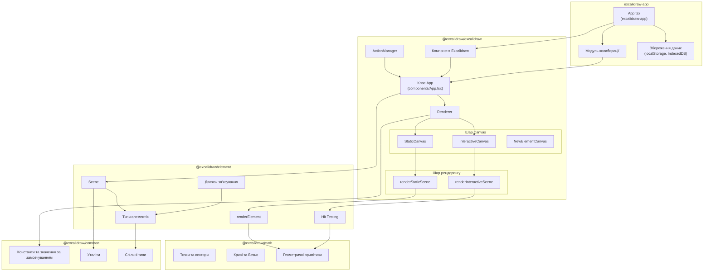
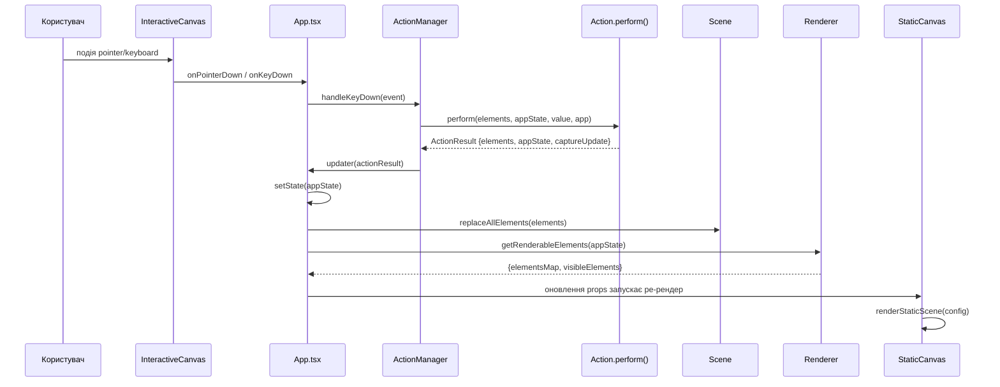
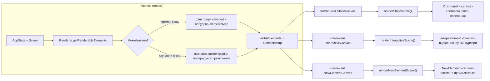
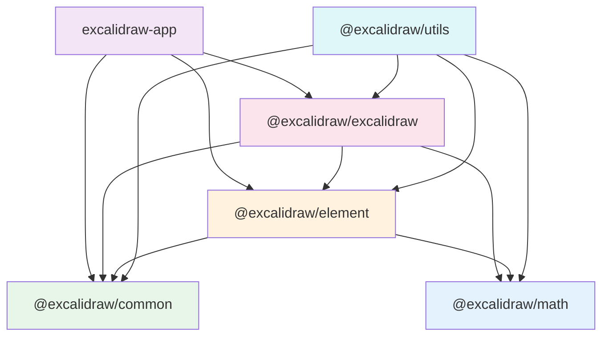

# Архітектура Excalidraw

## Високорівнева архітектура

Excalidraw — це колаборативний застосунок для роботи з дошками (whiteboard), побудований як монорепозиторій з п'ятьма внутрішніми пакетами та окремим веб-застосунком.

### Структура монорепозиторію

```
excalidraw-app/           # Веб-застосунок (excalidraw.com)
packages/
  excalidraw/             # Основна бібліотека редактора (@excalidraw/excalidraw v0.18.0)
  element/                # Типи елементів та логіка маніпуляцій (@excalidraw/element v0.18.0)
  common/                 # Спільні утиліти та константи (@excalidraw/common v0.18.0)
  math/                   # Геометричні математичні примітиви (@excalidraw/math v0.18.0)
  utils/                  # Хелпери для експорту та конвертації (@excalidraw/utils v0.1.2)
```

### Діаграма системи



## Потік даних

### Від введення користувача до циклу рендерингу

Дані рухаються через систему в односпрямованому циклі: події користувача запускають дії (actions), дії породжують оновлення стану, оновлення стану запускають перемальовування canvas.



### Потік створення елемента

Коли користувач малює новий елемент (наприклад, прямокутник):

1. **Pointer down** (`App.tsx`): `handleCanvasPointerDown()` визначає, що активний інструмент — `"rectangle"`, і викликає `createGenericElementOnPointerDown()`.
2. **Створення елемента** (`@excalidraw/element`): `newElement()` створює `ExcalidrawElement` зі значеннями за замовчуванням, випадковим `seed` для RoughJS та унікальним `id`.
3. **Pointer move** (`App.tsx`): обробник `onPointerMove` безперервно оновлює `width`/`height` через `scene.mutateElement()` під час перетягування.
4. **Pointer up** (`App.tsx`): фіналізує розміри елемента, додає його до `Scene` через `addNewElement()` і встановлює `appState.newElement = null`.
5. **Рендеринг** (`StaticCanvas`): щойно збережений елемент з'являється у `scene.getNonDeletedElements()` і малюється на статичному canvas.

### Системи координат

Застосунок використовує дві системи координат:

- **Координати сцени (Scene coordinates)**: абсолютна позиція елементів на нескінченному полотні. Зберігаються в `element.x`, `element.y`.
- **Координати viewport**: піксельна позиція на видимому екрані. Конвертуються через `viewportCoordsToSceneCoords()` та `sceneCoordsToViewportCoords()` з використанням `scrollX`, `scrollY`, `zoom`, `offsetLeft`, `offsetTop`.

## Управління станом

Стан застосунку розподілений між трьома окремими сховищами, кожне з яких має конкретну відповідальність.

### AppState

Визначений у `packages/excalidraw/types.ts`, ініціалізується в `packages/excalidraw/appState.ts` через `getDefaultAppState()`. Керується як стан React-компонента у класі `App` (`this.state`).

Ключові групи стану:

| Група | Поля | Призначення |
|-------|------|-------------|
| Інструмент | `activeTool`, `preferredSelectionTool` | Поточний інструмент малювання |
| Viewport | `zoom`, `scrollX`, `scrollY`, `width`, `height`, `offsetLeft`, `offsetTop` | Позиція камери |
| Стилізація | `currentItemStrokeColor`, `currentItemBackgroundColor`, `currentItemFontFamily`, `currentItemFontSize`, `currentItemRoughness`, ... | Значення за замовчуванням для нових елементів |
| Виділення | `selectedElementIds`, `selectedGroupIds`, `editingGroupId` | Що саме виділено |
| Редагування | `editingTextElement`, `newElement`, `selectionElement` | Активне редагування |
| UI | `theme`, `viewModeEnabled`, `zenModeEnabled`, `gridModeEnabled`, `showStats` | Перемикачі інтерфейсу |
| Колаборація | `collaborators` (Map з даними присутності користувачів) | Мультикористувацький стан |

Стан оновлюється через `this.setState()`, що запускає React ре-рендер і передає нові props у canvas-компоненти.

### Scene (сховище елементів)

Визначений у `packages/element/src/Scene.ts`. Керує колекцією `ExcalidrawElement[]` незалежно від стану React.

```
Scene
├── elements: OrderedExcalidrawElement[]          # Усі елементи (включно з видаленими)
├── nonDeletedElements: NonDeletedExcalidrawElement[]  # Відфільтрований список
├── nonDeletedElementsMap: NonDeletedSceneElementsMap  # Map для O(1) пошуку
├── frames: ExcalidrawFrameLikeElement[]           # Елементи-фрейми
└── sceneNonce: number                             # Лічильник інвалідації кешу
```

Ключові методи:

- `getNonDeletedElements()` — повертає елементи без м'яко видалених
- `getElementsIncludingDeleted()` — повертає всі елементи для undo/redo
- `getSelectedElements(opts)` — фільтрує за `selectedElementIds` з AppState
- `mutateElement(element, updates)` — оновлює властивості елемента на місці, інкрементує `sceneNonce`
- `addNewElement(element)` — додає елемент, запускає колбеки зміни
- `replaceAllElements(elements)` — масова заміна (використовується під час синхронізації колаборації)
- `getSceneNonce()` — повертає nonce для інвалідації мемоїзованого кешу рендерингу

Scene сповіщує підписників через зареєстровані колбеки (`onUpdate`). `sceneNonce` інкрементується при кожній мутації і використовується `Renderer.getRenderableElements()` як ключ мемоїзації.

### ActionManager

Визначений у `packages/excalidraw/actions/manager.tsx`. Зв'язує наміри користувача (гарячі клавіші, кліки UI, API-виклики) з мутаціями стану.

```typescript
class ActionManager {
  actions: Record<ActionName, Action>    // Реєстр усіх дій
  updater: (result: ActionResult) => void // Колбек для застосування змін стану
  getAppState: () => AppState            // Доступ до поточного стану
  getElementsIncludingDeleted: () => OrderedExcalidrawElement[]
  app: AppClassProperties                // Посилання на екземпляр App
}
```

Життєвий цикл дії (Action):

1. **Реєстрація**: `registerAll(actions)` викликається під час ініціалізації `App`, завантажуючи ~48 модулів дій з `packages/excalidraw/actions/`.
2. **Диспатч**: Два шляхи диспатчу:
   - `handleKeyDown(event)` — перебирає всі дії, відсортовані за `keyPriority`, знаходить ту, чий `keyTest()` спрацював, викликає `perform()`.
   - `executeAction(action, source, value)` — прямий виклик з UI або API.
3. **Виконання**: `action.perform(elements, appState, value, app)` повертає `ActionResult`:
   ```typescript
   type ActionResult = {
     elements?: ExcalidrawElement[]
     appState?: Partial<AppState>
     captureUpdate: CaptureUpdateActionType
     replaceFiles?: BinaryFiles
   }
   ```
4. **Застосування**: Колбек `updater` отримує `ActionResult` і застосовує його до компонента `App` через `setState()` та `scene.replaceAllElements()`.

Поле `captureUpdate` контролює відстеження історії:
- `CaptureUpdateAction.IMMEDIATELY` — записати для undo/redo
- `CaptureUpdateAction.NEVER` — ефемерна зміна (наприклад, стани hover)
- `CaptureUpdateAction.EVENTUALLY` — пакетна відправка для синхронізації колаборації

### Jotai Atoms (стан UI)

Для стану, що стосується лише UI і не впливає на canvas (наприклад, видимість діалогів, стан бокової панелі), проєкт використовує атоми Jotai, обмежені через `EditorJotaiProvider`. Це дозволяє уникнути prop drilling і запобігає зайвим ре-рендерам canvas.

## Конвеєр рендерингу

### Огляд архітектури

Система рендерингу використовує архітектуру з двома canvas для продуктивності: **статичний canvas** для вмісту елементів та **інтерактивний canvas** для UI виділення та курсорів.



### Крок 1: Визначення елементів для рендерингу

`Renderer.getRenderableElements()` (`packages/excalidraw/scene/Renderer.ts`) — це мемоїзована функція, яка:

1. Отримує всі невидалені елементи зі `Scene`.
2. Фільтрує елемент, що зараз редагується як текст (він рендериться окремо DOM-редактором тексту).
3. Фільтрує новий елемент, що малюється (рендериться на `NewElementCanvas`).
4. Будує `RenderableElementsMap` — `Map<id, element>` для O(1) пошуку під час рендерингу.
5. Фільтрує до `visibleElements` — лише елементи, чиї обмежувальні рамки перетинаються з viewport, перевіряючи через `isElementInViewport()` з `@excalidraw/element`.

Ключ мемоїзації включає: `zoom`, `scrollX`, `scrollY`, `width`, `height`, `offsetLeft`, `offsetTop`, `editingTextElement`, `newElementId` та `sceneNonce`.

### Крок 2: Рендеринг статичного Canvas

`StaticCanvas` (`packages/excalidraw/components/canvases/StaticCanvas.tsx`) — React-компонент, що викликає `renderStaticScene()` при кожному рендері.

`renderStaticScene()` (`packages/excalidraw/renderer/staticScene.ts`) виконує:

1. **Ініціалізація**: `bootstrapCanvas()` налаштовує 2D-контекст з правильним масштабуванням під device pixel ratio.
2. **Фон**: заповнює кольором `appState.viewBackgroundColor`.
3. **Сітка**: якщо увімкнено `gridModeEnabled`, викликає `strokeGrid()` з кольорами відповідно до теми (`#dddddd`/`#e5e5e5` для світлої, фільтровані еквіваленти для темної).
4. **Обрізка фреймів**: для елементів всередині фреймів застосовує `clip()` регіони через `shouldApplyFrameClip()`.
5. **Рендеринг елементів**: ітерує `visibleElements` і викликає `renderElement()` з `@excalidraw/element` для кожного. Це делегує до RoughJS (`RoughCanvas`) для естетики рукописного стилю.
6. **Накладки**: малює підписи фреймів, індикатори посилань елементів та плейсхолдери для вбудованого вмісту.

### Крок 3: Рендеринг інтерактивного Canvas

`InteractiveCanvas` (`packages/excalidraw/components/canvases/InteractiveCanvas.tsx`) обробляє динамічні візуальні елементи, що часто змінюються:

- Контури виділення та обмежувальні рамки
- Ручки трансформації (зміна розміру, обертання)
- Прямокутник множинного виділення
- Напрямні прив'язки (`renderSnaps.ts`)
- Курсори та покажчики віддалених колаборантів
- Точки та середні точки редактора лінійних елементів
- Підсвітка зв'язування та індикатори точок фокусу

`renderInteractiveScene()` (`packages/excalidraw/renderer/interactiveScene.ts`) використовує дані hit-testing з `@excalidraw/element` (ручки трансформації, межі елементів) для малювання UI виділення.

### Крок 4: Canvas нового елемента

`NewElementCanvas` рендерить елемент, що зараз малюється (між pointer-down і pointer-up). Це розділення гарантує, що статичний canvas не перемальовується при кожному русі миші під час створення елемента.

### Інтеграція RoughJS

Усі геометричні елементи рендеряться з естетикою рукописного малюнка через [RoughJS](https://roughjs.com/). Кожен елемент зберігає значення `seed` (випадкове ціле число, присвоєне при створенні), яке забезпечує детермінованість рандомізації — один і той самий елемент завжди рендериться з однаковим "тремтінням".

Екземпляр `RoughCanvas` створюється один раз і передається через конвеєр рендерингу. Форми елементів кешуються і перегенеровуються лише при зміні геометрії елемента.

### Обмеження частоти рендерингу

- `renderStaticScene` обгорнутий у `throttleRAF` (обмеження до requestAnimationFrame) для уникнення надлишкових статичних рендерів.
- `InteractiveCanvas` використовує `AnimationController` для плавної анімації переходів.
- `Renderer.getRenderableElements()` використовує мемоїзацію для уникнення перерахунку видимих елементів, коли вхідні дані не змінились.

## Залежності пакетів

### Граф залежностей



### Опис пакетів

#### `@excalidraw/math`

Фундаментний шар. Чисті математичні примітиви без внутрішніх залежностей.

- Точки, вектори, відрізки, полігони
- Обчислення кривих Безьє (`bezierEquation`)
- Обертання, відстані, перетини
- Конвертація кутів та радіанів
- Брендовані типи: `GlobalPoint`, `LocalPoint`, `Radians`

#### `@excalidraw/common`

Спільні утиліти та константи. Не залежить від інших внутрішніх пакетів.

- Константи: `COLOR_PALETTE`, `DEFAULT_ELEMENT_PROPS`, `DEFAULT_FONT_FAMILY`, `THEME`, `ARROW_TYPE`, `EXPORT_SCALES`
- Утилітні функції: `arrayToMap`, `throttleRAF`, `debounce`, `memoize`, `isShallowEqual`
- Конвертація координат: `sceneCoordsToViewportCoords`, `viewportCoordsToSceneCoords`
- Спільні TypeScript-типи та утиліти брендованих типів

#### `@excalidraw/element`

Модель елементів та логіка маніпуляцій. Залежить від `@excalidraw/common` та `@excalidraw/math`.

- Клас `Scene` — сховище елементів та управління життєвим циклом
- Типи елементів: `ExcalidrawElement` та підтипи (`ExcalidrawRectangleElement`, `ExcalidrawArrowElement`, `ExcalidrawTextElement` тощо)
- Створення елементів: `newElement()`, `newArrowElement()`, `newTextElement()`, `newImageElement()`
- Мутація: `mutateElement()`, `newElementWith()`
- Движок зв'язування: зв'язок стрілка-фігура, зв'язок текст-контейнер
- Обчислення меж: `getElementAbsoluteCoords()`, `getElementBounds()`
- Hit testing: `hitElementItself()`, `isElementInViewport()`
- Логіка фреймів: `elementOverlapsWithFrame()`, `getTargetFrame()`
- Редагування лінійних елементів: клас `LinearElementEditor`
- Рендеринг елементів: `renderElement()` (делегує до RoughJS)
- Відстеження дельт для синхронізації колаборації

#### `@excalidraw/excalidraw`

Основна бібліотека редактора. Головний пакет, який імпортують споживачі. Залежить від `@excalidraw/element`, `@excalidraw/common`, `@excalidraw/math`.

- Клас `App` (`components/App.tsx`, ~12 800 рядків) — головний компонент редактора, що обробляє всю взаємодію з користувачем
- `ActionManager` + ~48 модулів дій (`actions/`) — мутації стану через клавіатуру/UI
- `Renderer` (`scene/Renderer.ts`) — відсікання за viewport та мемоїзована фільтрація елементів
- Canvas-компоненти (`components/canvases/`) — `StaticCanvas`, `InteractiveCanvas`, `NewElementCanvas`
- Функції рендерингу (`renderer/`) — `renderStaticScene`, `renderInteractiveScene`, `renderNewElementScene`, `renderSnaps`
- Шар даних (`data/`) — серіалізація, відновлення, управління бібліотекою, blob I/O
- UI-компоненти — панель інструментів, бокова панель, контекстне меню, палітра команд, діалоги
- Хуки — `useExcalidrawAPI()`, `useAppStateValue()`, атоми Jotai
- Експорти: компонент `Excalidraw`, `ExcalidrawAPIProvider`, `CaptureUpdateAction`, `reconcileElements`

#### `@excalidraw/utils`

Утиліти для споживачів для роботи з даними Excalidraw поза редактором. Залежить від усіх інших пакетів.

- Хелпери експорту: конвертація сцен у PNG, SVG, PDF
- Утиліти маніпуляції сценами
- Призначений для інтеграторів, що вбудовують Excalidraw у свої застосунки

#### `excalidraw-app`

Веб-застосунок на excalidraw.com. Не публікується як пакет. Залежить від `@excalidraw/excalidraw`, `@excalidraw/element`, `@excalidraw/common`.

- `App.tsx` — обгортає компонент `<Excalidraw>` функціональністю рівня застосунку
- `collab/` — колаборація в реальному часі через WebSocket (синхронізація курсорів, узгодження елементів)
- `data/` — шар збереження даних (localStorage, IndexedDB, імпорт/експорт файлів)
- `share/` — обмін посиланнями та управління кімнатами
- Інтеграція з Firebase для бекенд-сервісів

### Ключові зовнішні залежності

| Залежність | Використовується в | Призначення |
|-----------|-------------------|-------------|
| `roughjs` | `@excalidraw/excalidraw` | Рукописний стиль рендерингу |
| `react` / `react-dom` | `@excalidraw/excalidraw`, `excalidraw-app` | UI-фреймворк |
| `jotai` | `@excalidraw/excalidraw` | Атомарне управління станом UI |
| `lodash.throttle` | `@excalidraw/element` | Обмеження частоти виклику функцій |
| `clsx` | `excalidraw-app` | Композиція CSS-класів |
