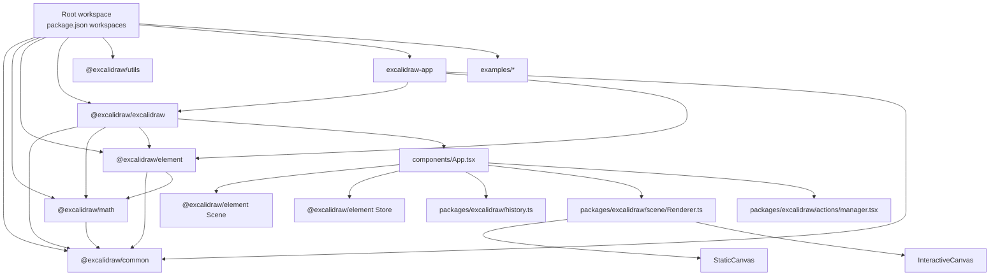

# Architecture

This document describes architecture facts observed in repository source code.
Scope includes root workspace wiring, `packages/*`, and the host app in `excalidraw-app`.

## High-level Architecture

### Monorepo structure

- Root workspace is configured in `package.json` with:
  - `excalidraw-app`
  - `packages/*`
  - `examples/*`
- Core package set under `packages/`:
  - `@excalidraw/common`
  - `@excalidraw/math`
  - `@excalidraw/element`
  - `@excalidraw/excalidraw`
  - `@excalidraw/utils`

### Runtime composition

- `packages/excalidraw/index.tsx` exports the public React component `<Excalidraw />`.
- `<Excalidraw />` wraps `InitializeApp` and then mounts `components/App.tsx`.
- `excalidraw-app/App.tsx` uses `@excalidraw/excalidraw` as a host integration layer.

### Mermaid diagram

### Build-time architecture facts

- Root scripts:
  - `yarn build:packages` builds `common`, `math`, `element`, `excalidraw`.
- `scripts/buildBase.js`:
  - entrypoint `src/index.ts`
  - marks `@excalidraw/common`, `@excalidraw/element`, `@excalidraw/math` as externals
  - used by `common`, `math`, `element`.
- `scripts/buildPackage.js`:
  - entrypoint `index.tsx` plus `**/*.chunk.ts`
  - marks `common/element/math` externals
  - aliases `@excalidraw/utils` to `packages/utils/src`.
- `scripts/buildUtils.js`:
  - entrypoint `src/index.ts`
  - aliases all internal `@excalidraw/*` packages to workspace source paths.

### Dev/test resolution facts

- `tsconfig.json` maps `@excalidraw/*` imports directly to workspace sources.
- `vitest.config.mts` uses equivalent alias mapping for tests.

## Data Flow

### 1. Startup flow (`@excalidraw/excalidraw`)

1. `InitializeApp` resolves language via `setLanguage(...)`.
2. `App` constructor initializes:
   - `scene = new Scene()`
   - `store = new Store(this)`
   - `history = new History(this.store)`
   - `renderer = new Renderer(this.scene)`
   - `actionManager = new ActionManager(...)`
3. `componentDidMount()` calls `updateDOMRect(this.initializeScene)`.
4. `initializeScene()`:
   - reads `props.initialData`
   - runs `restoreElements(..., { repairBindings: true, deleteInvisibleElements: true })`
   - runs `restoreAppState(...)`
   - resets store/history
   - applies state via `syncActionResult(..., captureUpdate: CaptureUpdateAction.NEVER)`.
5. After `isLoading` becomes `false`, `componentDidUpdate()` emits:
   - `editor:initialize`
   - `props.onInitialize?.(api)`.

### 2. Local action/data mutation flow

1. UI/keyboard/context menu paths route through `ActionManager`.
2. `ActionManager` executes an action `perform(...)`.
3. Action returns `ActionResult` with `captureUpdate`.
4. `App.syncActionResult(...)`:
   - schedules `store.scheduleAction(captureUpdate)`
   - replaces scene elements if provided
   - merges app state if provided
   - merges files if provided.
5. `componentDidUpdate()` always calls `store.commit(elementsMap, this.state)`.
6. If not loading, `onChange` callbacks fire:
   - `props.onChange?.(elements, appState, files)`
   - internal `onChangeEmitter.trigger(...)`.

### 3. External API flow (`ExcalidrawImperativeAPI`)

- `createExcalidrawAPI()` exposes:
  - `updateScene`
  - `applyDeltas`
  - `mutateElement`
  - `history.clear`
  - `getSceneElements*`
  - `getAppState`, `getFiles`
  - `onChange`, `onIncrement`, `onStateChange`, `onEvent`.
- `updateScene(...)` can include:
  - `elements`
  - `appState`
  - `collaborators`
  - `captureUpdate`.
- When `captureUpdate` is provided, `updateScene` schedules a micro action in `Store`.

### 4. Host app data flow (`excalidraw-app`)

- `excalidraw-app/App.tsx` registers `onChange` on `<Excalidraw />`.
- In host `onChange`:
  - if collaborating: `collabAPI.syncElements(elements)`
  - if local save is enabled: `LocalData.save(elements, appState, files, ...)`
  - post-save image status changes are applied using:
    - `excalidrawAPI.updateScene({ elements, captureUpdate: NEVER })`.
- On hash-change/re-initialization path, host calls:
  - `excalidrawAPI.updateScene({ appState: { isLoading: true } })`
  - then restore + `updateScene(..., captureUpdate: IMMEDIATELY | NEVER)` depending on flow.

### 5. Export flow (package and host)

- `@excalidraw/utils/src/export.ts` export functions:
  - normalize with `restoreElements(...)`
  - normalize with `restoreAppState(...)`
  - delegate to scene export renderers.
- Host app passes `onExport` and backend export handlers via `<Excalidraw />` props.

## State Management

### AppState (editor runtime state)

- `AppState` is declared in `packages/excalidraw/types.ts`.
- It includes:
  - tool and pointer state (`activeTool`, `cursorButton`, `selectionElement`, `newElement`, `resizingElement`)
  - selection state (`selectedElementIds`, `selectedGroupIds`, `editingGroupId`)
  - viewport state (`scrollX`, `scrollY`, `zoom`, `width`, `height`, offsets)
  - UI state (`openDialog`, `openSidebar`, `toast`, `theme`, `zenModeEnabled`)
  - collaboration state (`collaborators`, `userToFollow`, `followedBy`)
  - frame/crop/search state (`frameRendering`, `croppingElementId`, `searchMatches`)
  - locking state (`activeLockedId`, `lockedMultiSelections`).
- Default values are created in `getDefaultAppState()` (`packages/excalidraw/appState.ts`).

### ObservedAppState (store tracking subset)

- `ObservedAppState` is a subset in `types.ts`:
  - standalone keys: `name`, `viewBackgroundColor`
  - element-related keys:
    - `editingGroupId`
    - `selectedElementIds`
    - `selectedGroupIds`
    - `selectedLinearElement` reduced to `{ elementId, isEditing }`
    - `croppingElementId`
    - `lockedMultiSelections`
    - `activeLockedId`.
- `Store` converts full app state to observed state using `getObservedAppState(...)`.

### Elements state (`Scene`)

- `Scene` (`packages/element/src/Scene.ts`) stores:
  - all elements (including deleted)
  - non-deleted elements
  - maps for both sets
  - frame subsets
  - selected-elements cache
  - `sceneNonce` cache-invalidation token.
- `replaceAllElements(...)`:
  - synchronizes fractional indices via `syncInvalidIndices(...)`
  - rebuilds maps/caches
  - calls `triggerUpdate()`.
- `triggerUpdate()`:
  - regenerates `sceneNonce`
  - calls subscribed callbacks.
- `mapElements(...)` supports map-with-no-op optimization.
- `mutateElement(...)` delegates to element mutation logic and triggers update only on effective version change.

### Element mutation/versioning

- `packages/element/src/mutateElement.ts`:
  - mutates only defined changed fields
  - updates shape cache on geometry/file-affecting changes
  - bumps `version`, `versionNonce`, `updated` when changed.
- `newElementWith(...)` creates immutable updated copies with the same versioning rules.

### Store and increments

- `Store` (`packages/element/src/store.ts`) has:
  - `onDurableIncrementEmitter`
  - `onStoreIncrementEmitter`
  - scheduled macro actions (`IMMEDIATELY`, `NEVER`, `EVENTUALLY`)
  - scheduled micro actions queue.
- Commit cycle:
  1. flush micro actions
  2. pick single macro action by precedence:
     - `IMMEDIATELY`
     - then `NEVER`
     - else `EVENTUALLY`
  3. compute snapshot/change/delta
  4. emit durable or ephemeral increment.
- Snapshot updates:
  - `IMMEDIATELY` and `NEVER` update snapshot
  - `EVENTUALLY` emits ephemeral increment and does not immediately update snapshot.

### History

- `packages/excalidraw/history.ts` creates undo/redo stacks from `StoreDelta`.
- In `App.componentDidMount()`:
  - durable store increments are forwarded to `history.record(increment.delta)`.
- `History.record(...)` ignores:
  - empty deltas
  - already-history deltas (`HistoryDelta`).

### ActionManager

- `ActionManager` stores actions in a map by `ActionName`.
- Action registration:
  - `registerAll(actions)` where `actions` comes from `actions/register.ts`.
  - undo/redo actions are registered separately.
- Execution entry points:
  - `handleKeyDown(...)`
  - `executeAction(...)`
  - `renderAction(...)` for panel components.
- Every action returns `ActionResult` with mandatory `captureUpdate` mode.

### AppState observer API

- `AppStateObserver` provides:
  - selector-based subscriptions
  - predicate-based subscriptions
  - Promise mode when callback is omitted
  - `once` semantics.
- `App.componentDidUpdate()` calls `appStateObserver.flush(prevState)` to dispatch changes.

## Rendering Pipeline

### React tree level

1. `App.render()` computes:
   - `sceneNonce`
   - renderable/visible element sets from `Renderer.getRenderableElements(...)`.
2. `App.render()` renders layered canvases:
   - `<StaticCanvas />`
   - optional `<NewElementCanvas />` (when `state.newElement` exists)
   - `<InteractiveCanvas />`.
3. `LayerUI` and other overlays are rendered in the same React tree.

### Renderable element selection

- `Renderer.getRenderableElements(...)`:
  - starts from `scene.getNonDeletedElements()`
  - excludes currently edited text element
  - excludes element currently being created (`newElementId`)
  - filters by viewport via `isElementInViewport(...)`
  - memoizes result keyed by viewport args + `sceneNonce`.

### Static canvas pipeline

- `StaticCanvas`:
  - syncs canvas size with app state
  - calls `renderStaticScene(...)` on each effect cycle.
- `renderStaticScene(...)`:
  - bootstraps canvas context (`bootstrapCanvas`)
  - applies zoom transform
  - optionally draws grid
  - renders visible elements (except iframe-like first pass)
  - renders bound text with its container
  - renders link icons (non-export path)
  - renders iframe/embeddable elements in top pass
  - renders pending flowchart nodes.
- Render throttling:
  - `renderStaticSceneThrottled` uses `throttleRAF`
  - enabled when `isRenderThrottlingEnabled()` returns true.

### New element canvas pipeline

- `NewElementCanvas` calls `renderNewElementScene(...)`.
- `renderNewElementScene(...)`:
  - bootstraps a separate canvas
  - applies zoom
  - renders only `newElement`
  - skips invisibly small new elements
  - applies frame clipping rules when needed.

### Interactive canvas pipeline

- `InteractiveCanvas` aggregates collaboration cursor/selection maps from `appState.collaborators`.
- It calls `renderInteractiveScene(...)` through `AnimationController.start(...)`.
- Interactive render config includes:
  - remote pointer coordinates and buttons
  - remote selected ids
  - remote usernames/states
  - selection color
  - scrollbars toggle.
- `renderInteractiveSceneCallback` in `App` receives render outputs and updates:
  - scrollbar state
  - `scrolledOutside`
  - image refresh scheduling.

### Canvas layering fact

- In `App.render()`, static/new/interactive canvases are sibling layers under the same container.
- UI components (`LayerUI`, context menus, overlays, embeddables) are rendered separately from canvas rasterization.

## Package Dependencies

### Declared package dependencies (`packages/*/package.json`)

- `@excalidraw/common`
  - depends on: `tinycolor2`.
- `@excalidraw/math`
  - depends on: `@excalidraw/common`.
- `@excalidraw/element`
  - depends on: `@excalidraw/common`, `@excalidraw/math`.
- `@excalidraw/excalidraw`
  - depends on: `@excalidraw/common`, `@excalidraw/element`, `@excalidraw/math`, plus UI/runtime libraries.
  - peer dependencies: `react`, `react-dom`.
- `@excalidraw/utils`
  - package manifest does not declare direct dependencies on `@excalidraw/common|element|math|excalidraw`.

### Source-level internal import relationships (non-test source files)

- `common` imports from:
  - `@excalidraw/math`
  - `@excalidraw/element/types`
  - `@excalidraw/excalidraw/types`.
- `math` imports from:
  - `@excalidraw/common`.
- `element` imports from:
  - `@excalidraw/common`
  - `@excalidraw/math`
  - `@excalidraw/excalidraw/types` and `.../scene/types`
  - `@excalidraw/utils/*`.
- `excalidraw` imports from:
  - `@excalidraw/common`
  - `@excalidraw/element`
  - `@excalidraw/math`
  - `@excalidraw/utils`.
- `utils` imports from:
  - `@excalidraw/common`
  - `@excalidraw/element`
  - `@excalidraw/math`
  - `@excalidraw/excalidraw/*` internals (`appState`, `clipboard`, `data/*`, `scene/export`, `types`).

### Build and alias facts affecting dependency behavior

- `tsconfig.json` and `vitest.config.mts` map all `@excalidraw/*` imports to workspace source files.
- `buildUtils.js` aliases all internal packages directly to source paths.
- `buildPackage.js` aliases `@excalidraw/utils` to workspace source.
- Because of aliasing, source-level coupling and published package boundaries are managed by both:
  - package manifests
  - build script external/alias rules.
