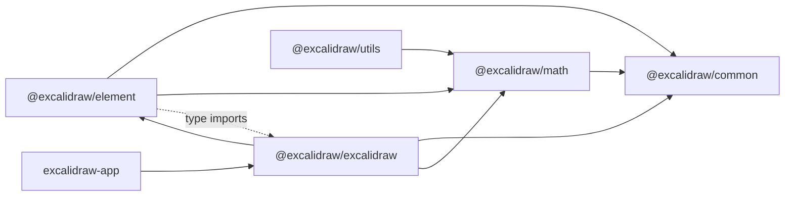

# Excalidraw Monorepo Architecture

Документ описує фактичну архітектуру на основі source code в репозиторії.
Усі твердження нижче прив'язані до реалізації в `packages/*`, `excalidraw-app` та root-конфігурації.

---

## High-level Architecture

### Monorepo topology

- Root `package.json` визначає Yarn workspaces:
  - `excalidraw-app`
  - `packages/*`
  - `examples/*`
- Root `tsconfig.json` задає path aliases:
  - `@excalidraw/common -> packages/common/src`
  - `@excalidraw/math -> packages/math/src`
  - `@excalidraw/element -> packages/element/src`
  - `@excalidraw/utils -> packages/utils/src`
  - `@excalidraw/excalidraw -> packages/excalidraw`

### Runtime building blocks (editor package)

- Центральний UI-клас: `packages/excalidraw/components/App.tsx` (`class App`).
- Модель сцени:
  - `packages/element/src/Scene.ts` (`class Scene`).
- Рендерер видимих елементів:
  - `packages/excalidraw/scene/Renderer.ts` (`class Renderer`).
- Store для інкрементів/дельт:
  - `packages/element/src/store.ts` (`class Store`).
- Action orchestration:
  - `packages/excalidraw/actions/manager.tsx` (`class ActionManager`).

### Mermaid diagram

```mermaid
flowchart TD
  Host["Host app / API consumer"] --> API["ExcalidrawImperativeAPI<br/>App.createExcalidrawAPI()"]
  API --> App["App (React class component)"]

  User["User input<br/>pointer / keyboard / UI"] --> App
  App --> AM["ActionManager"]
  AM -->|Action.perform()| SR["syncActionResult()"]

  App --> Scene["Scene (@excalidraw/element)"]
  App --> Store["Store (@excalidraw/element)"]
  App --> Renderer["Renderer (viewport filtering)"]

  SR -->|replaceAllElements| Scene
  SR -->|setState| App
  SR -->|scheduleAction| Store

  App -->|render()| ReactTree["LayerUI + Canvases"]
  ReactTree --> StaticCanvas["StaticCanvas"]
  ReactTree --> NewCanvas["NewElementCanvas"]
  ReactTree --> InteractiveCanvas["InteractiveCanvas"]

  StaticCanvas --> StaticScene["renderStaticScene()"]
  NewCanvas --> NewScene["renderNewElementScene()"]
  InteractiveCanvas --> InteractiveScene["renderInteractiveScene()"]

  StaticScene --> ElementRender["@excalidraw/element/renderElement()"]
  NewScene --> ElementRender
  InteractiveScene --> Overlay["selection, handles, snaps, collaborators"]

  App -->|componentDidUpdate| Commit["store.commit(elementsMap, appState)"]
  Commit --> Increments["Durable/Ephemeral increments"]
  Increments --> History["History (undo/redo)"]
  App --> OnChange["props.onChange + onChangeEmitter"]
```

### Layer split by responsibility

- `@excalidraw/common`
  - cross-cutting constants/utilities (`THEME`, `throttleRAF`, events, utils).
- `@excalidraw/math`
  - geometry/math primitives.
- `@excalidraw/element`
  - scene model, element logic, mutations, store/delta engine, element rendering.
- `@excalidraw/excalidraw`
  - React editor, action system, UI, canvases, interaction orchestration.
- `excalidraw-app`
  - standalone host app for the editor package.

---

## Data Flow: як дані рухаються через систему

### 1) Initialization flow

- `App` constructor:
  - створює `defaultAppState` через `getDefaultAppState()`;
  - ініціалізує `this.state`;
  - створює `ActionManager`, `Scene`, `Renderer`, `Store`, `History`, `Fonts`;
  - реєструє набір actions + undo/redo;
  - створює imperative API (`createExcalidrawAPI`).
- API, який експортується назовні, містить:
  - `updateScene`, `applyDeltas`, `mutateElement`, `resetScene`,
  - getters елементів/стану/файлів,
  - підписки `onChange`, `onIncrement`, `onPointerDown`, `onPointerUp`, `onScrollChange`, `onUserFollow`.

### 2) Action-driven update flow

- Події UI/keyboard/context-menu викликають `ActionManager`.
- `ActionManager`:
  - вибирає action за `keyTest` / name,
  - виконує `action.perform(elements, appState, value, app)`,
  - передає `ActionResult` в updater (`App.syncActionResult`),
  - підтримує async action results через `isPromiseLike`.
- `ActionResult` містить:
  - `elements?`,
  - `appState?`,
  - `files?`,
  - обов'язковий `captureUpdate` (`IMMEDIATELY|NEVER|EVENTUALLY`).

### 3) syncActionResult path

- `syncActionResult` в `App`:
  - викликає `store.scheduleAction(actionResult.captureUpdate)`,
  - якщо є `elements` -> `scene.replaceAllElements(elements)`,
  - якщо є `files` -> оновлює файлове сховище/кеш,
  - якщо є `appState` -> `setState(...)` з мержем та нормалізацією (viewMode/theme/name/errorMessage/editingTextElement),
  - якщо змін не було -> `scene.triggerUpdate()` для примусового оновлення.

### 4) API-driven update flow (`updateScene`)

- `updateScene(sceneData)` може приймати:
  - `elements`,
  - `appState`,
  - `collaborators`,
  - `captureUpdate`.
- Якщо передано `captureUpdate`:
  - формується observed app state (`getObservedAppState(...)`),
  - викликається `store.scheduleMicroAction(...)`.
- Далі застосовується state:
  - `setState(appState)` (якщо є),
  - `scene.replaceAllElements(elements)` (якщо є),
  - `setState({ collaborators })` (якщо є).

### 5) Commit + notifications flow

- У `componentDidUpdate` (у `App`) відбувається:
  - `store.commit(elementsMap, this.state)`,
  - якщо `!isLoading`: `props.onChange?.(elements, state, files)` та `onChangeEmitter.trigger(...)`.
- `Store.commit(...)`:
  - виконує micro actions,
  - обирає macro action з пріоритетом:
    - `IMMEDIATELY` > `NEVER` > default `EVENTUALLY`,
  - емітить:
    - durable increment (`onDurableIncrementEmitter` + `onStoreIncrementEmitter`) для `IMMEDIATELY`,
    - ephemeral increment (`onStoreIncrementEmitter`) для `NEVER/EVENTUALLY`.

### 6) Delta application flow

- API `applyDeltas(deltas, options)`:
  - агрегує вхідні `StoreDelta` через `StoreDelta.squash(...)`,
  - робить копії `nextAppState` та `nextElements`,
  - викликає `StoreDelta.applyTo(...)`,
  - повертає `[SceneElementsMap, AppState, appliedVisibleChanges]`.

### 7) Rendering data flow

- `App.render()`:
  - бере `sceneNonce` з `Scene`,
  - отримує `{ elementsMap, visibleElements }` через `Renderer.getRenderableElements(...)`,
  - рендерить `LayerUI` + 3 canvas-компоненти:
    - `StaticCanvas`,
    - `NewElementCanvas` (коли `state.newElement` не null),
    - `InteractiveCanvas`.
- `renderInteractiveScene` повертає callback payload:
  - `atLeastOneVisibleElement`,
  - `scrollBars?`,
  - `elementsMap`.
- `App.renderInteractiveSceneCallback`:
  - оновлює `currentScrollBars`,
  - синхронізує `state.scrolledOutside`,
  - планує refresh зображень.

---

## State Management: детальний опис (appState, elements, actionManager)

### appState: структура і призначення

`AppState` визначений у `packages/excalidraw/types.ts`.
Він містить кілька груп стану:

- Interaction/runtime:
  - `newElement`, `selectionElement`, `multiElement`, `resizingElement`,
  - `isResizing`, `isRotating`, `cursorButton`, `lastPointerDownWith`.
- Selection/editing:
  - `selectedElementIds`, `selectedGroupIds`, `previousSelectedElementIds`,
  - `editingGroupId`, `editingTextElement`, `selectedLinearElement`.
- Viewport/UI:
  - `scrollX`, `scrollY`, `zoom`, `width`, `height`, `offsetTop`, `offsetLeft`,
  - `openMenu`, `openPopup`, `openSidebar`, `openDialog`, `contextMenu`.
- Styling/tool defaults:
  - `currentItemStrokeColor`, `currentItemBackgroundColor`, `currentItemFillStyle`,
  - `currentItemStrokeWidth`, `currentItemStrokeStyle`, `currentItemRoughness`,
  - `currentItemOpacity`, `currentItemFontFamily`, `currentItemFontSize`,
  - `currentItemTextAlign`, arrowheads, roundness, arrow type.
- Feature toggles:
  - `viewModeEnabled`, `zenModeEnabled`, `gridModeEnabled`,
  - `objectsSnapModeEnabled`, `isBindingEnabled`, `isMidpointSnappingEnabled`,
  - `frameRendering`.
- Collaboration:
  - `collaborators`, `userToFollow`, `followedBy`.
- Files/export:
  - `fileHandle`, `exportBackground`, `exportScale`, `exportEmbedScene`, `exportWithDarkMode`.
- Advanced editor states:
  - `isCropping`, `croppingElementId`, `searchMatches`,
  - `lockedMultiSelections`, `activeLockedId`, `bindMode`.

### appState defaults

- `getDefaultAppState()` задає повний initial state, включаючи:
  - дефолтну тему (`THEME.LIGHT`),
  - дефолтний активний інструмент (`selection`),
  - zoom `{ value: 1 }`,
  - frame rendering `{ enabled: true, clip: true, name: true, outline: true }`,
  - порожні `Map`/`Set` для collaborators/followedBy.

### appState persistence/export policy

- `APP_STATE_STORAGE_CONF` у `appState.ts` визначає, які ключі дозволені для:
  - `browser` (local storage / IDB),
  - `export`,
  - `server`.
- Утиліти:
  - `clearAppStateForLocalStorage`,
  - `cleanAppStateForExport`,
  - `clearAppStateForDatabase`.

### elements state (`Scene`)

- `Scene` підтримує одночасно:
  - `elements` (включно з deleted),
  - `elementsMap` (включно з deleted),
  - `nonDeletedElements`,
  - `nonDeletedElementsMap`,
  - списки frame-like елементів.
- `replaceAllElements(...)`:
  - синхронізує indices (`syncInvalidIndices`),
  - будує map-структури,
  - оновлює кеші,
  - викликає `triggerUpdate()` (оновлює `sceneNonce` + callback-и).
- `getSelectedElements(...)` кешує вибірку за hash опцій та ідентичністю `selectedElementIds`.
- `mutateElement(...)` викликає element-level mutate і тригерить update лише якщо версія елемента зросла.

### observed app state для Store

- `Store` не спостерігає весь `AppState`.
- `getObservedAppState(...)` бере підмножину:
  - `name`,
  - `editingGroupId`,
  - `viewBackgroundColor`,
  - `selectedElementIds`,
  - `selectedGroupIds`,
  - `selectedLinearElement` (в нормалізованому вигляді),
  - `croppingElementId`,
  - `activeLockedId`,
  - `lockedMultiSelections`.

### Store + increments + deltas

- `Store` оперує `StoreSnapshot`, `StoreChange`, `StoreDelta`.
- Два публічні emitter-и:
  - `onDurableIncrementEmitter`,
  - `onStoreIncrementEmitter`.
- `IMMEDIATELY`:
  - формує durable increment,
  - оновлює snapshot.
- `NEVER`:
  - формує ephemeral increment,
  - оновлює snapshot.
- `EVENTUALLY`:
  - формує ephemeral increment,
  - snapshot не оновлює в цьому кроці.
- Для dedup/eventual-режиму використовуються hash-перевірки:
  - `_lastChangedElementsHash`,
  - `_lastChangedAppStateHash`.

### actionManager

- Зберігає реєстр `actions: Record<ActionName, Action>`.
- Підтримує:
  - `registerAction`, `registerAll`,
  - `handleKeyDown` (key priority + keyTest + view mode guard),
  - `executeAction` (програмний/контекстний запуск),
  - `renderAction` (рендер `PanelComponent` action-а),
  - `isActionEnabled` через `predicate`.
- Action telemetry:
  - `trackEvent` викликається для keyboard/ui/api/context джерел.
- Action contract:
  - `perform(...) => ActionResult | Promise<ActionResult>`,
  - обов'язкове поле `captureUpdate` у `ActionResult`.

---

## Rendering Pipeline: від React component до canvas

### React render entry

- `App.render()`:
  - розраховує renderable та visible елементи через `Renderer`,
  - рендерить UI (`LayerUI`) окремо від canvas,
  - рендерить три canvas-шари.

### Canvas layers

- `StaticCanvas`:
  - використовує `this.canvas` (створений в `App` constructor),
  - `useEffect` масштабує фізичний canvas розміром `width*scale`, `height*scale`,
  - викликає `renderStaticScene(...)`.
- `NewElementCanvas`:
  - окремий `<canvas>` тільки для `appState.newElement`,
  - викликає `renderNewElementScene(...)`.
- `InteractiveCanvas`:
  - окремий `<canvas class="interactive">`,
  - викликає `renderInteractiveScene(...)` в animation loop,
  - містить pointer/click/context handlers.

### Viewport filtering stage

- `Renderer.getRenderableElements(...)`:
  - будує `elementsMap` без `newElement` і без поточно редагованого тексту,
  - фільтрує visible елементи через `isElementInViewport(...)`,
  - memoized by inputs + `sceneNonce`.

### Static scene stage

- `renderStaticScene(...)`:
  - `bootstrapCanvas(...)` -> контекст з базовим очищенням/фоном,
  - `context.scale(appState.zoom.value, appState.zoom.value)`,
  - optional grid rendering (`strokeGrid`),
  - рендер non-iframe елементів,
  - рендер iframe-like зверху,
  - рендер pending flowchart nodes.
- Для frame clipping:
  - використовується `frameClip(...)`,
  - рішення приймається через `getTargetFrame(...)` + `shouldApplyFrameClip(...)`.

### New element stage

- `renderNewElementScene(...)`:
  - масштабує контекст за zoom,
  - пропускає invisibly small element (`isInvisiblySmallElement`),
  - застосовує frame clipping за тими ж правилами,
  - рендерить лише `newElement`.

### Interactive scene stage

- `InteractiveCanvas` збирає render config:
  - remote pointers/users/selections з `appState.collaborators`,
  - `selectionColor`,
  - `renderScrollbars`,
  - `lastViewportPosition`.
- `AnimationController.start(...)` викликає `renderInteractiveScene(...)` з `deltaTime`.
- `renderInteractiveScene(...)`:
  - повертає `scrollBars`, `atLeastOneVisibleElement`, `elementsMap`, `animationState`,
  - викликає callback, який синхронізує App-level state (`scrolledOutside`).

### Element rendering primitive

- Базовий primitive: `@excalidraw/element/renderElement(...)`.
- Гілки рендера:
  - export mode -> прямий рендер на canvas без кеш-оптимізацій,
  - non-export mode -> кешування в `elementWithCanvasCache` (WeakMap) + `drawImage`.
- Враховуються:
  - opacity (включно з frame opacity та pending erasure),
  - image placeholders/error placeholders,
  - dark theme filter для SVG/image/text,
  - bound text logic,
  - crop preview logic.

### Re-render controls

- `React.memo` + custom comparators:
  - `StaticCanvas.areEqual(...)` порівнює scene nonce, scale, maps, visible refs + relevant appState/renderConfig.
  - `InteractiveCanvas.areEqual(...)` порівнює selection nonce, scene nonce, scale, refs, flags + relevant appState.
- Throttling:
  - `renderStaticSceneThrottled`,
  - `renderNewElementSceneThrottled`,
  - у `InteractiveCanvas` кадри контролює `AnimationController`.

---

## Package Dependencies: взаємозв'язки між packages

### Workspace packages (internal)

- `@excalidraw/common`
- `@excalidraw/math`
- `@excalidraw/element`
- `@excalidraw/utils`
- `@excalidraw/excalidraw`
- app package: `excalidraw-app`

### Internal dependency graph (package.json)

- `@excalidraw/common`
  - internal deps: none.
- `@excalidraw/math`
  - depends on: `@excalidraw/common`.
- `@excalidraw/element`
  - depends on: `@excalidraw/common`, `@excalidraw/math`.
- `@excalidraw/excalidraw`
  - depends on: `@excalidraw/common`, `@excalidraw/element`, `@excalidraw/math`.
- `@excalidraw/utils`
  - не декларує internal workspace deps у `package.json`.
  - використовує external libs (`roughjs`, `pako`, `browser-fs-access`, etc.).
- `excalidraw-app`
  - не має прямої залежності `@excalidraw/excalidraw` у `dependencies`,
  - але входить в той самий tsconfig include (`packages`, `excalidraw-app`) і використовує монорепо-код через workspace/alias схему збірки.

### Import-level coupling facts from source

- `packages/excalidraw` має масові імпорти `@excalidraw/common`, `@excalidraw/element`, `@excalidraw/math`.
- `packages/element` імпортує:
  - `@excalidraw/common`,
  - `@excalidraw/math`,
  - type-only імпорти з `@excalidraw/excalidraw/*` (наприклад `AppState`/`App` в `Scene.ts`, `store.ts`).
- `packages/math` імпортує `@excalidraw/common` (наприклад `range.ts`).
- `packages/utils` використовує `@excalidraw/math` у runtime (`src/bbox.ts`, `src/withinBounds.ts`, `src/shape.ts`, etc.).

### Dependency observations constrained by source

- Існує фактичний двосторонній type-level зв'язок між `excalidraw` і `element`:
  - `excalidraw` залежить від `element` (runtime/package.json),
  - `element` посилається на `excalidraw` типи (через type imports).
- `Renderer` в `packages/excalidraw/scene/Renderer.ts` імпортує `Scene` type з `@excalidraw/element`.
- `Store` знаходиться в `@excalidraw/element`, але керується з `App` (`@excalidraw/excalidraw`) через API `scheduleAction/scheduleMicroAction/commit`.

### Mermaid: package relationship view



---

## Appendix: concrete source anchors

- Root workspace and scripts: `package.json`.
- Path aliases and include/exclude: `tsconfig.json`.
- App orchestration: `packages/excalidraw/components/App.tsx`.
- App state defaults/storage policy: `packages/excalidraw/appState.ts`.
- Action contract and manager: `packages/excalidraw/actions/types.ts`, `packages/excalidraw/actions/manager.tsx`.
- Scene model: `packages/element/src/Scene.ts`.
- Store/delta engine: `packages/element/src/store.ts`.
- Viewport/renderable filtering: `packages/excalidraw/scene/Renderer.ts`.
- Canvas components:
  - `packages/excalidraw/components/canvases/StaticCanvas.tsx`
  - `packages/excalidraw/components/canvases/NewElementCanvas.tsx`
  - `packages/excalidraw/components/canvases/InteractiveCanvas.tsx`
- Rendering backends:
  - `packages/excalidraw/renderer/staticScene.ts`
  - `packages/excalidraw/renderer/renderNewElementScene.ts`
  - `packages/excalidraw/renderer/interactiveScene.ts`
  - `packages/element/src/renderElement.ts`
- Package-level dependency declarations:
  - `packages/common/package.json`
  - `packages/math/package.json`
  - `packages/element/package.json`
  - `packages/utils/package.json`
  - `packages/excalidraw/package.json`
  - `excalidraw-app/package.json`
