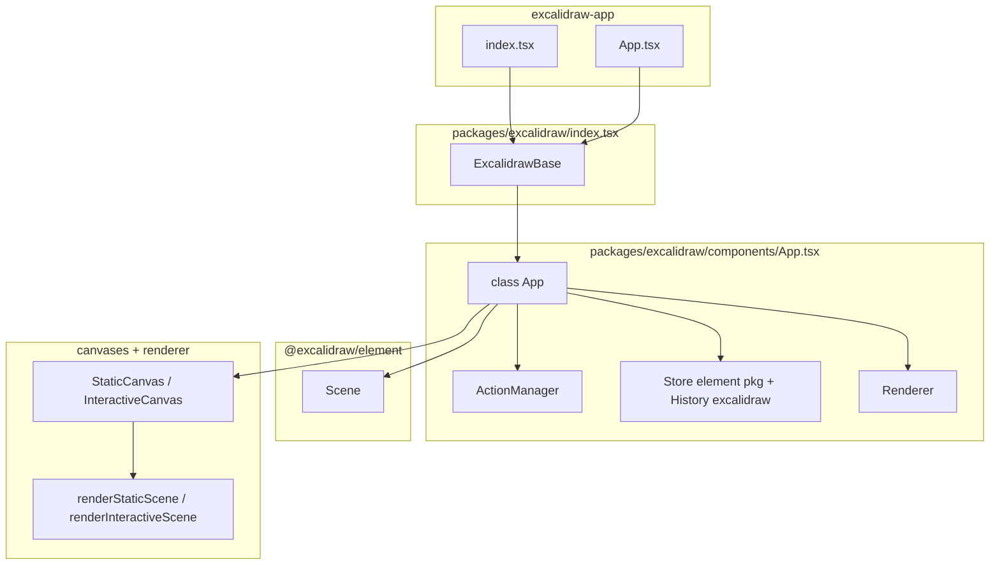
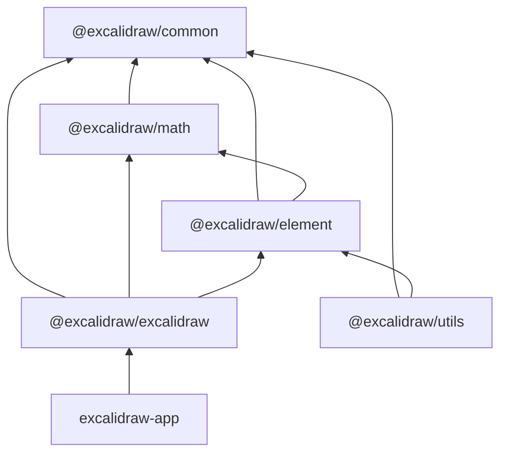

# Architecture (implementation-derived)

This document describes structure and control flow **as implemented** in this repository. Claims cite concrete paths. Items **not verified** from code are omitted or labeled.

---

## 1. High-level architecture

### Overview

The repository is a **Yarn workspaces monorepo** (`package.json`: `workspaces`: `excalidraw-app`, `packages/*`, `examples/*`). The shippable browser product is the **`excalidraw-app`** Vite application; the drawable editor implementation lives primarily in **`@excalidraw/excalidraw`**, with shared geometry/scene logic in **`@excalidraw/element`**, **`@excalidraw/math`**, and **`@excalidraw/common`**. Export helpers also surface from **`@excalidraw/utils`**, which `packages/excalidraw` imports (e.g. `packages/excalidraw/index.tsx` re-exports from `@excalidraw/utils/export`).

### Layers (by responsibility)

| Layer | Role | Evidence |
|-------|------|----------|
| **Host shell** | Mounts the editor, wires collaboration, persistence, env-driven backends | `excalidraw-app/index.tsx`, `excalidraw-app/App.tsx` |
| **Embed API** | `Excalidraw` / `ExcalidrawAPIProvider` React wrapper | `packages/excalidraw/index.tsx` (`ExcalidrawBase`, `EditorJotaiProvider`) |
| **Editor core (class `App`)** | React `Component` owning `AppState`, `Scene`, `Store`, `History`, `ActionManager`, canvases | `packages/excalidraw/components/App.tsx` (constructor ~786–852) |
| **Command layer** | `Action` objects + `ActionManager` dispatching to `syncActionResult` | `packages/excalidraw/actions/manager.tsx`, `packages/excalidraw/actions/types.ts` |
| **Domain / scene** | Ordered elements map, mutations, selection, indices | `packages/element/src/Scene.ts`, `packages/element/src/store.ts` |
| **Undo / incremental model** | `Store` schedules capture; `History` listens | `packages/element/src/store.ts` (`CaptureUpdateAction`, `scheduleMicroAction`), `packages/excalidraw/history` (imported in `App.tsx`) |
| **Rendering** | Two canvases: static scene + interactive overlays; RoughJS + 2D canvas | `packages/excalidraw/components/canvases/StaticCanvas.tsx`, `InteractiveCanvas.tsx`; `packages/excalidraw/renderer/staticScene.ts`, `interactiveScene.ts` |
| **Cross-cutting UI state (atoms)** | Jotai scoped for editor chrome | `packages/excalidraw/editor-jotai.ts`; host uses `excalidraw-app/app-jotai.ts` |

### Bootstrap

1. **Host**: `excalidraw-app/index.tsx` creates the React root, registers the PWA service worker, imports `sentry` side-effect, renders `ExcalidrawApp` from `excalidraw-app/App.tsx`.
2. **Library**: `packages/excalidraw/index.tsx` runs `polyfill()`, wraps children in `EditorJotaiProvider`, and renders `InitializeApp` → **`App`** from `packages/excalidraw/components/App.tsx` with props (`initialData`, `onChange`, etc.).

**Evidence**: `excalidraw-app/index.tsx`; `packages/excalidraw/index.tsx` (imports `App`, `InitializeApp`, `EditorJotaiProvider`).

### Separation: UI, state, actions, rendering

- **`AppState`** is **React state** on class `App` (`this.state`), initialized from `getDefaultAppState()` merged with props (`packages/excalidraw/components/App.tsx` constructor ~799–812).
- **Elements** live in **`Scene`** (`this.scene = new Scene()`), not in React state directly; updates go through `scene.replaceAllElements` / mutations (`packages/excalidraw/components/App.tsx` ~825–826, `syncActionResult` ~2745–2747).
- **Actions** are pure/command objects: `perform(elements, appState, value, app) → ActionResult` (`packages/excalidraw/actions/types.ts` ~35–40, ~162–180). Registration uses **`register()`** appending to a module-level array (`packages/excalidraw/actions/register.ts`); `App` calls `this.actionManager.registerAll(actions)` where `actions` is imported from that module (`packages/excalidraw/components/App.tsx` ~341–343, ~843).
- **Rendering** is split: **React** composes `LayerUI`, toolbars, dialogs; **canvas** draws via `renderStaticScene` / `renderInteractiveScene` inside `useEffect` in canvas components (`packages/excalidraw/components/canvases/StaticCanvas.tsx` ~59–71).

### Integration boundaries

- **Host ↔ package**: props/callbacks on `<Excalidraw />` (`packages/excalidraw/index.tsx` destructures `onChange`, `initialData`, …); imperative API via `createExcalidrawAPI()` from `App` (`packages/excalidraw/components/App.tsx` ~851).
- **`@excalidraw/element` ↔ `@excalidraw/excalidraw`**: `Scene` imports `AppState` from `../../excalidraw/types` (`packages/element/src/Scene.ts` ~43) — **tight type coupling** between element package and excalidraw types.

### Mermaid — runtime building blocks

**What each box represents**

- **host**: Vite app shell; **not** the editor implementation.
- **embed**: Public React entry (`ExcalidrawBase` inside `EditorJotaiProvider` in `packages/excalidraw/index.tsx`).
- **core `App`**: Central coordinator: React lifecycle, `actionManager`, `scene`, `Store` from `@excalidraw/element` (`packages/element/src/store.ts`), `History` from `packages/excalidraw/history` (`import { History } from "../history"` in `App.tsx` ~361), `Renderer` for visibility culling memo.
- **`Scene`**: Holds ordered elements and mutation APIs consumed by `App` (`packages/element/src/Scene.ts`).
- **canvases + renderer**: Imperative 2D drawing paths triggered after React commits (`packages/excalidraw/components/canvases/*`, `packages/excalidraw/renderer/*`).

**Relationships**

- **Direct code dependencies**: `App` imports `Scene`, `Store`, `CaptureUpdateAction` from `@excalidraw/element` (`packages/excalidraw/components/App.tsx` ~234–236). Canvas components import renderer functions (`packages/excalidraw/components/canvases/StaticCanvas.tsx` ~11).
- **Runtime interaction**: `ActionManager.executeAction` → `syncActionResult` → `scene.replaceAllElements` / `setState` (see §3). `updateScene` may call `store.scheduleMicroAction` then `setState` / `scene.replaceAllElements` (`packages/excalidraw/components/App.tsx` ~4532–4578).

---

## 2. Data flow

### Where input enters

- **Pointer / keyboard on canvas**: `App` attaches handlers such as `onPointerDown` → `handleCanvasPointerDown` (`packages/excalidraw/components/App.tsx` grep ~2043+).
- **Keyboard shortcuts**: `ActionManager.handleKeyDown` matches `keyTest` on registered actions (`packages/excalidraw/actions/manager.tsx` ~89–129) and calls `perform` → `updater` (same file ~126–128).
- **Commands / API**: `actionManager.executeAction(action, source, value)` (`packages/excalidraw/actions/manager.tsx` ~132–143).
- **Host-driven updates**: `updateScene({ elements, appState, captureUpdate })` on `App` (`packages/excalidraw/components/App.tsx` ~4532–4579); `excalidraw-app/App.tsx` passes `onChange` and uses `excalidrawAPI.updateScene` in several effects (host file).

### Transformation pipeline

1. **Action path**: `perform` returns **`ActionResult`** (`elements?`, `appState?`, `files?`, `captureUpdate`) (`packages/excalidraw/actions/types.ts` ~25–32).
2. **`ActionManager.updater`** forwards to **`syncActionResult`** (constructor in `packages/excalidraw/components/App.tsx` ~819–823).
3. **`syncActionResult`** (`packages/excalidraw/components/App.tsx` ~2735–2816):
   - Calls `this.store.scheduleAction(actionResult.captureUpdate)` (~2740).
   - If `elements` present: `this.scene.replaceAllElements(actionResult.elements)` (~2745–2747).
   - If `appState` present: `this.setState` merge (~2791–2808).
   - If nothing changed scene: `this.scene.triggerUpdate()` (~2813–2815).

### `updateScene` path (non-action)

- **`updateScene`** (`packages/excalidraw/components/App.tsx` ~4532–4579): optionally `store.scheduleMicroAction` with `elements`/`appState`, then `setState` for `appState`, `scene.replaceAllElements` for `elements`, `setState` for `collaborators`.

### Serialization boundaries

- **File / JSON / clipboard**: `packages/excalidraw/data/*` (imported from `App.tsx` e.g. `restoreElements`, `restoreAppState` ~359).
- **Host persistence**: `excalidraw-app/data/LocalData.ts`, `importFromLocalStorage` — used from `excalidraw-app/App.tsx` (not the core package).

### Flow distinction

- **User interaction**: pointer/keyboard → handlers → often `executeAction` or direct `updateScene` / `syncActionResult`.
- **Internal action flow**: `register` → `actions` array → `registerAll` → `executeAction` / `handleKeyDown` / `renderAction` (UI panels).
- **Render-triggering**: `setState` (React re-render) and/or `scene.triggerUpdate()` → canvas `useEffect` runs `renderStaticScene` (`packages/excalidraw/components/canvases/StaticCanvas.tsx` ~44–72).

---

## 3. State management

### `appState`

- **What it is**: Type `AppState` in `packages/excalidraw/types.ts` (large object: tool, selection, zoom, scroll, UI flags, theme, etc.). React **`App.state`** holds the live instance (`packages/excalidraw/components/App.tsx` constructor assigns `this.state = { ...defaultAppState, ... }` ~799–812).
- **Creation / update**: Initial merge with `getDefaultAppState()`; updates via `setState` inside `syncActionResult`, `updateScene`, and many handlers.
- **Immutability**: Patches merged in `setState` callbacks (e.g. `syncActionResult` ~2791–2807); action results carry **partial** `appState`.
- **Persistence vs ephemeral**: **Not fully enumerated here**; host passes `initialData` and `onChange` (`packages/excalidraw/index.tsx` props). `clearAppStateForLocalStorage` etc. appear in data layer (`packages/excalidraw/data` — referenced from persistence docs in `LocalData` host only for app).

### `elements`

- **Domain meaning**: `ExcalidrawElement` union and ordered variants (`@excalidraw/element/types`). Scene holds **ordered** elements including deleted ones where applicable (`Scene` in `packages/element/src/Scene.ts`).
- **Source of truth**: **`Scene`** inside `App` (`this.scene`), updated via `replaceAllElements`, `mutateElement` (`packages/excalidraw/components/App.tsx` `mutateElement` delegates to `this.scene.mutateElement` ~4603–4611).
- **Ordering / indices**: `syncInvalidIndices`, `validateFractionalIndices` used from `Scene` (`packages/element/src/Scene.ts` imports ~16–19).
- **Rendering participation**: `Renderer.getRenderableElements` filters and memoizes (`packages/excalidraw/scene/Renderer.ts` ~26–96); static canvas receives `elementsMap`, `visibleElements`.

### `actionManager`

- **Initialization**: `new ActionManager(this.syncActionResult, () => this.state, () => this.scene.getElementsIncludingDeleted(), this)` (`packages/excalidraw/components/App.tsx` ~819–824).
- **Registration**: `this.actionManager.registerAll(actions)` where `actions` is the mutable array populated by **`register()`** in action modules (`packages/excalidraw/actions/register.ts`); plus `createUndoAction` / `createRedoAction` (`packages/excalidraw/components/App.tsx` ~843–845).
- **Responsibilities**:
  - **`executeAction`**: resolve `perform` → `updater` (`packages/excalidraw/actions/manager.tsx` ~132–143).
  - **`handleKeyDown`**: pick single matching action, respect `viewMode` (`packages/excalidraw/actions/manager.tsx` ~89–129).
  - **`renderAction`**: mount `PanelComponent` for toolbar UI (`packages/excalidraw/actions/manager.tsx` ~148–190).
- **Undo/redo**: Implemented as **`Action`** instances from `createUndoAction` / `createRedoAction` (`packages/excalidraw/actions/actionHistory.ts` — imported in `App.tsx` ~337), not separate controller methods on `ActionManager`.

### `Store` (element package)

- **Role**: Coordinates **capture** of element + app-state deltas for **history** (`Store` class `packages/element/src/store.ts`; `scheduleAction`, `scheduleMicroAction` ~101–112). Distinct from React `AppState` — it snapshots **observed** state for increments.

### Relationship summary

| Concern | Primary owner |
|--------|----------------|
| Tooling, selection, viewport, dialogs | `AppState` (React) |
| Geometry, z-order, element graph | `Scene` elements |
| Undo granularity / deltas | `Store` + `History` |
| User commands | `Action` + `ActionManager` → `syncActionResult` |

**Evidence**: `packages/excalidraw/components/App.tsx` (constructor, `syncActionResult`, `updateScene`); `packages/excalidraw/actions/manager.tsx`; `packages/element/src/store.ts`.

---

## 4. Rendering pipeline

### Overview

**React `App.render`** composes **`LayerUI`**, canvas wrappers, and passes `appState` slices. **Canvas components** run **`useEffect`** that call imperative render functions — **not** React reconciliation of drawing primitives.

### Path: React → canvas

1. **`App`** renders `StaticCanvas`, `InteractiveCanvas`, `NewElementCanvas` with props derived from `this.state` and `this.scene` (`packages/excalidraw/components/App.tsx` ~2295–2347 region per grep).
2. **`StaticCanvas`**: `useEffect` calls **`renderStaticScene({ canvas, rc, elementsMap, visibleElements, appState, renderConfig, ... }, throttleFlag)`** (`packages/excalidraw/components/canvases/StaticCanvas.tsx` ~59–71).
3. **`InteractiveCanvas`**: imports **`renderInteractiveScene`** from `packages/excalidraw/renderer/interactiveScene.ts` (`packages/excalidraw/components/canvases/InteractiveCanvas.tsx` ~24).
4. **`staticScene.ts`**: draws grid, elements via **`renderElement`** from `@excalidraw/element` (`packages/excalidraw/renderer/staticScene.ts` ~21, ~11).

### Intermediate abstractions

- **`Renderer` (`packages/excalidraw/scene/Renderer.ts`)**: Computes **visible** / **renderable** element sets using viewport (`isElementInViewport` from `@excalidraw/element`).
- **`renderElement`**: Element-package entry for per-element draw (`packages/element/src/renderElement.ts` — imported by static renderer).
- **RoughJS**: `this.rc = rough.canvas(this.canvas)` in `App` constructor (`packages/excalidraw/components/App.tsx` ~827–828).

### Scheduling / batching

- **`withBatchedUpdates`** wraps `syncActionResult`, `updateScene`, etc. (`packages/excalidraw/components/App.tsx` ~2735, ~4532).
- **Static render**: `renderStaticSceneThrottled` imported in `Renderer` (`packages/excalidraw/scene/Renderer.ts` ~13); `StaticCanvas` passes `isRenderThrottlingEnabled()` (`packages/excalidraw/components/canvases/StaticCanvas.tsx` ~70).

### Multiple render paths

- **Static layer**: scene + grid + non-interactive visuals (`StaticCanvas` → `renderStaticScene`).
- **Interactive layer**: selection handles, drag UI (`InteractiveCanvas` → `renderInteractiveScene`).

**Evidence**: files cited above; `packages/excalidraw/renderer/interactiveScene.ts` (large file — selection rendering imports `renderSelectionElement` from `@excalidraw/element` ~47).

---

## 5. Package dependencies

### Major packages (from `package.json` + imports)

| Package | Responsibility | Declared deps (workspace `package.json`) |
|---------|----------------|------------------------------------------|
| `@excalidraw/common` | Constants, small utils, events | `tinycolor2` (`packages/common/package.json`) |
| `@excalidraw/math` | Vectors, curves | `@excalidraw/common` (`packages/math/package.json`) |
| `@excalidraw/element` | Scene, elements, bounds, render primitives | `@excalidraw/common`, `@excalidraw/math` (`packages/element/package.json`) |
| `@excalidraw/excalidraw` | Editor UI, actions, data, render orchestration | `@excalidraw/common`, `@excalidraw/element`, `@excalidraw/math`, React ecosystem, `roughjs`, etc. (`packages/excalidraw/package.json` ~80–117) |
| `@excalidraw/utils` | Export/to-canvas utilities | `packages/utils/package.json` lists `roughjs`, `pako`, etc.; **does not** list `@excalidraw/common` or `@excalidraw/element` — yet imports use them (`packages/utils/src/export.ts` `MIME_TYPES` from `@excalidraw/common`; `packages/utils/src/withinBounds.ts` from `@excalidraw/element`) |

**Note**: Source files under `packages/excalidraw` **import** `@excalidraw/utils/...` (`packages/excalidraw/index.tsx` re-exports from `@excalidraw/utils/export`, `@excalidraw/utils/withinBounds`). The **`exports`** field in `packages/excalidraw/package.json` exposes `./utils/*` typings for the published bundle layout.

### Layering

- **Foundational**: `@excalidraw/common`, `@excalidraw/math`.
- **Domain**: `@excalidraw/element` (depends up: common, math).
- **Application / UI**: `@excalidraw/excalidraw` (depends on element, math, common; uses utils for export).
- **Edge**: `excalidraw-app` depends on React, Firebase, socket.io, Sentry (`excalidraw-app/package.json`) and imports `@excalidraw/excalidraw` via Vite aliases (`excalidraw-app/vite.config.mts`).

### Mermaid — package dependency (declared + observed imports)

**Edges for `utils`**: Source imports (`packages/utils/src/export.ts`, `withinBounds.ts`, `shape.ts`, `index.ts`) — **not** from `dependencies` keys in `packages/utils/package.json` (see table above).

### Orchestration

- **`@excalidraw/excalidraw`** orchestrates **`@excalidraw/element`** (`Scene`, `Store`, rendering).
- **`excalidraw-app`** orchestrates networking/persistence around the embed (`excalidraw-app/App.tsx`, `excalidraw-app/collab/Collab.tsx`).

### Coupling notes

- **Type import** from `excalidraw` into `element` (`packages/element/src/Scene.ts` `AppState` from `../../excalidraw/types`) breaks strict one-way layering.
- **Path aliases** duplicate across `tsconfig.json`, `vitest.config.mts`, `excalidraw-app/vite.config.mts`.

---

## Evidence sources

### App bootstrap

- `excalidraw-app/index.tsx`
- `excalidraw-app/App.tsx`
- `packages/excalidraw/index.tsx`
- `packages/excalidraw/components/App.tsx` (constructor, render subtree imports)

### State management

- `packages/excalidraw/components/App.tsx` — `syncActionResult`, `updateScene`, `state`, `scene`, `store`, `history`
- `packages/excalidraw/types.ts` — `AppState` (consumed throughout)
- `packages/element/src/Scene.ts` — element container
- `packages/element/src/store.ts` — `CaptureUpdateAction`, `Store`

### Actions / command flow

- `packages/excalidraw/actions/register.ts` — `register`, exported `actions` array
- `packages/excalidraw/actions/manager.tsx` — `ActionManager`
- `packages/excalidraw/actions/types.ts` — `Action`, `ActionResult`
- `packages/excalidraw/components/App.tsx` — `actionManager.registerAll`, `executeAction` usage (grep)

### Rendering pipeline

- `packages/excalidraw/components/canvases/StaticCanvas.tsx`
- `packages/excalidraw/components/canvases/InteractiveCanvas.tsx`
- `packages/excalidraw/renderer/staticScene.ts`
- `packages/excalidraw/renderer/interactiveScene.ts`
- `packages/excalidraw/scene/Renderer.ts`

### Package / workspace mapping

- `package.json` (root workspaces)
- `packages/common/package.json`, `packages/math/package.json`, `packages/element/package.json`, `packages/excalidraw/package.json`
- `tsconfig.json` — `paths`
- `excalidraw-app/vite.config.mts` — `resolve.alias`

## Details
For detailed architecture → see `docs/technical/architecture.md`
For domain glossary → `see docs/product/domain-glossary.md`