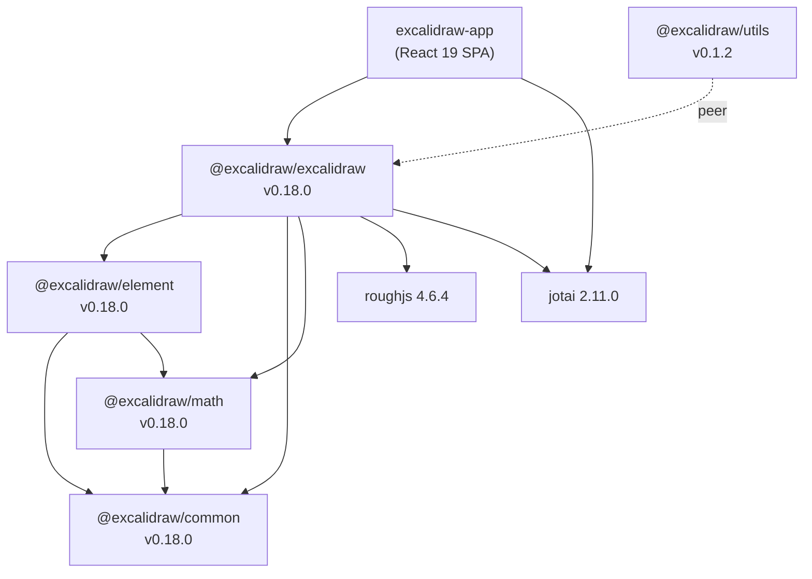
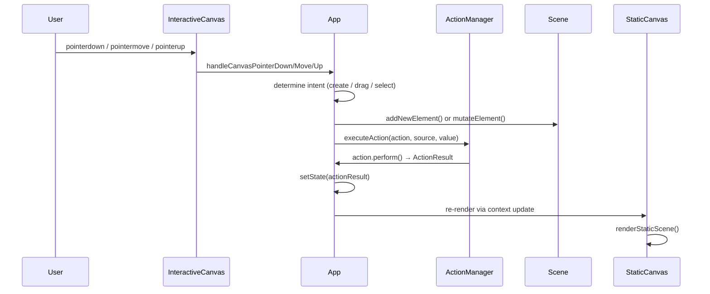
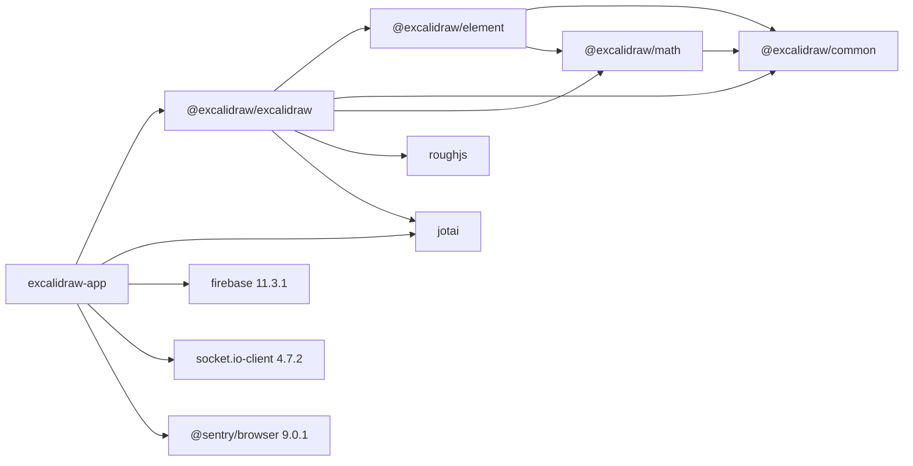

# Excalidraw — Technical Architecture

> All facts sourced directly from the repository source code.

---

## High-level Architecture

The project is a **Yarn Workspaces monorepo** (`package.json` → `workspaces: ["excalidraw-app", "packages/*", "examples/*"]`) with five publishable packages and one web application.



### Package Responsibilities

| Package | Entry Point | Role |
|---------|-------------|------|
| `excalidraw-app` | `excalidraw-app/index.tsx` | PWA shell, Firebase backend, Socket.IO collaboration |
| `@excalidraw/excalidraw` | `packages/excalidraw/index.tsx` | Core editor: React component, rendering, actions, state |
| `@excalidraw/element` | `packages/element/src/index.ts` | Element CRUD, Scene graph, bounds, bindings, rendering |
| `@excalidraw/common` | `packages/common/src/index.ts` | Constants, utilities, event bus, device detection |
| `@excalidraw/math` | `packages/math/src/index.ts` | Point, vector, geometry primitives |
| `@excalidraw/utils` | `packages/utils/src/index.ts` | Export helpers (`exportToCanvas`, `exportToBlob`, `exportToSvg`) |

---

## Data Flow

### Entry Point

`excalidraw-app/index.tsx` — creates a React root via `createRoot()`, registers the service worker, renders `<ExcalidrawApp />` inside `React.StrictMode`.

`excalidraw-app/App.tsx` — wraps the `<Excalidraw>` component with app-level concerns: Firebase sync, Socket.IO collaboration, library management, initial data loading.

### Event → State → Render cycle



### Keyboard path

`InteractiveCanvas.onKeyDown` → `ActionManager.handleKeyDown(event)` → finds matching action by `action.keyTest()` → calls `executeAction()` → same `setState` path as pointer events.

### Collaboration path

`excalidraw-app/App.tsx` uses `socket.io-client` (v4.7.2). Remote changes arrive as serialised element diffs, are reconciled via `packages/excalidraw/data/reconcile.ts`, then passed to `Excalidraw`'s `onChange` / `updateScene` API.

---

## State Management

### AppState

Defined as the `AppState` interface in `packages/excalidraw/types.ts`.
Default values produced by `getDefaultAppState()` in `packages/excalidraw/appState.ts` (≈130 lines).

Key property groups:

| Group | Examples |
|-------|---------|
| Canvas viewport | `scrollX`, `scrollY`, `zoom.value`, `width`, `height` |
| Active tool | `activeTool.type`, `activeTool.customType` |
| Selection | `selectedElementIds`, `hoveredElementIds`, `selectedGroupIds` |
| In-progress editing | `editingTextElement`, `editingGroupId`, `resizingElement`, `multiElement` |
| Stroke/fill defaults | `currentItemStrokeColor`, `currentItemBackgroundColor`, `currentItemOpacity`, `currentItemRoughness` |
| UI dialogs | `openDialog`, `openMenu`, `contextMenu`, `toast` |
| Features | `theme`, `viewModeEnabled`, `zenModeEnabled`, `gridModeEnabled` |
| Collaboration | `collaborators: Map<string, Collaborator>` |

### React Contexts

`packages/excalidraw/components/App.tsx` exposes state through nine React contexts (defined ~line 501–570):

```text
AppContext                   — App class instance (methods, refs)
AppPropsContext              — props passed to <Excalidraw>
EditorInterfaceContext       — device / form-factor info
ExcalidrawContainerContext   — container DOM ref
ExcalidrawElementsContext    — current elements array
ExcalidrawAppStateContext    — AppState object
ExcalidrawSetAppStateContext — setState callback
ExcalidrawAPIContext         — public imperative API
ExcalidrawAPISetContext      — API registration setter
```

Consumer hooks (`packages/excalidraw/hooks/`):

- `useAppStateValue<K>(prop)` — subscribe to a single AppState key, avoids unnecessary re-renders
- `useOnAppStateChange(selector, callback)` — side-effect listener with no re-render
- `useExcalidrawAPI()` — imperative API (exported publicly)
- `useExcalidrawStateValue()` — full appState snapshot (exported publicly)

### Jotai stores

Two isolated Jotai stores are created with `jotai-scope`:

| Store | File | Used for |
|-------|------|---------|
| `editorJotaiStore` | `packages/excalidraw/editor-jotai.ts` | Editor-scoped atoms (UI panels, dialogs, etc.) |
| `appJotaiStore` | `excalidraw-app/app-jotai.ts` | App-level atoms (collaboration, settings) |

The `EditorJotaiProvider` wraps the core `App` component; `appJotaiStore` wraps `<ExcalidrawApp>`.

### ActionManager

`packages/excalidraw/actions/manager.tsx` — `ActionManager` class:

```typescript
class ActionManager {
  actions: Record<ActionName, Action>
  updater: (result: ActionResult) => void   // bound to App.setState

  registerAction(action: Action): void
  handleKeyDown(event: KeyboardEvent): boolean
  executeAction(action, source, value): ActionResult | null
  renderAction(name: ActionName): JSX.Element
}
```

Actions registered in `packages/excalidraw/actions/register.ts` (100+ actions).
Each `Action` implements:

```typescript
interface Action {
  name: ActionName
  keyTest?: (event, appState, elements, app) => boolean
  perform(elements, appState, value, app): ActionResult
  // ActionResult = { elements?, appState?, commitToHistory?, captureUpdate? }
}
```

History is managed via `CaptureUpdateAction` (exported from `@excalidraw/element/src/store.ts`).

---

## Rendering Pipeline

### Two-canvas architecture

`App.render()` places two `<canvas>` elements on top of each other:

```text
┌─────────────────────────────┐  ← InteractiveCanvas (top, receives events)
│  selections, handles,        │
│  remote cursors, snap lines  │
├─────────────────────────────┤  ← StaticCanvas (bottom, read-only)
│  elements, grid, background  │
└─────────────────────────────┘
```

### StaticCanvas (`packages/excalidraw/components/canvases/StaticCanvas.tsx`)

On every render, a `useEffect` calls:

```text
renderStaticScene(config, throttle?)   ← packages/excalidraw/renderer/staticScene.ts
```

`renderStaticScene` order of operations:

1. Clear canvas, set `devicePixelRatio` transform
2. Draw background colour
3. Draw grid (if `gridModeEnabled`)
4. Iterate `visibleElements`, call `renderElement(element, rc, context, ...)`
5. Draw frame decorations

`renderElement` lives in `packages/element/src/renderElement.ts` and delegates to type-specific draw functions which use **RoughJS** (`rc.draw()`) for sketchy strokes.

### InteractiveCanvas (`packages/excalidraw/components/canvases/InteractiveCanvas.tsx`)

Calls `renderInteractiveScene(config)` from `packages/excalidraw/renderer/interactiveScene.ts`.

Renders (in order):

- Selection highlight boxes
- Resize / rotation handles
- Binding focus points
- Remote collaborator cursors (`appState.collaborators`)
- Snap alignment lines
- New element being drawn (`appState.newElement` / `appState.multiElement`)

### Element visibility filtering

`packages/excalidraw/scene/Renderer.ts` → `getRenderableElements()`:

- Filters by viewport bounds (`scrollX/Y + zoom`)
- Excludes elements inside collapsed frames
- Returns `{ elementsMap, visibleElements }` — **memoized**, recalculated only on viewport or element change

### NewElementCanvas

A third, smaller canvas renders the element currently being drawn in real time (pointer still held). It is separate to avoid triggering a full static scene re-render on every `pointermove`.

---

## Package Dependencies

### Dependency graph (runtime)



### What each package imports from its dependencies

**`@excalidraw/excalidraw` → `@excalidraw/element`**
`Scene`, `Store`, `CaptureUpdateAction`, `newElement`, `newTextElement`, `newArrowElement`, `mutateElement`, `newElementWith`, `isArrowElement`, `isTextElement`, `isFrameLikeElement`, `LinearElementEditor`, `renderElement`, `getElementBounds`, `bindOrUnbindBindingElements`

**`@excalidraw/excalidraw` → `@excalidraw/common`**
`CODES`, `KEYS`, `POINTER_BUTTON`, `THEME`, `ARROW_TYPE`, `MIME_TYPES`, `COLOR_PALETTE`, `debounce`, `throttle`, `viewportCoordsToSceneCoords`, `sceneCoordsToViewportCoords`, `AppEventBus`, `Emitter`

**`@excalidraw/element` → `@excalidraw/math`**
`pointDistance`, `pointRotateRads`, `vector`, `vectorNormalize`, `vectorDot`, `lineIntersectsLine`, `ellipse`, `polygon`, `rectangle`

**`@excalidraw/math` → `@excalidraw/common`**
`PRECISION`, shared numeric constants

### Notable external dependencies

| Dependency | Version | Used in | Purpose |
|------------|---------|---------|---------|
| `roughjs` | 4.6.4 | `@excalidraw/excalidraw` | Sketchy stroke rendering on canvas |
| `jotai` | 2.11.0 | `@excalidraw/excalidraw`, `excalidraw-app` | Scoped atom-based state |
| `react` | 19.0.0 (app) / peer 17+ (lib) | all | UI framework |
| `firebase` | 11.3.1 | `excalidraw-app` | Backend storage + auth |
| `socket.io-client` | 4.7.2 | `excalidraw-app` | Real-time collaboration |
| `tinycolor2` | 1.6.0 | `@excalidraw/common` | Colour manipulation |
| `pako` | — | `@excalidraw/utils` | gzip compression for export |
| `browser-fs-access` | 0.38.0 | `@excalidraw/utils` | File System Access API wrapper |
| `@sentry/browser` | 9.0.1 | `excalidraw-app` | Error tracking |

### Build system

Each package has its own `tsconfig.json` and builds to `dist/{prod,dev}/index.js` + `dist/types/`.
The root workspace uses Yarn 1.22.22 for hoisting and `packages/*/package.json` `exports` field for conditional resolution (`production` vs `development` builds).
