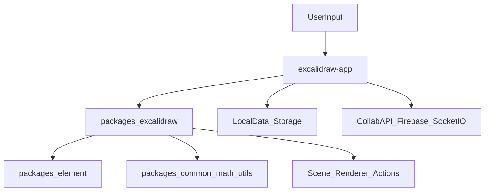

# Architecture

## High-level architecture

## Module boundaries
- `excalidraw-app/`
  - App composition, dialogs, collaboration wiring, startup/import/export orchestration.
- `packages/excalidraw/`
  - Main editor APIs, app state model, actions, scene operations, rendering integration.
- `packages/element/`
  - Element creation/mutation/bounds/selection/transform and related algorithms.
- `packages/common`, `packages/math`, `packages/utils`
  - Shared constants, utility primitives, geometry and helper functions.

## Data flow
1. User actions are handled by app/editor handlers.
2. Editor state transitions update `elements` + `appState`.
3. Persistence path writes to local storage and file storage.
4. Collaboration path syncs elements and binary files with remote backend.
5. Render path projects current scene state to canvas/UI.

## State management
- Core state buckets:
  - `elements`: scene entities.
  - `appState`: editor/UI/session state.
  - `files`: binary assets.
- State restoration is centralized through restore/reconcile utilities during init/import/collab attach.
- Some system updates intentionally bypass history capture (`CaptureUpdateAction.NEVER`) to avoid undo-noise from infrastructure writes.

## Rendering pipeline
- Excalidraw app shell mounts `<Excalidraw />` and provides callbacks (`onChange`, `onExport`, UI integrations).
- Scene edits trigger persistence/collaboration side effects through callback orchestration in app shell.
- Export path can wait on file readiness before final output generation.

## Package dependency intent
- App depends on editor package APIs and shared utilities.
- Editor depends on element engine + common/math utilities.
- Lower-level packages remain app-agnostic.

## Known risk zones
- Startup/import hash routing and collaboration attach flow.
- Multi-tab sync and visibility/focus event interactions.
- Export path when image/file states are still pending.

## Runtime mode matrix (operational)
- Non-collab + visible tab: normal local persistence/sync path.
- Non-collab + hidden/blurred tab: flush/defer behavior may apply, then sync on focus/visibility.
- Collab active: remote sync path is prioritized; local-only assumptions are unsafe.
- Import/share-link startup path: init logic may branch through confirmation/retry flows before scene settles.

## Must-preserve invariants
- System/persistence side effects should not pollute user undo history.
- Export should not finalize while required files are still pending.
- Cross-tab sync should remain version-aware to avoid stale overwrite.
- Hidden-tab startup/import edge handling must remain safe against data loss/regression.

## Related Docs
- [Memory Project Brief](../memory/projectBrief.md)
- [Memory System Patterns](../memory/systemPatterns.md)
- [Memory Decision Log](../memory/decisionLog.md)
- [Dev Setup](./dev-setup.md)
