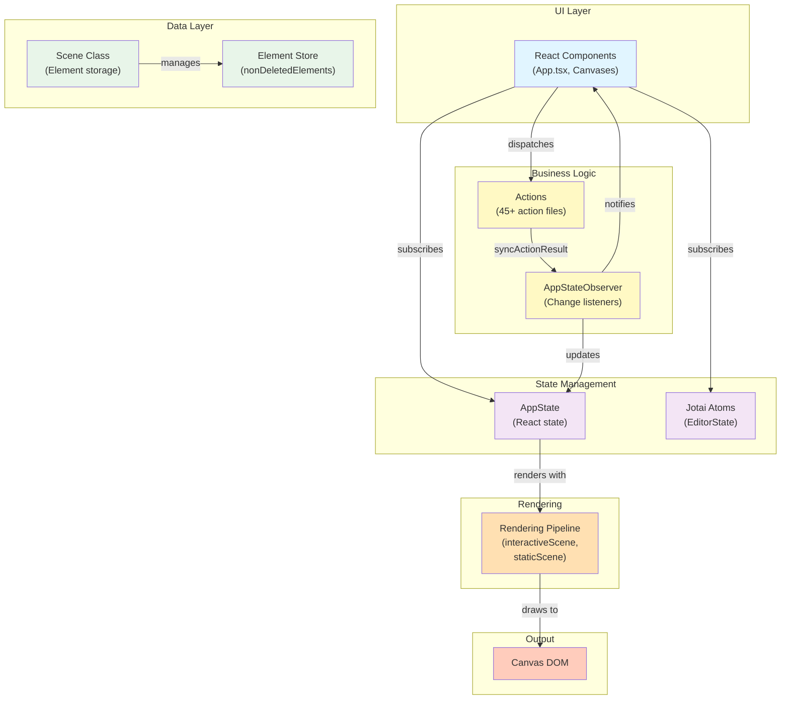

# Excalidraw Architecture

## High-Level Architecture

### System Layers



### Entry Points

**Web Application:** `/excalidraw-app/App.tsx`
- Orchestrates Excalidraw component
- Manages file persistence and collaboration
- Wraps with `Provider` from `app-jotai` for application state

**React Component Library:** `/packages/excalidraw/index.tsx`
- Exports `Excalidraw` memoized component
- Exports `ExcalidrawAPIProvider` context
- Wraps App with `EditorJotaiProvider` (line 170)
- Wraps App with `InitializeApp` for setup

**Core Editor:** `/packages/excalidraw/components/App.tsx` (12,818 lines)
- React class component extending `React.Component<AppProps, AppState>`
- Central hub for all business logic
- Instantiates `Scene` object for element management
- Creates `AppStateObserver` for state change subscriptions (line 676)
- Provides `ExcalidrawAPIContext` at lines 2129-2402

---

## Data Flow

### How AppState Flows to Components

**AppState Definition:** `/packages/excalidraw/types.ts` (lines 272-472)
- Interface containing 60+ properties organized into sections
- Tool state, selection, UI state, canvas state, collaboration state
- Held in `App.state` as React component state

**Distribution Methods:**
1. **Context API**: `ExcalidrawAPIContext` (line 557, App.tsx) - External component access
2. **useAppStateValue hook** (App.tsx line 576) - Subscribe to specific properties
3. **useOnAppStateChange hook** (App.tsx line 578) - Listener without component rerender
4. **AppStateObserver** (App.tsx line 676) - Tracks state changes for subscribers

### User Action → State Update Flow

**Action Registration:** `/packages/excalidraw/actions/register.ts`
```typescript
export const register = <TData extends any, T extends Action<TData>>(action: T) => {
  actions = actions.concat(action);
  return action;
}
```

**Action Flow:**
1. User interaction (pointer/keyboard/menu click)
2. Handler calls action from `/packages/excalidraw/actions/` directory (~45 files)
3. Action returns `ActionResult` (types.ts lines 25-33):
   - `elements?: readonly ExcalidrawElement[]` - Updated elements
   - `appState?: Partial<AppState>` - State changes
   - `files?: BinaryFiles` - Embedded files
   - `captureUpdate: CaptureUpdateActionType` - Update type
4. `syncActionResult()` processes result (App.tsx line 2735):
   - `this.scene.replaceAllElements(actionResult.elements)`
   - `this.setState(actionResult.appState)`
   - `this.appStateObserver.flush(prevState)` - Notify listeners

**Example:** Delete Selected Elements
- File: `/packages/excalidraw/actions/actionDeleteSelected.tsx`
- Action maps elements with `newElementWith(el, { isDeleted: true })`
- Returns `{ elements: [...], appState: { selectedElementIds: {} } }`

### Element Storage and Mutation

**Scene Class:** `/packages/element/src/Scene.ts`
- Manages element storage with two collections:
  - `nonDeletedElements`: Ordered array excluding deleted elements
  - `elements`: All elements including deleted (marked with `isDeleted: true`)
- Maintains dual indexing:
  - `nonDeletedElementsMap`: O(1) lookups
  - `elementsMap`: Full element access

**Element Update Operations:**
- `mutateElement(element, updates)` (Scene.ts line 245+) - In-place mutation
- `newElementWith(element, updates)` - Creates new immutable copy
- `replaceAllElements(elements)` - Batch replace (syncActionResult calls this)
- Elements use `version` and `versionNonce` for conflict detection in multiplayer

---

## State Management

### Jotai Atoms Organization

**Location:** `/packages/excalidraw/editor-jotai.ts` (18 lines)
- Creates scope-isolated Jotai context via `jotai-scope`
- Single store instance: `editorJotaiStore`
- Exports: `atom`, `useAtom`, `useSetAtom`, `useAtomValue`, `EditorJotaiProvider`
- Prevents atom conflicts with external Jotai instances

**Atom Usage Examples:**
- `libraryItemsAtom` - Library management state
- `editorLangCodeAtom` - Language selection
- `convertElementTypePopupAtom` - UI toggle state
- `commandPaletteAtom` - Command palette visibility

**EditorJotaiProvider Integration:**
- Wraps entire App at `/packages/excalidraw/index.tsx` line 170
- Enables multiple Excalidraw instances without state conflicts
- Used in `/excalidraw-app/App.tsx` for app-level state isolation

### AppState Structure

**Root State:** React class component state in App.tsx

**Key Sections** (from types.ts):

**View State:**
- `zoom: { value: number }` - Zoom level
- `scrollX, scrollY: number` - Viewport offset
- `viewModeEnabled: boolean` - Read-only mode

**Tool State:**
- `activeTool: ActiveTool` - Current drawing tool
- `currentItemBackgroundColor: string` - Fill color
- `currentItemStrokeColor: string` - Line color
- `currentItemStrokeWidth: number` - Line thickness

**Selection State:**
- `selectedElementIds: Record<string, true>` - Set-like map of selected IDs
- `editingGroupId: string | null` - Active group for editing

**UI State:**
- `openDialog: null | DialogType` - Open modal dialog
- `showStats: boolean` - Debug stats visibility
- `lastPointerDownWith: "mouse" | "touch" | "pen"` - Input type

**Collaboration State:**
- `collaborators: Record<SocketId, Collaborator>` - Active users
- `userToFollow: UserToFollow | null` - Following user

**Rendering State:**
- `viewBackgroundColor: string` - Canvas background
- `gridSize: number | null` - Grid spacing
- `theme: "light" | "dark"` - Theme selection

### State Observation Pattern

**AppStateObserver Class** (`/packages/excalidraw/components/AppStateObserver.ts`):
- Manages listener subscriptions with three modes:
  1. Property watch: `observer.onStateChange("zoom", callback)`
  2. Multiple properties: `observer.onStateChange(["x", "y"], callback)`
  3. Custom selector: `observer.onStateChange((state) => state.zoom.value, callback)`
- Batch notifications via `flush(prevState)` method
- Used for external state subscriptions without component rerender

---

## Rendering Pipeline

### React to Canvas Flow

**Render Cycle:**
1. **React Render** - App.tsx render() method
   - Returns JSX with canvas elements
   - Two main canvas components: InteractiveCanvas and StaticCanvas

2. **Canvas Components** (`/packages/excalidraw/components/canvases/`):
   - **InteractiveCanvas.tsx** (10,031 lines)
     - Renders interactive layer (selection, handles, snap guides)
     - Handles pointer and keyboard input
     - Updates on appState changes
   - **StaticCanvas.tsx** (4,328 lines)
     - Renders static scene background (elements)
     - Cached rendering for performance
   - **NewElementCanvas.tsx** (1,589 lines)
     - Preview of element being created

3. **Rendering Pipeline** (`/packages/excalidraw/renderer/`):
   - **interactiveScene.ts** (57,956 bytes)
     - Renders interactive overlays: selection boxes, transform handles, snap guides, binding highlights
     - Called on every frame during interaction
   - **staticScene.ts** (13,180 bytes)
     - Renders static elements with caching
     - Uses `shouldCacheIgnoreZoom` flag for optimization
   - **staticSvgScene.ts** (25,038 bytes)
     - SVG-based rendering for export functionality
   - **renderNewElementScene.ts** (2,352 bytes)
     - Preview rendering during element creation

### Canvas Layer Separation

**InteractiveCanvasAppState** (types.ts lines 215-249):
- Active tool, selection, editing state
- Linear element editor state
- Temporary state: binding, snapping, transform

**StaticCanvasAppState** (types.ts lines 197-213):
- Render settings, frame rendering, grid
- Cache invalidation flags

---

## Package Dependencies

### Monorepo Package Structure

**`@excalidraw/excalidraw`** - Main editor library
```
packages/excalidraw/
├── index.tsx              # Entry point, re-exports
├── components/            # UI components
│   ├── App.tsx           # Core editor (12,818 lines)
│   ├── canvases/         # Canvas rendering
│   ├── AppStateObserver.ts
│   └── ...
├── actions/              # ~45 action files
├── renderer/             # Rendering pipeline
├── hooks/                # Custom React hooks
├── handlers/             # Event handlers
├── data/                 # Serialization, storage
└── types.ts              # Public TypeScript API (33KB)
```

**`@excalidraw/element`** - Element models and utilities
```
packages/element/
├── src/types.ts          # Element definitions (15 types)
├── src/typeChecks.ts     # Type guards
├── src/Scene.ts          # Element storage class
├── src/bounds.ts         # Bounds calculations
└── src/textElement.ts    # Text utilities
```

**`@excalidraw/math`** - Mathematical operations
- Point operations, transformations
- Vector normalization, rotation
- Distance calculations

**`@excalidraw/common`** - Shared constants and types
- Theme constants, font families, size constants
- Utility types for TypeScript
- Helper functions (arrayToMap, updateActiveTool)

### Import Relationships

**From `@excalidraw/element`:**
```typescript
import {
  getNonDeletedElements,
  newElementWith,
  mutateElement,
  isArrowElement,
  LinearElementEditor,
} from "@excalidraw/element";
```

**From `@excalidraw/common`:**
```typescript
import {
  CODES, KEYS, TOOL_TYPE, THEME,
  updateActiveTool, arrayToMap,
} from "@excalidraw/common";
```

**From `@excalidraw/math`:**
```typescript
import {
  pointDistance, pointRotateRads,
  vectorNormalize,
} from "@excalidraw/math";
```

### Dependency Graph

```
@excalidraw/excalidraw (main)
├── @excalidraw/element
│   ├── @excalidraw/math
│   └── @excalidraw/common
├── @excalidraw/common
├── @excalidraw/math
└── @excalidraw/utils
    └── @excalidraw/element

excalidraw-app (web app)
├── @excalidraw/excalidraw
├── firebase 11.3.1
├── socket.io-client 4.7.2
├── jotai 2.11.0
└── react 19.0.10
```

### Barrel Exports

**`/packages/excalidraw/index.tsx` (lines 282-427):**
- Component exports: `Excalidraw`, `ExcalidrawAPIProvider`
- Hook exports: `useExcalidrawAPI`, `useExcalidrawStateValue`, `useOnExcalidrawStateChange`
- UI exports: `Sidebar`, `Button`, `Footer`, `MainMenu`, `CommandPalette`
- Re-exports element utilities and common constants

---

## Key Integration Points

**External Integration (Embedded Use):**
- `useExcalidrawAPI()` - Access to drawing API
- `api.onStateChange(callback)` - Subscribe to state changes
- `api.updateElement(elements)` - Update from host app
- `onChange` prop - Notify host of changes
- `onPointerUpdate` prop - Cursor position updates

**Collaboration (multiplayer):**
- Socket.io events for incremental updates
- Version-based reconciliation (version + versionNonce)
- Fractional indexing for insertion ordering
- AppState observer for state sync

**Persistence:**
- Storage adapters: localStorage, IndexedDB, Firebase
- Serialization via `serializeAsJSON()`
- Loading via `restoreElements()` with schema migration
- Library system for reusable elements
