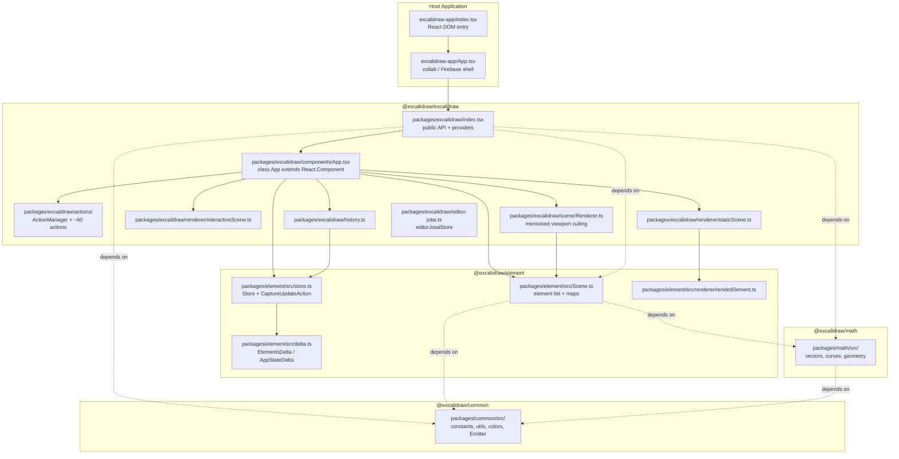
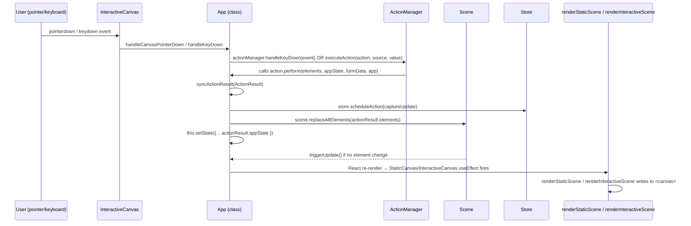
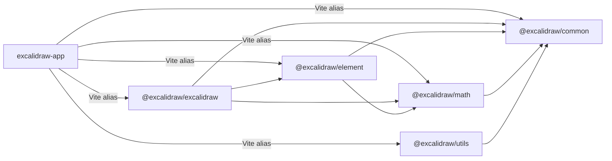

# Architecture

> Facts derived from source code only. Paths relative to repo root.

---

## High-level Architecture

The repository is an **Excalidraw monorepo** (`package.json` → `name: "excalidraw-monorepo"`) with four publishable packages and one host web application. Yarn workspaces are declared as `["excalidraw-app", "packages/*", "examples/*"]`.



**Dependency order (strictest to least):**
`@excalidraw/common` ← `@excalidraw/math` ← `@excalidraw/element` ← `@excalidraw/excalidraw` ← `excalidraw-app`

---

## Data Flow

### User Interaction → Canvas Update



### External API → Scene Update

`ExcalidrawImperativeAPI` (created via `createExcalidrawAPI` in `App.tsx`) exposes:
- `updateScene({ elements, appState, files, captureUpdate })` — calls `syncActionResult` internally
- `getSceneElements()`, `getAppState()` — direct reads from `scene` and `this.state`
- `scrollToContent()`, `resetScene()`, `exportToBlob()`, etc.

### Collaboration Data Path

`excalidraw-app/collab/` connects via `socket.io-client`. Remote updates arrive as serialised element arrays and are applied with `captureUpdate: CaptureUpdateAction.NEVER` so they do not enter the local undo stack.

---

## State Management

The editor uses **three distinct state stores**, each with a different scope and semantics.

### 1. AppState — React component state

- **Location:** `packages/excalidraw/appState.ts`
- **Initialiser:** `getDefaultAppState()` — returns the full `AppState` object
- **Owner:** `class App extends React.Component<AppProps, AppState>` in `packages/excalidraw/components/App.tsx`
- **Contents:** current tool, viewport (`scrollX`, `scrollY`, `zoom`), selection, theme, open dialogs, `newElement` in progress, grid/snap settings, collaboration cursor map, etc.
- **Mutations:** only via `this.setState(...)` inside `App` methods, or through `syncActionResult` which merges `actionResult.appState` into the existing state.

Two narrower subtypes are used for read-only passes:
- `StaticCanvasAppState` — passed to `renderStaticScene`
- `UIAppState` — passed to UI components

### 2. Scene — element list

- **Location:** `packages/element/src/Scene.ts`
- **Singleton per editor:** instantiated as `this.scene = new Scene()` in `App` constructor (line 825)
- **Responsibilities:**
  - Holds `OrderedExcalidrawElement[]` as the single source of truth for all elements
  - Maintains `SceneElementsMap` (id → element) for O(1) lookups
  - Exposes `replaceAllElements(elements)` for wholesale replacement
  - Emits `triggerUpdate()` to invalidate the render pipeline
  - Provides `getVisibleElements(viewport)` for culling

### 3. Store — history/undo semantics

- **Location:** `packages/element/src/store.ts`
- **Instantiation:** `this.store = new Store(this)` in `App` constructor (line 832)
- **Core concept:** `CaptureUpdateAction` enum controls which changes enter history:

  | Value | Semantics | Typical use |
  |-------|-----------|-------------|
  | `IMMEDIATELY` | Written to undo stack at once | Finalised element mutations |
  | `EVENTUALLY` | Deferred until next IMMEDIATELY | Mid-gesture async steps |
  | `NEVER` | Not recorded | Remote/collab updates, init |

- **Increments:** emits `DurableIncrement` events via `onDurableIncrementEmitter: Emitter<[DurableIncrement]>`
- **Delta types:** `ElementsDelta` and `AppStateDelta` (in `packages/element/src/delta.ts`) capture the before/after diff used by History.

### 4. History — undo/redo

- **Location:** `packages/excalidraw/history.ts`
- **Instantiation:** `this.history = new History(this.store)` in `App` constructor (line 833)
- Consumes `DurableIncrement` from `Store` and maintains undo/redo stacks of `StoreDelta` snapshots.
- Exposed to `ActionManager` via `createUndoAction(this.history)` and `createRedoAction(this.history)` registered actions.

### 5. Jotai atoms — cross-cutting UI state

Two separate Jotai stores exist:

| Store | File | Scope |
|-------|------|-------|
| `editorJotaiStore` | `packages/excalidraw/editor-jotai.ts` | Wraps the entire `<App />` tree via `<EditorJotaiProvider>` in `packages/excalidraw/index.tsx` |
| `appJotaiStore` | `excalidraw-app/app-jotai.ts` | Host application: collab UI, share dialog, storage quotas |

`App` writes to `editorJotaiStore` directly via `this.updateEditorAtom(atom, ...args)` (lines 854–861 in `App.tsx`).

### 6. ActionManager — command dispatch

- **Location:** `packages/excalidraw/actions/manager.tsx`
- **Class:** `ActionManager` with `actions: Record<ActionName, Action>`
- **Constructor parameters:** `updater` (→ `syncActionResult`), `getAppState`, `getElementsIncludingDeleted`, `app`
- **`executeAction(action, source, value)`** — calls `action.perform(elements, appState, formData, app)`, tracks analytics, passes result to `updater`
- Actions are registered in bulk via `this.actionManager.registerAll(actions)` (line 843) where `actions` comes from `packages/excalidraw/actions/index.ts`

`ActionName` union type lists ~80 named actions (from `types.ts`): `copy`, `cut`, `paste`, `sendBackward`, `bringForward`, `undo`, `redo`, `changeStrokeColor`, `changeFontSize`, etc.

`ActionSource` distinguishes the caller: `"ui" | "keyboard" | "contextMenu" | "api" | "commandPalette"`.

---

## Rendering Pipeline

The editor uses **two separate `<canvas>` elements** that are layered on top of each other:

```
┌──────────────────────────────────────────────┐
│  InteractiveCanvas  (top, pointer events)    │  selection handles, remote cursors, snap guides
├──────────────────────────────────────────────┤
│  NewElementCanvas   (shown during creation)  │  in-progress stroke while appState.newElement set
├──────────────────────────────────────────────┤
│  StaticCanvas       (bottom, Rough.js)       │  all committed elements
└──────────────────────────────────────────────┘
```

### Step 1 — App constructor initialises canvases

```827:829:packages/excalidraw/components/App.tsx
    this.canvas = document.createElement("canvas");
    this.rc = rough.canvas(this.canvas);
    this.renderer = new Renderer(this.scene);
```

`this.canvas` is the static layer DOM node; `this.rc` is the Rough.js wrapper. `Renderer` (`packages/excalidraw/scene/Renderer.ts`) provides memoised viewport-culled element lists.

### Step 2 — React renders three canvas components

From `App.render()` (around line 2295):
- `<StaticCanvas canvas={this.canvas} rc={this.rc} elementsMap={...} visibleElements={...} ... />`
- `{appState.newElement && <NewElementCanvas ... />}`
- `<InteractiveCanvas app={this} onPointerDown={this.handleCanvasPointerDown} ... />`

All three are **React function components** that receive state as props but draw imperatively into canvas contexts.

### Step 3 — StaticCanvas effect → renderStaticScene

`packages/excalidraw/components/canvases/StaticCanvas.tsx`:
- `useEffect` resizes the canvas element and injects the DOM node into the container div.
- Calls `renderStaticScene({ canvas, rc, elementsMap, visibleElements, appState, scale, ... })` from `packages/excalidraw/renderer/staticScene.ts`.

`staticScene.ts` pipeline:
1. `bootstrapCanvas(canvas, scale, normalizedWidth, normalizedHeight)` — resize + clear
2. Apply `scrollX`/`scrollY` viewport transform
3. Optionally draw grid lines
4. For each visible element: call `renderElement(element, elementsMap, rc, canvas, renderConfig)` from `packages/element/src/renderer/renderElement.ts`
5. Draw frame labels and link icons

### Step 4 — renderElement (element → Rough.js / ctx)

`packages/element/src/renderer/renderElement.ts` dispatches by element type:
- **Rectangle, diamond, ellipse** → `renderShapeToCanvas` via Rough.js generator
- **Text** → `fillText` on the 2D context
- **Freedraw** → SVG path converted to ctx commands
- **Image** → `ctx.drawImage` with optional dark-mode filter
- **Iframe/embeddable** → placeholder label rendered as text

### Step 5 — InteractiveCanvas → renderInteractiveScene

`packages/excalidraw/components/canvases/InteractiveCanvas.tsx`:
- `useEffect` builds `rendererParams` and calls `renderInteractiveScene(rendererParams)` from `packages/excalidraw/renderer/interactiveScene.ts`.
- Uses `AnimationController` for continuous RAF-based updates when animations are active.

`interactiveScene.ts` draws (on top of static layer):
- Selection bounding boxes and resize/rotation handles
- Remote collaboration cursors and usernames
- Snap guidelines and distance labels
- Element link handles

### Step 6 — Throttling

`packages/excalidraw/scene/Renderer.ts` wraps `renderStaticScene` with `throttleRAF` (from `@excalidraw/common`) to avoid redundant frames when multiple state updates arrive in the same animation frame.

---

## Package Dependencies

### Dependency Graph



`excalidraw-app` does **not** list `@excalidraw/*` in its `package.json` dependencies. Instead `excalidraw-app/vite.config.mts` maps each package alias to its local `packages/*/src` path, so the app always runs against workspace source.

### Per-package summary

| Package | Key external deps | Internal deps |
|---------|-------------------|---------------|
| `@excalidraw/common` | `tinycolor2` | — |
| `@excalidraw/math` | — | `@excalidraw/common` |
| `@excalidraw/element` | — | `@excalidraw/common`, `@excalidraw/math` |
| `@excalidraw/excalidraw` | `roughjs`, `jotai`, `@radix-ui/*`, `codemirror` | `@excalidraw/common`, `@excalidraw/element`, `@excalidraw/math` |
| `@excalidraw/utils` | `roughjs`, `pako`, `sanitize-url` | `@excalidraw/common` |
| `excalidraw-app` | `react 19`, `firebase`, `socket.io-client`, `idb-keyval`, `jotai` | all packages via Vite alias |

### Key cross-package boundaries

- `packages/element/src/store.ts` imports `App` type from `@excalidraw/excalidraw/components/App` (type-only, no runtime cycle).
- `packages/excalidraw/renderer/staticScene.ts` imports `renderElement` from `@excalidraw/element` — the only call site that crosses the rendering boundary between packages.
- `packages/excalidraw/history.ts` consumes `Store` and `StoreDelta` from `@excalidraw/element`; it does **not** hold element data directly.
- `excalidraw-app/collab/` imports `CaptureUpdateAction` from `@excalidraw/element` to mark remote updates as `NEVER`.
