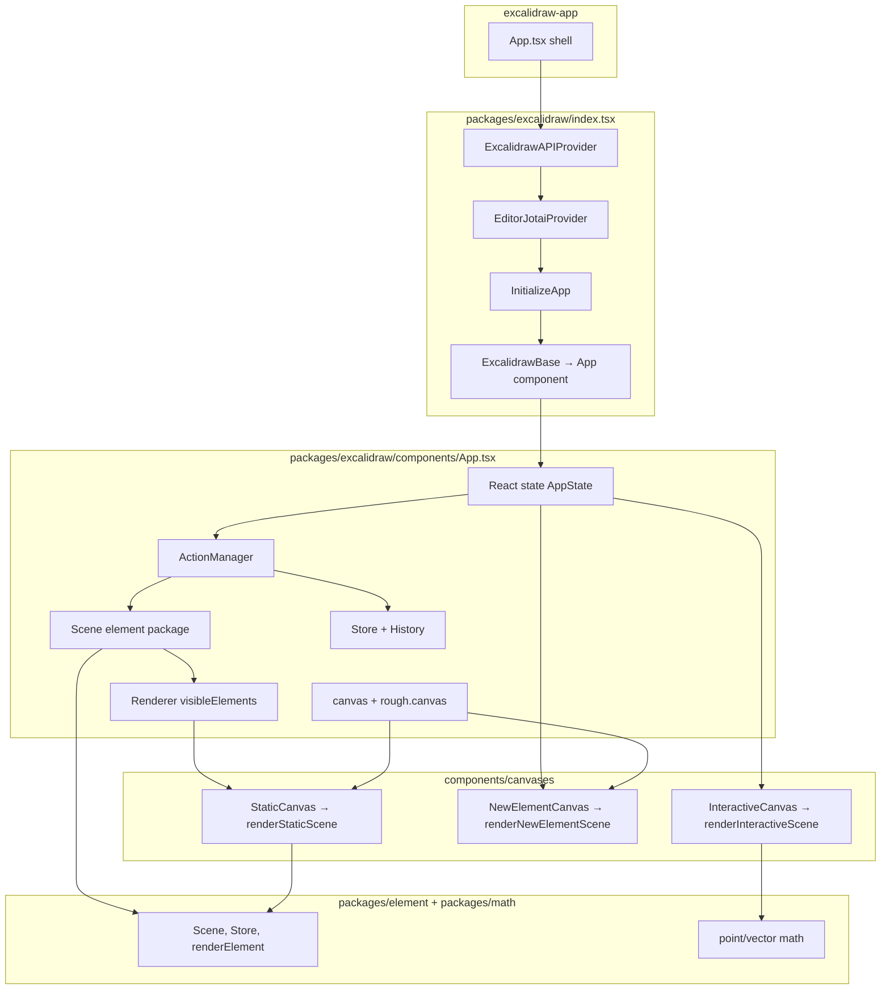

# Architecture (`@excalidraw/*` monorepo)

This document describes structure **as implemented in source**. Section notes reference concrete modules.

---

## High-level architecture

The hosted product (`excalidraw-app`) renders the **`Excalidraw` React wrapper** from `packages/excalidraw/index.tsx`, which wraps the class-based editor **`App`** (`packages/excalidraw/components/App.tsx`). The editor owns a **`Scene`** (`packages/element/src/Scene.ts`) for elements, **React `state` typed as `AppState`**, a **`Store`** (`packages/element/src/store.ts`) for undoable deltas, **`History`** (`packages/excalidraw/history.ts`), **`ActionManager`** (`packages/excalidraw/actions/manager.tsx`), **`Renderer`** (`packages/excalidraw/scene/Renderer.ts`), and DOM **`canvas`** elements driven by **`StaticCanvas`**, **`NewElementCanvas`**, and **`InteractiveCanvas`** under `packages/excalidraw/components/canvases/`.

---

## Data flow

### 1. User intent → action result

- **`ActionManager`** is constructed with an **`updater`** callback that forwards **`ActionResult`** (or a `Promise` thereof) to that callback (`packages/excalidraw/actions/manager.tsx`).
- For keyboard shortcuts, **`handleKeyDown`** picks at most one matching action (sorted by `keyPriority`), then calls **`this.updater(action.perform(...))`** with current elements and `AppState` (`manager.tsx`).
- **`executeAction`** and **`renderAction`**’s `updateData` path similarly call **`action.perform(elements, appState, value, app)`** and pass the result to **`this.updater`** (`manager.tsx`).
- In **`App`’s** constructor, the **`updater`** passed to **`ActionManager`** is **`this.syncActionResult`** (`packages/excalidraw/components/App.tsx`).

### 2. `ActionResult` → scene + React state

**`syncActionResult`** (wrapped with **`withBatchedUpdates`**) processes **`ActionResult`** (`packages/excalidraw/components/App.tsx`):

1. **`this.store.scheduleAction(actionResult.captureUpdate)`** — schedules how the change participates in **`Store.commit`** / history (`store.ts` documents `CaptureUpdateAction` values: `IMMEDIATELY`, `NEVER`, `EVENTUALLY`).
2. If **`actionResult.elements`** is set: **`this.scene.replaceAllElements(actionResult.elements)`** — rebuilds internal maps, non-deleted projections, frame lists, then **`triggerUpdate()`** (`Scene.ts`).
3. If **`actionResult.files`** is set: **`addMissingFiles`** / **`addNewImagesToImageCache`** (App).
4. If **`actionResult.appState`** (or related UI fields) is set: **`this.setState`** merges **`actionResult.appState`** into previous `AppState` with guarded fields (`viewModeEnabled`, `zenModeEnabled`, `theme`, `name`, `errorMessage`, `editingTextElement`, etc.).
5. If nothing marked `didUpdate`, **`this.scene.triggerUpdate()`** is still invoked to nudge subscribers.

**`ActionResult` shape** is defined in **`packages/excalidraw/actions/types.ts`**: optional `elements`, `appState`, `files`, required `captureUpdate`, optional `replaceFiles`; or `false` to no-op.

### 3. Scene update → React render cycle

- **`Scene.replaceAllElements`** assigns **`this.elements`**, refreshes **`elementsMap`**, **`nonDeletedElements`**, **`nonDeletedElementsMap`**, frame-derived arrays, increments **`sceneNonce`** via **`triggerUpdate`**, and notifies registered callbacks (`Scene.ts`).
- **`App.componentDidUpdate`** reads **`this.scene.getElementsIncludingDeleted()`** and **`getElementsMapIncludingDeleted()`**, runs observers and side effects, then calls **`this.store.commit(elementsMap, this.state)`** (`App.tsx`). That **`commit`** flushes scheduled micro-actions and applies the scheduled macro **`CaptureUpdateAction`**, emitting store increments used by **`History`** (`store.ts`, `history.ts`).
- When not loading, **`onChange`** and **`onChangeEmitter`** receive **elements** and **`AppState`** (`App.tsx`).

### 4. Outbound / host integration

- **`excalidraw-app`** composes **`Excalidraw`** with props and extra UI (collaboration, share dialogs) using the imperative API and package exports — imports are visible in **`excalidraw-app/App.tsx`** (e.g. `@excalidraw/excalidraw`, `@excalidraw/common`, `@excalidraw/element`).

---

## State management

### `AppState` (React component state)

- **Definition / defaults:** **`getDefaultAppState`** in **`packages/excalidraw/appState.ts`** returns the initial shape: theme, `activeTool`, selection maps (`selectedElementIds`, `selectedGroupIds`, …), `scrollX` / `scrollY`, `zoom`, dialog/menu fields (`openMenu`, `openSidebar`, `openDialog`, …), `collaborators` map, style defaults (`currentItemStrokeColor`, …), export settings, flags (`gridModeEnabled`, `viewModeEnabled`, …), and more.
- **React integration:** **`App`** is **`React.Component<AppProps, AppState>`**; initial state merges **`getDefaultAppState()`** with props such as `viewModeEnabled`, `zenModeEnabled`, `gridModeEnabled`, `theme`, `name`, plus layout fields from **`getCanvasOffsets()`** (`App.tsx` constructor).
- **Contexts:** **`ExcalidrawAppStateContext`** and **`ExcalidrawSetAppStateContext`** expose read/write of app state to descendants (`App.tsx`).

### Elements (scene, not React state)

- **`App`** constructs **`this.scene = new Scene()`** with no initial elements in the constructor snippet shown (`App.tsx`).
- **`Scene`** stores:
  - **`elements`**: all elements including deleted (`getElementsIncludingDeleted`),
  - **`elementsMap`**: id → element (`getElementsMapIncludingDeleted`),
  - derived **`nonDeletedElements`** / **`nonDeletedElementsMap`**, frame lists, selection cache, **`sceneNonce`** (`Scene.ts`).
- **`replaceAllElements`** synchronizes ordering (via **`syncInvalidIndices`** on the array), validates fractional indices in dev/test (throttled), then **`triggerUpdate`** (`Scene.ts`).

### `ActionManager`

- **Registration:** **`registerAll(actions)`** plus **`createUndoAction` / `createRedoAction`** registered individually (`App.tsx` constructor). Base **`actions`** array is populated by **`register()`** in **`packages/excalidraw/actions/register.ts`** as modules import side effects.
- **Execution:** **`perform`** receives **`OrderedExcalidrawElement[]`, `Readonly<AppState>`, form data, `AppClassProperties`** (`types.ts` `ActionFn`).
- **UI panels:** **`renderAction`** mounts **`PanelComponent`** when present; **`updateData`** funnels form changes through **`perform`** → **`updater`** (`manager.tsx`).
- **Sources:** `ActionSource` includes `"ui" | "keyboard" | "contextMenu" | "api" | "commandPalette"` (`types.ts`).

### `Store` and `History`

- **`Store`** (`packages/element/src/store.ts`) is constructed with **`App`**; it maintains **`StoreSnapshot`**, schedules **macro** (`CaptureUpdateAction`) and **micro** actions, **`commit`**’s with current **`elementsMap`** and **`AppState`**, and exposes **`onStoreIncrementEmitter`** / **`onDurableIncrementEmitter`**.
- **`History`** (`packages/excalidraw/history.ts`) uses **`HistoryDelta`** (extends **`StoreDelta`** from `@excalidraw/element`) for undo/redo stacks; deltas apply to both elements and `AppState` with documented exclusions for collaboration versioning (**`version`**, **`versionNonce`** excluded on apply).

### Jotai (orthogonal to scene state)

- **Editor-scoped atoms:** **`editor-jotai.ts`** uses **`createIsolation`** from **`jotai-scope`** and exports **`EditorJotaiProvider`**, **`editorJotaiStore`**.
- **`App`** uses **`updateEditorAtom`** / **`useStore`** patterns with **`WritableAtom`** from the same module (`App.tsx` imports).
- The **`excalidraw-app`** shell uses a separate **`app-jotai.ts`** store (`createStore` from `jotai`) for product-level atoms — not the editor package itself.

---

## Rendering pipeline: React → canvas

### Canvas resources in `App`

- In **`App`’s** constructor: **`this.canvas = document.createElement("canvas")`**, **`this.rc = rough.canvas(this.canvas)`** (RoughJS), **`this.renderer = new Renderer(this.scene)`** (`App.tsx`).
- **`StaticCanvas`** receives **`canvas={this.canvas}`** and **`rc={this.rc}`** (`App.tsx` JSX region with `<StaticCanvas …>`).

### Layering

1. **`StaticCanvas`** (`packages/excalidraw/components/canvases/StaticCanvas.tsx`):

   - On mount, appends the shared **`canvas`** DOM node to a wrapper with classes **`excalidraw__canvas`**, **`static`**.
   - Each **`useEffect`** invokes **`renderStaticScene({ canvas, rc, scale, elementsMap, allElementsMap, visibleElements, appState, renderConfig }, isRenderThrottlingEnabled())`** (`staticScene.ts`).

2. **`NewElementCanvas`** (`NewElementCanvas.tsx`):

   - Separate **`<canvas ref={canvasRef}>`**; **`renderNewElementScene(...)`** with **`appState.newElement`**, **`rc`**, maps, and config.

3. **`InteractiveCanvas`** (`InteractiveCanvas.tsx`):
   - Uses **`renderInteractiveScene`** from **`packages/excalidraw/renderer/interactiveScene.ts`** (selection handles, collaboration overlays, etc., per imports referencing `@excalidraw/element` and `@excalidraw/math`).
   - Props include pointer handlers (`onPointerDown`, `onPointerMove`, …) wired from **`App`**.

### Static scene drawing internals

- **`renderStaticScene`** / **`_renderStaticScene`** (`packages/excalidraw/renderer/staticScene.ts`):
  - **`bootstrapCanvas`** for context sizing, theme, background.
  - Applies zoom **`context.scale(appState.zoom.value, appState.zoom.value)`**.
  - Optionally **`strokeGrid`** from **`AppState`** grid fields.
  - Iterates **`visibleElements`**; skips **`isIframeLikeElement`** for static pass; uses **`renderElement`** and layout helpers from **`@excalidraw/element`** (imports at top of `staticScene.ts`).

### Visibility and maps

- **`Renderer.getRenderableElements`** (`packages/excalidraw/scene/Renderer.ts`):
  - Computes **visible** elements for viewport via **`isElementInViewport`** (`@excalidraw/element`).
  - Builds **`RenderableElementsMap`**, optionally skipping the element matching **`newElementId`** or the text element currently being edited (memoized pipeline).

### Re-render triggers

- **Scene** callbacks + **`sceneNonce`** changes feed into props (`sceneNonce` passed to canvas components — see `StaticCanvas` props in `StaticCanvas.tsx`).
- **`componentDidUpdate`** ends with **`store.commit`** → downstream history; **`onChange`** fires when **`!this.state.isLoading`** (`App.tsx`).

---

## Package dependencies (workspace libraries)

The following summarizes **`dependencies`** declared in each package’s **`package.json`** plus **observable import edges** from `packages/excalidraw` source.

### `@excalidraw/common` (`packages/common/package.json`)

- **Depends on:** `tinycolor2` only.
- **Role in code:** constants, themes, utilities imported across `App`, renderers, and scene helpers (e.g. `THEME`, `Emitter`, throttles).

### `@excalidraw/math` (`packages/math/package.json`)

- **Depends on:** `@excalidraw/common@0.18.0`.
- **Role in code:** geometry for interactive rendering and pointers (e.g. `interactiveScene.ts` imports **`@excalidraw/math`**).

### `@excalidraw/element` (`packages/element/package.json`)

- **Depends on:** `@excalidraw/common@0.18.0`, `@excalidraw/math@0.18.0`.
- **Role in code:** **`Scene`**, **`Store`**, **`CaptureUpdateAction`**, **`renderElement`**, selection, bounds, hit testing — imported throughout `App`, `Renderer`, `staticScene.ts`, `interactiveScene.ts`.
- **Note:** **`Store`** constructor types **`App`** as **`@excalidraw/excalidraw/components/App`** (`store.ts`) — a compile-time dependency from element package to the excalidraw app class.

### `@excalidraw/utils` (`packages/utils/package.json`)

- **Version:** `0.1.2`; **depends on:** external libs (`roughjs`, `pako`, PNG helpers, `browser-fs-access`, etc.) — see `package.json`.
- **Declared in `@excalidraw/excalidraw/package.json` dependencies:** **not listed** under `@excalidraw/utils`.
- **Import fact:** `packages/excalidraw` **does import** `@excalidraw/utils` / `@excalidraw/utils/export` / `@excalidraw/utils/withinBounds` in **`index.tsx`**, **`ImageExportDialog.tsx`**, **`PublishLibrary.tsx`**, **`useLibraryItemSvg.ts`**, **`TTDDialog/common.ts`**, **`Stats/MultiDimension.tsx`**, and test files (grepable).

### `@excalidraw/excalidraw` (`packages/excalidraw/package.json`)

- **Depends on (scoped packages):** `@excalidraw/common`, `@excalidraw/element`, `@excalidraw/math`, `@excalidraw/laser-pointer`, `@excalidraw/mermaid-to-excalidraw`, `@excalidraw/random-username`, plus many third-party UI/rendering libs (`roughjs`, `jotai`, `radix-ui`, `@codemirror`, …) — see full `dependencies` list in **`package.json`**.

### `excalidraw-app` (`excalidraw-app/package.json`)

- **Depends on:** `react`, `react-dom`, `jotai`, `firebase`, `socket.io-client`, `@sentry/browser`, `idb-keyval`, `i18next-browser-languagedetector`, etc.
- **Integrates editable core via:** `@excalidraw/excalidraw` imports (and workspace aliases to source in **`vite.config.mts`** / **`tsconfig paths`**).

---

## File index (quick reference)

| Concern | Primary files |
| --- | --- |
| Wrapper API / provider | `packages/excalidraw/index.tsx` |
| Editor class | `packages/excalidraw/components/App.tsx` |
| Default UI state | `packages/excalidraw/appState.ts` |
| Action wiring | `packages/excalidraw/actions/manager.tsx`, `types.ts`, `register.ts` |
| Scene graph | `packages/element/src/Scene.ts` |
| Undoable store | `packages/element/src/store.ts` |
| History | `packages/excalidraw/history.ts` |
| Visible elements | `packages/excalidraw/scene/Renderer.ts` |
| Static draw | `packages/excalidraw/renderer/staticScene.ts`, `components/canvases/StaticCanvas.tsx` |
| In-progress element | `components/canvases/NewElementCanvas.tsx`, `renderer/renderNewElementScene.ts` |
| Interactive overlay | `components/canvases/InteractiveCanvas.tsx`, `renderer/interactiveScene.ts` |
| Jotai isolation | `packages/excalidraw/editor-jotai.ts` |

---

_Generated strictly from repository source; behavior should be re-checked against these paths after major refactors._
