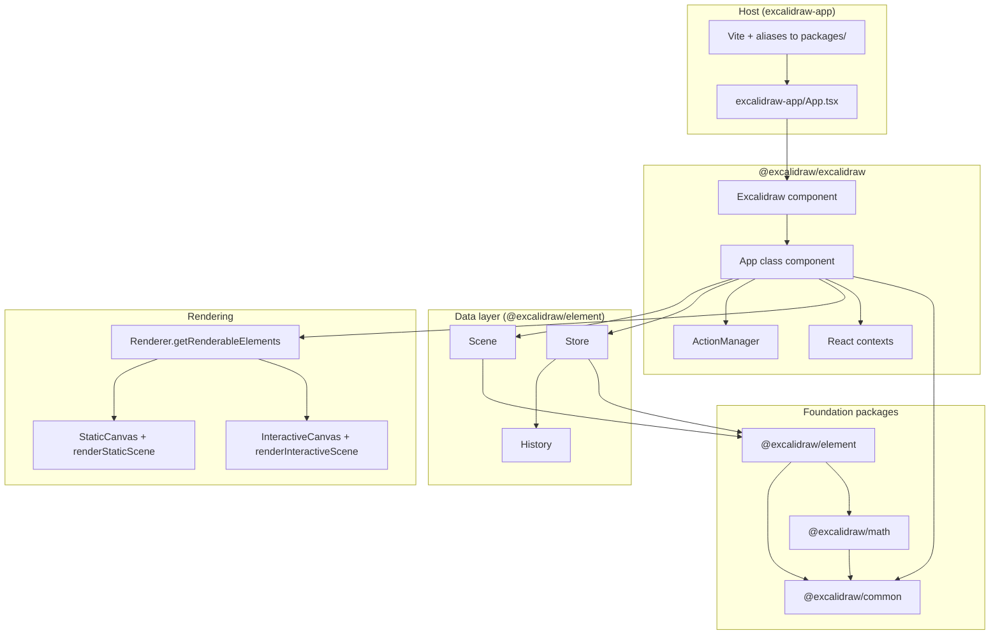

# Technical architecture

This document describes how the Excalidraw monorepo is structured and how the editor moves data from React state to canvas rendering. All statements are grounded in the current source tree.

---

## High-level architecture

The repository is a **Yarn workspaces** monorepo (`package.json` workspaces: `excalidraw-app`, `packages/*`, `examples/*`). The published-style library lives under `packages/`; the full web app that ships the product UI is `excalidraw-app/`.

At runtime, the embedding surface is the **`Excalidraw`** React component (`packages/excalidraw/index.tsx`), which mounts the class component **`App`** (`packages/excalidraw/components/App.tsx`). `App` owns:

- **React `state`** typed as `AppState` (UI, tool, viewport, selection, dialogs, collaboration handles, etc.).
- A **`Scene`** instance (`packages/element/src/Scene.ts`) holding the ordered element list and derived maps.
- A **`Store`** (`packages/element/src/store.ts`) that records observable changes for undo/redo and `onIncrement` consumers.
- An **`ActionManager`** (`packages/excalidraw/actions/manager.tsx`) that dispatches named **`Action`** objects (keyboard, menu, programmatic).
- A **`Renderer`** (`packages/excalidraw/scene/Renderer.ts`) that memoizes which elements are visible and which subset is passed to canvas renderers.

The host application `excalidraw-app` imports `@excalidraw/excalidraw` and related entry points; Vite resolves those imports to source files under `packages/` (`excalidraw-app/vite.config.mts` `resolve.alias`).

---

## Data flow: how data moves through the system

### 1. Scene elements vs. React state

- **Canvas geometry and element records** live in **`Scene`**: `replaceAllElements`, `mutateElement`, maps such as `getNonDeletedElementsMap()` / `getElementsMapIncludingDeleted()`, and a **`sceneNonce`** used as a render cache-invalidation token (`Scene` class comments in `packages/element/src/Scene.ts`).
- **Editor chrome and interaction state** live in **`AppState`** on the **`App`** component (`this.state`), defined in `packages/excalidraw/types.ts` and defaulted via `getDefaultAppState()` in `packages/excalidraw/appState.ts`.

### 2. Updates initiated by actions or API

- **`ActionManager`** (`packages/excalidraw/actions/manager.tsx`) is constructed in `App`’s constructor with an **`updater`** callback wired to **`syncActionResult`**. Entry points such as **`executeAction`**, **`handleKeyDown`**, and panel **`updateData`** (inside **`renderAction`**) each call **`action.perform(elements, appState, value, app)`** and pass the returned **`ActionResult`** (see `packages/excalidraw/actions/types.ts`) through the manager’s **`updater`** wrapper into **`syncActionResult`** (`packages/excalidraw/components/App.tsx`).
- **`syncActionResult`**: first calls **`this.store.scheduleAction(actionResult.captureUpdate)`** (`packages/element/src/store.ts` **`scheduleAction`** — queues a “macro” capture for the next commit). If **`actionResult.elements`** is present, applies **`this.scene.replaceAllElements(actionResult.elements)`** (`packages/element/src/Scene.ts`). Merges **`appState`** via **`setState`** when provided; may add files; if nothing in that path forced an update, calls **`this.scene.triggerUpdate()`** so scene subscribers still redraw.

### 3. Updates via `updateScene`

- **`updateScene`** (`App.tsx`) accepts optional **`elements`**, **`appState`**, **`collaborators`**, and **`captureUpdate`** (values from `packages/element/src/store.ts` **`CaptureUpdateAction`**: `IMMEDIATELY`, `NEVER`, `EVENTUALLY`). When **`captureUpdate`** is set, it calls **`this.store.scheduleMicroAction`** with the incoming **`elements`** / **`appState`** so the store can compute a delta from the current snapshot (see **`StoreSnapshot.maybeClone`** in `packages/element/src/store.ts`); the same method then applies **`setState`**, **`this.scene.replaceAllElements`**, or collaborator updates as needed. Action-driven flows enqueue a macro capture via **`syncActionResult`** → **`scheduleAction`**; many other scene/API paths use **`scheduleMicroAction`** from **`updateScene`**.

### 4. Commit, history, and external notification

- After React applies updates, **`componentDidUpdate`** (`App.tsx`) runs **`this.store.commit(this.scene.getElementsMapIncludingDeleted(), this.state)`** (`packages/element/src/store.ts` **`commit`**), which flushes queued micro-actions, processes the scheduled macro capture, and emits increments.
- **`Store.onDurableIncrementEmitter`** feeds **`History.record`** (`App.tsx` `componentDidMount`).
- When not loading, **`onChange`** and **`onChangeEmitter`** receive `(elements, appState, files)` (`App.tsx`).

### 5. Scene-driven redraws

- **`this.scene.onUpdate(this.triggerRender)`** is registered in `componentDidMount` (`App.tsx`), so mutating the scene can request a React re-render without necessarily changing `AppState`.

### 6. Collaboration and files

- **`AppState.collaborators`** is a `Map` of remote pointers/selection (`packages/excalidraw/types.ts`). Interactive canvas code reads it to build remote pointer maps (`packages/excalidraw/components/canvases/InteractiveCanvas.tsx`).
- **`App.files`** holds **`BinaryFiles`** keyed by element id (`App.tsx`); image rendering uses **`imageCache`** passed into static canvas config.

---

## State management

### `AppState`

`AppState` is a large interface in `packages/excalidraw/types.ts` describing everything the UI and canvas layers need that is **not** stored as standalone scene elements. It includes, among other groups:

- **Menus and overlays**: `contextMenu`, `openMenu`, `openPopup`, `openSidebar`, `openDialog`, `toast`, `showWelcomeScreen`, `stats`, `searchMatches`.
- **Tooling and ephemeral editing**: `activeTool`, `preferredSelectionTool`, `newElement`, `selectionElement`, `multiElement`, `resizingElement`, `editingTextElement`, `selectedLinearElement`, `editingFrame`, `penMode`, `eraser`-related behavior via tools (see tool types in the same file).
- **Selection**: `selectedElementIds`, `hoveredElementIds`, `previousSelectedElementIds`, `selectedGroupIds`, `editingGroupId`, `selectedElementsAreBeingDragged`, `lockedMultiSelections`, `activeLockedId`.
- **Viewport**: `scrollX`, `scrollY`, `zoom`, `width`, `height`, `offsetLeft`, `offsetTop`, `scrolledOutside`.
- **Visual preferences**: `theme`, `viewBackgroundColor`, grid flags (`gridSize`, `gridStep`, `gridModeEnabled`), export-related flags, `zenModeEnabled`, `viewModeEnabled`.
- **Current style defaults for new elements**: `currentItemStrokeColor`, `currentItemBackgroundColor`, `currentItemFillStyle`, stroke width/style, roughness, opacity, fonts, arrowheads, roundness, `currentItemArrowType`, etc.
- **Collaboration**: `collaborators`, `userToFollow`, `followedBy`.
- **Misc**: `name`, `fileHandle`, `errorMessage`, `isLoading`, `frameRendering`, `frameToHighlight`, `elementsToHighlight`, cropping flags, `snapLines`, `originSnapOffset`, `objectsSnapModeEnabled`, `bindMode`, binding-related fields.

Defaults for construction are centralized in **`getDefaultAppState()`** in `packages/excalidraw/appState.ts`, which also defines **`APP_STATE_STORAGE_CONF`**: per-key flags for what is kept when persisting to browser storage vs. export vs. server.

Subsets **`StaticCanvasAppState`** and **`InteractiveCanvasAppState`** (`packages/excalidraw/types.ts`) are the props each canvas actually reads; helper functions in `StaticCanvas.tsx` and `InteractiveCanvas.tsx` project full `AppState` down to these shapes for memoization.

### Elements (`Scene`)

The **`Scene`** class (`packages/element/src/Scene.ts`) stores:

- **`elements`**: all elements including deleted (`OrderedExcalidrawElement[]`).
- **Maps** for quick lookup: `nonDeletedElementsMap`, `elementsMap` (including deleted), plus cached **selected-elements** results keyed by selection options.

It exposes **`getNonDeletedElements`**, **`getElementsIncludingDeleted`**, **`replaceAllElements`**, **`mutateElement`**, **`getSelectedElements`**, **`triggerUpdate`**, **`onUpdate`** callbacks, **`getSceneNonce`**, and frame-related accessors. Selection caching invalidates when the underlying element array or `selectedElementIds` change.

`App` passes **non-deleted** elements into React context as **`ExcalidrawElementsContext`** (`App.tsx`).

### `ActionManager`

Defined in `packages/excalidraw/actions/manager.tsx` as **`class ActionManager`**:

- Holds **`actions`** as `Record<ActionName, Action>`.
- **`registerAction` / `registerAll`** populate the registry.
- **`executeAction(action, source, value)`** reads current elements and app state via **`getElementsIncludingDeleted`** and **`getAppState`**, runs **`action.perform`**, and passes the result to **`updater`** (the `syncActionResult` pipeline).
- **`handleKeyDown`** resolves at most one matching action by **`keyTest`** and **`keyPriority`**, respects **`UIOptions.canvasActions`** toggles and **`viewModeEnabled`**, then **`perform`** + **`updater`**.
- **`renderAction`** returns a **`PanelComponent`** when the action defines one and UI options allow it; the panel receives **`updateData`** that again calls **`perform`** through **`updater`**.
- **`isActionEnabled`** consults optional **`action.predicate`**.

The **`ActionResult`** type (`packages/excalidraw/actions/types.ts`) is either **`false`** (block the action) or an object with optional **`elements`**, **`appState`**, **`files`**, **`replaceFiles`**, and required **`captureUpdate`** (a **`CaptureUpdateActionType`**). Actions may return **`Promise<ActionResult>`**; **`ActionManager`** forwards promise results to **`updater`** when settled (`isPromiseLike` branch in `manager.tsx`).

### Store and undo/redo

**`Store`** (`packages/element/src/store.ts`) is constructed with the **`App`** instance. It:

- Schedules **`CaptureUpdateAction`** values on actions (`scheduleAction`, `scheduleMicroAction`, `scheduleCapture`).
- **`commit(elementsMap, appState)`** flushes micro-actions and processes macro capture, emitting **`DurableIncrement`** / **`EphemeralIncrement`** via **`onStoreIncrementEmitter`** (and durable path via **`onDurableIncrementEmitter`** for `History`).

**`History`** (`packages/excalidraw/history.ts`, referenced from `App.tsx`) records deltas from durable increments.

### React contexts bridging hooks to `App`

`App.tsx` defines and provides:

- **`AppContext`** → `App` instance (`useApp`).
- **`ExcalidrawAppStateContext`** → `this.state` (`useExcalidrawAppState`).
- **`ExcalidrawSetAppStateContext`** → `setAppState` (`useExcalidrawSetAppState`).
- **`ExcalidrawElementsContext`** → `this.scene.getNonDeletedElements()` (`useExcalidrawElements`).
- **`ExcalidrawActionManagerContext`** → `this.actionManager` (`useExcalidrawActionManager`).

### Jotai (`editor-jotai`)

`packages/excalidraw/editor-jotai.ts` uses **`jotai-scope`**’s **`createIsolation`** and exports **`EditorJotaiProvider`**, **`editorJotaiStore`**, and scoped Jotai hooks. Atoms are read in places such as sidebar docking and popups (`App.tsx` references `editorJotaiStore.get(...)`). This is **orthogonal** to `AppState` / `Scene`: it stores smaller UI or feature flags, not the full scene.

---

## Rendering pipeline: from React component to canvas

### Coarse `App.render` flow

In **`App.render`** (`packages/excalidraw/components/App.tsx`):

1. **`selectedElements`** = `this.scene.getSelectedElements(this.state)`.
2. **`sceneNonce`** = `this.scene.getSceneNonce()`.
3. **`renderer.getRenderableElements({ sceneNonce, zoom, offsets, scroll, size, editingTextElement, newElementId })`** returns **`elementsMap`** (a **`RenderableElementsMap`**) and **`visibleElements`** (`packages/excalidraw/scene/Renderer.ts`). Visibility uses **`isElementInViewport`** from `@excalidraw/element`; the renderable map skips the element currently being created as **`newElement`** and the text element actively being edited (so text is not double-drawn on canvas while the WYSIWYG editor is open).
4. **`allElementsMap`** = `this.scene.getNonDeletedElementsMap()`.

### Static layer

**`<StaticCanvas>`** (`packages/excalidraw/components/canvases/StaticCanvas.tsx`):

- Receives the **rough.js** canvas **`rc`**, the shared **`canvas`** element, **`elementsMap`**, **`visibleElements`**, **`allElementsMap`**, **`sceneNonce`**, **`selectionNonce`**, **`scale`** (typically `window.devicePixelRatio`), **`appState`** sliced to **`StaticCanvasAppState`**, and **`StaticCanvasRenderConfig`** (image cache, grid, theme, embed validation, erasure sets, etc.—see `App.tsx` where `renderConfig` is built).
- In **`useEffect`**, syncs canvas CSS and buffer dimensions, mounts the canvas under a wrapper div, then calls **`renderStaticScene(...)`** from `packages/excalidraw/renderer/staticScene.ts` (with optional render throttling via `isRenderThrottlingEnabled()` from `packages/excalidraw/reactUtils.ts`).
- **`renderStaticScene`** uses **`renderElement`** from `@excalidraw/element` and canvas helpers such as **`bootstrapCanvas`** (`staticScene.ts` imports).

### New-element overlay

If **`this.state.newElement`** is set, **`NewElementCanvas`** (`packages/excalidraw/components/canvases/NewElementCanvas.tsx`) renders similarly with static scene rendering for in-progress creation.

### Interactive layer

**`<InteractiveCanvas>`** (`packages/excalidraw/components/canvases/InteractiveCanvas.tsx`):

- Renders a **separate** `<canvas className="excalidraw__canvas interactive">` with pointer handlers wired to **`App`** methods (`handleCanvasPointerDown`, etc.).
- The **`useEffect`** that invokes **`renderInteractiveScene`** skips the first run (`isComponentMounted` ref): the first effect pass only flips the ref so the canvas is mounted before drawing begins on subsequent updates.
- On later effect runs, it builds **`InteractiveSceneRenderConfig`** including collaborator-derived remote pointer maps from **`appState.collaborators`**, then starts or feeds **`AnimationController`** keyed by **`INTERACTIVE_SCENE_ANIMATION_KEY`**, calling **`renderInteractiveScene`** from `packages/excalidraw/renderer/interactiveScene.ts` in a RAF loop when animation state requires it.
- **`renderInteractiveScene`** draws selection UI, handles, scrollbars, etc., using imports from `@excalidraw/element` (e.g. **`renderSelectionElement`**, transform handles).

### Construction-time canvas setup

In **`App`’s constructor** (`App.tsx`), a **`HTMLCanvasElement`** is created for the static layer, **`rough.canvas(this.canvas)`** builds **`rc`**, and **`interactiveCanvas`** is assigned later via **`handleInteractiveCanvasRef`** for the interactive canvas ref.

### SVG overlay

**`<SVGLayer>`** receives laser/lasso/eraser trail objects (`App.tsx`) for non-canvas vector overlays above the canvases.

---

## Package dependencies: relationships between packages

The following reflects **`dependencies`** in each package’s `package.json` (workspace versions `0.18.0` where applicable).

| Package | Declared dependencies (workspace / key externals) |
|--------|-----------------------------------------------------|
| **`@excalidraw/common`** | `tinycolor2` |
| **`@excalidraw/math`** | `@excalidraw/common` |
| **`@excalidraw/element`** | `@excalidraw/common`, `@excalidraw/math` |
| **`@excalidraw/excalidraw`** | `@excalidraw/common`, `@excalidraw/element`, `@excalidraw/math`, plus app libraries (e.g. `roughjs`, `jotai`, `jotai-scope`, CodeMirror packages, `radix-ui`, `sass`, …—see `packages/excalidraw/package.json`) |
| **`@excalidraw/utils`** | `@braintree/sanitize-url`, `@excalidraw/laser-pointer`, `browser-fs-access`, `pako`, `perfect-freehand`, PNG chunks, `roughjs` (built via `scripts/buildUtils.js`; not listed as a dependency of `@excalidraw/excalidraw` in the same file) |

**Root `package.json`** `workspaces` aggregate `excalidraw-app`, `packages/*`, and `examples/*`. The **`build:packages`** script builds, in order: **`common` → `math` → `element` → `excalidraw`**.

**`excalidraw-app/package.json`** depends on React 19, Firebase, Sentry, `socket.io-client`, `jotai`, `idb-keyval`, etc.; it does **not** duplicate `@excalidraw/excalidraw` as a semver dependency because development uses **Vite aliases** to `packages/excalidraw/index.tsx` and sibling packages.

**`examples/with-script-in-browser/package.json`** depends on **`@excalidraw/excalidraw`: `*`** and React.

**`examples/with-nextjs/package.json`** depends on Next.js and React; its scripts run `yarn build:packages` from the repo root before building.

**Peer dependency**: `@excalidraw/excalidraw` declares **`react` / `react-dom`** as peer dependencies (`^17 || ^18 || ^19`).

---

## Related source locations (index)

| Concern | Primary location |
|--------|-------------------|
| Default app state & export stripping | `packages/excalidraw/appState.ts` |
| `AppState` type | `packages/excalidraw/types.ts` |
| Main controller | `packages/excalidraw/components/App.tsx` |
| Actions registry | `packages/excalidraw/actions/manager.tsx`, `packages/excalidraw/actions/*.tsx` |
| Scene | `packages/element/src/Scene.ts` |
| Store / capture / deltas | `packages/element/src/store.ts` |
| Visible elements memo | `packages/excalidraw/scene/Renderer.ts` |
| Static canvas draw | `packages/excalidraw/renderer/staticScene.ts`, `components/canvases/StaticCanvas.tsx` |
| Interactive canvas draw | `packages/excalidraw/renderer/interactiveScene.ts`, `components/canvases/InteractiveCanvas.tsx` |
| Public embed API | `packages/excalidraw/index.tsx` |
| Host app entry | `excalidraw-app/index.tsx`, `excalidraw-app/App.tsx` |
| Dev resolution | `excalidraw-app/vite.config.mts` |
