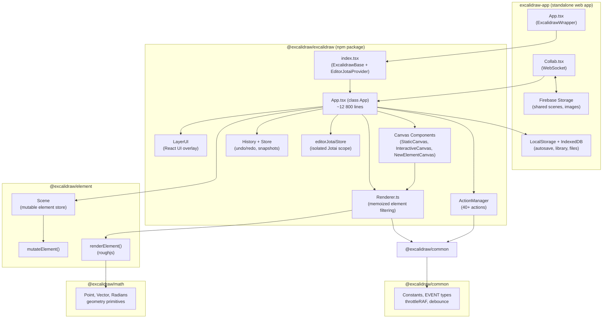
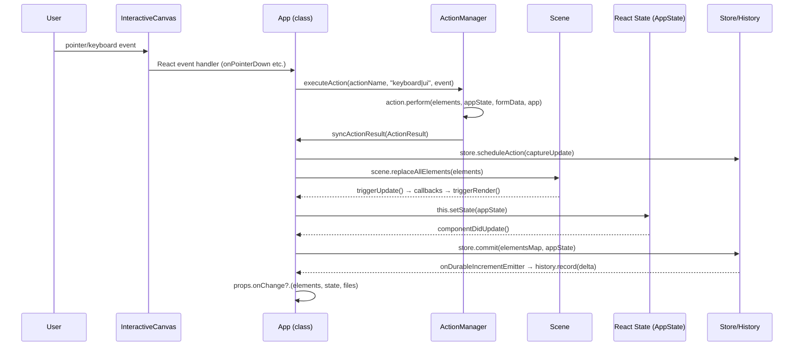
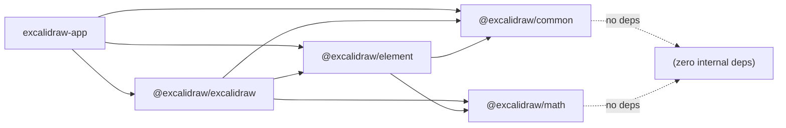

# Excalidraw Architecture

> Верифіковано з source code. Дата: 2026-03-25.

---

## 1. High-level Architecture



---

## 2. Data Flow

### 2.1 User Interaction → State Update



### 2.2 Scene Mutation Details

`Scene.mutateElement()` (verified: `element/src/Scene.ts:L435-468`):

```ts
scene.mutateElement(element, updates, options)
  → mutateElement(element, elementsMap, updates)   // creates new element object
  → if (informMutation && version changed):
      scene.triggerUpdate()
        → sceneNonce = randomInteger()             // cache invalidation
        → callbacks.forEach(cb => cb())            // → App.triggerRender()
```

### 2.3 Data Update Flow (withBatchedUpdates)

`syncActionResult` is wrapped in `withBatchedUpdates` (`unstable_batchedUpdates`):

- Multiple `setState` calls inside → single React render cycle
- Verified: `App.tsx:L2735`

```ts
syncActionResult(ActionResult)
  ├─ store.scheduleAction(captureUpdate)    → queues history snapshot
  ├─ scene.replaceAllElements(elements?)    → updates Scene
  ├─ this.addMissingFiles(files?)           → updates imageCache
  └─ this.setState({...prevState, ...actionAppState})  → React re-render
```

---

## 3. State Management

### 3.1 Три паралельних джерела правди

| Що | Де | API |
| --- | --- | --- |
| UI стан, viewport, tools | React `this.state` (`AppState`) | `this.setState({...})` |
| Canvas елементи | `Scene` singleton | `scene.replaceAllElements()` / `scene.mutateElement()` |
| Атомарний UI | `editorJotaiStore` (jotai-scope) | `updateEditorAtom(atom, value)` |

### 3.2 AppState (верифіковано: `appState.ts`)

Структура зберігається з `APP_STATE_STORAGE_CONF` per field:

```ts
// Persistence config (appState.ts:L1-308)
APP_STATE_STORAGE_CONF = {
  theme:                { browser: true,  export: false, server: false },
  zoom:                 { browser: false, export: false, server: false },
  scrollX:              { browser: true,  export: false, server: false },
  viewModeEnabled:      { browser: false, export: false, server: false },
  currentItemStrokeColor: { browser: true, export: true, server: false },
  // ...~80 fields total
}
```

Ключові групи AppState:

| Група | Поля |
| --- | --- |
| Viewport | `zoom`, `scrollX`, `scrollY`, `width`, `height`, `offsetLeft`, `offsetTop` |
| Tool | `activeTool`, `penMode`, `gridModeEnabled`, `snapLines` |
| Selection | `selectedElementIds`, `selectedGroupIds`, `selectionElement` |
| Editing | `editingTextElement`, `editingGroupId`, `multiElement`, `newElement` |
| Binding | `bindMode` (`orbit`/`skip`/`inside`), `bindingPreference`, `suggestedBinding` |
| Collab | `collaborators: Map<socketId, User>`, `userToFollow`, `followedBy` |
| UI | `openMenu`, `openSidebar`, `openDialog`, `contextMenu`, `toast` |

### 3.3 Scene — мутабельний елемент-стор

Verified: `element/src/Scene.ts`

```ts
class Scene {
  private elements:               readonly OrderedExcalidrawElement[]
  private elementsMap:            SceneElementsMap        // Map<id, element>
  private nonDeletedElements:     readonly NonDeleted<...>[]
  private nonDeletedElementsMap:  NonDeletedSceneElementsMap
  private nonDeletedFramesLikes:  readonly NonDeleted<ExcalidrawFrameLikeElement>[]
  private sceneNonce:             number | undefined      // render cache-bust nonce
  private callbacks:              Set<SceneStateCallback> // → triggerRender

  // Key API
  replaceAllElements(nextElements)  // full replace + re-index
  mutateElement(el, updates, opts)  // in-place + triggerUpdate if changed
  triggerUpdate()                   // sceneNonce++ + fire callbacks
  onUpdate(cb): unsubscribe         // subscribe (App uses: scene.onUpdate(triggerRender))
  getSelectedElements({selectedElementIds, ...opts})  // cached result
}
```

Кешування `getSelectedElements` через `selectedElementsCache` — уникає зайвих обчислень (verified: `Scene.ts:L126-134`).

### 3.4 Store та History

`Store` — snapshot manager між Scene і History:

```ts
Store.scheduleAction(captureUpdate)
  → CaptureUpdateAction.IMMEDIATELY → snapshot on next commit
  → CaptureUpdateAction.NEVER       → no snapshot
  → CaptureUpdateAction.EVENTUALLY  → snapshot deferred

Store.commit(elementsMap, appState)  // called every componentDidUpdate
  → creates StoreChange (diff from previous)
  → onDurableIncrementEmitter.trigger(delta)
      → History.record(delta)
          → undoStack.push(HistoryDelta)
          → redoStack.clear()   // only on element changes
```

---

## 4. Rendering Pipeline

### 4.1 Canvas шари

Три незалежних `<canvas>` елементи:

| Canvas | Компонент | Рендер | Throttle |
| --- | --- | --- | --- |
| Static | `StaticCanvas.tsx` | Committed elements + grid + links | `throttleRAF` via `window.EXCALIDRAW_THROTTLE_RENDER` |
| Interactive | `InteractiveCanvas.tsx` | Selection, handles, snap, cursors | `AnimationController` (RAF loop) |
| New Element | `NewElementCanvas.tsx` | Element being drawn live | Per pointer event |

### 4.2 StaticCanvas Render Flow

Verified: `StaticCanvas.tsx:L44-72`, `staticScene.ts:L482-501`

```text
React render → StaticCanvas (React.memo)
  ↓ areEqual() check:
    - sceneNonce changed?
    - elementsMap reference changed?
    - StaticCanvasAppState shallow-equal?
  ↓ useEffect() after mount (runs after every render)
  → renderStaticScene(config, throttle=EXCALIDRAW_THROTTLE_RENDER)
      → if throttle: renderStaticSceneThrottled()  // throttleRAF wrapper
        else: _renderStaticScene()                 // immediate
  → _renderStaticScene():
      1. bootstrapCanvas()    // clear, scale by devicePixelRatio
      2. context.scale(zoom)  // apply zoom
      3. strokeGrid()         // draw grid (if enabled)
      4. visibleElements.filter(not iframe).forEach:
           → renderElement(el, rc, ctx, ...)  // roughjs rendering
           → renderLinkIcon()                  // link indicator
      5. visibleElements.filter(iframe).forEach:
           → renderElement() on top layer
      6. renderPendingFlowchartNodes()
```

AppState fields for StaticCanvas (verified: `StaticCanvas.tsx:L77-106`):
`zoom`, `scrollX`, `scrollY`, `width`, `height`, `theme`, `gridSize`, `gridStep`,
`frameRendering`, `selectedElementIds`, `viewBackgroundColor`, `shouldCacheIgnoreZoom`

### 4.3 InteractiveCanvas Render Flow

Verified: `InteractiveCanvas.tsx:L86-198`

```text
React render → InteractiveCanvas (React.memo)
  ↓ areEqual() check: selectionNonce, sceneNonce, elementsMap, selectedElements...
  → useEffect() → AnimationController.start("animateInteractiveScene")
      → RAF loop: renderInteractiveScene({...rendererParams, deltaTime, animationState})
          Renders:
          - Selection boxes + transform handles
          - Linear element points (when editing)
          - Snap lines (snapLines from AppState)
          - Scrollbars (if enabled)
          - Remote collaborator cursors (from AppState.collaborators Map)
          - Binding highlights (orbit/inside mode animations with deltaTime)
          - Active lasso / selection region
```

### 4.4 Renderer.ts — Visible Elements Filter

Verified: `scene/Renderer.ts:L26-147`

```ts
Renderer.getRenderableElements = memoize(({
  zoom, scrollX, scrollY, width, height,
  editingTextElement, newElementId,
  sceneNonce  // ← cache key: changes on every scene.triggerUpdate()
}) => {
  // 1. Filter: exclude newElement (rendered on NewElementCanvas)
  // 2. Filter: exclude editingTextElement (rendered as WYSIWYG DOM)
  const elementsMap = getRenderableElements(elements)

  // 3. Viewport culling: isElementInViewport() for each element
  const visibleElements = getVisibleCanvasElements({elementsMap, zoom, scrollX, ...})

  return { elementsMap, visibleElements }
})
```

Cache invalidated on `sceneNonce` change → O(n) viewport filter runs only when Scene mutates.

### 4.5 renderElement() via roughjs

```ts
renderElement(element, elementsMap, allElementsMap, rc, context, renderConfig, appState)
  → per element.type:
      rectangle/diamond/ellipse → rc.draw() (roughjs Canvas)
      line/arrow                → rc.linearPath() / rc.curve()
      text                      → context.fillText() (native Canvas 2D)
      image                     → context.drawImage() (from imageCache)
      iframe/embeddable         → placeholder rectangle + label
      freedraw                  → context.fill() (custom path)
```

---

## 5. Package Dependencies

### 5.1 Граф залежностей



**Порядок збірки** (build order constraint):

```text
@excalidraw/common → @excalidraw/math → @excalidraw/element → @excalidraw/excalidraw
```

### 5.2 Що в кожному пакеті

| Пакет | Entry | Ключовий вміст |
| --- | --- | --- |
| `@excalidraw/common` | `index.ts` | `EVENT`, `THEME`, `throttleRAF`, `debounce`, `invariant`, `arrayToMap`, `memoize`, `Emitter` |
| `@excalidraw/math` | `index.ts` | `Point`, `Vector`, `Radians`, `pointFrom()`, `pointDistance()`, `bezierEquation()` |
| `@excalidraw/element` | `index.ts` | `Scene`, `mutateElement()`, `renderElement()`, types, `LinearElementEditor`, `ShapeCache` |
| `@excalidraw/excalidraw` | `index.tsx` | `<Excalidraw>`, `App`, `ActionManager`, `History`, `Store`, `Renderer`, all UI components |

### 5.3 Node-safe exports

`@excalidraw/excalidraw` має окремий entry для Node.js:

- `index-node.ts` — без browser APIs (не імпортує DOM, canvas, window)
- Дозволяє серверне використання: `exportToSvg`, `restoreElements`, `serializeAsJSON`

### 5.4 Alias resolving (dev)

Vite aliases (verified: `excalidraw-app/vite.config.mts:L24-78`):

```text
@excalidraw/common    → packages/common/src/index.ts
@excalidraw/math      → packages/math/src/index.ts
@excalidraw/element   → packages/element/src/index.ts
@excalidraw/excalidraw → packages/excalidraw/index.tsx
@excalidraw/utils     → packages/utils/src/index.ts
```

### 5.5 Ключові зовнішні залежності пакету

| Lib | Використання |
| --- | --- |
| `roughjs` | Canvas-рендеринг hand-drawn стилю (`rc.draw()`, `rc.linearPath()`) |
| `jotai` + `jotai-scope` | Ізольований Jotai store (`createIsolation()` → `EditorJotaiProvider`) |
| `lodash.throttle` | Throttle в `Scene.ts` (validateIndices: 1хв) |
| `nanoid` | `element.id` generation, `App.id` |
| `socket.io-client` | Collab WebSocket (у `excalidraw-app`) |
| `idb-keyval` | IndexedDB для library та files (у `excalidraw-app`) |
| `pako` | Binary scene compression для share links |
