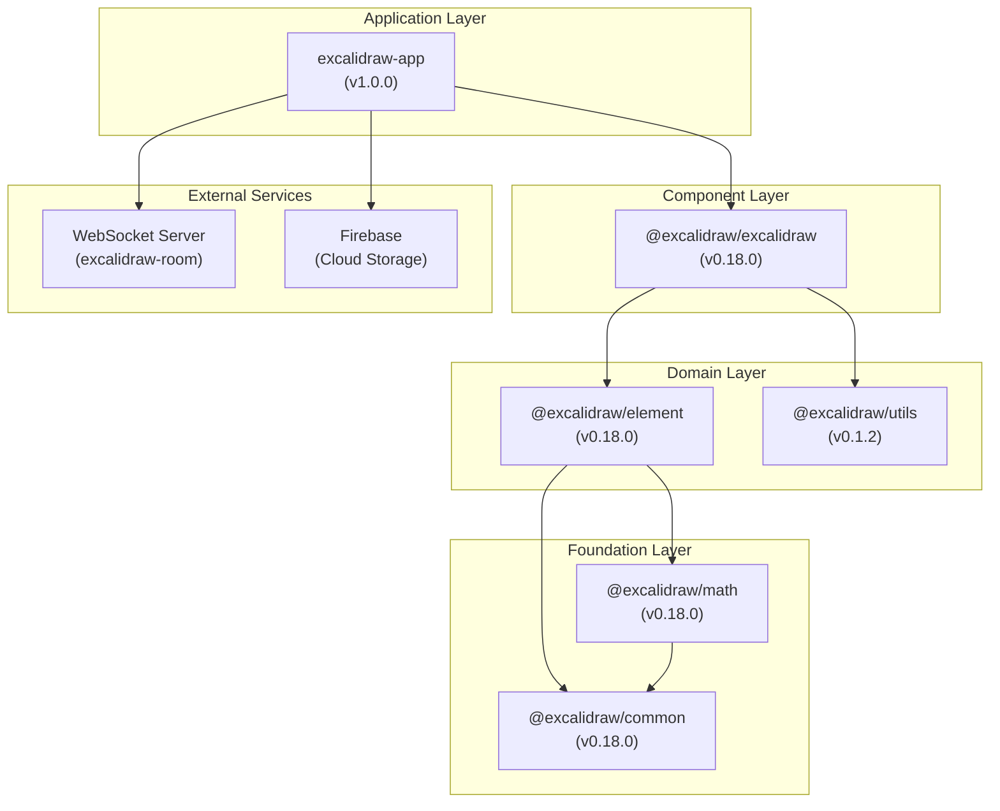
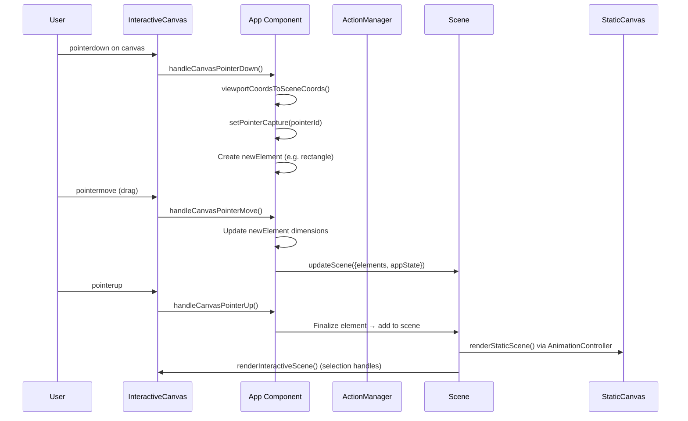
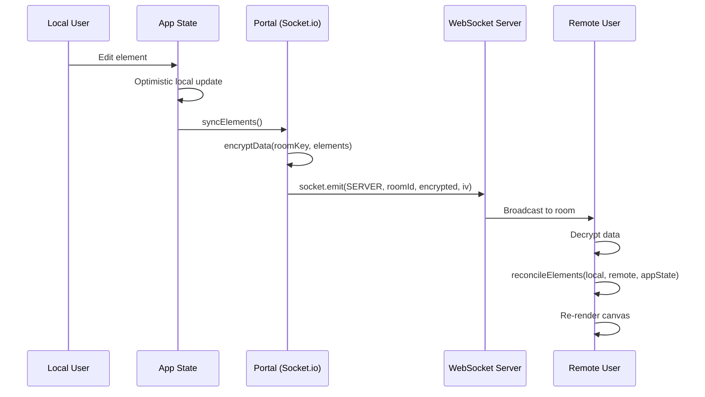
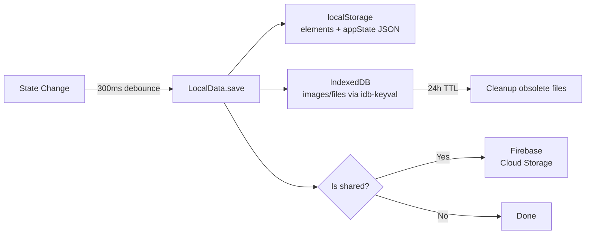
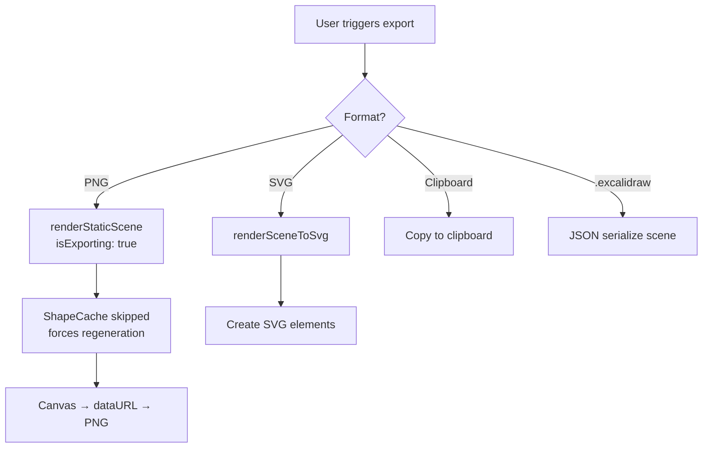
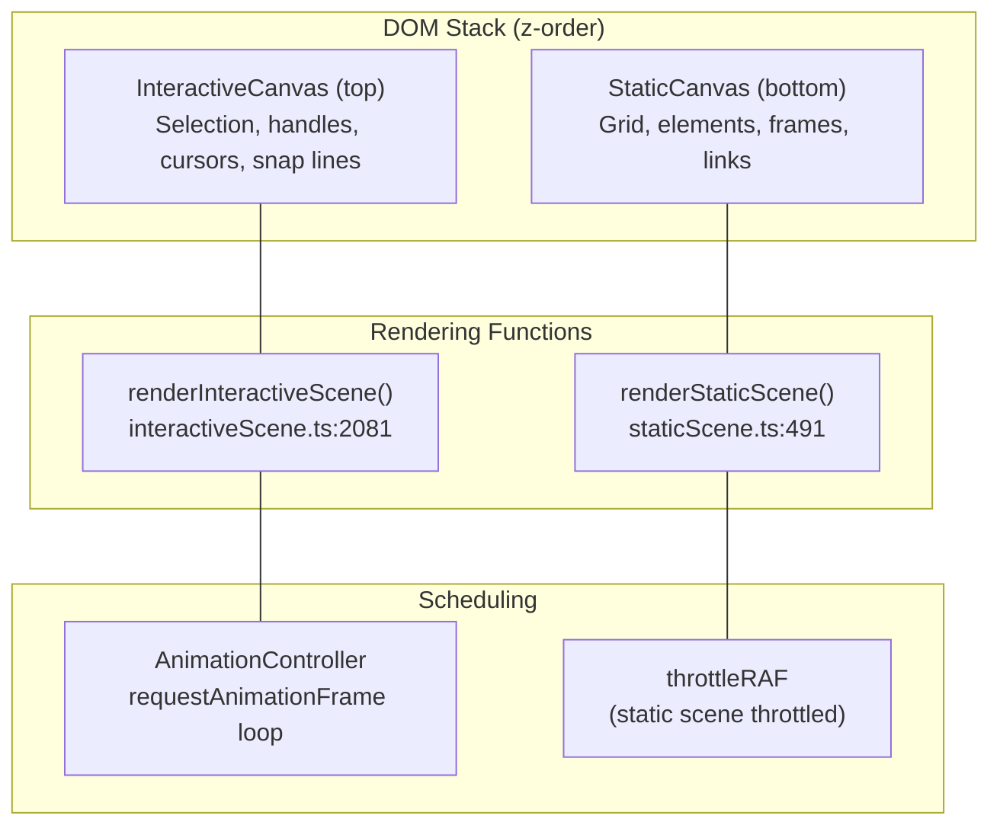
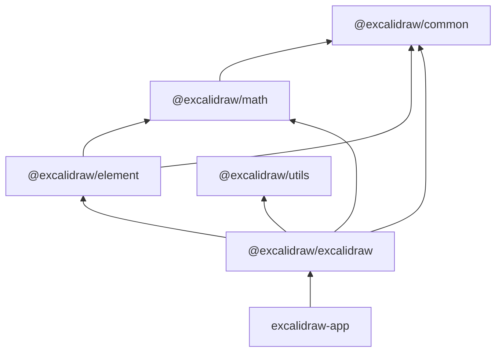
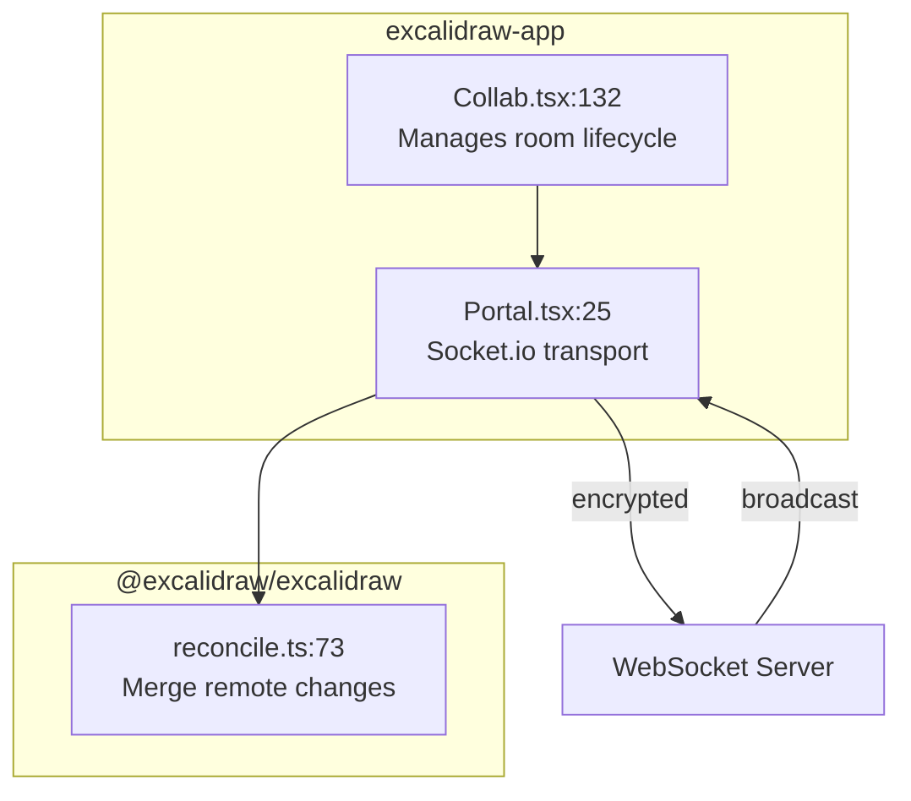

# Architecture: Excalidraw

*Source-verified from codebase v0.18.0*

## High-Level Architecture

Excalidraw is a monorepo with a layered package model. The application layer (`excalidraw-app`) consumes the embeddable component (`@excalidraw/excalidraw`), which depends on lower-level packages for element logic, math, and utilities.



### Package Responsibilities

| Package | Path | Responsibility |
|---------|------|----------------|
| `excalidraw-app` | `excalidraw-app/` | Web app: collaboration, persistence, Firebase, AI |
| `@excalidraw/excalidraw` | `packages/excalidraw/` | Embeddable React component: actions, rendering, UI |
| `@excalidraw/element` | `packages/element/` | Element logic: creation, transforms, hit testing, binding |
| `@excalidraw/utils` | `packages/utils/` | Consumer utilities: export PNG/SVG, import files |
| `@excalidraw/math` | `packages/math/` | Pure math: Point, Vector, Segment, Polygon, curves |
| `@excalidraw/common` | `packages/common/` | Shared constants, type guards, helpers |

### Key Entry Points

| Entry | File | What It Does |
|-------|------|--------------|
| App bootstrap | `excalidraw-app/index.tsx` | `createRoot()` → renders `<ExcalidrawApp />` in StrictMode |
| App component | `excalidraw-app/App.tsx` | Wraps `<Excalidraw>` with collaboration, persistence, Firebase |
| Core component | `packages/excalidraw/components/App.tsx:617` | Class `App extends React.Component<AppProps, AppState>` — main canvas logic |
| Library export | `packages/excalidraw/index.tsx:61` | `ExcalidrawBase` — public embeddable component |

---

## Data Flow

### Drawing Flow



**Source**: `packages/excalidraw/components/App.tsx:7470` — `handleCanvasPointerDown`

### Collaboration Flow



**Key files**:
- Collab: `excalidraw-app/collab/Collab.tsx:132`
- Portal: `excalidraw-app/collab/Portal.tsx:25`
- Reconciliation: `packages/excalidraw/data/reconcile.ts:73`

**WebSocket events**:
| Event | Type | Purpose |
|-------|------|---------|
| `WS_EVENTS.SERVER` | Reliable | Element updates, app state |
| `WS_EVENTS.SERVER_VOLATILE` | Volatile | Cursor position, selection |
| `WS_SUBTYPES.INIT` | — | Full scene sync on join |
| `WS_SUBTYPES.UPDATE` | — | Incremental element updates |

### Persistence Flow



**Source**: `excalidraw-app/data/LocalData.ts`
- Debounce: `SAVE_TO_LOCAL_STORAGE_TIMEOUT = 300` (from `excalidraw-app/app_constants.ts:2`)
- Storage keys: `STORAGE_KEYS.LOCAL_STORAGE_ELEMENTS`, `STORAGE_KEYS.LOCAL_STORAGE_APP_STATE`
- IndexedDB store: `createStore("files-db", "files-store")`
- Auto-save paused during active collaboration

### Export Flow



**Source**: `packages/excalidraw/scene/export.ts`

---

## State Management

### AppState

Defined in `packages/excalidraw/types.ts:272` (~200 properties). Key groups:

| Category | Fields | Purpose |
|----------|--------|---------|
| **Active tool** | `activeTool.type`, `.locked`, `.lastActiveTool` | Current drawing mode |
| **Viewport** | `scrollX`, `scrollY`, `zoom.value`, `width`, `height` | Canvas viewport |
| **Selection** | `selectedElementIds`, `selectedGroupIds`, `selectedLinearElement` | What's selected |
| **Editing** | `editingTextElement`, `newElement`, `resizingElement`, `multiElement` | In-progress operations |
| **Styling** | `currentItemStrokeColor`, `currentItemFontFamily`, `currentItemOpacity` | Default element styles |
| **Collaboration** | `collaborators: Map<SocketId, Collaborator>` | Remote user presence |
| **UI** | `theme`, `gridModeEnabled`, `objectsSnapModeEnabled`, `openDialog` | UI toggles |

Default values: `packages/excalidraw/appState.ts:22` — `getDefaultAppState()`

### Elements (Scene)

Elements are managed by the `Scene` class (`packages/element/src/Scene.ts`):

- Internal `elementsMap`: `Map<id, ExcalidrawElement>` for O(1) lookups
- **Immutable updates**: every change creates a new element with incremented `version`
- `getNonDeletedElements()` — filters out soft-deleted elements
- `getSelectedElements(appState)` — intersects with `selectedElementIds`
- `getSceneNonce()` — cache-invalidation counter

### Jotai Atoms (Global State)

Two isolated stores for fine-grained reactivity without prop drilling:

| Store | File | Key Atoms |
|-------|------|-----------|
| **Editor** | `packages/excalidraw/editor-jotai.ts` | `editorJotaiStore` — isolated via `jotai-scope/createIsolation()` |
| **App** | `excalidraw-app/app-jotai.ts` | `collabAPIAtom`, `isCollaboratingAtom`, `isOfflineAtom`, `localStorageQuotaExceededAtom` |

### ActionManager

Defined in `packages/excalidraw/actions/manager.tsx:52`:

```
registerAction(action) → actions[]
handleKeyDown(event):
  1. Filter actions by action.keyTest(event, appState, elements, app)
  2. Sort by action.keyPriority (higher first)
  3. Validate only 1 action matches
  4. Check viewModeEnabled permissions
  5. trackAction() for analytics
  6. Execute: action.perform(elements, appState, value, app)
```

Each **Action** is an object with:
- `name: string` — unique identifier
- `perform(elements, appState, value, app)` → `{elements, appState, captureUpdate}`
- `keyTest(event, appState, elements, app)` → boolean (keyboard shortcut matcher)
- `PanelComponent` — optional React component for toolbar rendering
- `keyPriority?: number` — disambiguation for overlapping shortcuts

40+ actions registered: drawing, selection, styling, alignment, export, undo/redo, clipboard, etc.

---

## Rendering Pipeline

### Two-Canvas Architecture



### StaticCanvas
**File**: `packages/excalidraw/components/canvases/StaticCanvas.tsx`
- Receives `RoughCanvas` instance for hand-drawn rendering
- Props: `elementsMap`, `visibleElements`, `allElementsMap`, `renderConfig`
- Calls `renderStaticScene()` (`packages/excalidraw/renderer/staticScene.ts:491`)
- Throttled via `renderStaticSceneThrottled` using `throttleRAF`
- Renders: background, grid, all visible elements, frame labels, element links

### InteractiveCanvas
**File**: `packages/excalidraw/components/canvases/InteractiveCanvas.tsx`
- Handles all pointer events: `onPointerDown`, `onPointerMove`, `onPointerUp`, `onPointerCancel`, `onTouchMove`, `onDoubleClick`
- Calls `renderInteractiveScene()` (`packages/excalidraw/renderer/interactiveScene.ts:2081`)
- Scheduled via `AnimationController.start("animateInteractiveScene")`
- Renders: selection box, transform handles, rotation handle, binding highlights, remote cursors/usernames, snap lines

### Shape Generation & Cache

**File**: `packages/element/src/shape.ts`

```
ShapeCache (static WeakMap<ExcalidrawElement, {shape, theme}>)
├── get(element, theme) → cached shape or null
├── generateElementShape(element, renderConfig)
│   ├── Skip cache if isExporting: true
│   └── Use RoughGenerator → create hand-drawn shapes
├── delete(element) → invalidate single element
└── destroy() → clear entire cache
```

RoughJS (`roughjs/bin/generator`) creates the hand-drawn aesthetic. Shapes are cached per-element and invalidated on version change.

### Element Rendering

**File**: `packages/element/src/renderElement.ts`

Each element type has specialized rendering:
- **Shapes** (rectangle, ellipse, diamond): RoughJS generator → canvas path
- **Lines/Arrows**: RoughJS polyline + arrowhead rendering
- **Freedraw**: `perfect-freehand` library → smooth stroke paths
- **Text**: Canvas 2D `fillText()` with font metrics
- **Images**: Canvas `drawImage()` with transform matrix
- **Frames**: Clipping region + label rendering

### Animation Loop

**File**: `packages/excalidraw/renderer/animation.ts`

```
AnimationController (static class)
├── animations: Map<key, {callback, lastFrameTime}>
├── start(key, animation)
│   └── requestAnimationFrame(AnimationController.tick)
├── tick(timestamp)
│   ├── Run all registered animation callbacks
│   ├── Remove completed animations
│   └── Reschedule: requestAnimationFrame(tick) if animations remain
└── stop(key)
    └── cancelAnimationFrame()
```

Lower-level: `AnimationFrameHandler` (`packages/excalidraw/animation-frame-handler.ts`) manages per-target RAF registration via WeakMap.

---

## Package Dependencies

### Dependency Graph



### Build Order (strict dependency chain)

```bash
# From root package.json — must run in this order:
yarn build:common → yarn build:math → yarn build:element → yarn build:excalidraw
```

### Package Exports

| Package | Main Export | Additional Exports |
|---------|------------|-------------------|
| `@excalidraw/excalidraw` | `./dist/prod/index.js` | `./index.css`, `./common/*`, `./element/*`, `./math/*`, `./utils/*` |
| `@excalidraw/element` | `./dist/prod/index.js` | `./visualdebug` (dev/prod separate) |
| `@excalidraw/math` | `./dist/prod/index.js` | — |
| `@excalidraw/common` | `./dist/prod/index.js` | — |
| `@excalidraw/utils` | `./dist/prod/index.js` | — |

### Key External Dependencies

| Dependency | Version | Used By | Purpose |
|------------|---------|---------|---------|
| React | 19.0.0 | excalidraw (peer) | UI framework |
| Jotai | 2.11.0 | excalidraw | Atomic state management |
| RoughJS | 4.6.4 | element | Hand-drawn shape rendering |
| Socket.io-client | 4.7.2 | excalidraw-app | Real-time collaboration |
| Perfect-freehand | 1.2.0 | element | Freehand stroke smoothing |
| Pako | 2.0.3 | excalidraw | Data compression (URL sharing) |
| Radix UI | 1.4.3 | excalidraw | Accessible UI primitives |
| Firebase | 11.3.1 | excalidraw-app | Cloud storage, auth |

---

## Collaboration Architecture

### Component Structure



### Conflict Resolution Algorithm

From `packages/excalidraw/data/reconcile.ts:73` — `reconcileElements()`:

1. Build `localElementsMap` from local elements
2. For each remote element:
   - If element is being edited locally (text/resize) → **keep local**
   - If remote `version > local.version` → **take remote**
   - If same version → compare `versionNonce` (lower value wins — deterministic tiebreaker)
3. Append remaining local-only elements
4. Reorder via `orderByFractionalIndex()` for stable z-ordering
5. Validate indices via `syncInvalidIndices()`

### End-to-End Encryption

- Room key generated client-side, shared via URL fragment (never sent to server)
- Data encrypted with AES before WebSocket transmission
- `Portal._broadcastSocketData()` calls `encryptData(roomKey, encoded)`
- Server sees only opaque encrypted buffers

---

## Related Documentation

- [Development Setup](./dev-setup.md)
- [Project Brief](../memory/projectbrief.md)
- [Tech Context](../memory/techContext.md)
- [System Patterns](../memory/systemPatterns.md)
- [Product Requirements](../product/PRD.md)
- [Domain Glossary](../product/domain-glossary.md)
