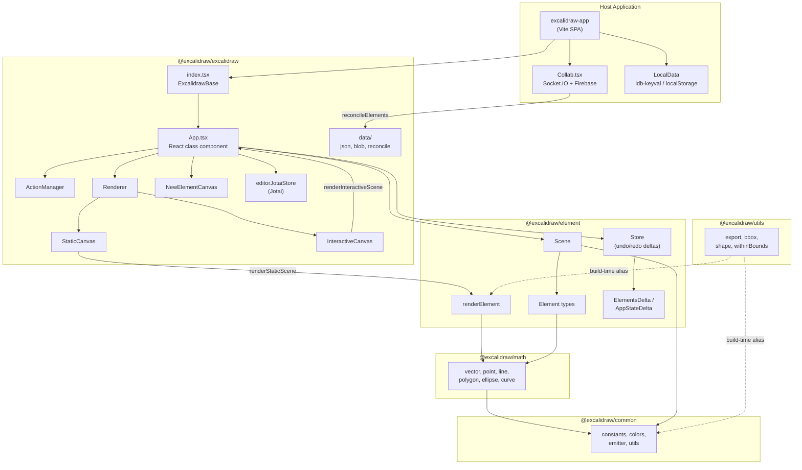
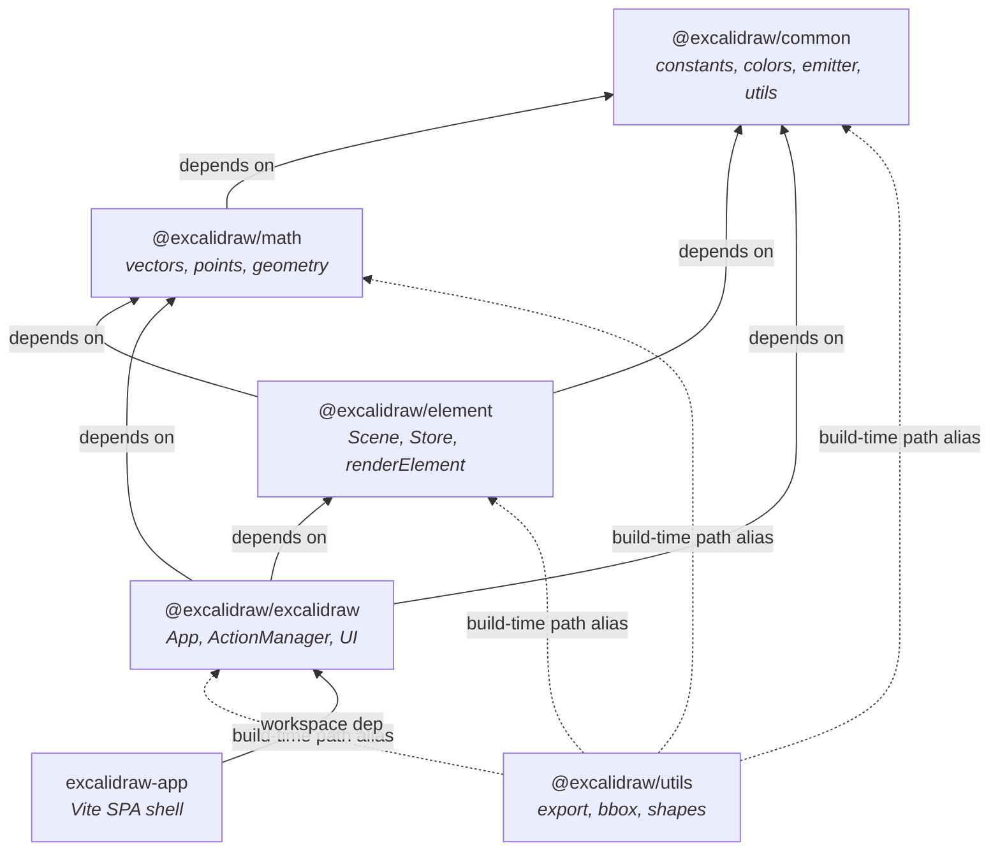

# Excalidraw Architecture

## High-level Architecture

Excalidraw is a **Yarn workspaces monorepo** (`excalidraw-monorepo`) with five publishable
packages under `packages/` and a Vite-based SPA shell in `excalidraw-app/`.



### Workspace layout

| Directory | Role |
|-----------|------|
| `excalidraw-app/` | Vite SPA shell — Firebase auth, Socket.IO collab, local persistence |
| `packages/common/` | Zero-dependency shared utilities: constants, colors, emitter, type helpers |
| `packages/math/` | Pure 2D geometry: vectors, points, lines, polygons, ellipses, curves |
| `packages/element/` | Element model, `Scene`, `Store`, delta system, `renderElement` |
| `packages/excalidraw/` | React editor: `App`, `ActionManager`, `Renderer`, canvases, UI components |
| `packages/utils/` | Consumer-facing helpers: export, bounding boxes, shape detection |
| `examples/` | Integration demos (`with-nextjs`, `with-script-in-browser`) |
| `scripts/` | Build, release, WASM, locale tooling |

---

## Data Flow

### User interaction cycle

```
User input (pointer / keyboard / UI click)
       │
       ▼
┌──────────────────────────┐
│  App event handlers      │  handleCanvasPointerDown, handleKeyDown, etc.
│  (packages/excalidraw/   │
│   components/App.tsx)    │
└──────────┬───────────────┘
           │
           ▼
┌──────────────────────────┐
│  ActionManager.execute   │  action.perform(elements, appState, value, app)
│  or direct setState      │  → returns ActionResult {elements, appState, files, captureUpdate}
└──────────┬───────────────┘
           │
           ▼
┌──────────────────────────┐
│  syncActionResult        │  Merges ActionResult into React state:
│  (App.tsx ~2735)         │  • this.setState({...appState})
│                          │  • this.scene.replaceAllElements(elements)
│                          │  • Schedules Store capture for undo history
└──────────┬───────────────┘
           │
           ▼
┌──────────────────────────┐
│  React re-render         │  App.render() computes sceneNonce,
│                          │  visibleElements via Renderer.getRenderableElements
└──────────┬───────────────┘
           │
     ┌─────┴──────┐
     ▼            ▼
StaticCanvas  InteractiveCanvas
(useEffect)   (AnimationController + rAF)
     │            │
     ▼            ▼
renderStaticScene  renderInteractiveScene
     │
     ▼
renderElement (per element, switch on type)
```

### External data flow (onChange callback)

After every React commit, `componentDidUpdate` in `App.tsx` runs:

1. `this.store.commit(elementsMap, this.state)` — captures deltas for undo/redo
2. `this.props.onChange?.(elements, appState, files)` — notifies embedders
3. `this.onChangeEmitter.trigger(...)` — notifies internal subscribers

This is the primary mechanism for host applications (like `excalidraw-app`) to
persist state or sync with collaboration backends.

### Collaboration data flow

```
Local edit ──► onChange(elements, appState) ──► Collab.tsx ──► Socket.IO server
                                                                    │
Remote update ◄── socket event ◄── Collab.tsx ◄── reconcileElements ◄┘
       │
       ▼
updateScene({ elements, captureUpdate: NEVER })
```

`reconcileElements` (in `packages/excalidraw/data/reconcile.ts`) merges local
and remote element arrays using `version` / `versionNonce` fields. Remote updates
use `CaptureUpdateAction.NEVER` so they don't pollute the local undo stack.

### Persistence layer

| Layer | Mechanism | Location |
|-------|-----------|----------|
| Scene serialization | `serializeAsJSON` / `loadFromBlob` | `packages/excalidraw/data/json.ts`, `blob.ts` |
| Browser storage | `idb-keyval` (IndexedDB) + `localStorage` wrapper | `excalidraw-app/data/LocalData.ts` |
| Cloud storage | Firebase Firestore | `excalidraw-app/data/firebase.ts` |
| Export | Canvas → PNG/SVG via `exportToCanvas` / `exportToSvg` | `packages/utils/src/export.ts` |

---

## State Management

Excalidraw uses a layered state model. There is no single global store like Redux;
instead, three complementary mechanisms handle different concerns.

### 1. AppState (React class component state)

**Definition:** `AppState` interface in `packages/excalidraw/types.ts` (~line 272).

`App` is a React class component (`class App extends React.Component<AppProps, AppState>`)
that holds the full editor UI state in `this.state`. Key fields include:

| Field group | Examples |
|-------------|----------|
| Tool state | `activeTool`, `penMode`, `penDetected` |
| Selection | `selectedElementIds`, `selectedGroupIds`, `editingGroupId` |
| Viewport | `scrollX`, `scrollY`, `zoom`, `width`, `height`, `offsetLeft`, `offsetTop` |
| UI mode | `viewModeEnabled`, `zenModeEnabled`, `gridModeEnabled`, `theme` |
| Editing | `editingTextElement`, `editingLinearElement`, `newElement` |
| Collaboration | `collaborators` (Map of user pointers/cursors) |
| Export | `exportBackground`, `exportEmbedScene`, `exportScale` |

**Initialization:** `getDefaultAppState()` in `packages/excalidraw/appState.ts` returns
the baseline values. The `App` constructor merges these with props-supplied overrides.

**Mutation:** State is updated exclusively through `this.setState()`, which is triggered by:
- `syncActionResult` — merges `ActionResult.appState` from executed actions
- `updateScene` — the public API method for batched state + element updates
- Direct `setState` calls in pointer/keyboard handlers for ephemeral UI state

**Observation:** `AppStateObserver` (`packages/excalidraw/components/AppStateObserver.ts`)
provides selector-based subscriptions. The `useAppStateValue` hook lets functional
components subscribe to specific `AppState` slices without full re-renders.

### 2. Elements (Scene)

**Definition:** `ExcalidrawElement` union type in `packages/element/src/types.ts`.

Elements are the document model — every shape, text block, arrow, or frame on the canvas.
They are managed by the `Scene` class (`packages/element/src/Scene.ts`):

```
Scene
├── elements: readonly OrderedExcalidrawElement[]     (all, including deleted)
├── nonDeletedElements: readonly NonDeletedExcalidrawElement[]
├── elementsMap: SceneElementsMap                     (Map<id, element>)
├── nonDeletedElementsMap: NonDeletedSceneElementsMap
├── frames: readonly ExcalidrawFrameLikeElement[]
├── selectedElementsCache                             (memoized selection queries)
└── sceneNonce: number                                (cache-invalidation token)
```

**Updates:** `scene.replaceAllElements(elements)` is the only entry point for
element mutations. It rebuilds all derived views (non-deleted, frames, maps) and
calls `triggerUpdate()` which:
1. Generates a new random `sceneNonce`
2. Notifies all registered `SceneStateCallback` listeners

**Element identity:** Each element carries `id`, `version`, `versionNonce`, and a
fractional `index` (for z-ordering via `syncInvalidIndices`). Version fields drive
conflict resolution during collaboration merges.

**Access in App:** `this.scene` is created in the `App` constructor:

```typescript
this.scene = new Scene();
this.renderer = new Renderer(this.scene);
this.fonts = new Fonts(this.scene);
```

### 3. ActionManager (command system)

**Definition:** `ActionManager` class in `packages/excalidraw/actions/manager.tsx`.

The action system is a registry-based command pattern:

```
Action {
  name: ActionName
  perform: (elements, appState, value, app) => ActionResult
  keyTest?: (event, appState, elements, app) => boolean
  PanelComponent?: React component for toolbar UI
  trackEvent?: analytics config
  predicate?: (elements, appState, props, app) => boolean
}
```

**Registration:** In the `App` constructor:

```typescript
this.actionManager = new ActionManager(
  this.syncActionResult,       // updater — merges ActionResult into App state
  () => this.state,            // getAppState
  () => this.scene.getElementsIncludingDeleted(),  // getElements
  this,                        // app instance
);
this.actionManager.registerAll(actions);            // built-in actions
this.actionManager.registerAction(createUndoAction(this.history));
this.actionManager.registerAction(createRedoAction(this.history));
```

Actions are registered via the `register()` helper in `packages/excalidraw/actions/register.ts`,
which appends to a mutable `actions` array that `App` passes to `registerAll`.

**Execution paths:**
- **Keyboard:** `handleKeyDown` → finds action via `keyTest` priority → `action.perform()` → `updater`
- **UI:** `renderAction(name)` → renders `PanelComponent` with `updateData` callback → `action.perform()` → `updater`
- **API:** `executeAction(action, source, value)` → `action.perform()` → `updater`

**ActionResult:** Each action returns `{ elements?, appState?, files?, captureUpdate? }`.
The `captureUpdate` field controls undo history behavior via `CaptureUpdateAction`.

### 4. Store (undo/redo delta system)

**Definition:** `Store` class in `packages/element/src/store.ts`.

The `Store` is not a Redux-style state container. It captures state deltas for
undo/redo and emits increments for external consumers:

```
Store
├── onStoreIncrementEmitter    (public — API consumers)
├── onDurableIncrementEmitter  (internal — History)
├── snapshot: StoreSnapshot    (last committed state)
├── scheduledMacroActions      (pending capture actions)
└── scheduledMicroActions      (pre-commit hooks)
```

**CaptureUpdateAction** controls what gets pushed to the undo stack:
- `IMMEDIATELY` — standard user edits (captured on next commit)
- `NEVER` — remote updates, scene init (never enters undo stack)
- `EVENTUALLY` — async multi-step operations (deferred capture)

`Store.commit(elementsMap, appState)` runs in `componentDidUpdate` after every
React render cycle. It computes `ElementsDelta` and `AppStateDelta`, emits them
as `DurableIncrement` or `EphemeralIncrement`, and `History` consumes durable
increments for undo/redo.

### 5. Jotai (atomic UI state)

Two isolated Jotai stores handle UI state outside the main React tree:

| Store | File | Scope |
|-------|------|-------|
| `editorJotaiStore` | `packages/excalidraw/editor-jotai.ts` | Editor-internal atoms (toolbar state, dialogs) |
| `appJotaiStore` | `excalidraw-app/app-jotai.ts` | App shell atoms (collab status, app-level UI) |

Jotai atoms are scoped with `createIsolation()` to prevent cross-instance leaks
when multiple Excalidraw editors are mounted. The `EditorJotaiProvider` wraps the
editor tree in `index.tsx`.

---

## Rendering Pipeline

### Architecture: dual-canvas model

Excalidraw renders to two stacked HTML5 `<canvas>` elements plus an optional third
for in-progress element creation:

| Canvas | Component | Z-index | Pointer events | Responsibility |
|--------|-----------|---------|----------------|----------------|
| Static | `StaticCanvas` | `--zIndex-canvas` | `none` | Document content: grid, shapes, text, images, frames, link icons |
| Interactive | `InteractiveCanvas` | `--zIndex-interactiveCanvas` | receives all | Selection boxes, resize handles, snap lines, remote cursors, scrollbars |
| New element | `NewElementCanvas` | between static and interactive | `none` | Element being actively drawn |

### From React to pixels

```
App.render()
│
├── sceneNonce = this.scene.getSceneNonce()
├── { elementsMap, visibleElements } = this.renderer.getRenderableElements({
│       sceneNonce, zoom, scrollX, scrollY, width, height, ...
│   })
│
├── <StaticCanvas
│       sceneNonce={sceneNonce}
│       elementsMap={elementsMap}
│       visibleElements={visibleElements}
│       ...appState slice
│   />
│
├── <NewElementCanvas ... />   (only when state.newElement exists)
│
└── <InteractiveCanvas
        sceneNonce={sceneNonce}
        selectionNonce={selectionElement?.versionNonce}
        elementsMap={elementsMap}
        visibleElements={visibleElements}
        ...appState slice
    />
```

### Memoization gate

Both `StaticCanvas` and `InteractiveCanvas` are wrapped in `React.memo` with
custom `areEqual` comparators. They compare:
- `sceneNonce` / `selectionNonce`
- `elementsMap` identity
- `visibleElements` identity
- Relevant `appState` slices (`zoom`, `theme`, `scrollX`, `scrollY`, etc.)

If all are equal, the component skips re-render entirely — no canvas painting occurs.

### Static canvas painting

When `StaticCanvas` does re-render, its `useEffect` (no dependency array — runs
every render) calls:

```
renderStaticScene(config, isRenderThrottlingEnabled())
```

`renderStaticScene` delegates to `_renderStaticScene` which:
1. Clears the canvas and applies viewport transform (translate + scale)
2. Draws the grid (if enabled) via `strokeGrid`
3. Iterates visible elements and calls `renderElement()` from `@excalidraw/element`
4. `renderElement` dispatches on `element.type` (rectangle, ellipse, text, arrow, image, frame, etc.)
5. Uses `RoughCanvas` (from `roughjs`) for hand-drawn stroke rendering

Throttling uses `throttleRAF` to coalesce rapid updates into single animation frames.

### Interactive canvas painting

`InteractiveCanvas` uses `AnimationController` for `requestAnimationFrame`-based
rendering. After mount, each re-render updates `rendererParams.current` and the
animation controller fires `renderInteractiveScene` on the next rAF tick.

`renderInteractiveScene` draws:
- Selection outlines and resize handles
- Multi-element selection box
- Snap guide lines
- Remote collaborator cursors and names
- Scrollbar indicators
- Drag-to-select rectangle

After rendering, it invokes `renderConfig.callback` back into `App.renderInteractiveSceneCallback`
which may trigger further state updates (e.g., `scrolledOutside` flag, image refresh).

### Element rendering detail

`renderElement` in `packages/element/src/renderElement.ts` (~line 780) handles
each element type via a `switch` statement:

| Element type | Rendering approach |
|--------------|--------------------|
| `rectangle`, `ellipse`, `diamond`, `line`, `arrow` | `RoughCanvas` (roughjs) for hand-drawn strokes |
| `text` | Native `CanvasRenderingContext2D.fillText` with font metrics |
| `image` | `drawImage` with optional scaling and cropping |
| `frame`, `magicframe` | Labeled border rectangles with clip regions |
| `freedraw` | Direct path rendering from point arrays |
| `iframe`, `embeddable` | Placeholder rendering (actual content is HTML overlay) |

---

## Package Dependencies

### Internal dependency graph



Solid arrows = declared in `package.json` `dependencies`.
Dashed arrows = resolved via build-time path aliases in `scripts/buildUtils.js` and `tsconfig.json`.

### Package details

| Package | Internal deps | Key modules | External deps |
|---------|--------------|-------------|---------------|
| `@excalidraw/common` | none | `constants.ts`, `colors.ts`, `Emitter`, `appEventBus.ts`, utility functions (`randomId`, `throttleRAF`, `isShallowEqual`) | `tinycolor2` |
| `@excalidraw/math` | `common` | `vector.ts`, `point.ts`, `line.ts`, `segment.ts`, `polygon.ts`, `ellipse.ts`, `curve.ts`, `angle.ts` | none |
| `@excalidraw/element` | `common`, `math` | `types.ts` (element union), `Scene.ts`, `store.ts` (Store + deltas), `renderElement.ts`, `mutateElement.ts`, `binding.ts`, `linearElementEditor.ts`, `fractionalIndex.ts` | `roughjs`, `points-on-curve`, `fractional-indexing` |
| `@excalidraw/excalidraw` | `common`, `math`, `element` | `index.tsx` (public API), `components/App.tsx` (~12,800 lines), `actions/` (registry + built-ins), `components/canvases/`, `renderer/`, `data/` (JSON, blob, reconcile), `editor-jotai.ts` | `react`, `jotai`, `roughjs`, `clsx`, `pako`, `browser-fs-access` |
| `@excalidraw/utils` | build-time aliases to all | `export.ts` (`exportToCanvas/Blob/Svg/Clipboard`), `bbox.ts`, `shape.ts`, `withinBounds.ts` | `roughjs`, `pako`, `browser-fs-access` |

### Build order

The monorepo builds packages sequentially (defined in root `package.json` scripts):

```
build:common → build:math → build:element → build:excalidraw → build:utils
```

Each package produces `dist/dev/` and `dist/prod/` outputs. TypeScript path mappings
in `tsconfig.json` resolve `@excalidraw/*` imports to source during development;
published consumers use the built `dist/` artifacts.

### TypeScript resolution

`tsconfig.json` at the repo root maps `@excalidraw/*` paths to source directories
(e.g. `@excalidraw/common/*` → `./packages/common/src/*`). This lets cross-package
imports resolve to source files during development, while published consumers use
the `exports` map from each `package.json`.
