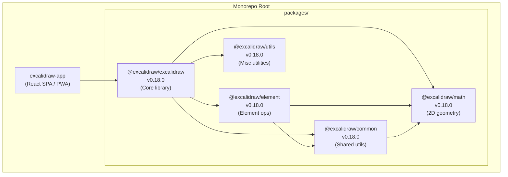
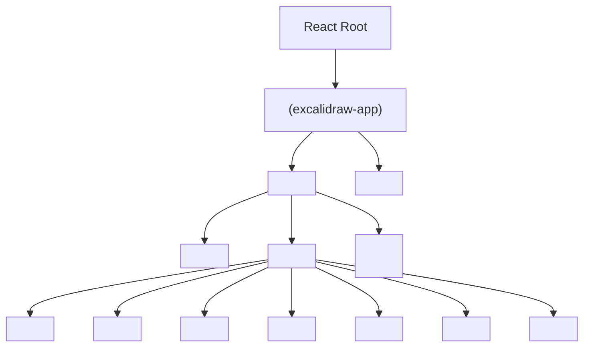
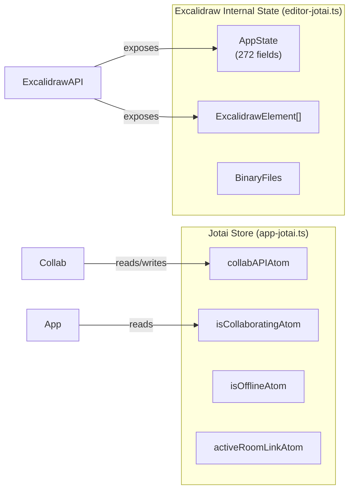
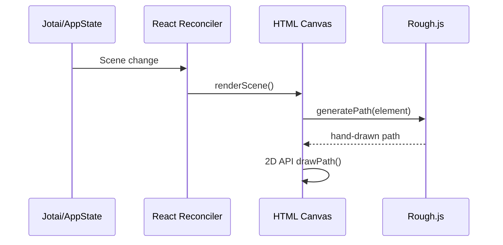

# Architecture

> Cross-reference: [techContext.md](../memory/techContext.md) for stack versions, [systemPatterns.md](../memory/systemPatterns.md) for design patterns.

## High-Level Overview

Excalidraw is a **monorepo** composed of five publishable packages and a standalone web application. All packages share one dependency lock file managed by Yarn Workspaces.



## Layer Breakdown

### Layer 1 — Math & Geometry (`@excalidraw/math`)
Stateless pure functions: vector operations, 2D algebra, angle math. No React, no side effects.

### Layer 2 — Common Utilities (`@excalidraw/common`)
Shared constants, event bus (`appEventBus`), color utilities, bounding-box helpers, data structures (binary heap, queue, promise pool), URL utilities, and the `editorInterface` contract that decouples the editor from specific state implementations.

### Layer 3 — Element Operations (`@excalidraw/element`)
Everything about canvas elements without rendering them:
- Creation (`newElement/`), mutation (`mutateElement/`), duplication (`duplicate/`)
- Geometry: bounds, collision, distance, transforms, resize, z-index
- Advanced: elbow arrows, flowchart layout, fractional indexing, binding, frame management
- Scene graph management (`Scene/`)

### Layer 4 — Core Library (`@excalidraw/excalidraw`)
The public-facing React component and its subsystems:

| Subsystem | Location | Responsibility |
|-----------|----------|---------------|
| App Component | `components/App.tsx` | Root orchestrator (398 KB — largest file) |
| Action System | `actions/` | 46 discrete canvas operations |
| Renderer | `renderer/` | Pure canvas paint from scene state |
| WYSIWYG | `wysiwyg/` | In-canvas text editing |
| Fonts | `fonts/`, `subset/` | Font loading, subsetting for SVG export |
| Data | `data/` | Serialize, compress, encrypt, restore |
| Scene | `scene/` | Scene state transitions |
| Hooks | `hooks/` | Reusable React hooks |
| Locales | `locales/` | 50+ language strings |
| Components | `components/` | 136 UI components |

### Layer 5 — Web Application (`excalidraw-app`)
Wraps the library with production concerns:

| Module | Responsibility |
|--------|---------------|
| `App.tsx` | App shell, initializes Excalidraw with all props |
| `collab/Collab.tsx` | WebSocket collaboration, session lifecycle |
| `collab/Portal.tsx` | Socket.io portal (send/receive) |
| `data/firebase.ts` | Firebase CRUD operations |
| `data/LocalData.ts` | localStorage + IndexedDB persistence |
| `data/FileManager.ts` | File upload/download with Firebase Storage |
| `data/tabSync.ts` | Cross-tab scene synchronization |
| `data/index.ts` | Encryption, compression, backend sync |
| `app-jotai.ts` | Jotai store wrapper (prevents direct imports) |

## Component Hierarchy (Runtime)



## State Architecture



## Action System

All 46 canvas operations are defined as `Action` objects:

```typescript
interface Action {
  name: string
  label?: string
  perform: (elements, appState, value, app) => ActionResult
  keyTest?: (event) => boolean
  contextItemLabel?: string
  PanelComponent?: React.FC   // renders in properties panel
}
```

The `ActionManager` registers actions and dispatches them from keyboard events, context menus, and the command palette — single definition, multiple triggers.

## Rendering Pipeline



The renderer is a **pure function** — same input always produces same pixels. No side effects or subscriptions inside the render path.

## Public API Surface (`ExcalidrawImperativeAPI`)

Key imperative API methods accessed via `onExcalidrawAPI` prop callback:

| Category | Methods |
|----------|---------|
| Scene | `updateScene()`, `resetScene()`, `getSceneElements()`, `applyDeltas()` |
| Elements | `mutateElement()`, `scrollToContent()` |
| State | `getAppState()`, `getFiles()`, `refresh()` |
| Tools | `setActiveTool()`, `setCursor()`, `resetCursor()` |
| UI | `toggleSidebar()`, `registerAction()` |
| Events | `onChange()`, `onPointerDown()`, `onPointerUp()`, `onScrollChange()`, `onStateChange()`, `onEvent()` |

All event subscriptions return an **unsubscribe** function.
