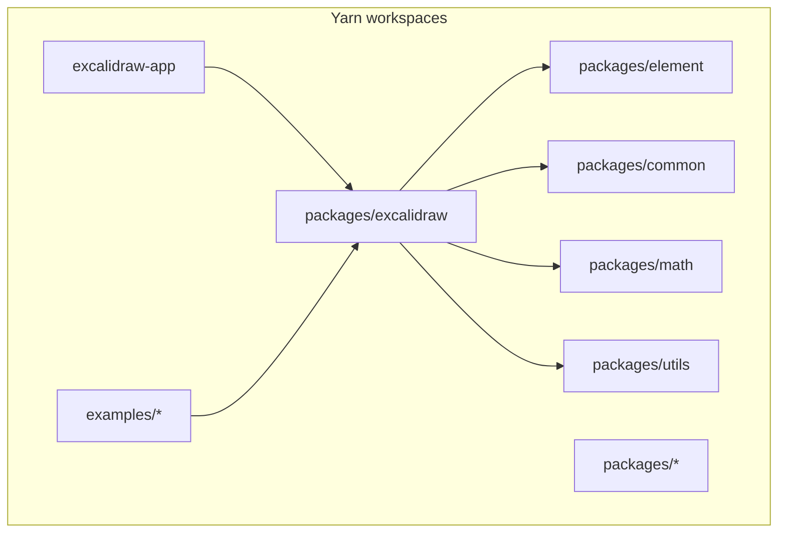
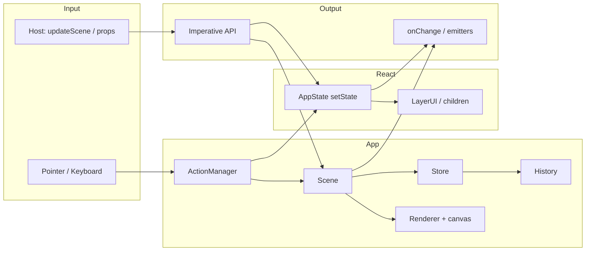
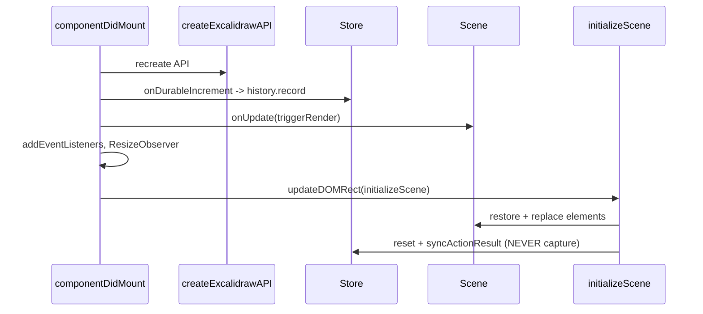

# Architecture — Excalidraw monorepo

This document describes the editor architecture at the repository and `@excalidraw/excalidraw` package level: layers, data flow, and state management. A shorter summary also lives in the [memory bank](../memory/).

---

## 1. Monorepo (repository level)



- **Root:** `package.json` — `name: excalidraw-monorepo`, `workspaces: ["excalidraw-app", "packages/*", "examples/*"]`.
- **App:** `excalidraw-app` — full web application (Vite, React 19, dependencies such as Firebase / socket.io for product features).
- **Library:** `packages/excalidraw` — React component and public API for embedding.
- **Domain:** `packages/element`, `packages/common`, `packages/math`, `packages/utils` — shared element logic, types, and math.

---

## 2. Package entry: `<Excalidraw />`

The outer layer is a functional component in `packages/excalidraw/index.tsx` that:

- normalizes `UIOptions`;
- loads polyfills and global styles;
- wraps the editor in **`EditorJotaiProvider`** (isolated Jotai store);
- renders **`InitializeApp`** (language, theme, etc.) and inside it the class **`App`**.

```169:215:packages/excalidraw/index.tsx
  return (
    <EditorJotaiProvider store={editorJotaiStore}>
      <InitializeApp langCode={langCode} theme={theme}>
        <App
          onExport={onExport}
          onChange={onChange}
          onIncrement={onIncrement}
          initialData={initialData}
          onExcalidrawAPI={handleExcalidrawAPI}
          onMount={onMount}
          onUnmount={onUnmount}
          onInitialize={onInitialize}
          ...
        >
          {children}
        </App>
      </InitializeApp>
    </EditorJotaiProvider>
  );
```

Optionally, **`ExcalidrawAPIProvider`** lets hooks such as `useExcalidrawAPI()` work **outside** the `<Excalidraw />` tree (see the comment in the same file).

---

## 3. Editor core: class `App`

`packages/excalidraw/components/App.tsx` is the central orchestrator.

### 3.1 Key instances

| Component | Role |
|-----------|------|
| **`Scene`** | Canvas elements, mutations, scene updates |
| **`Store`** | Snapshots / deltas for undo/redo and external subscribers (`onIncrement`) |
| **`History`** | History stack driven by durable store increments |
| **`ActionManager`** | Registers and runs actions (user commands) |
| **`Renderer`** | Canvas drawing against `Scene` |
| **`Library`**, **`Fonts`** | Shape library, fonts |

The constructor creates `scene`, `store`, `history`, registers `actions` and undo/redo.

### 3.2 Imperative API

`createExcalidrawAPI()` returns an object with `updateScene`, `getAppState`, `onChange`, `onIncrement`, `onStateChange`, etc. — the host-app contract.

---

## 4. State management (three layers)

The architecture is **not** a single Redux/Context for everything; state is split by responsibility.

### 4.1 `AppState` (React `this.state`)

- UI and session state: tool, zoom, scroll, selection, dialogs, theme, view modes, etc.
- Updated via `setState` on `App` and methods wrapped in `withBatchedUpdates`.

### 4.2 `Scene` + `Store` + `History` (canvas data and history)

- **Elements** live in **`Scene`** (not as one large array in React state).
- **`Store`** coordinates **capture** of updates for undo/redo and emits increments.
- In `componentDidMount`: durable increments → **`history.record`**, optionally `onIncrement` from props.

```3098:3109:packages/excalidraw/components/App.tsx
    this.store.onDurableIncrementEmitter.on((increment) => {
      this.history.record(increment.delta);
    });

    if (this.props.onIncrement) {
      this.store.onStoreIncrementEmitter.on((increment) => {
        this.props.onIncrement?.(increment);
      });
    }

    this.scene.onUpdate(this.triggerRender);
```

### 4.3 Jotai (`editor-jotai.ts`)

- Separate **`createStore()`** + **`createIsolation()`** from `jotai-scope`.
- Used for **local UI chrome** (sidebar, dialogs, part of i18n, etc.), not as the source of truth for canvas elements.

`App` can update atoms via `editorJotaiStore.set` and call `triggerRender()` afterward.

---

## 5. Data flow

### 5.1 Overview



### 5.2 `updateScene` — programmatic scene updates

`updateScene` combines element updates, partial `appState`, collaborators, and **`captureUpdate`** policy (what enters the undo stack).

```4532:4578:packages/excalidraw/components/App.tsx
  public updateScene = withBatchedUpdates(
    <K extends keyof AppState>(sceneData: {
      elements?: SceneData["elements"];
      appState?: Pick<AppState, K> | null;
      collaborators?: SceneData["collaborators"];
      captureUpdate?: SceneData["captureUpdate"];
    }) => {
      const { elements, appState, collaborators, captureUpdate } = sceneData;

      if (captureUpdate) {
        ...
        this.store.scheduleMicroAction({
          action: captureUpdate,
          elements: nextElements,
          appState: observedAppState,
        });
      }

      if (appState) {
        this.setState(appState as Pick<AppState, K> | null);
      }

      if (elements) {
        this.scene.replaceAllElements(elements);
      }

      if (collaborators) {
        this.setState({ collaborators });
      }
    },
  );
```

Hosts can use **`applyDeltas`** to apply deltas consistently to the element map and an `AppState` copy.

### 5.3 After each render: store sync and `onChange`

In **`componentDidUpdate`**, after derived UI work, **`store.commit(elementsMap, this.state)`** runs; if the scene is not loading, **`props.onChange`** and the internal emitter run.

```3509:3518:packages/excalidraw/components/App.tsx
    this.store.commit(elementsMap, this.state);

    if (!this.state.isLoading) {
      this.props.onChange?.(elements, this.state, this.files);
      this.onChangeEmitter.trigger(elements, this.state, this.files);
    }
```

This is the main **host contract**: stable `(elements, appState, files)` after changes, with protection against early `onChange` while `isLoading`.

### 5.4 Canvas refresh without changing meaningful `AppState`

`triggerRender`: either forced `scene.triggerUpdate()`, or empty `setState({})` to re-render React.

```4614:4622:packages/excalidraw/components/App.tsx
  private triggerRender = (force?: boolean) => {
    if (force === true) {
      this.scene.triggerUpdate();
    } else {
      this.setState({});
    }
  };
```

`scene.onUpdate(this.triggerRender)` from `componentDidMount` ties scene changes to UI updates.

### 5.5 Initialization sequence (simplified)



Details for loading `initialData`, `restoreElements` / `restoreAppState` are in `initializeScene` in the same file.

---

## 6. Actions (`ActionManager`) and UI layer

- Actions under `packages/excalidraw/actions/*` register with **`ActionManager`**; results sync via **`syncActionResult`** (`appState`, scene, capture flags).
- **`LayerUI`** and related components receive `appState`, `elements`, `actionManager` via props/context and do not duplicate canvas domain logic.

---

## 7. Relationship to `excalidraw-app`

`excalidraw-app` is a separate workspace package that builds the product app (Vite, extra services). It consumes the same workspace packages; collaboration, analytics, and similar integrations live in `excalidraw-app`, not in the minimal embed library surface.

---

## 8. Further reading

- [Memory: system patterns](../memory/systemPatterns.md)
- [Memory: tech context](../memory/techContext.md)
- Source: `packages/excalidraw/components/App.tsx`, `packages/excalidraw/index.tsx`, `packages/excalidraw/editor-jotai.ts`
