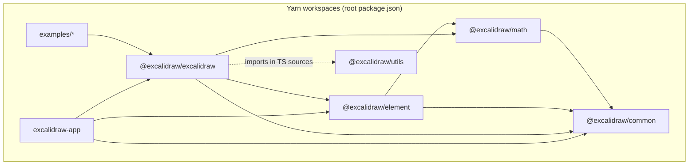
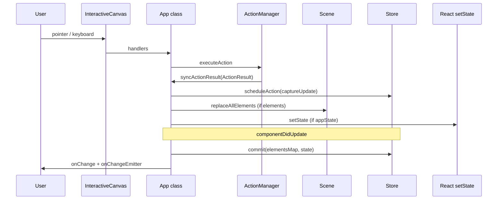
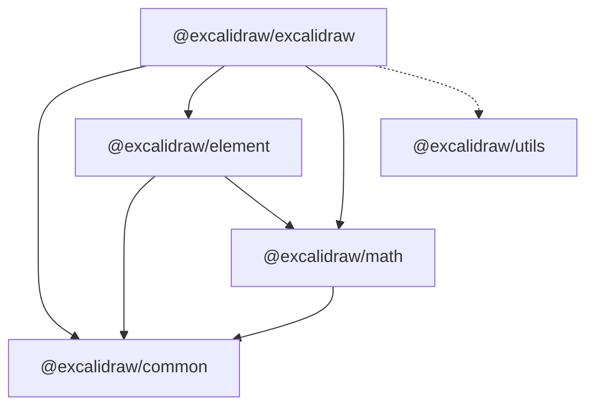

# Excalidraw monorepo — technical architecture

This document describes how the codebase is structured and how the editor moves data from React into pixels. Statements below are tied to concrete modules in this repository.

---

## High-level architecture

### Monorepo roles

- **Root workspace** (`package.json`, `name`: `excalidraw-monorepo`): Yarn **workspaces** over `excalidraw-app`, `packages/*`, and `examples/*`.
- **`excalidraw-app`**: Vite-based SPA that **consumes** `@excalidraw/excalidraw` and related packages (see `excalidraw-app/App.tsx` imports from `@excalidraw/excalidraw`, `@excalidraw/common`, `@excalidraw/element`).
- **`packages/excalidraw`**: The **embeddable editor** — React entry (`index.tsx`), the `App` class (`components/App.tsx`), UI (`components/**`), canvas renderers (`renderer/**`), persistence (`data/**`), and editor-specific **`History`** (`history.ts`).
- **`packages/element`**: **Element model** — `Scene`, `Store`, `CaptureUpdateAction`, `StoreDelta`, rendering helpers such as `renderElement`, mutations, selection, bindings (`element/src/index.ts` barrel exports).
- **`packages/common`**: Shared constants, utilities, events, theme helpers (`description` in `packages/common/package.json`). Depends on **`tinycolor2`** only (`dependencies` there).
- **`packages/math`**: 2D math (`description`: “Excalidraw math functions”). Depends on **`@excalidraw/common`** (`packages/math/package.json`).
- **`packages/utils`**: Export helpers (`exportToCanvas`, `exportToSvg`), bounds helpers, PNG tooling (`description`: “Excalidraw utility functions”). **Does not** list other `@excalidraw/*` packages in its `dependencies` (see `packages/utils/package.json`); editors still **import** it from `@excalidraw/excalidraw` sources (e.g. `@excalidraw/utils/export`).

### Mermaid — workspaces and primary consumers



### Mermaid — editor runtime (inside `packages/excalidraw`)

```mermaid
flowchart LR
  subgraph entry["index.tsx"]
    EJP[EditorJotaiProvider]
    INIT[InitializeApp]
  end

  subgraph core["components/App.tsx (class App)"]
    ST[React state AppState]
    SC[Scene]
    STR[Store]
    HIST[History]
    AM[ActionManager]
    REN[Renderer]
    API[ExcalidrawImperativeAPI]
    Obs[AppStateObserver]
  end

  subgraph views["React children"]
    LUI[LayerUI]
    STC[StaticCanvas]
    NEC[NewElementCanvas]
    ICC[InteractiveCanvas]
  end

  EJP --> INIT --> APP_NODE[App]
  APP_NODE --> ST
  APP_NODE --> SC
  APP_NODE --> STR
  APP_NODE --> HIST
  APP_NODE --> AM
  APP_NODE --> REN
  APP_NODE --> API
  APP_NODE --> Obs
  APP_NODE --> LUI
  APP_NODE --> STC NEC ICC
  AM -->|syncActionResult| SC
  AM --> ST
  STR --> HIST
```

---

## Data flow

### 1. User / host input

- **Pointer and keyboard** events are handled on **`InteractiveCanvas`** (callbacks such as `onPointerDown`, `onPointerMove`, `onPointerUp` are passed from `App` in `components/App.tsx`).
- **Menu / command palette / context menu** actions go through **`ActionManager`** (`actions/manager.tsx`): `handleKeyDown` chooses an `Action` by `keyTest` and priority; **`executeAction`** ultimately invokes the action’s **`perform`** with `(elements, appState, formData, app)`.

### 2. Action results → scene and UI

- Actions return an **`ActionResult`** (`actions/types.ts`): optional `elements`, `appState`, `files`, plus required **`captureUpdate`** (typed as `CaptureUpdateActionType` from `@excalidraw/element`).
- **`App.syncActionResult`** (`components/App.tsx`):
  - Calls **`this.store.scheduleAction(actionResult.captureUpdate)`** (and later `commit` runs from the React update cycle — see below).
  - If `actionResult.elements` is set: **`this.scene.replaceAllElements(actionResult.elements)`**.
  - If `actionResult.appState`: merges into React state via **`this.setState`**, with special handling for `editingTextElement`, `viewModeEnabled`, `zenModeEnabled`, `theme`, `name`, `errorMessage`, and forces **`contextMenu: null`** for that path.
  - If `files`: **`addMissingFiles`** / cache refresh.
  - If nothing changed elements or app state, **`this.scene.triggerUpdate()`** as a fallback to refresh views.

### 3. API-driven updates

- **`App.updateScene`** (`components/App.tsx`) accepts optional `elements`, `appState`, `collaborators`, and **`captureUpdate`**.
  - When `captureUpdate` is present, it calls **`this.store.scheduleMicroAction`** with elements and an **`observedAppState`** derived from **`getObservedAppState`** and the current **`this.store.snapshot.appState`** (JSDoc in `updateScene` explicitly links **`Store`** capture to **`History`** / undo semantics).
  - Applies **`setState`** for `appState`, **`scene.replaceAllElements`** for `elements`, and **`setState({ collaborators })`** for collaboration.

### 4. Store commit, change notifications, and history

- In **`componentDidUpdate`**, after **`appStateObserver.flush(prevState)`**, **`App`** calls **`this.store.commit(elementsMap, this.state)`** with maps from **`this.scene.getElementsMapIncludingDeleted()`** (`components/App.tsx`).
- When **`!this.state.isLoading`**, the host callback **`this.props.onChange`** runs, and **`this.onChangeEmitter.trigger(elements, this.state, this.files)`** fires (`componentDidUpdate` block).

### 5. Outbound persistence / export

- **`data/`** modules (JSON/blob, restore) feed **`updateScene`** / **`syncActionResult`** paths during load.
- **`packages/excalidraw/renderer/staticScene`** and element **`renderElement`** participate in drawing; **export** also uses **`@excalidraw/utils`** (`exportToCanvas`, `exportToSvg`) from components such as `ImageExportDialog.tsx` and re-exports in `index.tsx`.

### Mermaid — simplified update path



---

## State management

### `AppState` (React state on `App`)

- **Definition / defaults**: `appState.ts` exports **`getDefaultAppState()`**, which initializes tool, colors, scroll/zoom-related defaults, selection maps, dialog keys, grid, collaborators map, stats panel flags, etc.
- **Living state**: `class App extends React.Component<AppProps, AppState>` holds authoritative UI/interaction state (`components/App.tsx`).
- **Selective subscription for embedders**: **`AppStateObserver`** (`components/AppStateObserver.ts`) wraps **`() => this.state`**; **`onStateChange`** supports keys, key arrays, selectors, or predicates. **`flush(prevState)`** is called from **`componentDidUpdate`** so listeners run after commits.
- **Public hook surface**: `hooks/useAppStateValue.ts` uses **`api.onStateChange`** from **`ExcalidrawImperativeAPI`**.

### Elements (`Scene` + maps)

- **`Scene`** is constructed in **`App`**’s constructor (**`this.scene = new Scene()`**) and owns the ordered element list and mutation entry points used throughout `App`.
- **`App`** passes **`this.scene.getNonDeletedElements()`** into **`ExcalidrawElementsContext.Provider`** and uses **`getElementsIncludingDeleted`** / **`getElementsMapIncludingDeleted`** in **`componentDidUpdate`** for store commit and `onChange`.
- **Mutations** can go through **`App.mutateElement`**, which delegates to **`this.scene.mutateElement`** (`components/App.tsx`).
- **Bulk replace** uses **`scene.replaceAllElements`** from both **`syncActionResult`** and **`updateScene`**.

### `Store`, `CaptureUpdateAction`, and `History`

- **`Store`** is from **`@excalidraw/element`** and is constructed as **`new Store(this)`** in **`App`**’s constructor.
- **`CaptureUpdateAction`** values are defined in the element package and appear in every **`ActionResult`** and in **`updateScene`**’s optional `captureUpdate` parameter. The inline JSDoc on **`updateScene`** documents **`IMMEDIATELY`**, **`NEVER`**, and **`EVENTUALLY`** behaviors with respect to undo/redo.
- **`History`** is implemented in **`packages/excalidraw/history.ts`**: it subclasses **`StoreDelta`**, uses **`StoreSnapshot`**, and coordinates undo/redo with **`StoreChange`** events from **`@excalidraw/element`**. **`App`** registers **`createUndoAction`** / **`createRedoAction`** on its **`ActionManager`**.

### `ActionManager`

- **`ActionManager`** (`actions/manager.tsx`) stores **`actions`** by **`ActionName`**, holds references to **`getAppState`**, **`getElementsIncludingDeleted`**, and the **`App`** instance as **`app`** (`AppClassProperties`).
- **Constructor** sets **`this.updater`** to wrap async action results toward the **`updater`** passed in — for **`App`**, that **`updater`** is **`syncActionResult`** (see `new ActionManager(this.syncActionResult, ...)` in `App` constructor).
- **Registration**: **`registerAction` / `registerAll`**; **`App`** calls **`registerAll(actions)`** and adds undo/redo actions after imports from **`actions/index`** (`components/App.tsx` constructor region).
- **Action shape** (`actions/types.ts`): **`Action`** includes **`perform`**, optional **`keyTest`**, **`keyPriority`**, **`PanelComponent`**, and optional **`trackEvent`** for analytics.

### Jotai and scoped atoms

- **`editor-jotai.ts`** uses **`createIsolation()`** from **`jotai-scope`** and exports **`EditorJotaiProvider`**, **`useAtom`**, **`useStore`**, etc., bound to that isolation. Root **`index.tsx`** wraps the tree with **`EditorJotaiProvider store={editorJotaiStore}`**.
- **`context/tunnels.ts`** creates per-mount **tunnel-rat** tunnels and a separate **`tunnelsJotai`** isolation for portal-related state (comment notes future per-editor stores).
- Various UI atoms exist in components (examples from codebase search: **`isLibraryMenuOpenAtom`** in `LibraryMenu.tsx`, **`isSidebarDockedAtom`** in `Sidebar/Sidebar.tsx`, **`activeEyeDropperAtom`** in `EyeDropper.tsx`). **`App`** reads **`editorJotaiStore.get(convertElementTypePopupAtom)`** during render for conditional UI.

---

## Rendering pipeline: React to canvas

### 1. React render phase (`App.render`)

- **`App`** computes **`visibleElements`** using **`this.renderer.getRenderableElements`** (the **`Renderer`** class in **`scene/Renderer.ts`** uses **`renderStaticSceneThrottled`** import path and viewport checks via **`isElementInViewport`** from `@excalidraw/element`).
- It supplies **`sceneNonce`** / **`selectionNonce`** to canvas components for memoization.

### 2. Layering in the DOM

- Order in **`App`**’s JSX (`components/App.tsx`): **`LayerUI`** (tool chrome and dialogs), portal containers, **`SVGLayer`** (trails), contextual overlays (**`Hyperlink`**, etc.), **`StaticCanvas`**, optional **`NewElementCanvas`**, then **`InteractiveCanvas`**.

### 3. `StaticCanvas` (main scene bitmap)

- **`StaticCanvas`** (`components/canvases/StaticCanvas.tsx`):
  - On first mount, inserts **`props.canvas`** (a shared **`HTMLCanvasElement`** created in **`App`**’s constructor) into a wrapper div with classes **`excalidraw__canvas`** / **`static`**.
  - Each `useEffect` run calls **`renderStaticScene({ canvas, rc, scale, elementsMap, allElementsMap, visibleElements, appState, renderConfig }, isRenderThrottlingEnabled())`** from **`renderer/staticScene.ts`**.
- **`renderStaticScene`** (`renderer/staticScene.ts`) imports **`renderElement`** from **`@excalidraw/element`** and uses **`@excalidraw/common`** for theming/grid behaviors.

### 4. `NewElementCanvas` (in-progress element)

- Rendered only when **`this.state.newElement`** is truthy (`components/App.tsx`).
- **`NewElementCanvas`** (`components/canvases/NewElementCanvas.tsx`) calls **`renderNewElementScene`** from **`renderer/renderNewElementScene.ts`** with **`props.appState.newElement`**.

### 5. `InteractiveCanvas` (handles + collaboration cursors)

- **`InteractiveCanvas`** (`components/canvases/InteractiveCanvas.tsx`) calls **`renderInteractiveScene`** from **`renderer/interactiveScene.ts`**.
- **`interactiveScene.ts`** imports geometry from **`@excalidraw/math`**, UI constants from **`@excalidraw/common`**, hit testing and **`renderSelectionElement`** from **`@excalidraw/element`**.
- It receives **`renderInteractiveSceneCallback`** from **`App`** (`App.renderInteractiveSceneCallback` updates scroll-related **`scrolledOutside`** and image refresh scheduling).

### 6. Rough.js

- **`App`** constructs **`rough.canvas(this.canvas)`** into **`this.rc`** (**`RoughCanvas`**) in the constructor and passes **`rc`** into **`StaticCanvas`** / **`NewElementCanvas`** so static and new-element draws share the Rough renderer.

### 7. Reconciliation and memoization

- **`StaticCanvas`** uses a custom **`areEqual`** that compares **`sceneNonce`**, **`scale`**, **`elementsMap`**, and **`visibleElements`** (`StaticCanvas.tsx`) so canvas React props stabilize when possible.
- **`InteractiveCanvas`** maintains animation/render configuration in refs and syncs collaborator-derived maps before drawing.

---

## Package dependencies

### Declared `dependencies` between workspace libraries

| Package | Depends on (workspace / notable) | Source |
|---------|-----------------------------------|--------|
| `@excalidraw/common` | `tinycolor2` | `packages/common/package.json` |
| `@excalidraw/math` | `@excalidraw/common@0.18.0` | `packages/math/package.json` |
| `@excalidraw/element` | `@excalidraw/common@0.18.0`, `@excalidraw/math@0.18.0` | `packages/element/package.json` |
| `@excalidraw/utils` | `@braintree/sanitize-url`, `@excalidraw/laser-pointer`, `browser-fs-access`, `pako`, `perfect-freehand`, PNG packages, `roughjs` | `packages/utils/package.json` |
| `@excalidraw/excalidraw` | `@excalidraw/common`, `@excalidraw/element`, `@excalidraw/math@0.18.0`, plus many npm packages (`jotai`, `roughjs`, CodeMirror, Radix, …) | `packages/excalidraw/package.json` |

Version **`0.18.0`** appears on **`common`**, **`element`**, **`math`**, and **`excalidraw`** in their respective `version` fields; **`utils`** is **`0.1.2`**.

### Build order at the root

- **`yarn build:packages`** runs **`build:common` → `build:math` → `build:element` → `build:excalidraw`** (`package.json` scripts at repo root), matching the dependency chain above.

### Application layer

- **`excalidraw-app`** lists **`react@19.0.0`**, **`react-dom@19.0.0`**, **`jotai@2.11.0`**, **`firebase`**, **`socket.io-client`**, **`@sentry/browser`**, etc. (`excalidraw-app/package.json`). Its **`App.tsx`** imports the embeddable editor and deep paths under `@excalidraw/excalidraw/...` plus **`@excalidraw/element`** and **`@excalidraw/common`**.

### Mermaid — package dependency DAG (workspace libs only)



---

## Appendix: key file map

| Concern | Location |
|---------|----------|
| Workspace config | Root `package.json` |
| Editor entry | `packages/excalidraw/index.tsx` |
| Orchestrator | `packages/excalidraw/components/App.tsx` |
| Default React state | `packages/excalidraw/appState.ts` |
| Action types | `packages/excalidraw/actions/types.ts` |
| Action manager | `packages/excalidraw/actions/manager.tsx` |
| State observer | `packages/excalidraw/components/AppStateObserver.ts` |
| Undo/redo | `packages/excalidraw/history.ts` |
| Jotai isolation | `packages/excalidraw/editor-jotai.ts` |
| UI tunnels | `packages/excalidraw/context/tunnels.ts` |
| Static draw | `packages/excalidraw/renderer/staticScene.ts` |
| Interactive draw | `packages/excalidraw/renderer/interactiveScene.ts` |
| Static canvas component | `packages/excalidraw/components/canvases/StaticCanvas.tsx` |
| Interactive canvas component | `packages/excalidraw/components/canvases/InteractiveCanvas.tsx` |
| Element / scene / store exports | `packages/element/src/index.ts` |
| Host app composition | `excalidraw-app/App.tsx` |
