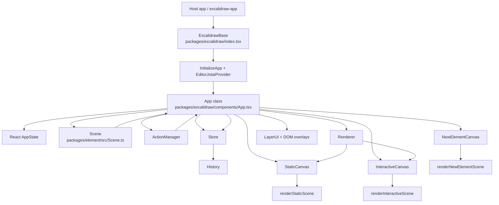
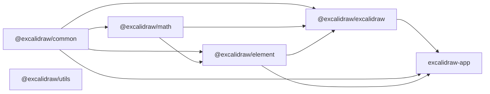

# Architecture

This document describes the runtime architecture implemented in the current source tree.
It focuses on the workspace packages, the editor runtime in `packages/excalidraw`, and the application shell in `excalidraw-app`.
All statements below are derived from source files in this repository.

## High-level Architecture

The workspace is a Yarn monorepo.
The root `package.json` defines workspaces for `excalidraw-app`, `packages/*`, and `examples/*`.

The published editor library lives in `packages/excalidraw`.
The browser application shell lives in `excalidraw-app`.

At runtime, the core editor is centered around the `App` class component in `packages/excalidraw/components/App.tsx`.
`App` owns the editor state, scene model, action system, store/history integration, and canvas rendering orchestration.

`ExcalidrawBase` in `packages/excalidraw/index.tsx` wraps `App` in `EditorJotaiProvider` and `InitializeApp`.
It normalizes `UIOptions`, installs a polyfill, and forwards public props such as `initialData`, `onChange`, `onIncrement`, `renderTopLeftUI`, and `renderTopRightUI`.

Inside `App`, the constructor creates these long-lived runtime objects:

- `Library`
- `ActionManager`
- `Scene`
- a static HTML canvas plus a RoughJS canvas wrapper
- `Renderer`
- `Store`
- `History`
- `Fonts`

The scene model is split from React state.
Elements are stored in `Scene` from `packages/element/src/Scene.ts`.
UI and editor session state are stored in React component state using the `AppState` shape from `packages/excalidraw/types.ts`.

Rendering is also split across layers.
`App.render()` computes `selectedElements`, `elementsMap`, and `visibleElements`.
It then renders:

- `LayerUI` for the DOM-based editor UI
- `SVGLayer` for trails
- `StaticCanvas` for scene elements
- `NewElementCanvas` for the in-progress element preview
- `InteractiveCanvas` for selection boxes, handles, cursors, snapping, and scrollbars

The scene object actively notifies the editor about element changes.
`Scene.replaceAllElements()` updates internal maps and arrays and then calls `triggerUpdate()`.
`App.componentDidMount()` subscribes to `scene.onUpdate(this.triggerRender)`.

The store/history pipeline is separate from rendering.
`Store` in `packages/element/src/store.ts` captures observed scene and app-state changes and emits increments.
`History` in `packages/excalidraw/history.ts` listens to durable increments and records inverse deltas for undo/redo.

### Runtime Diagram

## Data Flow

### 1. Initial scene loading

`App.componentDidMount()` calls `updateDOMRect(this.initializeScene)` unless the web-share flow is active.

`initializeScene` in `packages/excalidraw/components/App.tsx` resolves `this.props.initialData`.
If `initialData` is a function, it awaits the function.
If `initialData` is a promise-like value, it awaits that value.

If `initialData.libraryItems` exists, the editor updates the library first.

`initializeScene` restores the scene through:

- `restoreElements(initialData?.elements, null, { refreshDimensions: false, repairBindings: true, deleteInvisibleElements: true })`
- `restoreAppState(initialData?.appState, null)`

If `initialData.scrollToContent` is set, `calculateScrollCenter()` derives scroll values for the restored scene.

Before applying restored data, `initializeScene` resets store and history.
It then calls `syncActionResult()` with:

- restored elements
- restored app state
- restored files
- `captureUpdate: CaptureUpdateAction.NEVER`

That path loads initial data without creating undo history entries.

### 2. Public scene updates

The imperative API created by `createExcalidrawAPI()` exposes `updateScene`.
`updateScene` accepts:

- `elements`
- partial `appState`
- `collaborators`
- `captureUpdate`

When `captureUpdate` is provided, `updateScene` schedules a store micro-action before mutating React state or scene elements.
When `appState` is provided, it calls `setState`.
When `elements` are provided, it calls `scene.replaceAllElements(elements)`.
When `collaborators` are provided, it updates the `collaborators` field in `AppState`.

### 3. Action execution flow

`ActionManager` stores a map of registered actions keyed by action name.
The constructor receives:

- an updater function
- `getAppState`
- `getElementsIncludingDeleted`
- the `App` instance

Keyboard input flows through `ActionManager.handleKeyDown()`.
It sorts actions by `keyPriority`, filters by enabled canvas actions and `keyTest`, and executes exactly one matching action.

Programmatic or UI-triggered execution flows through `ActionManager.executeAction()`.
That method reads current elements and app state, tracks analytics when configured, and passes the action result to the updater.

The updater in this editor is `App.syncActionResult()`.
`syncActionResult()`:

- ignores `false` results or updates after unmount
- schedules a store action using `actionResult.captureUpdate`
- replaces scene elements when `actionResult.elements` exists
- merges files when `actionResult.files` exists
- updates React state when `actionResult.appState` exists

This means action results can update both scene elements and UI state in one path.

### 4. Scene mutation flow

The scene model lives in `Scene`.
It stores:

- `elements`
- `elementsMap`
- `nonDeletedElements`
- `nonDeletedElementsMap`
- frame-specific subsets
- a selection cache
- a `sceneNonce`

`Scene.replaceAllElements()` converts incoming maps or arrays to an array, validates indices unless validation is skipped, synchronizes invalid indices, rebuilds internal maps, recomputes frame subsets, and triggers an update.

`Scene.mutateElement()` delegates mutation to `mutateElement()` from `@excalidraw/element`.
If the mutated element is still in the scene and its version changed, `Scene` triggers an update when `informMutation` is enabled.

`Scene.getSelectedElements()` caches selection results based on:

- the current `selectedElementIds` object
- the element collection used
- selection options such as bound-text and frame inclusion

### 5. React update to store/increment flow

After React updates, `App.componentDidUpdate()` calls `this.store.commit(elementsMap, this.state)`.
This happens after the editor resolves other side effects such as scroll callbacks and cleanup.

`Store.commit()` first flushes scheduled micro-actions.
It then resolves the highest-priority scheduled macro action:

- `IMMEDIATELY`
- otherwise `NEVER`
- otherwise `EVENTUALLY`

`Store` works with `StoreSnapshot`.
A snapshot contains:

- a `SceneElementsMap`
- an `ObservedAppState`
- metadata flags for element and app-state changes

`ObservedAppState` is not the full `AppState`.
`getObservedAppState()` keeps only a subset:

- `name`
- `editingGroupId`
- `viewBackgroundColor`
- `selectedElementIds`
- `selectedGroupIds`
- `selectedLinearElement`
- `croppingElementId`
- `activeLockedId`
- `lockedMultiSelections`

Durable increments include a `StoreDelta`.
Ephemeral increments include only a `StoreChange`.

If `onIncrement` is provided, `App.componentDidMount()` subscribes to `store.onStoreIncrementEmitter` and forwards increments to the prop callback.

### 6. History flow

`App.componentDidMount()` subscribes to `store.onDurableIncrementEmitter`.
Each durable increment is passed to `history.record(increment.delta)`.

`History.record()` converts the store delta to an inverse `HistoryDelta` and pushes it onto the undo stack.
If the delta changes elements, it clears the redo stack.

Undo and redo do not mutate the scene directly.
`History.undo()` and `History.redo()` compute next elements and app state by applying deltas to the current scene and app state.
They also schedule store micro-actions so history operations become durable increments for synchronization.

### 7. Output callbacks

`App.componentDidUpdate()` calls `this.props.onChange?.(elements, this.state, this.files)` after `store.commit()`, unless the editor is still loading.
It also triggers the internal `onChangeEmitter`.

This means the main output callback observes post-commit editor state, not raw pre-commit action results.

## State Management

### AppState

Default editor state is defined in `packages/excalidraw/appState.ts` by `getDefaultAppState()`.
The default object contains tool state, selection state, scroll/zoom state, export settings, collaborator state, snapping state, frame state, cropping state, and UI state.

Examples of fields initialized there include:

- current item styling fields
- `activeTool`
- `preferredSelectionTool`
- `selectedElementIds`
- `selectedGroupIds`
- `hoveredElementIds`
- `scrollX`
- `scrollY`
- `zoom`
- `collaborators`
- `frameRendering`
- `viewBackgroundColor`
- `objectsSnapModeEnabled`
- `bindMode`

`getDefaultAppState()` intentionally excludes `offsetTop`, `offsetLeft`, `width`, and `height`.
`App` fills those values from DOM measurements and window size in its constructor and resize handling.

`appState.ts` also defines `APP_STATE_STORAGE_CONF`.
That configuration classifies every `AppState` key for three storage targets:

- `browser`
- `export`
- `server`

`clearAppStateForLocalStorage()`, `cleanAppStateForExport()`, and `clearAppStateForDatabase()` all derive filtered state from that config.

### Elements

Scene elements are not stored in React component state.
They are stored in `Scene`.

`Scene` keeps both full and filtered representations:

- `elements`: all ordered elements, including deleted
- `elementsMap`: all elements by id
- `nonDeletedElements`: only non-deleted elements
- `nonDeletedElementsMap`: only non-deleted elements by id
- `frames`: frame-like elements, including deleted
- `nonDeletedFramesLikes`: non-deleted frame-like elements

This separation is used throughout the runtime:

- `ActionManager` reads `getElementsIncludingDeleted()`
- renderers consume `getNonDeletedElements()` and `getNonDeletedElementsMap()`
- selection logic uses `Scene.getSelectedElements()`
- history/store snapshots use `SceneElementsMap`

The scene also maintains `sceneNonce`.
The code comments describe it as a renderer cache-invalidation nonce.
It is regenerated on every scene update.

### ActionManager

`ActionManager` is the command dispatch layer for editor actions.

Its responsibilities in source code are:

- action registration
- keyboard shortcut dispatch
- action execution from UI, keyboard, API, context menu, or command palette
- analytics tracking for action execution
- rendering action-specific panel components
- checking action predicates through `isActionEnabled()`

Actions are plain objects described by `packages/excalidraw/actions/types.ts`.
Each action can define:

- `name`
- `label`
- `perform`
- `keyTest`
- `predicate`
- `PanelComponent`
- `trackEvent`
- `viewMode`

The action result format explicitly supports:

- `elements`
- `appState`
- `files`
- `captureUpdate`
- `replaceFiles`

That result shape is the contract between actions and the editor runtime.

### Store and History

The editor uses a separate state-capture layer in `packages/element/src/store.ts`.

`Store` is responsible for:

- tracking scheduled capture actions
- computing `StoreChange`
- computing `StoreDelta`
- maintaining a current `StoreSnapshot`
- emitting durable and ephemeral increments

`History` is responsible for:

- storing inverse durable deltas
- maintaining undo and redo stacks
- replaying deltas back into scene/app state
- emitting `HistoryChangedEvent`

This design means rendering state, undo/redo state, and scene state are related but not stored in a single structure.

## Rendering Pipeline

### 1. React render computes scene subsets

`App.render()` begins by computing:

- `selectedElements` from `scene.getSelectedElements(this.state)`
- `sceneNonce` from `scene.getSceneNonce()`
- `{ elementsMap, visibleElements }` from `renderer.getRenderableElements(...)`

`Renderer.getRenderableElements()` performs two filtering passes:

1. It excludes the current `newElement`.
2. It excludes the text element currently being edited.
3. It filters the remaining elements to the current viewport using `isElementInViewport(...)`.

The result is:

- `elementsMap`: renderable non-deleted elements
- `visibleElements`: viewport-visible elements

### 2. React mounts canvas components

`App.render()` passes those computed subsets into canvas components.

`StaticCanvas` receives:

- the shared static canvas
- RoughJS canvas wrapper
- renderable element map
- full non-deleted element map
- visible elements
- scene nonce
- scale
- app state
- static render config

`NewElementCanvas` receives the current `newElement`, maps, scale, RoughJS wrapper, app state, and static render config.

`InteractiveCanvas` receives:

- the interactive canvas element reference
- renderable element map
- visible elements
- selected elements
- full non-deleted map
- scene and selection nonces
- scale
- app state
- editor interface
- callback hooks

### 3. Static canvas rendering

`StaticCanvas` is memoized with a custom comparison.
It rerenders when scene nonce, scale, elements map, visible elements, relevant app-state fields, or render config change.

Inside `useEffect`, `StaticCanvas`:

- resizes the canvas to CSS pixels and device pixels
- mounts the shared canvas into a wrapper div on first render
- calls `renderStaticScene(...)`

`renderStaticScene()` in `packages/excalidraw/renderer/staticScene.ts`:

- normalizes canvas dimensions
- bootstraps the canvas context
- applies zoom
- optionally paints the grid
- iterates visible non-iframe elements and calls `renderElement(...)`
- renders bound text with its container
- renders link icons for non-export rendering
- renders iframe-like elements on top
- renders placeholder labels for embeddables when needed
- renders pending flowchart nodes

Frame clipping is handled per element through `frameClip()` when frame rendering and clip mode are enabled.

### 4. New-element preview rendering

`NewElementCanvas` owns a separate canvas element for the currently created element.
Its effect calls `renderNewElementScene(...)`.

`renderNewElementScene()`:

- bootstraps a canvas context
- applies zoom
- returns early for invisible small new elements
- applies frame clipping when needed
- renders only `newElement`
- clears the preview canvas when there is no renderable new element

This isolates in-progress drawing from the committed static scene.

### 5. Interactive canvas rendering

`InteractiveCanvas` is also memoized with a custom comparison.
It rerenders when selection nonce, scene nonce, scale, renderable maps, visible elements, selected elements, scrollbar option, or relevant interactive app-state fields change.

Its effect derives collaboration overlays from `appState.collaborators`:

- remote selected element ids
- remote pointer viewport coordinates
- remote usernames
- remote user states
- remote pointer buttons

It stores those values in `rendererParams.current`.

It then starts `AnimationController` under the key `animateInteractiveScene`.
Each animation step calls `renderInteractiveScene(...)`.

`renderInteractiveScene()` in `packages/excalidraw/renderer/interactiveScene.ts`:

- bootstraps the interactive canvas
- applies zoom
- renders linear-editor handles
- renders the drag selection element
- renders text edit boxes and auto-resize handles
- renders binding highlights
- renders frame and element highlight boxes
- renders selection borders and transform handles
- renders search highlights
- renders snap lines
- renders remote cursors
- optionally renders scrollbars

After rendering, it calls the callback passed from `App`.

### 6. Callback back into App

`App.renderInteractiveSceneCallback()` receives:

- `atLeastOneVisibleElement`
- `scrollBars`
- `elementsMap`

It updates the module-level scrollbar cache and derives `scrolledOutside` when there are elements in the scene but none visible in the viewport.
It also calls `scheduleImageRefresh()`.

## Package Dependencies

### Workspace packages

The monorepo contains these internal packages under `packages/`:

- `@excalidraw/common`
- `@excalidraw/math`
- `@excalidraw/element`
- `@excalidraw/excalidraw`
- `@excalidraw/utils`

### Dependency relationships from package manifests

`@excalidraw/common` depends on `tinycolor2`.

`@excalidraw/math` depends on `@excalidraw/common`.

`@excalidraw/element` depends on:

- `@excalidraw/common`
- `@excalidraw/math`

`@excalidraw/excalidraw` depends on:

- `@excalidraw/common`
- `@excalidraw/element`
- `@excalidraw/math`
- many browser/editor libraries such as RoughJS, Jotai, CodeMirror, and Radix UI

`@excalidraw/utils` does not declare internal package dependencies in its `package.json`.
It declares external dependencies such as `browser-fs-access`, `pako`, `perfect-freehand`, and `roughjs`.

### Import relationships visible in source

`packages/excalidraw` imports heavily from `@excalidraw/common`, `@excalidraw/element`, and `@excalidraw/math`.

Examples from source include:

- `App.tsx` imports math helpers from `@excalidraw/math`
- `App.tsx` imports scene, store, delta, mutation, element creation, selection, and rendering helpers from `@excalidraw/element`
- `Renderer.ts` imports viewport tests from `@excalidraw/element`
- `appState.ts` imports constants from `@excalidraw/common`

`packages/element/src/store.ts` imports `App` and `AppState` types from `@excalidraw/excalidraw`.
That file shows that the store package contains logic that is aware of the editor package's app-state shape.

`excalidraw-app/App.tsx` imports:

- `Excalidraw` from `@excalidraw/excalidraw`
- `trackEvent` from `@excalidraw/excalidraw/analytics`
- `getDefaultAppState` from `@excalidraw/excalidraw/appState`
- restore helpers from `@excalidraw/excalidraw/data/restore`
- `isElementLink`, `newElementWith`, and `isInitializedImageElement` from `@excalidraw/element`
- constants and helpers from `@excalidraw/common`

This makes `excalidraw-app` the browser shell around the reusable editor package.

### Package dependency diagram

## Summary

The implementation is organized around one central runtime component, `App`, plus a separate scene model, a separate store/history capture layer, and a multi-canvas renderer.

The main state split in the codebase is:

- `AppState` for editor/session/UI state
- `Scene` for ordered elements and selection queries
- `Store` for observed snapshots and emitted increments
- `History` for inverse durable deltas

The main rendering split is:

- static scene canvas for committed elements
- preview canvas for the element being created
- interactive canvas for selection and UI overlays

The package split is:

- `common` for shared constants/utilities
- `math` for geometric helpers
- `element` for scene and element logic
- `excalidraw` for the editor runtime and React UI
- `excalidraw-app` for the application shell
