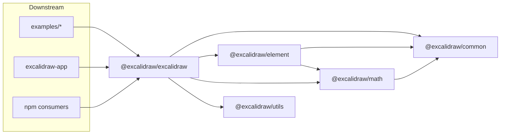
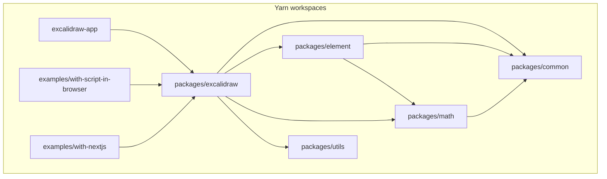
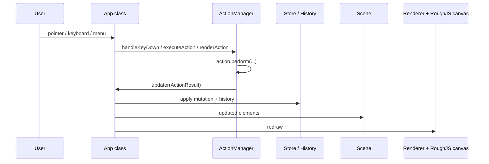

# Technical architecture

This document describes how the **excalidraw-monorepo** is structured at runtime and build time: workspaces, packages, the editor core, the hosted app shell, and how configuration ties them together. It is derived from files in this repository only.

## Purpose and scope

**In scope:** monorepo layout; dependency direction between `@excalidraw/*` packages; responsibilities of `excalidraw-app` vs. `packages/excalidraw`; editor internals (`App`, scene/store/history, actions); where network and product services attach; dev vs. publishable builds; test tooling; integrator extension points.

**Out of scope:** product roadmap; production deployment topology; values of secrets or private `VITE_*` endpoints (only names and loading behavior that appear in config/code are mentioned). For a short product-oriented overview, see [`docs/memory/projectbrief.md`](../memory/projectbrief.md).

## High-level Architecture

The repository ships two related surfaces:

| Surface | Role | Typical entry |
|--------|------|----------------|
| **Hosted product** | Vite-built SPA: PWA registration, optional Sentry, Firebase, socket.io collaboration, app-level Jotai store, dialogs and shell UI around the editor | `excalidraw-app/index.tsx` → `excalidraw-app/App.tsx` |
| **Embeddable library** | React component + CSS + imperative API: canvas editor usable inside third-party apps without the hosted stack | `packages/excalidraw/index.tsx` → internal `packages/excalidraw/components/App.tsx` |

**Dependency direction:** `excalidraw-app` imports `@excalidraw/excalidraw` (and deeper subpaths such as `@excalidraw/excalidraw/data/blob`, components, i18n) plus `@excalidraw/common`. It does **not** own the editor implementation. Consumers who only need the whiteboard can depend on `@excalidraw/excalidraw` and avoid `excalidraw-app` entirely.

## Package Dependencies

Root `package.json` declares **Yarn classic workspaces** (`packageManager`: `yarn@1.22.22`):

- `excalidraw-app` — private host application.
- `packages/*` — `@excalidraw/common`, `@excalidraw/math`, `@excalidraw/element`, `@excalidraw/excalidraw`, `@excalidraw/utils`.
- `examples/*` — reference hosts (`with-script-in-browser`, `with-nextjs`).

**Declared package dependencies (npm-style edges):**

- `@excalidraw/math` → `@excalidraw/common` (`packages/math/package.json`).
- `@excalidraw/element` → `@excalidraw/common`, `@excalidraw/math` (`packages/element/package.json`).
- `@excalidraw/excalidraw` → `@excalidraw/common`, `@excalidraw/element`, `@excalidraw/math`, plus many other runtime libraries (`packages/excalidraw/package.json`); source imports also use `@excalidraw/utils` (export helpers, bounds, test utils), resolved in dev via `tsconfig` / Vite / Vitest aliases and in the main package build via `scripts/buildPackage.js` (see below).

**Aggregate library build order** (root `package.json` script `build:packages`):

`build:common` → `build:math` → `build:element` → `build:excalidraw`.

## Resolution and configuration

**TypeScript** (`tsconfig.json`): `baseUrl` `.`, `paths` map `@excalidraw/common`, `@excalidraw/element`, `@excalidraw/math`, `@excalidraw/utils` to `packages/*/src`, and `@excalidraw/excalidraw` to `packages/excalidraw/index.tsx`. `include` covers `packages` and `excalidraw-app`; `examples` are excluded from this project.

**Vite (host app)** (`excalidraw-app/vite.config.mts`): `loadEnv(mode, "../")` and `envDir: "../"` so `.env*` files are read from the **repository root**, not `excalidraw-app/`. `server.port` defaults to **3000**, overridable with `VITE_APP_PORT`. `resolve.alias` mirrors the same `@excalidraw/*` mappings (paths relative to the monorepo root). Production browser build output directory: **`build`**.

**Vitest** (`vitest.config.mts` at repo root): duplicates the same `resolve.alias` entries; `test.environment` is **`jsdom`**; `setupFiles`: `./setupTests.ts`; `test.globals` enabled; coverage thresholds configured under `test.coverage`.

## State Management

### Host application (`excalidraw-app`)

- **Bootstrap:** `excalidraw-app/index.tsx` mounts `ExcalidrawApp` with `createRoot`, calls `registerSW()` from `virtual:pwa-register`, and imports `../excalidraw-app/sentry` before the app component (Sentry wiring lives next to the app package).
- **Composition:** `excalidraw-app/App.tsx` imports `Excalidraw`, collaboration triggers, command palette pieces, and data helpers from `@excalidraw/excalidraw` and `@excalidraw/common`, and wires hosted-only behavior (local storage keys, share dialogs, collab, theme/language hooks, etc.).
- **App-level state:** `excalidraw-app/app-jotai.ts` re-exports Jotai; modules such as `Collab.tsx`, `ShareDialog.tsx`, `LocalData.ts`, and `App.tsx` use this store for collaboration and shell concerns.

### Editor library (`packages/excalidraw`)

- **Public wrapper:** `packages/excalidraw/index.tsx` applies `polyfill()`, loads global SCSS/fonts, wraps the internal class component `App` from `components/App.tsx`, and provides `ExcalidrawAPIProvider` / related hooks so the imperative API can be used outside the immediate React subtree. It uses `EditorJotaiProvider` and `editorJotaiStore` from `editor-jotai` for editor-scoped reactive state (`updateEditorAtom` on `App` delegates to this store).
- **Core coordinator:** `App` is a large **class component** that owns the interactive editor. In its constructor it constructs `Library`, then `ActionManager` (with `syncActionResult` as the update sink), then `Scene`, an off-DOM `canvas` and **`rough.canvas(this.canvas)`** (RoughJS), `Renderer(this.scene)`, `Store(this)`, `History(this.store)`, `Fonts`, then assigns `History` again (same constructor block), then `actionManager.registerAll(actions)` and registers undo/redo (`createUndoAction` / `createRedoAction` from `actions/actionHistory.tsx`). See `packages/excalidraw/components/App.tsx` around the constructor for the exact sequence.

## Rendering Pipeline

The editor **`App`** class (`packages/excalidraw/components/App.tsx`) keeps an off-DOM **`canvas`**, a **RoughJS** handle from `rough.canvas(this.canvas)` for sketch-style strokes, and a **`Renderer`** driven by **`Scene`**. After input is handled, updates go through **`ActionManager`** → **`Store`** / **`History`** → **`Scene`**, then the renderer redraws the canvas. Frame scheduling follows the browser paint cycle from those mutations (no separate RAF abstraction is documented here beyond standard React reconciliation).

### Failure modes & observability

This subsection summarizes **where things can fail** and **what the repo already exposes** for debugging—**not** a product SLO/SLA.

- **RoughJS / canvas init** — If the off-DOM **`canvas`** or **`rough.canvas(...)`** cannot be created (missing APIs, extreme memory pressure), construction in **`App`** (`packages/excalidraw/components/App.tsx`) fails early; the surface is a normal JS exception during mount.
- **Scene / document consistency** — Mismatches after import, collab, or restore are addressed in **`packages/excalidraw/data/`** (e.g. **`reconcile.ts`**, **`restore.ts`**); the hosted app adds HTTP/Firebase layers in **`excalidraw-app/data/`**.
- **`ActionManager` / `perform`** — A throwing **`perform`** or bad **`ActionResult`** breaks the usual updater path; harden actions and wrap the embed in host-level error boundaries if you customize actions.
- **`Store` / `History`** — Invalid incremental updates can leave history unusable; recovery paths in practice are reload, **restore from blob**, or local storage flows wired from **`excalidraw-app`** (see **`LocalData`** / import helpers in **`App.tsx`**).

**Observability present in-tree:** **`excalidraw-app/index.tsx`** loads **Sentry** when not disabled; **`packages/excalidraw/errors.ts`** centralizes some error helpers; **`trackEvent`** on **`Action`** supports analytics where enabled. There is **no** dedicated metrics pipeline or documented render-time histograms in this repository—use browser **Performance** tooling and **`yarn test:app` / `yarn test:all`** for regressions. **Operators** typically watch Sentry noise, failed requests to **`VITE_APP_BACKEND_V2_*`** endpoints, and collab/socket errors in **`excalidraw-app/collab/`**.

**Recovery patterns (conceptual):** retry failed network calls in the app data layer; reload the SPA after unrecoverable editor errors; use **import/restore** flows in **`packages/excalidraw/data/`** when document bytes are trusted. Integrators embedding **`Excalidraw`** should surface **`onChange`** / **`onExport`** snapshots to their own backup pipeline if they need rollback beyond local history.

For automated gates that catch regressions before merge, see **Testing and quality** later in this document and GitHub workflows referenced from **`docs/memory/activeContext.md`**.

## Data Flow

**Conceptual data path** (simplified):

## Action and command model

- **Shape:** `Action` in `packages/excalidraw/actions/types.ts` includes `name` (`ActionName` union), `perform` (receives elements, `appState`, optional form data, and `app`), optional `keyTest`, `predicate`, `PanelComponent`, `trackEvent`, etc. `ActionResult` can update elements, `appState`, files, and signals capture behavior for the store.
- **Registration:** `packages/excalidraw/actions/register.ts` exports `register()` (which appends each action to a mutable `actions` array) and the `actions` array itself (`App` imports `actions` from this module). Individual action modules call `register(...)` when loaded.
- **Dispatch:** `packages/excalidraw/actions/manager.tsx` defines `ActionManager`. After `registerAll`, shortcuts go through `handleKeyDown` (matches `keyTest` with priority), UI panels use `renderAction` → `perform`, and programmatic use goes through `executeAction` with an `ActionSource` (`"ui" | "keyboard" | "contextMenu" | "api" | "commandPalette"`). All paths funnel into `perform` and the same `updater` that applies `ActionResult` to the app.

## Data and integration boundaries

| Area | Location | Responsibility |
|------|----------|----------------|
| Encode/decode, restore, blob/file helpers, library serialization, reconciliation hooks usable by the editor | `packages/excalidraw/data/` (e.g. `blob.ts`, `restore.ts`, `reconcile.ts`, `index.ts`) | Format- and document-oriented logic tied to the library |
| Backend v2 HTTP, hosted sharing/import, app-specific persistence | `excalidraw-app/data/` (e.g. `index.ts` with `import.meta.env.VITE_APP_BACKEND_V2_GET_URL` / `VITE_APP_BACKEND_V2_POST_URL`) | Network and product integration **outside** the publishable package surface |

**Hosted-only integrations** (present in `excalidraw-app` dependencies and code, not required for a minimal embed):

- **Firebase** (`firebase` in `excalidraw-app/package.json`).
- **Realtime collaboration client** (`socket.io-client`; implementation e.g. `excalidraw-app/collab/Collab.tsx`).
- **Sentry** (`@sentry/browser`; `excalidraw-app/index.tsx` imports `../excalidraw-app/sentry` before `App`).
- **PWA:** `vite-plugin-pwa` in root devDependencies, configured from `excalidraw-app/vite.config.mts`; `registerSW()` in `excalidraw-app/index.tsx`.

**Environment variables:** Host app reads `VITE_*` via Vite from the monorepo root (`envDir`). Examples referenced in repo scripts/config include `VITE_APP_PORT`, `VITE_APP_GIT_SHA`, `VITE_APP_ENABLE_TRACKING`, `VITE_APP_DISABLE_SENTRY` (Docker build script), and backend URLs in `excalidraw-app/data/index.ts`. Exact deployment values are not defined in this documentation.

## Build and publish pipeline

**Development:** Apps and tests resolve `@excalidraw/*` to **TypeScript sources** through `tsconfig.json` paths and matching aliases in `excalidraw-app/vite.config.mts` and `vitest.config.mts`.

**Publishable packages:** Each of `common`, `element`, and `math` runs `build:esm` → `scripts/buildBase.js`, which uses **esbuild** to emit parallel **`dist/dev`** (sourcemaps, `import.meta.env` with `DEV`) and **`dist/prod`** (minify, `PROD`).

**Main editor package:** `packages/excalidraw` runs `rimraf dist && node ../../scripts/buildPackage.js && yarn gen:types`. `scripts/buildPackage.js` uses **esbuild** with **esbuild-sass-plugin**, entry `index.tsx` plus `**/*.chunk.ts`, marks `@excalidraw/common`, `@excalidraw/element`, and `@excalidraw/math` as **external**, aliases `@excalidraw/utils` into the bundle, and emits **`dist/dev`** and **`dist/prod`**. `import.meta.env` is defined from parsed `.env.development` / `.env.production` at the monorepo root via `packages/excalidraw/env.cjs`. `gen:types` runs `tsc` to populate type stubs under `dist/types` as described in `packages/excalidraw/package.json` `exports`.

Consumers resolve `development` vs. `production` **conditional exports** for `@excalidraw/excalidraw` and `./index.css` (`packages/excalidraw/package.json`).

## Testing and quality

- **Unit / integration tests:** Root **Vitest** (`yarn test:app` / `vitest`) with **jsdom**, global test APIs, and path aliases aligned with `tsconfig.json`.
- **Editor-focused tests:** e.g. `packages/excalidraw/tests/` (Testing Library and related devDependencies in `packages/excalidraw/package.json`).
- **Repo-wide gates:** `yarn test:typecheck` (`tsc`), `yarn test:code` (ESLint), `yarn test:other` (Prettier check), combined in `yarn test:all` (see root `package.json`).

## Extension points (integrators)

- **`Excalidraw` props** — callbacks (`onChange`, `onExport`, …), `initialData`, UI slots (`renderTopLeftUI`, etc.), view/theme/grid flags; types under `packages/excalidraw/types` and usage in `packages/excalidraw/index.tsx`.
- **Imperative API** — `onExcalidrawAPI`, `ExcalidrawAPIProvider`, and hooks that read the API from context (see `packages/excalidraw/index.tsx`).
- **CSS contract** — consumers import `@excalidraw/excalidraw/index.css` and provide a non-zero height container (`packages/excalidraw/README.md`).
- **Examples** — `examples/with-script-in-browser` and `examples/with-nextjs` show alternate bundlers and asset copy patterns (e.g. fonts from `packages/excalidraw/dist/prod/fonts` for Next).

## Related documentation

- [`docs/technical/dev-setup.md`](dev-setup.md) — install, run, test, build commands.
- [`docs/product/domain-glossary.md`](../product/domain-glossary.md) — Element, Scene, AppState, Tool, Action (code-aligned terms).
- [`docs/memory/systemPatterns.md`](../memory/systemPatterns.md) — concise pattern notes (diagrams overlap intentionally).
- [`docs/memory/techContext.md`](../memory/techContext.md) — toolchain versions and command tables.
- [`docs/memory/decisionLog.md`](../memory/decisionLog.md) — decision-style summary of workspace, Vite, esbuild, CI splits.
