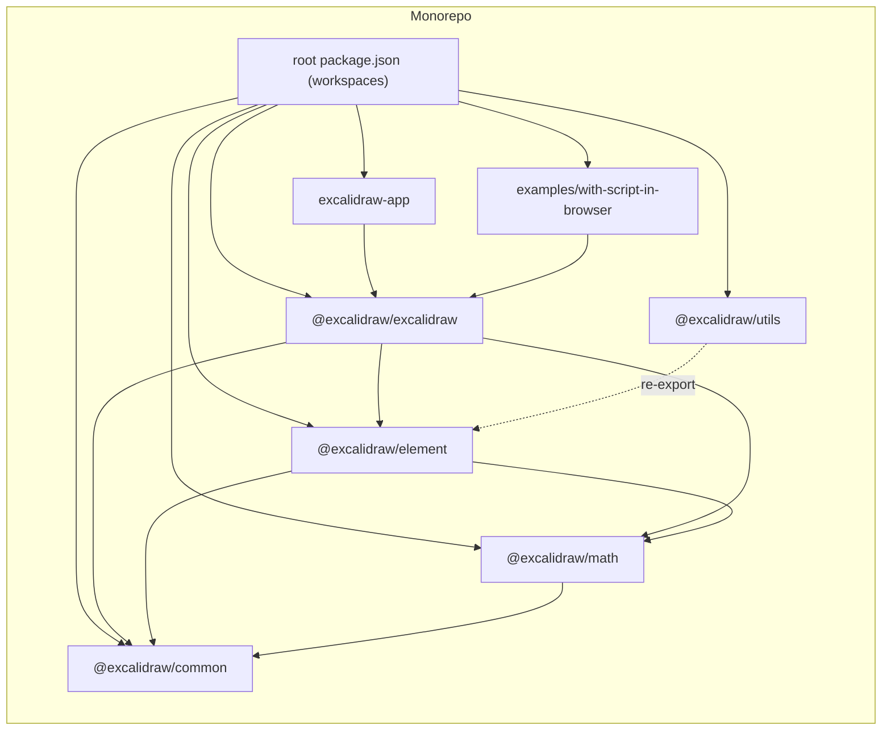
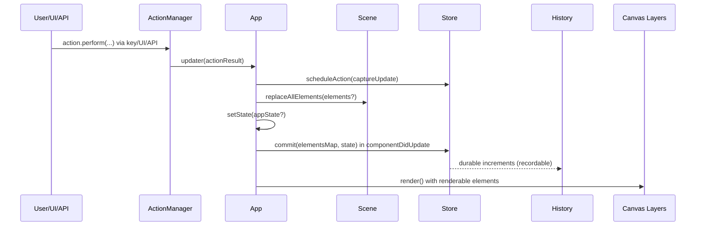
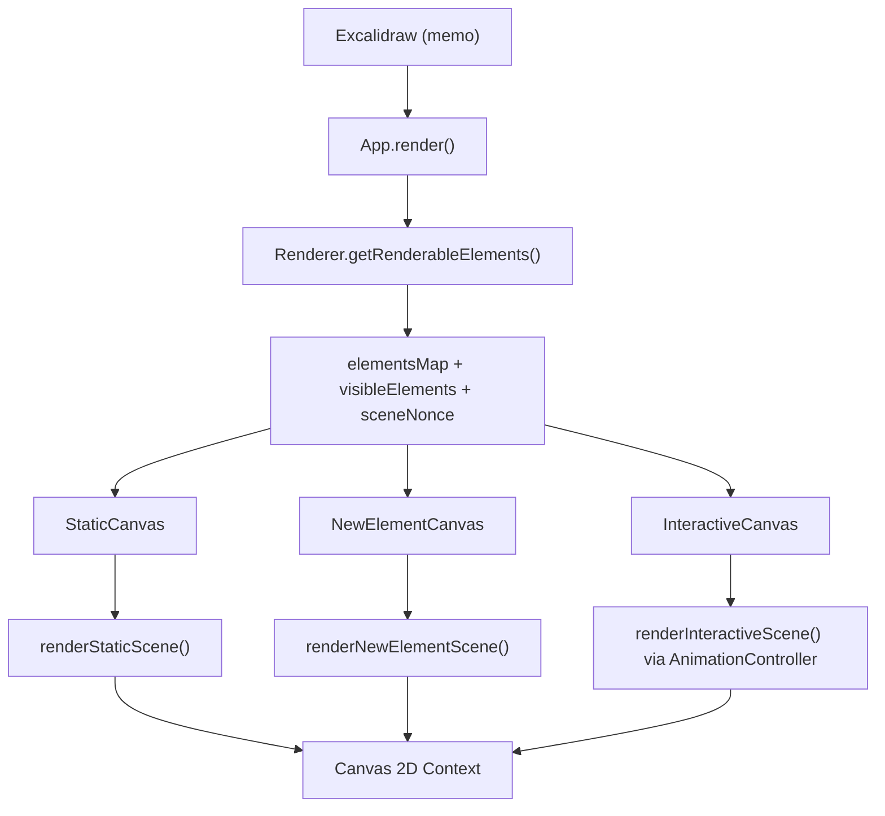
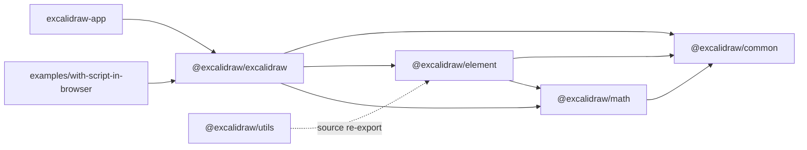

# Architecture

This document describes the current architecture based only on repository source code.

## High-level Architecture

### Repository and workspace model

- The root workspace is a Yarn v1 monorepo (`packageManager: yarn@1.22.22`).
- Root workspace globs are:
  - `excalidraw-app`
  - `packages/*`
  - `examples/*`
- TypeScript path aliases map package names to in-repo source:
  - `@excalidraw/common` -> `packages/common/src/index.ts`
  - `@excalidraw/element` -> `packages/element/src/index.ts`
  - `@excalidraw/math` -> `packages/math/src/index.ts`
  - `@excalidraw/utils` -> `packages/utils/src/index.ts`
  - `@excalidraw/excalidraw` -> `packages/excalidraw/index.tsx`

### Runtime building blocks

- `packages/excalidraw/index.tsx` exports memoized `Excalidraw` and renders `App`.
- `packages/excalidraw/components/App.tsx` defines `class App extends React.Component<AppProps, AppState>`.
- `App` constructor initializes and stores:
  - `scene: Scene`
  - `renderer: Renderer`
  - `store: Store`
  - `history: History`
  - `actionManager: ActionManager`
- `App.render()` composes three canvas layers:
  - `StaticCanvas`
  - `NewElementCanvas` (only when `state.newElement` exists)
  - `InteractiveCanvas`
- `App` also exposes `ExcalidrawImperativeAPI` with methods such as:
  - `updateScene`
  - `applyDeltas`
  - `mutateElement`
  - `addFiles`
  - `resetScene`
  - `history.clear`

### High-level module responsibilities (DDD-style boundaries from code)

- `@excalidraw/common`
  - Common constants and helpers used across packages.
  - Example: default values and theme constants imported by `appState.ts`.
- `@excalidraw/math`
  - Geometry/math primitives and functions.
  - Used by interactive rendering logic.
- `@excalidraw/element`
  - Element/domain core: scene, element operations, store/deltas, selection logic.
  - Key classes: `Scene`, `Store`, `StoreDelta`.
- `@excalidraw/excalidraw`
  - Application layer for React integration, input handling, actions, rendering orchestration.
  - Key classes: `App`, `ActionManager`, `Renderer`, `History`.
- `@excalidraw/utils`
  - Utility exports including export helpers and `getCommonBounds` re-export.
- `excalidraw-app`
  - Host application consuming `@excalidraw/excalidraw` APIs/components.

### Mermaid: high-level architecture

### React shell and orchestration

- `ExcalidrawBase` wraps `App` with:
  - `EditorJotaiProvider`
  - `InitializeApp`
- `App` is the stateful editor orchestrator.
- `App.render()` computes renderable data before rendering canvases:
  - `sceneNonce` from `scene.getSceneNonce()`
  - `elementsMap` and `visibleElements` from `renderer.getRenderableElements(...)`
  - `allElementsMap` from `scene.getNonDeletedElementsMap()`

## Data Flow: як дані рухаються через систему

### 1) Input entry points

- UI and keyboard events are handled in `App` (pointer/keyboard/wheel handlers).
- Keyboard shortcuts are routed through `ActionManager.handleKeyDown(event)`.
- External API calls are routed through `ExcalidrawImperativeAPI` methods.

### 2) Action execution path

- `ActionManager` stores registered actions in `actions: Record<ActionName, Action>`.
- `handleKeyDown()`:
  - filters actions by `keyTest`
  - resolves conflicts by `keyPriority`
  - prevents default event handling
  - calls `this.updater(action.perform(...))`
- `executeAction()`:
  - pulls current elements/appState from getters
  - calls `action.perform(...)`
  - forwards result to updater.
- In `App`, updater is `this.syncActionResult`.

### 3) Applying action results

- `syncActionResult(actionResult)` behavior:
  - ignores `false` and unmounted cases
  - schedules macro capture via `this.store.scheduleAction(actionResult.captureUpdate)`
  - applies element updates via `this.scene.replaceAllElements(actionResult.elements)`
  - merges state via `this.setState(...)`
  - updates file map when files are provided
  - calls `scene.triggerUpdate()` if nothing else changed

### 4) Programmatic scene updates

- `updateScene(sceneData)` behavior:
  - optionally schedules store micro action when `captureUpdate` exists
  - converts app state to observed subset via `getObservedAppState(...)`
  - calls `setState(appState)` when provided
  - calls `scene.replaceAllElements(elements)` when provided
  - updates collaborators in state when provided

### 5) Commit and publish cycle

- React update completes, then `componentDidUpdate(prevProps, prevState)` runs.
- `componentDidUpdate` invokes:
  - `this.appStateObserver.flush(prevState)`
  - `this.store.commit(elementsMap, this.state)`
  - `this.props.onChange?.(elements, this.state, this.files)` when not loading
  - `this.onChangeEmitter.trigger(...)` when not loading
- Result:
  - Store increments are emitted.
  - Durable increments are available for history recording.

### 6) Store event model

- `Store` maintains:
  - scheduled macro actions (`scheduledMacroActions`)
  - scheduled micro actions (`scheduledMicroActions`)
  - current snapshot (`StoreSnapshot`)
- `commit(elements, appState)`:
  - flushes micro actions first
  - processes one resolved macro action
  - emits durable or ephemeral increments depending on action.
- Emitters:
  - `onDurableIncrementEmitter`
  - `onStoreIncrementEmitter`

### 7) History data path

- `History.record(delta)` stores inverse `HistoryDelta` in `undoStack`.
- `undo()` / `redo()`:
  - pop one entry
  - apply delta to elements and appState
  - schedule immediate micro action in store for synchronization
  - move inverse entry to opposite stack
  - emit `HistoryChangedEvent`

### Mermaid: action and data flow

## State Management: детальний опис (appState, elements, actionManager)

### appState

- Primary UI/application state is `AppState` in `App` component state.
- Initial state source:
  - `getDefaultAppState()` in `packages/excalidraw/appState.ts`
  - constructor overrides from props (`viewModeEnabled`, `zenModeEnabled`, `theme`, etc.)
- `getDefaultAppState()` contains defaults for:
  - tool state (`activeTool`, `preferredSelectionTool`)
  - selection state (`selectedElementIds`, `selectedGroupIds`, `selectedLinearElement`)
  - viewport (`scrollX`, `scrollY`, `zoom`, dimensions set later)
  - collaboration state (`collaborators`, `followedBy`, `userToFollow`)
  - rendering options (`frameRendering`, `viewBackgroundColor`, `grid*`)

### appState persistence filtering

- `APP_STATE_STORAGE_CONF` defines per-key persistence for:
  - `browser`
  - `export`
  - `server`
- Export helpers:
  - `clearAppStateForLocalStorage(appState)`
  - `cleanAppStateForExport(appState)`
  - `clearAppStateForDatabase(appState)`
- Internal filter implementation:
  - `_clearAppStateForStorage(appState, exportType)`
  - copies only keys where config enables the target storage type.

### observed appState subset for store snapshots

- `getObservedAppState(appState)` keeps only specific keys:
  - `name`
  - `editingGroupId`
  - `viewBackgroundColor`
  - `selectedElementIds`
  - `selectedGroupIds`
  - `selectedLinearElement` (normalized to `{ elementId, isEditing }`)
  - `croppingElementId`
  - `activeLockedId`
  - `lockedMultiSelections`
- Observed state is tagged with hidden runtime property `__observedAppState`.

### elements and Scene ownership

- `Scene` is the authoritative element container in runtime.
- Internal storage in `Scene`:
  - `elements` (including deleted)
  - `elementsMap` (including deleted)
  - `nonDeletedElements`
  - `nonDeletedElementsMap`
  - frame-specific arrays (`frames`, `nonDeletedFramesLikes`)
- `replaceAllElements(nextElements)`:
  - validates and syncs indices
  - rebuilds maps/arrays
  - recomputes frame lists
  - calls `triggerUpdate()`
- `triggerUpdate()`:
  - regenerates `sceneNonce`
  - invokes registered update callbacks.

### selection state caching

- `Scene.getSelectedElements(opts)` caches selections by:
  - `selectedElementIds` reference
  - elements reference
  - computed hash of options
- Cache is cleared when latest scene elements change and custom elements are not supplied.

### actionManager responsibilities

- Registration:
  - `registerAction(action)`
  - `registerAll(actions)`
- Invocation:
  - `handleKeyDown(event)` for keyboard shortcuts
  - `executeAction(action, source, value)` for API/UI flow
- Rendering:
  - `renderAction(name, data)` renders action panel component when available.
- Data access:
  - reads latest app state via injected getter
  - reads latest elements via injected getter
  - forwards all results to `updater` (App sync function).

### state changes and lifecycle integration

- `App.componentDidUpdate(...)` coordinates post-update state effects:
  - app-state observers flush
  - sync calls for scroll/user-follow changes
  - store commit and onChange publishing
- Undo/redo uses store snapshots and deltas, not direct mutation-only history.

## Rendering Pipeline: від React component до canvas

### Layered rendering architecture

- `App.render()` computes render inputs once per React render.
- Rendering uses three canvases/layers with distinct responsibilities:
  - `StaticCanvas`: persistent scene rendering (elements/background/grid)
  - `NewElementCanvas`: currently drawn new element preview
  - `InteractiveCanvas`: overlays and interaction affordances

### Step-by-step rendering pipeline

1. `Excalidraw` function component renders `<App .../>`.
2. `App.render()` calls `renderer.getRenderableElements(...)`.
3. `Renderer.getRenderableElements(...)`:
   - gets non-deleted elements from `Scene`
   - excludes `newElement` and edited text element from static map
   - filters visible elements using `isElementInViewport(...)`
4. `App` passes:
   - `elementsMap`, `visibleElements`, `allElementsMap`
   - `sceneNonce`, `selectionNonce`
   - current `appState`
   - render configs
5. `StaticCanvas` calls `renderStaticScene(...)`.
6. `NewElementCanvas` calls `renderNewElementScene(...)` when `newElement` exists.
7. `InteractiveCanvas` drives `renderInteractiveScene(...)` via `AnimationController`.

### Static canvas details

- `StaticCanvas` mounts the shared `App.canvas` into wrapper DOM.
- It sets canvas dimensions from `appState.width/height` and device scale.
- `renderStaticScene(...)` can be throttled through `renderStaticSceneThrottled`.
- Static renderer behavior includes:
  - canvas bootstrap and zoom transform
  - optional grid stroke
  - rendering visible non-iframe elements
  - rendering iframe-like elements (with placeholder when needed)
  - optional frame clipping via `frameClip(...)`
  - link icon overlay rendering
  - pending flowchart node rendering

### New element canvas details

- `renderNewElementScene(...)` renders only `appState.newElement`.
- It skips rendering for invisibly small elements.
- It applies frame clip when frame rendering and clip are enabled.
- It clears canvas when there is no renderable new element.

### Interactive canvas details

- `InteractiveCanvas` builds runtime collaborator maps:
  - remote pointer viewport coordinates
  - remote selected element ids
  - remote usernames and user states
- It starts animation loop with key `animateInteractiveScene` if not running.
- `renderInteractiveScene(...)` handles overlays such as:
  - selection borders and transform handles
  - linear element editing handles
  - binding highlights
  - frame highlight and element highlight boxes
  - remote cursor rendering
  - optional scrollbars

### Memoization and redraw gating

- `StaticCanvas` and `InteractiveCanvas` are wrapped with `React.memo`.
- Both compare scene nonces, maps, and relevant `appState` slices.
- `Renderer.getRenderableElements` uses `memoize(...)` and `sceneNonce` as cache invalidation input.

### Mermaid: rendering pipeline

## Package Dependencies: взаємозв'язки між packages

### Workspace package list

- Root workspace package: `excalidraw-monorepo`.
- App package: `excalidraw-app`.
- Library packages:
  - `@excalidraw/excalidraw`
  - `@excalidraw/element`
  - `@excalidraw/math`
  - `@excalidraw/common`
  - `@excalidraw/utils`
- Example packages:
  - `with-nextjs`
  - `with-script-in-browser`

### Declared internal package dependencies

- `@excalidraw/common`
  - no internal monorepo dependency in `dependencies`
  - external runtime dep: `tinycolor2`
- `@excalidraw/math`
  - depends on `@excalidraw/common`
- `@excalidraw/element`
  - depends on `@excalidraw/common`
  - depends on `@excalidraw/math`
- `@excalidraw/excalidraw`
  - depends on `@excalidraw/common`
  - depends on `@excalidraw/element`
  - depends on `@excalidraw/math`
- `@excalidraw/utils`
  - no declared internal monorepo runtime dependency in `package.json`
  - source re-exports `getCommonBounds` from `@excalidraw/element`

### Source-level package coupling examples

- `packages/excalidraw/components/App.tsx` imports `Scene` and store/delta APIs from `@excalidraw/element`.
- `packages/excalidraw/renderer/interactiveScene.ts` imports math APIs from `@excalidraw/math`.
- `packages/excalidraw/appState.ts` imports constants from `@excalidraw/common`.
- `packages/excalidraw/index.tsx` re-exports APIs from:
  - `@excalidraw/element`
  - `@excalidraw/utils/export`
- `packages/utils/src/index.ts` re-exports `getCommonBounds` from `@excalidraw/element`.

### App and examples consuming library package

- `excalidraw-app` contains multiple imports from `@excalidraw/excalidraw`.
- `examples/with-script-in-browser/package.json` depends on `@excalidraw/excalidraw`.
- `examples/with-nextjs` builds workspace packages before running app scripts.

### Mermaid: package dependency graph

### Build script relationships visible in root scripts

- Root build order script `build:packages` runs:
  - `build:common`
  - `build:math`
  - `build:element`
  - `build:excalidraw`
- This order mirrors declared dependency direction:
  - common -> math -> element -> excalidraw.
