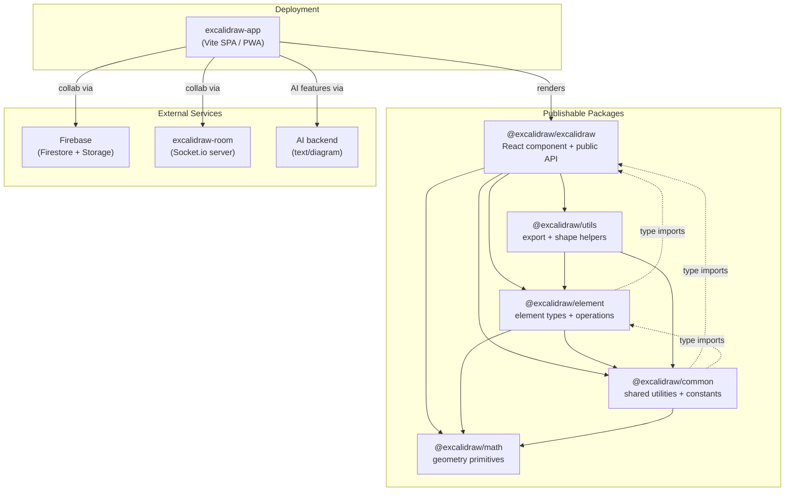
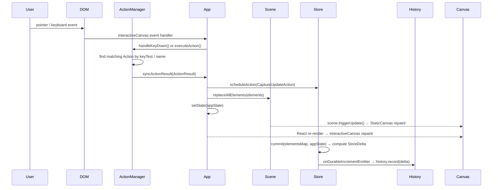
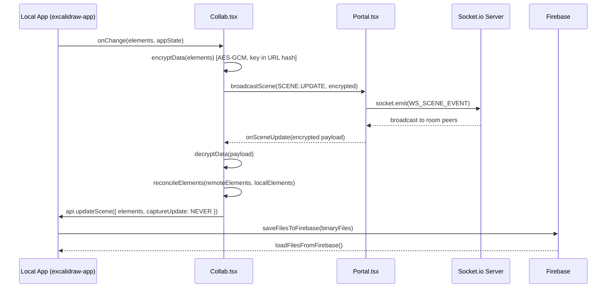

# Architecture: Excalidraw

> **Related docs:** [PRD](../product/PRD.md) · [Domain Glossary](../product/domain-glossary.md) · [System Patterns](../memory/systemPatterns.md) · [Decision Log](../memory/decisionLog.md) · [Tech Context](../memory/techContext.md) · [Project Brief](../memory/projectbrief.md)

## 1. High-level Architecture

Excalidraw is a **Yarn-workspace monorepo** composed of five internal packages and one deployed application. The application layer (`excalidraw-app`) assembles the publishable `@excalidraw/excalidraw` React component with Firebase-backed collaboration, AI features, and PWA infrastructure.



> Note: `@excalidraw/element` and `@excalidraw/common` have circular **type-only** imports back to `@excalidraw/excalidraw` (e.g. `AppState`, `AppProps`). These are `import type` only — no runtime cycle.

---

## 2. Data Flow

### 2a. User Interaction → State Update → Repaint



Key decisions:
- `syncActionResult` (`App.tsx:2735`) is the **single funnel** for all state mutations. It calls `store.scheduleAction` before touching either `scene` or `setState`.
- `CaptureUpdateAction.NEVER` — used for remote/init updates; bypasses history.
- `CaptureUpdateAction.IMMEDIATELY` — recorded immediately to undo stack.
- `CaptureUpdateAction.EVENTUALLY` — batched; committed on the next `store.commit()` call.

### 2b. Collaboration Data Flow



- Encryption key lives in the URL `#hash` only — never sent to the server.
- `reconcileElements` (`packages/excalidraw/data/reconcile.ts`) merges remote and local element arrays using `version` + `versionNonce` for conflict resolution.
- Large binary files (images) are stored in Firebase Storage separately from scene JSON.

### 2c. Initialization Flow

```
componentDidMount
  └─ updateDOMRect(initializeScene)
       └─ initializeScene()  [App.tsx:2860]
            ├─ props.initialData?  → restore from prop
            ├─ URL ?scene=...    → fetch from sharing backend, decrypt
            ├─ Web Share Target  → restoreFileFromShare()
            └─ syncActionResult({ elements, appState, captureUpdate: NEVER })
                 └─ resetHistory()
```

`isLoading: true` is set in the constructor and cleared only after `initializeScene` completes, preventing `onChange` from firing with empty data during init.

---

## 3. State Management

### Three containers

| Container | Type | Holds | Updated via |
|---|---|---|---|
| `this.state` | React class state | `AppState` (~200 props) | `this.setState()` |
| `this.scene` | `Scene` class | all `ExcalidrawElement[]` (including deleted) | `scene.replaceAllElements()`, `mutateElement()` |
| `this.store` | `Store` class | frozen snapshot `{elements, appState}` | `store.commit()` every `componentDidUpdate` |

### AppState (`types.ts:272`)

`AppState` covers everything that is not an element:
- **Viewport:** `scrollX`, `scrollY`, `zoom`, `width`, `height`, `offsetTop`, `offsetLeft`
- **Active tool:** `activeTool`, `currentItemStrokeColor`, `currentItemFontSize`, etc.
- **Selection:** `selectedElementIds`, `selectedGroupIds`
- **UI state:** `openSidebar`, `openDialog`, `showWelcomeScreen`, `isLoading`, `contextMenu`
- **Collaboration:** `collaborators` (Map), `userToFollow`
- **Export / theme:** `exportWithDarkMode`, `theme`

`getDefaultAppState()` (`appState.ts:22`) produces the initial values. `APP_STATE_STORAGE_CONF` (`appState.ts:138`) is a per-key table of `{browser, export, server}` booleans that drives which keys are written to localStorage / included in JSON export / sent to the backend.

### Elements and Scene (`@excalidraw/element`)

`Scene` is the single source of truth for elements. It stores elements in an internal `Map<id, element>` and exposes:
- `getNonDeletedElements()` / `getNonDeletedElementsMap()`
- `getElementsIncludingDeleted()` / `getElementsMapIncludingDeleted()`
- `replaceAllElements(elements)` — full replacement, triggers `onUpdate` callbacks
- `mutateElement(element, updates)` — in-place mutation with version bump, triggers update
- `onUpdate(callback)` — subscribe to any mutation; `App` subscribes `triggerRender`

Elements are **frozen plain objects** (`ExcalidrawElement` interface from `@excalidraw/element/types`). All mutations go through `mutateElement()` which bumps `version` and `versionNonce` for CRDT-style reconciliation.

### Store / History / Delta

```
Store
  ├─ holds: frozen snapshot { elements: Map, appState }
  ├─ commit(elementsMap, appState) → computes StoreDelta via structural diff
  ├─ onDurableIncrementEmitter → History.record(delta)
  └─ onStoreIncrementEmitter   → props.onIncrement?.(increment)

History
  ├─ undoStack: HistoryDelta[]
  ├─ redoStack: HistoryDelta[]
  ├─ record(delta) → inverts delta, pushes to undoStack, clears redoStack
  ├─ undo() → pop undoStack, applyTo(elements, appState), push inverse to redoStack
  └─ redo() → pop redoStack, applyTo(elements, appState), push inverse to undoStack
```

A `StoreDelta` encodes both element changes (added/removed/mutated entries) and `AppState` changes as composable diff objects. Applying a delta rebuilds the affected slice without replacing everything.

### Jotai Atoms (`editor-jotai.ts`)

`editorJotaiStore` is created with `jotai-scope`'s `createIsolation()` — scoped so atoms don't leak to any parent `Provider`. Used exclusively for **ephemeral UI state** that does not need to be undo-able or serialized:

| Atom | Purpose |
|---|---|
| `libraryItemsAtom` | library panel items + load status |
| `isLibraryMenuOpenAtom` | library panel open/closed |
| `isSidebarDockedAtom` | sidebar docked vs floating |
| `activeConfirmDialogAtom` | which confirmation dialog is open |
| `activeEyeDropperAtom` | eye-dropper tool active state |
| `searchQueryAtom` / `searchItemInFocusAtom` | search menu state |
| `rateLimitsAtom`, `chatHistoryAtom` | TTD (text-to-diagram) dialog |
| `editorLangCodeAtom` | current i18n language |

`App` writes into the store imperatively via `updateEditorAtom(atom, ...args)` (`App.tsx:854`), which calls `editorJotaiStore.set()` then `triggerRender()` to force React to re-read the new atom values.

### Context distribution

`App.render()` wraps descendants in **8 nested React Contexts** (`App.tsx:2129`):

```
ExcalidrawAPIContext          → this.api (imperative API object)
 AppContext                   → this (the App class instance)
  AppPropsContext             → this.props
   ExcalidrawContainerContext → { container: HTMLDivElement, id }
    EditorInterfaceContext    → { formFactor, desktopUIMode, … }
     ExcalidrawSetAppStateContext → this.setAppState
      ExcalidrawAppStateContext  → this.state
       ExcalidrawElementsContext → non-deleted elements array
        ExcalidrawActionManagerContext → this.actionManager
```

Sub-components consume these via typed hooks: `useExcalidrawAppState()`, `useExcalidrawElements()`, `useApp()`, `useExcalidrawActionManager()`, etc.

---

## 4. Rendering Pipeline

### Four rendering surfaces

| Surface | React Component | Renderer function | What it paints |
|---|---|---|---|
| Static canvas | `StaticCanvas.tsx` | `renderer/staticScene.ts` | grid, all non-deleted elements, images, SVG embeds |
| New-element canvas | `NewElementCanvas.tsx` | `renderer/renderNewElementScene.ts` | only the element currently being drawn |
| Interactive canvas | `InteractiveCanvas.tsx` | `renderer/interactiveScene.ts` | selection boxes, transform handles, collaborator cursors, snap lines, scroll bars |
| SVG (export only) | — | `renderer/staticSvgScene.ts` | full scene to SVG DOM for `exportToSvg` |

Separating static and interactive canvases means the heavy element repaint does not happen on every cursor move.

### Step-by-step pipeline

```
1. Scene mutation or setState()
      │
2. Renderer.getRenderableElements()          [scene/Renderer.ts:26]
      │  memoized on (sceneNonce, zoom, scroll, viewport dimensions)
      │  calls isElementInViewport() per element
      │  returns { elementsMap: RenderableElementsMap, visibleElements }
      │
3. Props pass to StaticCanvas / InteractiveCanvas
      │
4. StaticCanvas useEffect fires
      │  bootstrapCanvas(canvas, scale, width, height)
      │  ctx.save() / translate(scrollX, scrollY) / scale(zoom)
      │  renderGrid(ctx, gridSize, …)
      │  for each visibleElement:
      │    renderElement(element, elementsMap, rc, ctx, …)   [@excalidraw/element]
      │      └─ delegates to RoughJS (shapes) or direct ctx API (text, images)
      │      └─ ShapeCache.get/set(element) — caches RoughJS output by element version
      │
5. InteractiveCanvas useEffect fires
      │  renderSelectionElement, renderTransformHandles
      │  renderSnaps, renderBindingHighlight
      │  renderRemoteCursors (collaboration)
      │  renderScrollbars
      │
6. SVGLayer (React SVG element, not canvas)
      │  LaserTrails, LassoTrail, EraserTrail
      │  driven by AnimationFrameHandler (RAF loop)
```

### Memoization and cache invalidation

- **`Renderer.getRenderableElements`** — memoized via `memoize` from `@excalidraw/common`. Busts when `sceneNonce` changes (set by `Scene` on every mutation) or viewport params change. Prevents re-running the viewport cull on every unrelated `setState`.
- **`ShapeCache`** — maps `element.id + element.version` → RoughJS `Drawable`. Deleted on `componentWillUnmount` and on `window resize` (canvas DPR changes require redraw).
- **`SnapCache`** — caches snap point computation; cleared on unmount.
- **`isRenderThrottlingEnabled()`** — when true, `renderStaticSceneThrottled` (RAF-throttled variant) is used instead of immediate repaint.

### Dark mode rendering

After painting all elements, `applyDarkModeFilter(canvas)` (`@excalidraw/common`) applies a CSS `invert(93%) hue-rotate(180deg)` filter to the static canvas context when `theme === THEME.DARK`.

---

## 5. Package Dependencies

### Dependency graph

```
@excalidraw/math          ← no internal deps; only tinycolor2 indirectly via common
        ↑
@excalidraw/common        ← depends on @excalidraw/math
        ↑                    type-imports AppState / AppProps from @excalidraw/excalidraw
@excalidraw/element       ← depends on @excalidraw/common, @excalidraw/math
        ↑                    type-imports AppState from @excalidraw/excalidraw
@excalidraw/utils         ← depends on @excalidraw/common, @excalidraw/element
        ↑
@excalidraw/excalidraw    ← depends on all four packages above
        ↑
excalidraw-app            ← depends on @excalidraw/excalidraw
```

### Package responsibilities

**`@excalidraw/math`** (`packages/math/src/`)
- Pure geometry with no DOM or React dependency.
- Exports: `Point`, `Vector`, `Segment`, `Line`, `Curve`, `Ellipse`, `Rectangle`, `Triangle`, `Polygon`, `Radians`, `Degrees`, and all associated operations.
- Used by every other package.

**`@excalidraw/common`** (`packages/common/src/`)
- Shared utilities, constants, and types used across all packages.
- Key exports: `KEYS`, `EVENT`, `THEME`, `FONT_FAMILY`, `Emitter`, `AppEventBus`, `memoize`, `debounce`, `throttleRAF`, `updateObject`, `updateStable`, `arrayToMap`, `isShallowEqual`.
- Contains `colors.ts` (palette generation via `tinycolor2`), `utils.ts`, `keys.ts`, `constants.ts`.
- Has **type-only circular imports** from `@excalidraw/excalidraw` and `@excalidraw/element`.

**`@excalidraw/element`** (`packages/element/src/`)
- All element-type definitions and pure operations — no React, no canvas.
- Key exports: `ExcalidrawElement` types, `Scene`, `Store`, `renderElement`, `mutateElement`, `newElementWith`, `getElementAbsoluteCoords`, `isElementInViewport`, arrow/binding/snapping logic, `reconcileElements`, `StoreDelta`.
- `renderElement` is the per-element canvas paint function; delegates to `roughjs` for shapes.
- `Scene` is the authoritative element container used by `App`.
- `Store` computes structural diffs between snapshots; emits `StoreDelta` to `History`.

**`@excalidraw/utils`** (`packages/utils/src/`)
- Public export utilities consumed by host applications.
- Key exports: `exportToCanvas`, `exportToBlob`, `exportToSvg`, `exportToClipboard`, `getContainerElement`, `getCurvePathOps`, `getEmbedLink`.
- Re-exported wholesale from `@excalidraw/excalidraw/index.tsx`.

**`@excalidraw/excalidraw`** (`packages/excalidraw/`)
- The publishable React component and full editor UI.
- Owns: `App` (root class component), `ActionManager`, `History`, `Renderer`, `Fonts`, `LayerUI`, all canvas components, all dialog/toolbar components.
- Public API surface: `Excalidraw` component, `ExcalidrawImperativeAPI`, slot components (`MainMenu`, `Sidebar`, `Footer`, `WelcomeScreen`), data helpers, constants.

**`excalidraw-app`** (`excalidraw-app/`)
- The production SPA. Not published to npm.
- Adds on top of `@excalidraw/excalidraw`: Firebase persistence, Socket.io collaboration (`Collab.tsx`, `Portal.tsx`), AI features (`AI.tsx`), PWA service worker, Sentry error monitoring, share-link handling, library sync with Excalidraw+.
- Env-configured via `VITE_APP_*` variables (Firebase config, WS server URL, AI backend URL).
