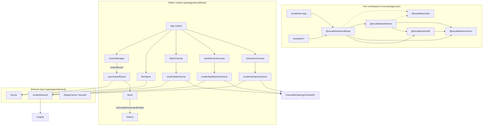

# Technical Architecture

This document describes how the Excalidraw monorepo wires **React UI state**, **scene elements**, **command-style actions**, and **HTML5 Canvas** (with a small **SVG** overlay for specific effects). Names and behaviors below are taken from the TypeScript sources under `packages/excalidraw`, `packages/element`, `packages/common`, `packages/math`, and the host workspace `excalidraw-app`.

---

## High-level Architecture

The editor core is a **class component** `App` in `packages/excalidraw/components/App.tsx`. It owns:

- React `state` typed as `AppState` (`packages/excalidraw/types.ts`).
- A `Scene` instance (`packages/element/src/Scene.ts`) holding the authoritative ordered list and maps of elements.
- A `Store` (`packages/element/src/store.ts`) that diffs snapshots of elements + app state and emits **durable** or **ephemeral** increments.
- A `History` (`packages/excalidraw/history.ts`) that records **inverse deltas** for undo/redo when the store emits durable increments.
- An `ActionManager` (`packages/excalidraw/actions/manager.tsx`) that runs `Action` objects whose `perform` functions return an `ActionResult` consumed by `App.syncActionResult`.
- A `Renderer` (`packages/excalidraw/scene/Renderer.ts`) that memoizes **visible** elements and a **renderable** `Map` for canvas painting.

Child canvas components (`StaticCanvas`, `NewElementCanvas`, `InteractiveCanvas` under `packages/excalidraw/components/canvases/`) invoke imperative renderers in `packages/excalidraw/renderer/` (`staticScene.ts`, `renderNewElementScene.ts`, `interactiveScene.ts`). Those functions obtain a `CanvasRenderingContext2D` via `bootstrapCanvas` in `packages/excalidraw/renderer/helpers.ts` (`canvas.getContext("2d")`).



---

## Data Flow

### Input → action → mutation of scene and/or React state

- **Pointer and keyboard handlers** on `App` are wrapped with `withBatchedUpdates` / `withBatchedUpdatesThrottled` from `packages/excalidraw/reactUtils.ts`, which delegates to React DOM’s `unstable_batchedUpdates` so multiple updates coalesce within one React commit phase.
- Many flows call `actionManager.executeAction(...)`, `handleKeyDown` on `ActionManager`, or UI panels that call `action.perform` via `renderAction`’s `updateData` callback (`packages/excalidraw/actions/manager.tsx`).
- Each `Action`’s `perform` signature is defined in `packages/excalidraw/actions/types.ts` as `ActionFn`: it receives `(elements, appState, formData, app)` and returns `ActionResult` or `Promise<ActionResult>`, or `false` to abort.

### Applying an `ActionResult`

`App.syncActionResult` (`packages/excalidraw/components/App.tsx`):

- Calls `this.store.scheduleAction(actionResult.captureUpdate)` with a `CaptureUpdateAction` value from `@excalidraw/element` (`IMMEDIATELY`, `NEVER`, or `EVENTUALLY` — see `packages/element/src/store.ts`).
- If `actionResult.elements` is set, calls `this.scene.replaceAllElements(actionResult.elements)`.
- Merges `actionResult.appState` into React state via `this.setState` (with special handling for `editingTextElement`, hosted props like `viewModeEnabled`, etc.).
- If nothing changed elements or app state, it may call `this.scene.triggerUpdate()` to force subscribers to refresh.

### After React renders: store commit and history

`App.componentDidUpdate` ends with:

```text
this.store.commit(elementsMap, this.state);
```

(`packages/excalidraw/components/App.tsx`, using the current scene’s element map and latest `AppState`.)

`Store.commit` flushes micro-actions, applies the scheduled macro capture mode, computes `StoreChange` / `StoreDelta`, and for `CaptureUpdateAction.IMMEDIATELY` emits a `DurableIncrement` on `onDurableIncrementEmitter` (`packages/element/src/store.ts`).

In `App.componentDidMount`, the editor subscribes:

```text
this.store.onDurableIncrementEmitter.on((increment) => {
  this.history.record(increment.delta);
});
```

So **undo/redo stacks are fed from durable store deltas**, not directly from `ActionManager`.

### Notifying the host and re-rendering when only the scene changes

- `App` passes `onChange` and `onChangeEmitter` after load completes (`componentDidUpdate` guard around `isLoading`).
- `Scene.replaceAllElements` and `Scene.triggerUpdate` bump `sceneNonce` and invoke callbacks registered with `scene.onUpdate`. `App` registers `this.scene.onUpdate(this.triggerRender)`.
- `triggerRender` either calls `this.scene.triggerUpdate()` (force path) or `this.setState({})` to schedule a React render when the scene changed without a React state update (`packages/excalidraw/components/App.tsx`).

---

## State Management

### **appState**

- **Type**: `AppState` is a large interface in `packages/excalidraw/types.ts` (viewport: `width`, `height`, `offsetTop`, `offsetLeft`, `scrollX`, `scrollY`, `zoom`; tool: `activeTool`, `preferredSelectionTool`; selection: `selectedElementIds`, `hoveredElementIds`, `selectedGroupIds`, `editingGroupId`; transient creation: `newElement`, `multiElement`, `selectionElement`, `resizingElement`; UI: `openDialog`, `openSidebar`, `contextMenu`, `toast`, `theme`, `zenModeEnabled`, `viewModeEnabled`; collaboration: `collaborators`, `userToFollow`, `followedBy`; and many more).
- **Defaults**: `getDefaultAppState()` in `packages/excalidraw/appState.ts` returns the initial subset (excluding `offsetTop`, `offsetLeft`, `width`, `height`, which are set from the DOM/window in `App`’s constructor).
- **Persistence / export filtering**: `APP_STATE_STORAGE_CONF` in `packages/excalidraw/appState.ts` marks which keys are stored per environment (`browser`, `export`, `server`).
- **React integration**: The live object lives on `App.state`. Context providers `ExcalidrawAppStateContext`, `ExcalidrawSetAppStateContext`, and `UIAppStateContext` (`packages/excalidraw/context/ui-appState.ts`) expose slices to descendants.
- **Additional UI state**: Some panels use **Jotai** (`jotai`, `jotai-scope` in `packages/excalidraw/package.json`), e.g. TTD dialog atoms in `packages/excalidraw/components/TTDDialog/TTDContext.tsx` and sidebar-related atoms; `App.updateEditorAtom` updates atoms and calls `triggerRender`.

### **elements**

- **Core type**: `ExcalidrawElement` is a discriminated union (`type` field) in `packages/element/src/types.ts`, built on `_ExcalidrawElementBase` (geometry: `x`, `y`, `width`, `height`, `angle`; style: `strokeColor`, `backgroundColor`, `fillStyle`, `strokeWidth`, `strokeStyle`, `roughness`, `opacity`; identity/versioning: `id`, `version`, `versionNonce`, `seed`; ordering: `index` as optional branded `FractionalIndex | null`; structure: `groupIds`, `frameId`, `boundElements`, `isDeleted`, `locked`, `updated`, `link`, optional `customData`; etc.).
- **Ordered elements**: `OrderedExcalidrawElement` requires non-null `index` (`FractionalIndex`). `Scene.replaceAllElements` runs `syncInvalidIndices` on the array and rebuilds `elementsMap` (`SceneElementsMap`) keyed by `id` (`packages/element/src/Scene.ts`).
- **Derived structures**:
  - `nonDeletedElements` and `nonDeletedElementsMap` (`NonDeletedSceneElementsMap`) exclude `isDeleted` elements.
  - `selectedElementsCache` inside `Scene` memoizes `getSelectedElements` for the current `selectedElementIds` hash.
  - `sceneNonce` is documented in `Scene` as a renderer cache-invalidation nonce, unrelated to per-element `version`.
- **Mutation**: `Scene.mapElements`, `Scene.mutateElement`, and higher-level helpers across `@excalidraw/element` update instances; `App` also calls `scene.replaceAllElements` from many code paths (paste, collaboration, actions).

### **actionManager**

- **Class**: `ActionManager` in `packages/excalidraw/actions/manager.tsx`.
- **Construction** (in `App` constructor): `new ActionManager(this.syncActionResult, () => this.state, () => this.scene.getElementsIncludingDeleted(), this)`.
- **Registration**: `registerAction`, `registerAll`; `App` registers the exported `actions` array plus `createUndoAction(this.history)` and `createRedoAction(this.history)` from `packages/excalidraw/actions/actionHistory.tsx`.
- **Command-shaped API**: Each `Action` (`packages/excalidraw/actions/types.ts`) has `name: ActionName`, `perform: ActionFn`, optional `keyTest`, `predicate`, `PanelComponent`, and `trackEvent`. This matches a **command pattern** surface: uniform `executeAction(action, source, value)` and keyboard dispatch via `handleKeyDown`.
- **`ActionResult`**: `{ elements?, appState?, files?, captureUpdate: CaptureUpdateActionType, replaceFiles? } | false`. The `captureUpdate` field ties actions into the **Store** / **History** pipeline (see `CaptureUpdateAction` in `packages/element/src/store.ts`).
- **Undo/redo specifically**: `createUndoAction` / `createRedoAction` call `history.undo` / `history.redo` with `SceneElementsMap` built via `arrayToMap(elements)`. They return `captureUpdate: CaptureUpdateAction.NEVER` when applying history so the inverse delta is not re-recorded as a new user edit. `History` uses `HistoryDelta` (`packages/excalidraw/history.ts`) extending `StoreDelta` to apply changes to both `SceneElementsMap` and `AppState`, excluding `version` / `versionNonce` on element application for collaboration semantics.

---

## Rendering Pipeline

### 1. React render of `App`

On each render, `App.render` (`packages/excalidraw/components/App.tsx`):

- Reads `sceneNonce = this.scene.getSceneNonce()`.
- Calls `this.renderer.getRenderableElements({ sceneNonce, zoom, offsets, scroll, width/height, editingTextElement, newElementId })` (`packages/excalidraw/scene/Renderer.ts`).
  - Inner logic builds a `RenderableElementsMap` skipping the element matching `newElement` and skipping the text element currently being edited (so in-editor text is not double-drawn on the static layer).
  - `getVisibleCanvasElements` uses `isElementInViewport` from `@excalidraw/element` to filter `visibleElements`.
- Computes `selectedElements` via `this.scene.getSelectedElements(this.state)`.
- Passes `elementsMap`, `visibleElements`, `allElementsMap = this.scene.getNonDeletedElementsMap()`, and `appState={this.state}` into canvas components.

### 2. Layered canvases

Stack order in JSX (`App.tsx`):

1. **`StaticCanvas`** — main scene: grid (if enabled), then each visible element (excluding iframe-like types from the main pass per `staticScene.ts` logic).
2. **`NewElementCanvas`** (conditional) — `renderNewElementScene` for `appState.newElement`.
3. **`InteractiveCanvas`** — selection UI, linear handles, remote pointers, scrollbars, etc., via `renderInteractiveScene` and `AnimationController` for `INTERACTIVE_SCENE_ANIMATION_KEY` (`packages/excalidraw/components/canvases/InteractiveCanvas.tsx`).

`StaticCanvas` and `NewElementCanvas` use `useEffect` to call their render functions each commit (with optional throttling via `isRenderThrottlingEnabled()` from `reactUtils.ts`). `InteractiveCanvas` sets `rendererParams` in `useLayoutEffect` and drives animation frames through `AnimationController.start`.

### 3. Static scene → Canvas 2D

`_renderStaticScene` in `packages/excalidraw/renderer/staticScene.ts`:

- Calls `bootstrapCanvas` → `context = canvas.getContext("2d")!`, resets transform, scales by `devicePixelRatio`, fills/clears background from `viewBackgroundColor` and theme.
- Applies `context.scale(appState.zoom.value, appState.zoom.value)`.
- Optionally paints the grid (`strokeGrid`).
- Iterates `visibleElements` and calls `renderElement` from `@excalidraw/element` (`packages/element/src/renderElement.ts`), passing `RoughCanvas` `rc` from `rough.canvas(this.canvas)` created in `App`’s constructor.

`renderElement` uses **Rough.js** (`roughjs`) for sketch styling, `ShapeCache`, text measurement helpers, and image cache lookups from `renderConfig.imageCache`.

### 4. Interactive scene → Canvas 2D

`_renderInteractiveScene` in `packages/excalidraw/renderer/interactiveScene.ts` similarly calls `bootstrapCanvas`, applies zoom, then draws selection overlays, linear point handles, collaboration cursors, etc., using the same `CanvasRenderingContext2D`.

### 5. SVG layer (supplementary)

`App.render` includes `SVGLayer` (`packages/excalidraw/components/App.tsx`) with `trails` such as `laserTrails`, `lassoTrail`, and `eraserTrail` — vector overlays on top of the canvases for tools that are not part of the static element list.

### 6. SVG export path (off the main interactive loop)

`packages/excalidraw/scene/export.ts` imports `renderSceneToSvg` from `packages/excalidraw/renderer/staticSvgScene.ts` alongside `renderStaticScene`, used when exporting to SVG or embedding scene data — a separate path from the live triple-canvas stack.

---

## Package Dependencies

### Workspace layout

Root `package.json` (`name: excalidraw-monorepo`) declares **workspaces**: `excalidraw-app`, `packages/*`, `examples/*`.

### Internal packages (from each `package.json`)

| Package | Depends on |
|--------|------------|
| `@excalidraw/common` | `tinycolor2` only (runtime). |
| `@excalidraw/math` | `@excalidraw/common`. |
| `@excalidraw/element` | `@excalidraw/common`, `@excalidraw/math`. |
| `@excalidraw/utils` | External libs (`roughjs`, `pako`, etc.). The workspace package exists at `packages/utils`; **`packages/excalidraw/package.json` does not list it**, but the editor and element code **import** it (e.g. `exportToSvg` / `exportToCanvas` from `@excalidraw/utils/export` in `packages/excalidraw/index.tsx`, `ImageExportDialog.tsx`, `PublishLibrary.tsx`; `getCommonBounds` from `@excalidraw/utils` in `Stats/MultiDimension.tsx`; `doLineSegmentsIntersect` / `elementsOverlappingBBox` from `@excalidraw/utils/bbox` and `@excalidraw/utils/withinBounds` in `packages/element/src/frame.ts`). |
| `@excalidraw/excalidraw` | `@excalidraw/common`, `@excalidraw/element`, `@excalidraw/math`, plus UI/editor libraries (`roughjs`, `perfect-freehand`, `jotai`, `radix-ui`, CodeMirror packages, etc.). |

### Dependent applications

- **`excalidraw-app`**: Host application; source imports `@excalidraw/excalidraw`, `@excalidraw/element`, `@excalidraw/common`, `@excalidraw/math` (see e.g. `excalidraw-app/data/FileManager.ts`, `excalidraw-app/components/DebugCanvas.tsx`). Workspace resolution supplies these even when not duplicated in the trimmed `dependencies` list of `excalidraw-app/package.json`.
- **`examples/*`**: Example integrations (e.g. `examples/with-nextjs`, `examples/with-script-in-browser`) consume the built editor package per their `package.json` files.

### Notable cross-layer dependency

`packages/element/src/store.ts` imports the type `App` from `@excalidraw/excalidraw/components/App` for the `Store` constructor (`constructor(private readonly app: App)`). The store reads `this.app.scene` and `this.app.state` when building snapshots. This ties the **element package’s mutation/history infrastructure** to the **excalidraw editor’s** concrete `App` class.

---

## Summary Table

| Concern | Primary locations |
|--------|-------------------|
| Global UI + editor state | `AppState` / `getDefaultAppState` / `appState.ts`, `App.state` |
| Scene elements | `Scene`, `ExcalidrawElement` types, `replaceAllElements` |
| Commands / shortcuts / menus | `ActionManager`, `actions/*`, `ActionResult` |
| Undo/redo | `History`, `HistoryDelta`, `Store` + `onDurableIncrementEmitter` |
| Visible set + memoization | `Renderer.getRenderableElements` |
| Canvas drawing | `renderStaticScene`, `renderInteractiveScene`, `renderNewElementScene`, `renderElement`, `bootstrapCanvas` |
| SVG overlay / export | `SVGLayer`, `renderSceneToSvg`, `scene/export.ts` |

---

*Verified against source: Yes*
