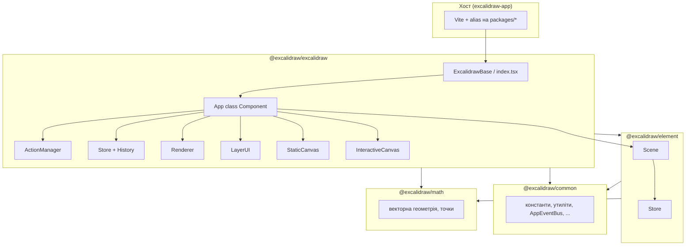

# Архітектура кодової бази (за вихідним кодом)

Цей документ описує лише те, що прямо випливає з реалізації в репозиторії `excalidraw-monorepo`: кореневий `package.json` оголошує workspaces `excalidraw-app`, `packages/*`, `examples/*` і збирає пакети в порядку `common` → `math` → `element` → `excalidraw` (скрипт `build:packages`).

Нижче розділи **«Контекст проєкту»**, **«TypeScript і збірка»**, **«excalidraw-app»** та **«Версії й команди»** узгоджені з фактами з `docs/memory/projectbrief.md`, `docs/memory/techContext.md` та `docs/memory/systemPatterns.md` і перевірені по вихідних файлах репозиторію.

---

## Контекст проєкту

- **Ім’я workspace** у корені: `excalidraw-monorepo` (`package.json`, поле `name`).
- Це **монорепозиторій Excalidraw**: веб-додаток для дошки / діаграм і npm-пакети `@excalidraw/*` для вбудовування редактора як React-компонента (`packages/excalidraw/package.json`: `description` — «Excalidraw as a React component»).
- **Шари пакетів** (за `description` / роллю в дереві залежностей): `packages/common` — спільні константи й утиліти; `packages/math` — геометрія; `packages/element` — логіка елементів; `packages/utils` — додаткові утиліти (окремий пакет); `packages/excalidraw` — UI редактора, дані, i18n, публічний API; `excalidraw-app` — оболонка продукту (точка входу `excalidraw-app/index.tsx` рендерить `ExcalidrawApp` з `./App`).
- **Приклади інтеграції:** workspace `examples/with-nextjs`, `examples/with-script-in-browser` (кореневий `package.json`, `workspaces`).

---

## High-level Architecture

На верхньому рівні застосунок — це **React**-редактор, де головний класовий компонент `App` (`packages/excalidraw/components/App.tsx`) тримає **стан інтерфейсу** у `this.state` типу `AppState`, а **масив елементів сцени** — у екземплярі **`Scene`** з пакета `@excalidraw/element`. Поруч існують **`Store`** (історія змін / інкременти), **`History`**, **`ActionManager`** (дії користувача та гарячі клавіші) та **`Renderer`** (підбір видимих елементів для малювання).

Публічний вхід для вбудовування — компонент `ExcalidrawBase` у `packages/excalidraw/index.tsx`: він обгортає дерево в `EditorJotaiProvider` з `editorJotaiStore` і рендерить `<App ... />`.

Хост-додаток `excalidraw-app` збирається **Vite**; у `excalidraw-app/vite.config.mts` налаштовані **alias** на вихідні файли `packages/common`, `packages/element`, `packages/math`, `packages/excalidraw`, `packages/utils` (імпорти на кшталт `@excalidraw/excalidraw` резолвляться в сорси, а не лише в `node_modules`).

---

## Data Flow: як дані рухаються через систему

### 1. Дії через `ActionManager`

Клас `ActionManager` (`packages/excalidraw/actions/manager.tsx`) зберігає словник `actions` і при виконанні дії викликає `action.perform(elements, appState, value, app)`, де `elements` береться з `getElementsIncludingDeleted()`, а `appState` — з `getAppState()`. Результат має тип `ActionResult`: або `false`, або об’єкт з опційними полями `elements`, `appState`, `files`, `replaceFiles` та обов’язковим `captureUpdate` (тип з `CaptureUpdateAction` у `@excalidraw/element`).

`executeAction` і `handleKeyDown` передають результат у **`updater`**, який у `App` конструкторі встановлений як **`this.syncActionResult`**.

### 2. `syncActionResult` і оновлення сцени

Метод `syncActionResult` (`packages/excalidraw/components/App.tsx`) з `withBatchedUpdates`:

- викликає `this.store.scheduleAction(actionResult.captureUpdate)`;
- якщо є `actionResult.elements`, викликає `this.scene.replaceAllElements(actionResult.elements)`;
- обробляє `files` через `addMissingFiles` / `addNewImagesToImageCache`;
- при зміні `appState` викликає `this.setState(...)` з урахуванням пропсів `viewModeEnabled`, `zenModeEnabled`, `theme`, `name` тощо;
- якщо жодної зміни не було (`didUpdate === false`), викликає `this.scene.triggerUpdate()`.

### 3. Оновлення `Scene` і повторний рендер

`Scene.replaceAllElements` (`packages/element/src/Scene.ts`) перераховує внутрішні масиви/мапи елементів, оновлює `sceneNonce` випадковим цілим і викликає зареєстровані колбеки. У `App.componentDidMount` підписка: `this.scene.onUpdate(this.triggerRender)`.

`triggerRender` (`App.tsx`): при `force === true` викликає `this.scene.triggerUpdate()`, інакше — `this.setState({})`, щоб ініціювати React-оновлення.

### 4. Підсумок кадру: `Store.commit` і зовнішні колбеки

У `App.componentDidUpdate` після логіки, залежної від попереднього стану, викликається **`this.store.commit(elementsMap, this.state)`** з поточної мапи елементів і стану. Якщо `!this.state.isLoading`, викликаються `this.props.onChange?.(elements, this.state, this.files)` та `this.onChangeEmitter.trigger(...)`.

`Store` (`packages/element/src/store.ts`) під час `commit` виконує заплановані micro/macro дії, емітує інкременти; у `App.componentDidMount` `onDurableIncrementEmitter` підписаний на `this.history.record(increment.delta)`.

### 5. Інші шляхи зміни даних

- **`updateScene`** / **`setAppState`** у `App` змінюють елементи через `scene.replaceAllElements` і/або `setState`, з опційним `scheduleMicroAction` для `Store`.
- **`applyDeltas`** застосовує `StoreDelta.applyTo` до копій мапи елементів і `AppState` (див. `App.tsx`).
- **`mutateElement`** делегує в `this.scene.mutateElement(...)`.

Потік скорочено: **ввід / API → ActionManager або прямі методи App → Scene + React state → Store.commit → History / onChange → (наступний рендер)**.

---

## State Management: детальний опис

### `AppState`

- Тип `AppState` оголошений у `packages/excalidraw/types.ts`; початкові значення для більшості полів задає **`getDefaultAppState()`** у `packages/excalidraw/appState.ts` (тема, інструмент, скрол, зум, вибрані id, діалоги, `collaborators`, тощо).
- У конструкторі `App` стан ініціалізується як `{ ...getDefaultAppState(), ...getCanvasOffsets(), ...props }` з полями `width`/`height` з `window`.
- Для підписок на зміни використовується **`AppStateObserver`** (`packages/excalidraw/components/AppStateObserver.ts`), екземпляр `this.appStateObserver` з посиланням на `() => this.state`; публічне поле `onStateChange` проксує спостерігач.
- Через React Context експортуються **`ExcalidrawAppStateContext`**, **`ExcalidrawSetAppStateContext`**, хуки `useExcalidrawAppState` / `useExcalidrawSetAppState` (див. `App.tsx` поруч із оголошенням класу `App`).

### Елементи та `Scene`

- **`Scene`** тримає `elements`, `elementsMap`, `nonDeletedElements`, `nonDeletedElementsMap`, кеш вибраних елементів, `sceneNonce` (у коментарі в коді — nonce для інвалідації кешу рендерера).
- Публічні методи включають `getElementsIncludingDeleted`, `getNonDeletedElements`, `getElementsMapIncludingDeleted`, `replaceAllElements`, `mutateElement`, `getSelectedElements`, `onUpdate`, `triggerUpdate`, `destroy` (файл `packages/element/src/Scene.ts`).

### `Store` (пакет element)

- **`Store`** конструюється з посиланням на `App` (`constructor(private readonly app: App)` у `store.ts`).
- Константи **`CaptureUpdateAction`**: `IMMEDIATELY`, `NEVER`, `EVENTUALLY` — визначають, чи потрапляють зміни в undo/redo та коли фіксується знімок.
- Методи: `scheduleAction`, `scheduleCapture`, `scheduleMicroAction`, `commit`, `snapshot` getter/setter, еміттери `onDurableIncrementEmitter` та `onStoreIncrementEmitter`.

### `History`

- Клас **`History`** знаходиться у `packages/excalidraw/history.ts` і прив’язаний до `Store`; у конструкторі `App`: `this.history = new History(this.store)`.

### `ActionManager`

- Поля: `actions`, `updater`, `getAppState`, `getElementsIncludingDeleted`, `app`.
- Методи: `registerAction`, `registerAll`, `handleKeyDown`, `executeAction`, `renderAction` (рендерить `PanelComponent` дії, якщо вона є), `isActionEnabled` (перевіряє `action.predicate`).
- У конструкторі `App` після `registerAll(actions)` додаються `createUndoAction` / `createRedoAction` для історії.

### Додатково: Jotai

- `EditorJotaiProvider` і `editorJotaiStore` (`packages/excalidraw/editor-jotai.tsx`) обгортають `App`; у самому `App` є `updateEditorAtom`, який викликає `editorJotaiStore.set` і `this.triggerRender()` — для UI-стану на атомах, окремо від `AppState` сцени.

### Бінарні вкладення (зображення тощо)

- У `App` є поле **`this.files: BinaryFiles`** (тип у `packages/excalidraw/types.ts` — запис за id елемента), окреме від масиву елементів у `Scene`. `ActionResult` може містити `files`; імперативний API експонує `getFiles` та `addFiles`. Колбек **`onChange`** отримує третім аргументом `files` разом із елементами та `appState`.

---

## Rendering Pipeline: від React component до canvas

1. **`App.render()`** обчислює `selectedElements` через `this.scene.getSelectedElements(this.state)`, бере `sceneNonce` з `this.scene.getSceneNonce()`, викликає **`this.renderer.getRenderableElements({...})`** з полями зуму, скролу, розмірів, `editingTextElement`, `newElementId` — отримує `elementsMap` та **`visibleElements`**; зберігає `this.visibleElements = visibleElements`; `allElementsMap = this.scene.getNonDeletedElementsMap()`.

2. **`Renderer`** (`packages/excalidraw/scene/Renderer.ts`) у конструкторі отримує `Scene`; метод `getRenderableElements` мемоізований і всередині використовує `this.scene.getNonDeletedElements()`, фільтрацію для тексту в редагуванні та видимість через `isElementInViewport` з `@excalidraw/element`.

3. У дереві JSX після провайдерів контексту рендеряться **`LayerUI`**, **`StaticCanvas`**, за наявності — **`NewElementCanvas`**, далі **`InteractiveCanvas`**.

4. **`StaticCanvas`** (`packages/excalidraw/components/canvases/StaticCanvas.tsx`): у `useEffect` виставляються розміри `canvas`, при першому монтуванні canvas вставляється в обгортку з класом `excalidraw__canvas-wrapper`; викликається **`renderStaticScene({ canvas, rc, scale, elementsMap, allElementsMap, visibleElements, appState, renderConfig }, isRenderThrottlingEnabled())`**. Компонент обгорнутий у `React.memo` з порівнянням `sceneNonce`, `scale`, посилань на мапи/елементи та релевантних полів `appState` через `getRelevantAppStateProps`.

5. У **`packages/excalidraw/renderer/staticScene.ts`**: експортуються **`renderStaticScene`** та **`renderStaticSceneThrottled`** (обгортка `throttleRAF` над `_renderStaticScene`). Для кожного елемента викликається **`renderElement`** з `@excalidraw/element` (імпорт у файлі). Коментар у коді: static scene — канвас без UI-оверлею, де малюються елементи.

6. **`InteractiveCanvas`** (`packages/excalidraw/components/canvases/InteractiveCanvas.tsx`): збирає дані про колабораторів (`collaborators`) у структури для віддалених курсорів і викликає **`renderInteractiveScene`** з `packages/excalidraw/renderer/interactiveScene.ts` (селекція, хендли, snap-лінії тощо). Є `AnimationController` для анімаційного шляху.

7. **Два HTML canvas елементи**: у конструкторі `App` створюється `this.canvas = document.createElement("canvas")` і `rough.canvas(this.canvas)` як `this.rc`; інтерактивний канвас зберігається в `this.interactiveCanvas` (призначається через ref-колбек, переданий у `InteractiveCanvas` як `handleCanvasRef` у фрагменті `App.render`).

8. **`Renderer.destroy`** скасовує `renderStaticSceneThrottled` і очищає мемо-кеш `getRenderableElements`.

9. **Розділення полів стану для шару малювання** у `packages/excalidraw/types.ts`: тип **`StaticCanvasAppState`** — підмножина `AppState` для статичного шару (сітка, фон, `frameRendering`, `hoveredElementIds`, обрізання тощо); **`InteractiveCanvasAppState`** — для інтерактивного шару (`activeTool`, `selectionElement`, `collaborators`, `snapLines`, `editingTextElement`, `selectedLinearElement` тощо). Обидва типи будуються поверх спільного `_CommonCanvasAppState` (зум, скрол, розміри, `offset*`, тема, частина полів вибору).

10. Якщо `this.state.newElement` заданий, додатково монтується **`NewElementCanvas`** (`packages/excalidraw/components/canvases/NewElementCanvas.tsx`) — окремий шлях малювання для елемента в процесі створення (поруч з `StaticCanvas` у `App.render`).

---

## Package Dependencies: взаємозв’язки між packages

Нижче — залежності, явно зазначені в `package.json` кожного пакета (workspace).

| Пакет | Залежності (workspace / npm) |
|--------|------------------------------|
| **`@excalidraw/common`** | `tinycolor2` |
| **`@excalidraw/math`** | `@excalidraw/common` |
| **`@excalidraw/element`** | `@excalidraw/common`, `@excalidraw/math` |
| **`@excalidraw/excalidraw`** | `@excalidraw/common`, `@excalidraw/element`, `@excalidraw/math`, а також зовнішні бібліотеки: наприклад `jotai`, `jotai-scope`, `roughjs`, `perfect-freehand`, `nanoid`, `pako`, Radix UI, CodeMirror, `browser-fs-access`, `fractional-indexing`, `lodash.throttle` / `lodash.debounce`, `sass`, тощо (повний список у `packages/excalidraw/package.json`) |
| **`@excalidraw/utils`** | `@braintree/sanitize-url`, `@excalidraw/laser-pointer`, `browser-fs-access`, `pako`, `perfect-freehand`, PNG-chunk пакети, `roughjs` — плюс **вихідні імпорти з `@excalidraw/excalidraw/...`** у файлах на кшталт `packages/utils/src/export.ts` (експорт/відновлення через API пакета excalidraw) |

Напрямок збірки з кореневого `package.json`: спочатку `build:common`, потім `build:math`, `build:element`, `build:excalidraw`; окремий скрипт `build-node` викликає `scripts/build-node.js`.

**`excalidraw-app`** у власному `package.json` не декларує `@excalidraw/*` як залежності; натомість Vite-alias з `vite.config.mts` підключає сорси пакетів. Залежності застосунку включають `react`, `react-dom`, `jotai`, `firebase`, `socket.io-client`, `@sentry/browser`, `idb-keyval`, тощо.

**`examples/with-script-in-browser`** має `"@excalidraw/excalidraw": "*"` у `dependencies` (workspace).

**`examples/with-nextjs`** у `dependencies` містить лише `next`, `react`, `react-dom`; збірка копіює шрифти з `packages/excalidraw/dist` у `public` (скрипти в `package.json` прикладу).

У **`packages/excalidraw/package.json`** поле `exports` містить підшляхи `"./common/*"`, `"./element/*"`, `"./math/*"`, `"./utils/*"` — типи для залежностей, зібраних разом із дистрибутивом.

---

## TypeScript, path aliases і збірка пакетів

- **Кореневий `tsconfig.json`:** `include` — `packages`, `excalidraw-app`; `exclude` — `examples`, `dist`, `types`, `tests`.
- **`compilerOptions.paths`:** `@excalidraw/common`, `@excalidraw/element`, `@excalidraw/math`, `@excalidraw/utils` → `packages/*/src`; `@excalidraw/excalidraw` → `packages/excalidraw/index.tsx` та підшляхи `packages/excalidraw/*`.
- **Пакети** збирають артефакти в `dist/` через скрипти на **esbuild** (`scripts/buildPackage.js`, `scripts/buildBase.js`, `scripts/buildUtils.js` — викликаються з `package.json` підпакетів як `build:esm`).
- **Vite** (`excalidraw-app/vite.config.mts`): для dev-сервера налаштовані **alias**, які дзеркалять ту саму схему, що й `tsconfig` (прямий резолв сирців); `envDir: "../"` — змінні з кореневих `.env*`; `server.port` — з `VITE_APP_PORT` або **3000** за замовчуванням.
- Плагіни у `vite.config.mts` (імпорти на початку файлу): `@vitejs/plugin-react`, `vite-plugin-svgr`, `vite-plugin-ejs`, `vite-plugin-pwa`, `vite-plugin-checker`, `vite-plugin-html`, `vite-plugin-sitemap`, `woff2BrowserPlugin` з `../scripts/woff2/woff2-vite-plugins`.
- **Тести:** кореневий `vitest.config.mts` використовує ті самі alias `@excalidraw/*`, що й TypeScript / Vite (`docs/memory/systemPatterns.md` узгоджує це з практикою репозиторію).

---

## excalidraw-app: продуктовий шар над бібліотекою

- Застосунок імпортує модулі з `@excalidraw/excalidraw` (резолв через alias у `excalidraw-app/vite.config.mts`).
- **Jotai** використовується і в ядрі (`EditorJotaiProvider` у `packages/excalidraw/index.tsx`), і в застосунку — файл `excalidraw-app/app-jotai.ts` (атоми/стор для оболонки).
- Колаборація та мережеві клієнти: каталог `excalidraw-app/collab/` (наприклад `Collab.tsx` з динамічним імпортом клієнта); **Firebase** — `excalidraw-app/data/firebase.ts`.
- **Sentry:** side-effect імпорт `../excalidraw-app/sentry` у `excalidraw-app/index.tsx` (рядок 5).
- Імперативний API редактора ззовні дерева: `ExcalidrawAPIProvider`, `onExcalidrawAPI`, контексти `ExcalidrawAPIContext` / `ExcalidrawAPISetContext` у `packages/excalidraw/index.tsx` (коментар у коді про використання зовні `<Excalidraw>`).
- Глобальні стилі редактора підключаються в `packages/excalidraw/index.tsx`: `app.scss`, `styles.scss`, `fonts.css`.

---

## Версії ключових залежностей і команди

| Область | Значення (за `package.json`) |
|--------|-------------------------------|
| Менеджер пакетів | Yarn Classic `yarn@1.22.22` (корінь `package.json`, `packageManager`) |
| Node.js | `>=18.0.0` (корінь та `excalidraw-app/package.json`, `engines`) |
| TypeScript | `5.9.3` (корінь `devDependencies`) |
| Vite | `5.0.12` (корінь `devDependencies`) |
| Vitest | `3.0.6` (корінь `devDependencies`) |
| React / React DOM | `19.0.0` (`excalidraw-app/dependencies`) |
| Пакети `@excalidraw/common`, `element`, `math`, `excalidraw` | `0.18.0` (відповідні `packages/*/package.json`) |
| `@excalidraw/utils` | `0.1.2` (`packages/utils/package.json`) |
| Jotai | `2.11.0` (`excalidraw-app` та `packages/excalidraw` `dependencies`) |
| Firebase | `11.3.1` (`excalidraw-app`) |
| `socket.io-client` | `4.7.2` (`excalidraw-app`) |
| `@sentry/browser` | `9.0.1` (`excalidraw-app`) |

**Корисні команди з кореневого `package.json`:** `yarn start` → dev у `excalidraw-app` (`vite`); `yarn build` → збірка застосунку; `yarn build:packages` → послідовна збірка пакетів; `yarn test` / `yarn test:app` → Vitest; `yarn test:all` → typecheck + eslint + prettier + тести застосунку; `yarn test:typecheck` → `tsc`; `yarn start:example` → приклад зі скриптом після `build:packages`; `yarn rm:build`, `yarn clean-install`, `yarn fix` — див. скрипти в корені.

---

## Короткий покажчик файлів

| Тема | Файл (від кореня репозиторію) |
|------|-------------------------------|
| Клас `App`, контексти, `syncActionResult`, `triggerRender`, `render()` | `packages/excalidraw/components/App.tsx` |
| Дефолтний `AppState` | `packages/excalidraw/appState.ts` |
| `ActionManager` | `packages/excalidraw/actions/manager.tsx` |
| Тип `ActionResult` | `packages/excalidraw/actions/types.ts` |
| `Scene` | `packages/element/src/Scene.ts` |
| `Store`, `CaptureUpdateAction` | `packages/element/src/store.ts` |
| `History` | `packages/excalidraw/history.ts` |
| `Renderer.getRenderableElements` | `packages/excalidraw/scene/Renderer.ts` |
| Статичний рендер канвасу | `packages/excalidraw/renderer/staticScene.ts` |
| Інтерактивний оверлей | `packages/excalidraw/renderer/interactiveScene.ts` |
| React-обгортки канвасів | `packages/excalidraw/components/canvases/StaticCanvas.tsx`, `InteractiveCanvas.tsx` |
| Публічний компонент | `packages/excalidraw/index.tsx` |
| Alias для застосунку | `excalidraw-app/vite.config.mts` |
| Vitest (alias як у TS) | `vitest.config.mts` |
| Точка входу застосунку, Sentry | `excalidraw-app/index.tsx`, `excalidraw-app/sentry.ts` (імпорт у `index.tsx`) |
| Jotai-стор застосунку | `excalidraw-app/app-jotai.ts` |
| Firebase | `excalidraw-app/data/firebase.ts` |
| Колаборація | `excalidraw-app/collab/` |

---

*Документ згенеровано за станом вихідного коду в репозиторії; при зміні архітектури оновлюйте відповідні файли та цей опис. Розділи на основі `docs/memory/*` варто синхронізувати при зміні цих файлів.*
