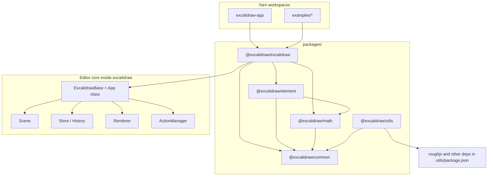

# Technical architecture

This document describes how the repository is structured and how the editor moves data from React state through scene storage to canvas drawing. Every statement is grounded in the TypeScript sources under this workspace.

---

## High-level architecture

The root `package.json` names the workspace `excalidraw-monorepo` and declares Yarn workspaces: `excalidraw-app`, `packages/*`, and `examples/*`. The script `build:packages` builds internal libraries in order: `@excalidraw/common`, `@excalidraw/math`, `@excalidraw/element`, then `@excalidraw/excalidraw`.

The public embed surface is the `@excalidraw/excalidraw` package (`packages/excalidraw`), which exports a React tree rooted at `ExcalidrawBase` in `packages/excalidraw/index.tsx`. That component wraps the class-based editor `App` (`packages/excalidraw/components/App.tsx`) inside `EditorJotaiProvider` (Jotai store `editorJotaiStore` from `packages/excalidraw/editor-jotai`) and `InitializeApp`.

The full product shell `excalidraw-app` is a Vite application that imports from `@excalidraw/excalidraw`, `@excalidraw/common`, `@excalidraw/element`, and related paths; `excalidraw-app/vite.config.mts` aliases those packages to the local `packages/*` sources.

The diagram reflects package `dependencies` in each `package.json`: `@excalidraw/element` depends on `@excalidraw/common` and `@excalidraw/math`; `@excalidraw/math` depends on `@excalidraw/common`; `@excalidraw/common` depends on `tinycolor2` only; `@excalidraw/utils` lists its own dependencies including `roughjs` and does not depend on `@excalidraw/element` or `@excalidraw/excalidraw` in that manifest. The `@excalidraw/excalidraw` package’s `package.json` lists `@excalidraw/common`, `@excalidraw/element`, and `@excalidraw/math` as dependencies. Source files under `packages/excalidraw` additionally import `@excalidraw/utils` (for example `packages/excalidraw/index.tsx` re-exports from `@excalidraw/utils/export` and `@excalidraw/utils/withinBounds`, and components such as `ImageExportDialog.tsx` import `@excalidraw/utils/export`).

---

## Data flow: how data moves through the system

### Inbound: props and initial scene

`ExcalidrawBase` passes `AppProps` into `App`, including callbacks such as `onChange`, `onIncrement`, `initialData`, and UI hooks (`renderTopLeftUI`, `renderTopRightUI`, etc.) as defined in `packages/excalidraw/types.ts`.

### User and API mutations: actions

`ActionManager` (`packages/excalidraw/actions/manager.tsx`) is constructed in `App`’s constructor with:

- `updater`: `this.syncActionResult`
- `getAppState`: `() => this.state`
- `getElementsIncludingDeleted`: `() => this.scene.getElementsIncludingDeleted()`
- `app`: the `App` instance as `AppClassProperties`

`executeAction` reads the current elements and app state, optionally records analytics via `trackEvent`, then calls `this.updater(action.perform(elements, appState, value, this.app))`. Keyboard shortcuts use the same path after `keyTest` matching in `handleKeyDown`. `renderAction` mounts panel UI that calls `updateData`, which again funnels through `perform` and `updater`.

### Applying results: `syncActionResult`

`App.syncActionResult` (`packages/excalidraw/components/App.tsx`) is wrapped in `withBatchedUpdates`. For a non-`false` result it:

1. Calls `this.store.scheduleAction(actionResult.captureUpdate)` with the `CaptureUpdateAction` value from the result.
2. If `actionResult.elements` is set, calls `this.scene.replaceAllElements(actionResult.elements)`.
3. If `actionResult.files` is set, calls `this.addMissingFiles` and `this.addNewImagesToImageCache`.
4. Merges `actionResult.appState` into React state via `this.setState`, with special handling for `editingTextElement`, controlled props (`viewModeEnabled`, `zenModeEnabled`), `theme`, `name`, and `errorMessage`, and forces `contextMenu` to `null` on that path.
5. If nothing changed scene or state, calls `this.scene.triggerUpdate()` so subscribers still run.

`ActionResult` is defined in `packages/excalidraw/actions/types.ts` as either `false` or an object with optional `elements`, `appState`, `files`, required `captureUpdate`, and optional `replaceFiles`.

### After React updates: store commit and host notification

`App.componentDidUpdate` (`packages/excalidraw/components/App.tsx`) calls `this.appStateObserver.flush(prevState)`, runs various side effects (embeddables, export theme, collaboration, props-driven state sync, etc.), then:

- `this.store.commit(this.scene.getElementsMapIncludingDeleted(), this.state)`

When not loading, it invokes `this.props.onChange?.(elements, this.state, this.files)` and `this.onChangeEmitter.trigger(elements, this.state, this.files)` with `elements` from `this.scene.getElementsIncludingDeleted()`.

### Capture semantics: `Store` and `CaptureUpdateAction`

`CaptureUpdateAction` lives in `packages/element/src/store.ts` as three string literals: `IMMEDIATELY`, `NEVER`, and `EVENTUALLY`, with comments describing undo-stack behavior (immediate capture, never recorded, or deferred capture).

`Store` (`packages/element/src/store.ts`) holds a `StoreSnapshot`, schedules macro actions via `scheduleAction`, queues micro-actions via `scheduleMicroAction`, and `commit` flushes micro-actions then processes the scheduled macro action. It emits `DurableIncrement` / `EphemeralIncrement` events through `onDurableIncrementEmitter` and `onStoreIncrementEmitter`. The `Store` constructor takes the `App` instance (`constructor(private readonly app: App)`).

### Scene notifications

`Scene.replaceAllElements` (`packages/element/src/Scene.ts`) updates internal arrays and maps, then `triggerUpdate` sets `sceneNonce` to a new random integer and invokes all registered callbacks. Comments state that `sceneNonce` is a renderer cache-invalidation nonce, not an element version.

---

## State management

### `AppState` (React component state on `App`)

`App` is declared as `class App extends React.Component<AppProps, AppState>`. The `AppState` interface is in `packages/excalidraw/types.ts` and aggregates:

- UI and editor mode: `showWelcomeScreen`, `viewModeEnabled`, `zenModeEnabled`, `gridModeEnabled`, theme, dialogs, sidebars, toast, etc.
- Tooling: `activeTool`, `preferredSelectionTool`, `penMode`, laser-related behavior indirectly via tool type checks in render.
- Transient drawing/edit state: `newElement`, `resizingElement`, `multiElement`, `selectionElement`, `editingTextElement`, `editingGroupId`, `editingFrame`, linear element editor state (`selectedLinearElement`), crop flags, and similar fields documented inline in the interface.
- Viewport: `scrollX`, `scrollY`, `zoom`, `width`, `height`, `offsetLeft`, `offsetTop`, `scrolledOutside`.
- Selection: `selectedElementIds`, `hoveredElementIds`, `selectedGroupIds`, `previousSelectedElementIds`, drag flags, locked selection maps.
- Collaboration: `collaborators` (a `Map`), `userToFollow`, `followedBy`.
- Export and file: `exportBackground`, `exportScale`, `exportEmbedScene`, `exportWithDarkMode`, `fileHandle`, document `name`.
- Other feature state: bindings (`isBindingEnabled`, `bindingPreference`, `startBoundElement`, `suggestedBinding`, `bindMode`), frames (`frameRendering`, `frameToHighlight`, `elementsToHighlight`), snap lines, search matches, stats panel, embeddable focus (`activeEmbeddable`), and more as listed in the interface.

Defaults for many keys come from `getDefaultAppState()` in `packages/excalidraw/appState.ts`, which reads shared constants from `@excalidraw/common`. The same module defines `APP_STATE_STORAGE_CONF`, mapping each key to whether it is stored for browser, export, or server contexts.

### `UIAppState`

`UIAppState` in `packages/excalidraw/types.ts` is `Omit<AppState, "startBoundElement" | "cursorButton" | "scrollX" | "scrollY">`. `UIAppStateContext` (`packages/excalidraw/context/ui-appState.ts`) exposes it via `useUIAppState()`.

### Elements: `Scene`, not React state

Scene geometry and element records live in `Scene` (`packages/element/src/Scene.ts`), not in React `setState`. The scene keeps:

- `elements`: ordered list including deleted entries (`OrderedExcalidrawElement[]`)
- `elementsMap`: map including deleted
- `nonDeletedElements` and `nonDeletedElementsMap`
- Frame-like element lists
- A selection cache keyed by `selectedElementIds` and options to `getSelectedElements`

`replaceAllElements` runs `syncInvalidIndices` on the next array, rebuilds maps, recomputes non-deleted structures, and calls `triggerUpdate`.

`Scene.getSelectedElements` takes `selectedElementIds` from `AppState` (typed as `AppState["selectedElementIds"]`) and optional overrides; it uses `getSelectedElements` from the element package. The `Scene` file imports `AppState` from `../../excalidraw/types`, which ties element package scene logic to the editor’s state shape.

### `actionManager`

`ActionManager` stores `actions` as `Record<ActionName, Action>`. Registration uses `registerAction` and `registerAll`. In `App`’s constructor, `this.actionManager.registerAll(actions)` loads the array built by `register()` calls across action modules, then registers undo/redo actions from `createUndoAction` / `createRedoAction` with `this.history`.

Actions implement `perform` returning `ActionResult`. Sources are typed as `ActionSource`: `"ui" | "keyboard" | "contextMenu" | "api" | "commandPalette"`.

### Related instances on `App`

The `App` constructor (same file) also constructs:

- `this.library = new Library(this)`
- `this.scene = new Scene()` (after `actionManager`, per source order)
- `this.canvas = document.createElement("canvas")`
- `this.rc = rough.canvas(this.canvas)` using RoughJS
- `this.renderer = new Renderer(this.scene)`
- `this.store = new Store(this)` and `this.history = new History(this.store)`
- `this.fonts = new Fonts(this.scene)`
- `this.api = this.createExcalidrawAPI()`

So element data flows: action or API → `syncActionResult` → `Scene.replaceAllElements` / `setState` → React re-render → `componentDidUpdate` → `store.commit` → optional `onChange` to the host.

### Context providers in `App.render`

`App.render` wraps children with React contexts including:

- `ExcalidrawAPIContext` (imperative API)
- `AppContext` (the `App` instance)
- `AppPropsContext`
- `ExcalidrawContainerContext`
- `EditorInterfaceContext`
- `ExcalidrawSetAppStateContext` / `ExcalidrawAppStateContext` (`value={this.state}`)
- `ExcalidrawElementsContext` (`value={this.scene.getNonDeletedElements()}`)
- `ExcalidrawActionManagerContext` (`value={this.actionManager}`)

`ContextMenu` receives `actionManager={this.actionManager}`.

### History

`History` (`packages/excalidraw/history.ts`) works with `Store` snapshots and deltas; undo/redo paths return updated element maps and app state consumed as `ActionResult` in `packages/excalidraw/actions/actionHistory.tsx` (`executeHistoryAction`), with `CaptureUpdateAction.NEVER` for applied history steps when a change is produced.

---

## Rendering pipeline: from React component to canvas

### Top-level render pass

`App.render` computes:

- `selectedElements` via `this.scene.getSelectedElements(this.state)`
- `sceneNonce` via `this.scene.getSceneNonce()`
- `{ elementsMap, visibleElements }` via `this.renderer.getRenderableElements({ sceneNonce, zoom, offsetLeft, offsetTop, scrollX, scrollY, height, width, editingTextElement, newElementId })`
- Assigns `this.visibleElements = visibleElements` for internal use
- `allElementsMap = this.scene.getNonDeletedElementsMap()`

It then renders `StaticCanvas`, optional `NewElementCanvas`, and `InteractiveCanvas` from `packages/excalidraw/components/canvases`, passing the shared `elementsMap`, `visibleElements`, `sceneNonce`, `scale={window.devicePixelRatio}`, and `appState={this.state}`.

### `Renderer`

`Renderer` (`packages/excalidraw/scene/Renderer.ts`) memoizes `getRenderableElements`. Inside:

- It reads non-deleted elements from `this.scene.getNonDeletedElements()`.
- It builds a `RenderableElementsMap` that skips the element matching `newElementId` and skips the text element currently being edited (so in-progress text is not drawn on the static layer as usual).
- It computes `visibleElements` with `isElementInViewport` from `@excalidraw/element` over the map, using viewport parameters from `AppState`.
- `destroy()` cancels throttled static rendering and clears the memo cache.

### `StaticCanvas`

`StaticCanvas` (`packages/excalidraw/components/canvases/StaticCanvas.tsx`) is a memoized functional component. On mount it places the provided `canvas` DOM node inside a wrapper div with classes `excalidraw__canvas` and `static`. A `useEffect` syncs CSS size and bitmap dimensions from `appState.width` / `height` and `scale`. Another `useEffect` calls `renderStaticScene` from `packages/excalidraw/renderer/staticScene.ts`, passing `canvas`, `rc` (Rough canvas), `elementsMap`, `allElementsMap`, `visibleElements`, `appState`, and `renderConfig`, with `isRenderThrottlingEnabled()` as the second argument.

`renderStaticScene` uses helpers such as `bootstrapCanvas` from `packages/excalidraw/renderer/helpers` and delegates element drawing to `renderElement` imported from `@excalidraw/element` (see imports at top of `staticScene.ts`).

Memo comparison uses `sceneNonce`, `scale`, reference equality on `elementsMap` and `visibleElements`, shallow equality on a subset of `appState` via `getRelevantAppStateProps`, and `renderConfig`.

### `InteractiveCanvas`

`InteractiveCanvas` (`packages/excalidraw/components/canvases/InteractiveCanvas.tsx`) renders a `<canvas className="excalidraw__canvas interactive">` with pointer handlers wired to `App` methods. Its `useEffect` builds `InteractiveSceneRenderConfig` (remote pointers from `appState.collaborators`, selection color from CSS variable `--color-selection`, scrollbars flag, etc.) and drives `renderInteractiveScene` from `packages/excalidraw/renderer/interactiveScene.ts` through `AnimationController.start` keyed by `INTERACTIVE_SCENE_ANIMATION_KEY`, passing `deltaTime` and `animationState` for animated overlays.

The callback `renderInteractiveSceneCallback` from `App` updates scroll bar state and `scrolledOutside` based on visibility feedback from the interactive renderer.

### Layering

The static canvas draws the scene background and elements; the interactive canvas draws selection handles, collaboration cursors, and other editor chrome as implemented in `interactiveScene.ts`. When `this.state.newElement` is set, `NewElementCanvas` renders an additional layer with similar static render configuration.

---

## Package dependencies: relationships between packages

### Declared workspace package dependencies

From each `package.json`:

| Package | Declared dependencies on other workspace packages |
|--------|-----------------------------------------------------|
| `@excalidraw/common` | None (uses `tinycolor2`). |
| `@excalidraw/math` | `@excalidraw/common`. |
| `@excalidraw/element` | `@excalidraw/common`, `@excalidraw/math`. |
| `@excalidraw/excalidraw` | `@excalidraw/common`, `@excalidraw/element`, `@excalidraw/math` (plus many external packages such as `roughjs`, `jotai`, CodeMirror, Radix, etc.). |
| `@excalidraw/utils` | No workspace packages; external libs including `roughjs`, `pako`, `perfect-freehand`, `browser-fs-access`, PNG helpers, `@braintree/sanitize-url`, `@excalidraw/laser-pointer`. |

### Build and consumption

Root scripts delegate to `yarn --cwd ./packages/<name> build:esm` for each library. `@excalidraw/excalidraw` uses `scripts/buildPackage.js` (referenced in its `package.json`); base packages use `buildBase.js` or `buildUtils.js` as specified.

`excalidraw-app` does not list `@excalidraw/excalidraw` in its `dependencies` object in `excalidraw-app/package.json`; it resolves the editor through the monorepo workspace and Vite aliases. `examples/with-nextjs` depends on `next` and React only in its manifest and relies on building workspace packages first per its scripts.

### Cross-package type and runtime coupling

- `packages/element/src/store.ts` imports the type `App` from `@excalidraw/excalidraw/components/App` for the `Store` constructor.
- `packages/element/src/Scene.ts` imports `AppState` from `../../excalidraw/types` for selection APIs and typing.

Those imports show that the element package both stands alone as a published module and references editor types for scene APIs used exclusively in the full editor.

### Peer dependencies

`@excalidraw/excalidraw` declares `react` and `react-dom` as peer dependencies with version ranges covering 17, 18, and 19.

---

## File index (primary entry points)

| Concern | Location |
|--------|----------|
| Monorepo workspace layout | Root `package.json` |
| Public React wrapper | `packages/excalidraw/index.tsx` |
| Editor class | `packages/excalidraw/components/App.tsx` |
| Default app state | `packages/excalidraw/appState.ts` |
| App state types | `packages/excalidraw/types.ts` |
| Actions and results | `packages/excalidraw/actions/types.ts`, `packages/excalidraw/actions/manager.tsx` |
| Scene storage | `packages/element/src/Scene.ts` |
| Store / capture / increments | `packages/element/src/store.ts` |
| History | `packages/excalidraw/history.ts` |
| Render scheduling | `packages/excalidraw/scene/Renderer.ts` |
| Static canvas React glue | `packages/excalidraw/components/canvases/StaticCanvas.tsx` |
| Interactive canvas React glue | `packages/excalidraw/components/canvases/InteractiveCanvas.tsx` |
| Static drawing | `packages/excalidraw/renderer/staticScene.ts` |
| Interactive drawing | `packages/excalidraw/renderer/interactiveScene.ts` |
| Product shell | `excalidraw-app/` |

This index is for navigation only; behavior details are defined in the cited files.
