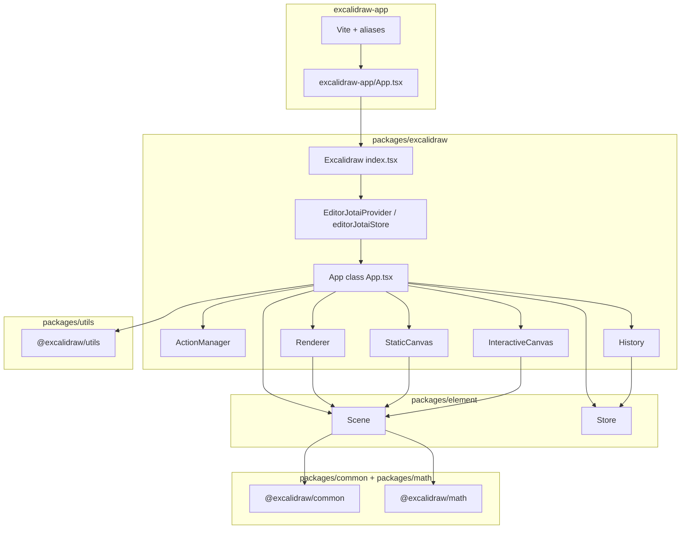

# Архітектура редактора (за вихідним кодом)

Документ описує лише те, що можна перевірити у файлах репозиторію: монорепо Excalidraw, пакет `@excalidraw/excalidraw`, доменні пакети `packages/*` і оболонку `excalidraw-app`.

---

## High-level Architecture

На верхньому рівні є три шари:

1. **Продуктовий застосунок** `excalidraw-app` збирається через Vite (`excalidraw-app/vite.config.mts`) і імпортує API бібліотеки під імпортом `@excalidraw/excalidraw`. У конфігурації Vite цей шлях резолвиться в `packages/excalidraw/index.tsx` (alias `find: /^@excalidraw\/excalidraw$/`).
2. **Бібліотека редактора** `packages/excalidraw` експортує React-компонент `Excalidraw` (`packages/excalidraw/index.tsx`, `React.memo`) і всередині монтує класовий компонент `App` з `packages/excalidraw/components/App.tsx`. `App` розширює `React.Component<AppProps, AppState>`.
3. **Доменна логіка елементів і змін сцени** живе в `packages/element` (клас `Scene`, `Store`, дельти, `getObservedAppState` тощо), геометрія — у `packages/math`, спільні константи й утиліти — у `packages/common`. Додаткові утиліти експортує `packages/utils`; імпорти на кшталт `@excalidraw/utils` присутні в коді `packages/excalidraw` (наприклад `packages/excalidraw/index.tsx`, `hooks/useLibraryItemSvg.ts`), а `tsconfig.json` кореня мапить їх на `packages/utils/src/`.

Кореневий `package.json` оголошує `workspaces`: `excalidraw-app`, `packages/*`, `examples/*`.

---

## Data Flow: як дані рухаються через систему

### Ініціалізація

- У конструкторі `App` (`packages/excalidraw/components/App.tsx`) після початкового `this.state` і `Library(this)` створюються **`ActionManager`** (замикання на `this.scene.getElementsIncludingDeleted()` викликається лише пізніше, коли `Scene` уже існує), потім **`Scene`**, **`canvas`** / **`rough.canvas`** / **`Renderer`**, **`Store(this)`** та **`History(this.store)`** (у файлі `this.history` двічі присвоюється послідовно), **`Fonts(this.scene)`**, далі **`registerAll(actions)`** (`actions` з `packages/excalidraw/actions/register.ts`) та **`createUndoAction` / `createRedoAction`**, наприкінці **`createExcalidrawAPI()`**.
- Після завантаження початкових даних `initializeScene` викликає `syncActionResult` з відновленими елементами та `appState` і `captureUpdate: CaptureUpdateAction.NEVER` (`packages/excalidraw/components/App.tsx`).

### Оновлення сцени з коду редактора

- **`updateScene`** (`App.updateScene`, обгорнутий у `withBatchedUpdates`): блок `this.store.scheduleMicroAction({ action, elements, appState })` виконується **лише якщо** істинний `captureUpdate` з `sceneData` (`if (captureUpdate)` — без переданого `captureUpdate` мікродія не планується, незважаючи на те, що в JSDOC біля `captureUpdate` зазначено `@default CaptureUpdateAction.EVENTUALLY`). Усередині гілки: `elements` — переданий масив або `undefined`; поле **`appState`** аргумента `scheduleMicroAction` отримує `getObservedAppState({ ...this.store.snapshot.appState, ...appState })`, якщо в `sceneData` є `appState`, інакше **`undefined`**. Далі опційно `setState` для `appState`, `this.scene.replaceAllElements(elements)` при переданих `elements`, `setState({ collaborators })` при переданих `collaborators`. У JSDOC також описані ролі `IMMEDIATELY` / `NEVER` / `EVENTUALLY` для undo/redo.
- **`syncActionResult`**: якщо `actionResult === false` або `this.unmounted`, метод виходить одразу і **не** викликає `scheduleAction` (`packages/excalidraw/components/App.tsx`). Інакше викликає `this.store.scheduleAction(actionResult.captureUpdate)`; при наявності `actionResult.elements` — `this.scene.replaceAllElements`; обробляє `files` через `addMissingFiles` і `addNewImagesToImageCache`; блок `setState` виконується за умови `actionResult.appState || this.state.contextMenu` (у вихідному рядку умови є ще операнд `editingTextElement`, але перед перевіркою він ще не присвоєний і залишається `null`); якщо після цього `didUpdate` лишився `false` — `this.scene.triggerUpdate()`.

### Після кожного React-оновлення

- У `componentDidUpdate` (`App`) викликається `this.store.commit(this.scene.getElementsMapIncludingDeleted(), this.state)` — це точка, де `Store` фіксує дельти та емітує інкременти (див. `packages/element/src/store.ts`, метод `commit`).
- Якщо `!this.state.isLoading`, викликаються `this.props.onChange?.(elements, this.state, this.files)` і `this.onChangeEmitter.trigger(...)` з тими самими аргументами.

### Батчинг React-оновлень

- `syncActionResult` і `updateScene` обгорнуті у `withBatchedUpdates` з `packages/excalidraw/reactUtils.ts` (імпорт у `App.tsx`).

### Дані поза `App` (приклад `excalidraw-app`)

- У `excalidraw-app/data/firebase.ts` імпортуються `reconcileElements` з `@excalidraw/excalidraw`, `restoreElements` з `@excalidraw/excalidraw/data/restore` і типи з `@excalidraw/excalidraw/types`; подібні шари — у `excalidraw-app/data/*` та `excalidraw-app/collab/*`. Узгодження сцени з бекендом відбувається в цих модулях, а оновлення полотна — через публічний API редактора та пропси `Excalidraw` / `App`.

### Оновлення `Scene`

- `Scene.replaceAllElements` (`packages/element/src/Scene.ts`) синхронізує індекси (`syncInvalidIndices`), оновлює `elements`, `elementsMap`, кеші не видалених елементів і фреймів, викликає `triggerUpdate()`.
- `triggerUpdate()` виставляє новий `sceneNonce` через `randomInteger()` і викликає зареєстровані колбеки `onUpdate`.

### Дії користувача (меню, клавіатура, API)

- `ActionManager.executeAction` бере поточні елементи й `appState`, викликає `action.perform(...)`, результат передає в `updater` (у конструкторі це обгортка навколо `syncActionResult`). Для клавіатури `handleKeyDown` фільтрує дії за `keyTest`, `UIOptions.canvasActions` і `viewModeEnabled`, потім так само викликає `updater` з `perform`.
- Окремі модулі реєструють дії через `register` у `packages/excalidraw/actions/register.ts`, який накопичує їх у змінній `actions`.

### Експорт спостережуваного стану для Store

- `getObservedAppState` (`packages/element/src/store.ts`) будує об’єкт лише з полів, релевантних для відстеження змін (наприклад `name`, `selectedElementIds`, `viewBackgroundColor`, `selectedLinearElement` у скороченому вигляді тощо) і позначає його прихованою властивістю `__observedAppState` для розпізнавання типу `ObservedAppState`.

---

## State Management: `appState`, `elements`, `actionManager`

### `AppState` і `getDefaultAppState`

- Повний тип UI-стану редактора — інтерфейс `AppState` у `packages/excalidraw/types.ts` (тема, інструмент, виділення, скрол, зум, діалоги, колаборація, режими перегляду тощо).
- Дефолти для ініціалізації задає `getDefaultAppState()` у `packages/excalidraw/appState.ts` (повертає об’єкт без `offsetTop`, `offsetLeft`, `width`, `height`, які додає `App` з вимірів вікна та `getCanvasOffsets()`).
- Для персистенції `APP_STATE_STORAGE_CONF` у тому ж файлі визначає, які ключі потрапляють у `browser` / `export` / `server`; експортуються хелпери `clearAppStateForLocalStorage`, `cleanAppStateForExport`, `clearAppStateForDatabase`.

### `UIAppState`

- У `packages/excalidraw/types.ts`: `UIAppState = Omit<AppState, "startBoundElement" | "cursorButton" | "scrollX" | "scrollY">`.
- Контекст `UIAppStateContext` / хук `useUIAppState` — `packages/excalidraw/context/ui-appState.ts`.

### Елементи (`elements`)

- Канонічне сховище списку елементів сцени — екземпляр `Scene` на `App`: `getElementsIncludingDeleted()`, `getNonDeletedElements()`, `getNonDeletedElementsMap()`, `getElementsMapIncludingDeleted()`, `getSelectedElements(...)` з кешем за хешем опцій (`packages/element/src/Scene.ts`); у `App.render` у метод передається весь `this.state`.
- Оновлення масиву елементів зазвичай проходить через `scene.replaceAllElements` або через шлях `updateScene` / `syncActionResult`.
- Типи елементів і допоміжні функції експортуються з `packages/element` (імпорти в `App.tsx` з `@excalidraw/element`).

### `Store` і `History`

- `Store` (`packages/element/src/store.ts`) прив’язаний до екземпляра `App` у конструкторі `constructor(private readonly app: App)` (тип `App` імпортується з `@excalidraw/excalidraw/components/App`).
- `Store` тримає `snapshot`, планує макро- та мікродії (`scheduleAction`, `scheduleMicroAction`, `scheduleCapture`), у `commit` спочатку `flushMicroActions`, потім обробка запланованого макро-акшену через `processAction`.
- Константи `CaptureUpdateAction` (`IMMEDIATELY`, `NEVER`, `EVENTUALLY`) визначені в цьому ж модулі й використовуються в `ActionResult` і в `updateScene` / `syncActionResult`.
- `History` (`packages/excalidraw/history.ts`) отримує `Store` у конструкторі; `HistoryDelta` розширює `StoreDelta` з `@excalidraw/element` і перевизначає `applyTo` для ігнору `version` / `versionNonce` при застосуванні з історії.

### `actionManager`

- Клас `ActionManager` — `packages/excalidraw/actions/manager.tsx`: поля `actions` як `Record<ActionName, Action>`, посилання на `getAppState`, `getElementsIncludingDeleted`, екземпляр `app` типу `AppClassProperties`, метод `updater` для прокидання `ActionResult` у `App.syncActionResult` (з підтримкою Promise).
- Публічні методи: `registerAction`, `registerAll`, `handleKeyDown`, `executeAction`, `renderAction` (рендерить `PanelComponent` дії, якщо він є і дозволений `UIOptions.canvasActions`), `isActionEnabled` (перевірка `action.predicate`).
- Тип результату дії — `ActionResult` у `packages/excalidraw/actions/types.ts`: об’єкт з опційними `elements`, `appState`, `files`, `replaceFiles`, обов’язковим `captureUpdate`, або `false`.

### React-контексти навколо UI

- У `App.render()` провайдери: `ExcalidrawAPIContext`, `AppContext`, `AppPropsContext`, `ExcalidrawContainerContext`, `EditorInterfaceContext`, `ExcalidrawSetAppStateContext`, `ExcalidrawAppStateContext` (значення `this.state`), `ExcalidrawElementsContext` (значення `this.scene.getNonDeletedElements()`), `ExcalidrawActionManagerContext` (значення `this.actionManager`).
- Обгортка `Excalidraw` у `packages/excalidraw/index.tsx` додає `EditorJotaiProvider` з `store={editorJotaiStore}` і `InitializeApp` перед `App`.

### Бінарні вкладення (`files`)

- На екземплярі `App` є поле `public files: BinaryFiles = {}` (`packages/excalidraw/components/App.tsx`); `LayerUI` отримує `files={this.files}`; `onChange` / `onChangeEmitter` передають третім аргументом `this.files`. `syncActionResult` при `actionResult.files` викликає `addMissingFiles` і `addNewImagesToImageCache`; через імперативний API доступний `addFiles`.

### Імперативний API (`ExcalidrawImperativeAPI`)

- Об’єкт `api` збирається в `createExcalidrawAPI()` (`packages/excalidraw/components/App.tsx`): зокрема `updateScene`, `applyDeltas`, `mutateElement`, `addFiles`, `resetScene` (посилання на приватний `resetScene`), `getSceneElements`, `getSceneElementsIncludingDeleted`, `getSceneElementsMapIncludingDeleted`, `getAppState`, `getFiles`, `registerAction` → `actionManager.registerAction`, `onChange` → `onChangeEmitter`, `onIncrement` → `store.onStoreIncrementEmitter`, `history.clear` → `resetHistory`.

---

## Rendering Pipeline: від React-компонента до canvas

### Крок 1: `App.render`

- Обчислюються `selectedElements` через `this.scene.getSelectedElements(this.state)`: сигнатура `Scene.getSelectedElements` у `packages/element/src/Scene.ts` очікує об’єкт опцій з полем `selectedElementIds` (та опційно іншими полями); у `App.render` передається весь `this.state` типу `AppState`, який містить потрібні поля.
- `sceneNonce` береться з `this.scene.getSceneNonce()`.
- `this.renderer.getRenderableElements({...})` (`packages/excalidraw/scene/Renderer.ts`) повертає `{ elementsMap, visibleElements }`: внутрішньо використовується мемоізована функція, яка з не видалених елементів сцени будує `RenderableElementsMap` (пропускає `newElementId` і текст, що зараз редагується в `appState.editingTextElement`), потім фільтрує видимі в viewport через `isElementInViewport` з `@excalidraw/element`. У параметри входять `zoom`, `scrollX`/`scrollY`, `width`/`height`, `offsetLeft`/`offsetTop`, `sceneNonce` для інвалідації кешу.
- `allElementsMap` = `this.scene.getNonDeletedElementsMap()`.
- Далі рендеряться `LayerUI` (панелі, меню), контекстні вікна та канви.

### Крок 2: `StaticCanvas`

- Компонент `packages/excalidraw/components/canvases/StaticCanvas.tsx` отримує той самий `canvas`, що створений у конструкторі `App`, і `rc` (RoughJS). У другому `useEffect` (рендер сцени) при першому проході, коли `isComponentMounted` ще `false`, виконуються `wrapper.replaceChildren(canvas)` і додавання класів canvas; у тому ж проході далі викликається `renderStaticScene({ ... }, isRenderThrottlingEnabled())`; на наступних оновленнях пропсів ефект знову викликає лише `renderStaticScene`.
- `renderStaticScene` (`packages/excalidraw/renderer/staticScene.ts`) за документацією в файлі відповідає за «non-ui canvas»; при `throttle === true` делегує в `renderStaticSceneThrottled` (`throttleRAF` з `@excalidraw/common`).

### Крок 3: `NewElementCanvas` (умовно)

- Якщо `this.state.newElement` заданий, рендериться `NewElementCanvas` з тими ж `rc`, `elementsMap`, `allElementsMap` і конфігом рендеру (`packages/excalidraw/components/App.tsx`).

### Крок 4: `InteractiveCanvas`

- Компонент `packages/excalidraw/components/canvases/InteractiveCanvas.tsx` рендерить окремий `<canvas className="excalidraw__canvas interactive">` з обробниками подій, переданими з `App`.
- У `useEffect`: **перший** запуск лише виставляє `isComponentMounted` і робить `return` — без збирання конфігурації та без `renderInteractiveScene`. **З другого** запуску ефекту збирається `InteractiveSceneRenderConfig` (у т.ч. з `appState.collaborators`), за відсутності вже запущеної анімації викликається `AnimationController.start` з ключем `INTERACTIVE_SCENE_ANIMATION_KEY`, у колбеку кадру викликається `renderInteractiveScene` з `packages/excalidraw/renderer/interactiveScene.ts` з `deltaTime` та `animationState`.

### Де малюються елементи

- `staticScene.ts` імпортує `renderElement` з `@excalidraw/element` для відмалювання примітивів сцени на canvas.
- `interactiveScene.ts` імпортує низку перевірок і хелперів з `@excalidraw/element` і `renderSelectionElement` для інтерактивного шару.

### Додаткові тригери перерендеру

- `App` має `triggerRender`, який за потреби викликає `this.scene.triggerUpdate()` (`packages/excalidraw/components/App.tsx`).
- Зміна `sceneNonce` в `Scene.triggerUpdate` змінює вхід до `Renderer.getRenderableElements` і змушує оновити кеш видимих елементів.

---

## Package Dependencies: взаємозв’язки між packages

Нижче — залежності, явно записані в `dependencies` відповідних `package.json`, плюс факти резолву з `tsconfig.json` / Vite.

### `@excalidraw/common` (`packages/common/package.json`)

- `dependencies`: `tinycolor2`.
- Інших пакетів `@excalidraw/*` не оголошує.

### `@excalidraw/math` (`packages/math/package.json`)

- `dependencies`: `@excalidraw/common`.

### `@excalidraw/element` (`packages/element/package.json`)

- `dependencies`: `@excalidraw/common`, `@excalidraw/math`.
- У вихідному коді `Scene.ts` імпортується тип `AppState` з `../../excalidraw/types` (залежність типів від пакета excalidraw). `store.ts` імпортує тип `App` з `@excalidraw/excalidraw/components/App`.

### `@excalidraw/utils` (`packages/utils/package.json`)

- Не містить залежностей на `@excalidraw/common`, `@excalidraw/math` або `@excalidraw/element`; перелік зовнішніх бібліотек включає наприклад `roughjs`, `pako`, `perfect-freehand`, `@braintree/sanitize-url`, `browser-fs-access`, пакети для PNG тощо.

### `@excalidraw/excalidraw` (`packages/excalidraw/package.json`)

- `peerDependencies`: `react`, `react-dom` (діапазони версій у файлі).
- `dependencies` включають `@excalidraw/common`, `@excalidraw/element`, `@excalidraw/math`, а також UI/редакторські бібліотеки (`roughjs`, `jotai`, CodeMirror 6, `radix-ui`, `sass` тощо — повний список у файлі).
- Поле `exports` також оголошує підшляхи `./common/*`, `./element/*`, `./math/*`, `./utils/*` для типів збірки в `dist/types/...`.
- У кореневому `tsconfig.json` шлях `@excalidraw/utils` вказує на вихідники `packages/utils`, хоча в `packages/excalidraw/package.json` окремого рядка `dependencies` для `@excalidraw/utils` немає — резолв іде через workspace і path mapping.

### `excalidraw-app` (`excalidraw-app/package.json`)

- Залежності рівня застосунку: `react`, `react-dom`, `jotai`, `firebase`, `socket.io-client`, `idb-keyval`, `@sentry/browser` тощо (див. файл).
- Явного запису `"@excalidraw/excalidraw"` у `dependencies` немає; імпорти `@excalidraw/excalidraw/...` у файлах `excalidraw-app` резолвляться через aliases у `excalidraw-app/vite.config.mts` на `packages/excalidraw/...` та сусідні пакети (`@excalidraw/common`, `element`, `math`, `utils`).

### Порядок збірки пакетів (скрипти кореня)

- У кореневому `package.json` скрипт `build:packages` викликає послідовно: `build:common` → `build:math` → `build:element` → `build:excalidraw`, що відповідає ланцюжку залежностей між пакетами.

### Приклади

- `examples/with-script-in-browser/package.json` залежить від `@excalidraw/excalidraw` з версією `*`.
- `examples/with-nextjs/package.json` залежить від `next`, `react`, `react-dom`; збірка викликає `yarn --cwd ../../ build:packages` за скриптом `build:workspace`.

---

## Короткий покажчик файлів

| Тема | Файли |
|------|--------|
| Точка входу бібліотеки | `packages/excalidraw/index.tsx` |
| Головний клас редактора | `packages/excalidraw/components/App.tsx` |
| Дефолтний і експортний `AppState` | `packages/excalidraw/appState.ts`, `packages/excalidraw/types.ts` |
| Сцена елементів | `packages/element/src/Scene.ts` |
| Знімки, дельти, commit | `packages/element/src/store.ts` |
| Історія undo/redo | `packages/excalidraw/history.ts` |
| Дії та менеджер | `packages/excalidraw/actions/types.ts`, `packages/excalidraw/actions/manager.tsx`, `packages/excalidraw/actions/register.ts` |
| Видимі елементи для canvas | `packages/excalidraw/scene/Renderer.ts` |
| Статичний шар canvas | `packages/excalidraw/components/canvases/StaticCanvas.tsx`, `packages/excalidraw/renderer/staticScene.ts` |
| Інтерактивний шар | `packages/excalidraw/components/canvases/InteractiveCanvas.tsx`, `packages/excalidraw/renderer/interactiveScene.ts` |
| Алиases збірки застосунку | `excalidraw-app/vite.config.mts` |
| Path aliases TypeScript | `tsconfig.json` |

---

## Де далі читати

- Локальне налаштування та перший PR → [dev-setup.md](./dev-setup.md).
- Стек, команди й версії → [techContext.md](../memory/techContext.md).
