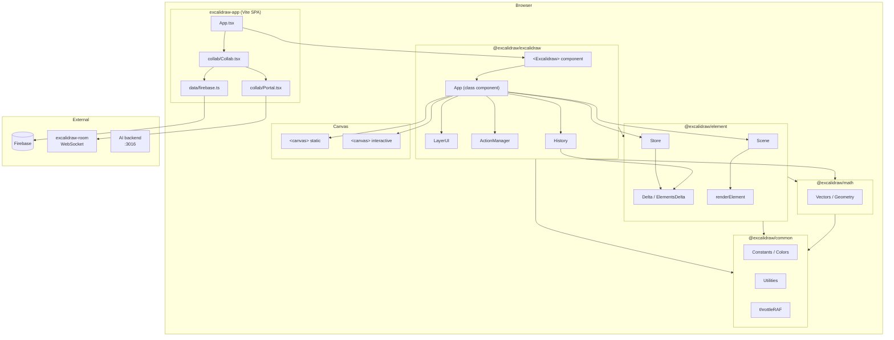

# Architecture — Excalidraw Monorepo

> Джерела: `packages/excalidraw/components/App.tsx`, `packages/element/src/`, `packages/excalidraw/renderer/`, `packages/*/package.json`

---

## High-level Architecture



### Монорепо

```
/
├── excalidraw-app/        # Vite SPA — excalidraw.com
├── packages/
│   ├── excalidraw/        # @excalidraw/excalidraw — головний npm-пакет
│   ├── element/           # @excalidraw/element — типи, Scene, Store, Delta
│   ├── common/            # @excalidraw/common — константи, кольори, utils
│   ├── math/              # @excalidraw/math — 2D вектори, геометрія
│   └── utils/             # @excalidraw/utils — публічний API: export, bbox
└── examples/
    ├── with-nextjs/
    └── with-script-in-browser/
```

---

## Data Flow

Повний цикл від дії користувача до canvas:

```
User input (pointer / keyboard / toolbar click)
  │
  ▼
Event handler у App.tsx
  └── withBatchedUpdates(fn)        ← unstable_batchedUpdates, уникає зайвих ре-рендерів
        │
        ▼
  actionManager.executeAction(action, source, value)
        │
        ▼
  action.perform(elements, appState, formData, app) → ActionResult
        │
        ▼
  syncActionResult()
  ├── scene.replaceAllElements(newElements)   ← єдина точка запису елементів
  ├── this.setState(partialAppState)          ← React re-render
  └── store.scheduleAction(CaptureUpdateAction.IMMEDIATELY)
        │
        ▼
  componentDidUpdate (App.tsx:3358)
  ├── appStateObserver.flush(prevState)       ← onStateChange() callbacks
  ├── store.commit(elementsMap, appState)     ← збирає StoreDelta
  │     └── store.onDurableIncrementEmitter  ← emit → History
  │           └── history.record(HistoryDelta)
  └── props.onChange(elements, appState, files)   ← зовнішній callback
        │
        ▼
  triggerRender()
  ├── this.setState({})                       ← звичайний re-render
  └── scene.triggerUpdate()                   ← force-перемальовка canvas
        │
        ▼
  React render()
  ├── <LayerUI>                               ← React UI
  ├── <StaticCanvas> → renderStaticScene()    ← packages/excalidraw/renderer/staticScene.ts:491
  └── <InteractiveCanvas> → renderInteractiveScene()
```

### Collab data flow (тільки excalidraw-app)

```
Socket.io message (від інших учасників)
  → Portal.tsx → Collab.tsx
  → excalidrawAPI.updateScene({ elements, collaborators })
  → App: scene.replaceAllElements() + setState()
  → triggerRender()
```

---

## State Management

### Тристороння тріада стану

Повний стан сцени складається з трьох незалежних частин, що передаються разом при збереженні/відновленні:

| Частина | Тип | Де живе | Що містить |
|---|---|---|---|
| `elements` | `ExcalidrawElement[]` | `this.scene` (поза React) | Всі об'єкти на canvas |
| `appState` | `AppState` (~50 полів) | `this.state` (React class state) | UI-стан, zoom, tool, theme... |
| `files` | `BinaryFiles` | `this.files` (поза React) | Зображення за `fileId` |

### AppState

`packages/excalidraw/types.ts:272` — інтерфейс `AppState`. Кожне поле має конфіг у `packages/excalidraw/data/appState.ts:138`:

```ts
// Що зберігається і куди
gridSize:      { browser: true,  export: true,  server: true  }
collaborators: { browser: false, export: false, server: false }
zoom:          { browser: true,  export: false, server: false }
```

`clearAppStateForLocalStorage/Database/Export` фільтрують поля за цим конфігом перед збереженням.

Підтипи для рендерерів (уникають передачі зайвих полів):
- `StaticCanvasAppState` — тільки поля, потрібні для static canvas
- `InteractiveCanvasAppState` — тільки поля для interactive canvas
- `UIAppState` — тільки поля для React UI

### Scene

`packages/element/src/Scene.ts` — клас-контейнер, живе як `this.scene` в App (поза React state).

```ts
// App.tsx:825
this.scene = new Scene();

// Єдина точка запису:
scene.replaceAllElements(elements)

// Читання:
scene.getNonDeletedElements()
scene.getNonDeletedElementsMap()
scene.getElementsIncludingDeleted()  // для collab reconciliation
scene.getSelectedElements(appState)
```

Після кожного `replaceAllElements` → `scene.onUpdate` → `triggerRender()` (App.tsx:3109).

### ActionManager

`packages/excalidraw/actions/manager.tsx` — реєстр і виконавець дій.

```ts
// App.tsx:819
this.actionManager = new ActionManager(
  this.syncActionResult,
  () => this.state,
  () => this.scene.getElementsIncludingDeleted(),
  this,
);
this.actionManager.registerAll(actions);  // ~50 дій
```

Інтерфейс `Action` (`packages/excalidraw/actions/types.ts`):
```ts
{
  name: ActionName                          // унікальний ідентифікатор
  perform(elements, appState, value, app)   // бізнес-логіка → ActionResult
  keyTest(event)                            // keyboard binding
  PanelComponent                            // UI у Properties panel
  predicate(elements, appState, props, app) // умова доступності
}
```

Джерела виклику: `"ui" | "keyboard" | "contextMenu" | "api" | "commandPalette"`.

### Store → History pipeline

```ts
// App.tsx:832-833
this.store = new Store(this);
this.history = new History(this.store);
```

```
store.scheduleAction(CaptureUpdateAction.IMMEDIATELY)
  → componentDidUpdate: store.commit(elementsMap, appState)
  → збирає StoreDelta (ElementsDelta + AppStateDelta)
  → store.onDurableIncrementEmitter.emit()
  → history.record(HistoryDelta)  ← push на undo-стек
```

`CaptureUpdateAction` (`packages/element/src/store.ts:38`):
- `IMMEDIATELY` — зберегти в undo-стек
- `EVENTUALLY` — злити з попереднім записом
- `NEVER` — не зберігати (наприклад, cursor moves)

### Jotai (UI atoms)

`packages/excalidraw/editor-jotai.ts` — атоми для UI-стану компонентів (sidebar docked, EyeDropper active тощо). Ізольований через `jotai-scope` — кілька інстанцій `<Excalidraw>` на сторінці не конфліктують.

---

## Rendering Pipeline

```
triggerRender()                         ← App.tsx:4614
  │
  ├─ this.setState({})                  ← звичайний re-render → React diffing
  │
  └─ scene.triggerUpdate()              ← force: bypass React diffing
        │
        ▼
  React render() → JSX
  ├── <StaticCanvas
  │     scene={this.scene}
  │     renderConfig={staticRenderConfig}
  │   />
  │     └── useEffect → renderStaticScene()
  │
  └── <InteractiveCanvas
        renderInteractiveSceneCallback={this.renderInteractiveSceneCallback}
      />
        └── рендерить через InteractiveScene component (App.tsx:2347)
```

### Static canvas (`packages/excalidraw/renderer/staticScene.ts`)

```ts
// staticScene.ts:482 — throttled через RAF
export const renderStaticSceneThrottled = throttleRAF(
  (config: StaticCanvasRenderConfig) => {
    _renderStaticScene(config);
  },
);

// staticScene.ts:491 — non-throttled для force-render
export const renderStaticScene = (renderConfig, isRenderThrottlingEnabled) => {
  if (isRenderThrottlingEnabled) {
    renderStaticSceneThrottled(renderConfig);
  } else {
    _renderStaticScene(renderConfig);
  }
};
```

Що рендерить `_renderStaticScene` (staticScene.ts:229):
1. Очищення canvas (`ctx.clearRect`)
2. Застосування viewport transform (scroll + zoom)
3. Для кожного видимого елемента → `renderElement()` (`@excalidraw/element`)
4. Frame clipping (`shouldApplyFrameClip`)
5. External/element link icons

### Interactive canvas (`packages/excalidraw/renderer/interactiveScene.ts`)

Рендерить поверх static canvas без очищення основного шару:
- Selection bounding box та handles
- Snap lines та alignment guides
- Cursor collaborators (позиції інших учасників)
- Hover highlights

### renderElement (`packages/element/src/renderElement.ts`)

```
renderElement(element, elementsMap, rc, context, renderConfig)
  ├── ShapeCache.get(element) || generateShape()   ← кеш RoughJS фігур
  ├── roughCanvas.draw(shape)                      ← RoughJS hand-drawn стиль
  └── для тексту → canvas fillText
```

`ShapeCache` очищається при resize (App.tsx:3206) та destroy (App.tsx:3194).

### Два canvas елементи

| Canvas | z-index | Що рендерить | Частота |
|---|---|---|---|
| `static` | нижній | Елементи сцени | При зміні елементів (throttleRAF) |
| `interactive` | верхній | Selection, handles, snap | При кожному pointer event |

---

## Package Dependencies

Граф залежностей між пакетами (тільки internal deps, з `package.json`):

```
excalidraw-app
  ├── @excalidraw/excalidraw   (workspace)
  ├── @excalidraw/element      (workspace)
  ├── @excalidraw/common       (workspace)
  └── [firebase, socket.io-client, @sentry/browser, idb-keyval, jotai]

@excalidraw/excalidraw
  ├── @excalidraw/element      → Scene, Store, Delta, renderElement, types
  ├── @excalidraw/common       → constants, colors, throttleRAF, utils
  ├── @excalidraw/math         → vectors, geometry
  └── [roughjs, jotai, jotai-scope, tunnel-rat, nanoid, pako, radix-ui...]

@excalidraw/element
  ├── @excalidraw/common       → constants, utils
  └── @excalidraw/math         → 2D geometry для hit-testing

@excalidraw/math
  └── @excalidraw/common       → базові константи

@excalidraw/common
  └── [tinycolor2]             ← єдина зовнішня залежність

@excalidraw/utils              (публічний API — re-exports з element/excalidraw)
  └── [roughjs, perfect-freehand, pako, browser-fs-access...]
``
### Відповідальності пакетів

| Пакет | Ключові експорти |
|---|---|
| `@excalidraw/excalidraw` | `<Excalidraw>`, `ExcalidrawImperativeAPI`, `ActionManager`, `History`, рендерери |
| `@excalidraw/element` | `ExcalidrawElement` types, `Scene`, `Store`, `Delta`, `renderElement`, hit-testing |
| `@excalidraw/common` | `KEYS`, `EVENT`, `THEME`, `COLOR_PALETTE`, `throttleRAF`, `arrayToMap` |
| `@excalidraw/math` | `Vector2d`, `Point`, `radiansToDegrees`, геометричні примітиви |
| `@excalidraw/utils` | `exportToCanvas`, `exportToSvg`, `exportToBlob`, `getCommonBounds` |

### Правила залежностей

- `common` і `math` — листові вузли, не імпортують інші internal пакети
- `element` залежить від `common` і `math`, але **не** від `excalidraw`
- `excalidraw` залежить від усіх пакетів — це верхівка графу
- `excalidraw-app` залежить від `excalidraw`, але також напряму від `element` і `common` для collab-логіки
- Циклічні залежності між пакетами відсутні

---

## Детальніше

- [Domain Glossary](../product/domain-glossary.md) — визначення Scene, Store, Action, Delta...
- [Project Brief](../memory/projectbrief.md) — огляд монорепо та аудиторія
- [Tech Context](../memory/techContext.md) — стек, залежності, команди
- [Decision Log](../memory/decisionLog.md) — чому саме такі архітектурні рішення
- [System Patterns](../memory/systemPatterns.md) — патерни з прикладами коду
- [Undocumented Behaviors](./undocumented-behaviors.md) — side effects та відомі баги
- [Dev Setup](./dev-setup.md) — підняття проєкту та перший PR
