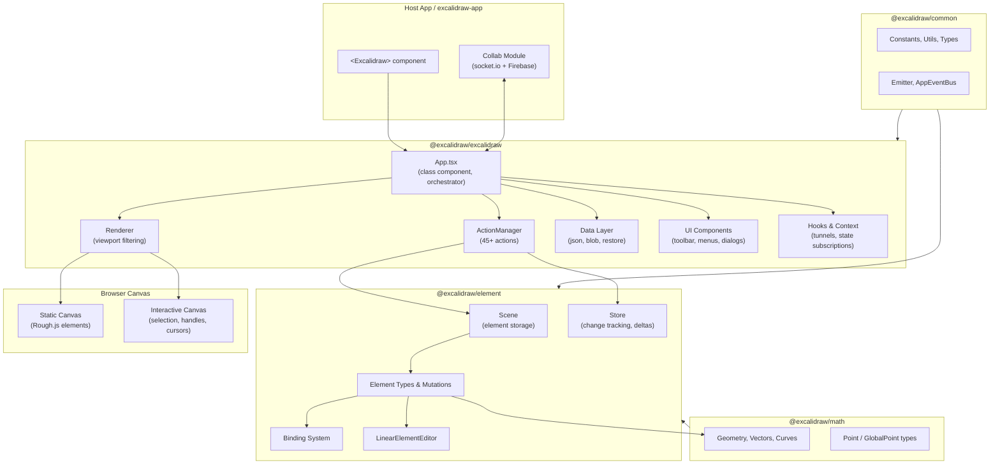
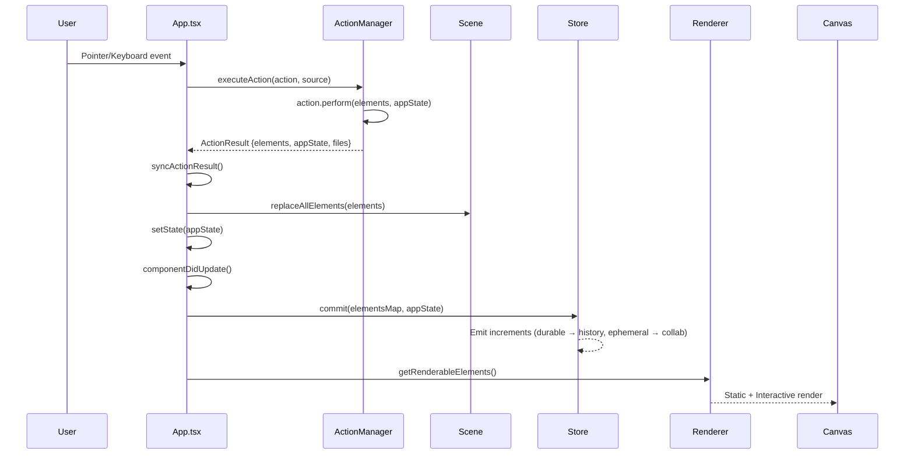
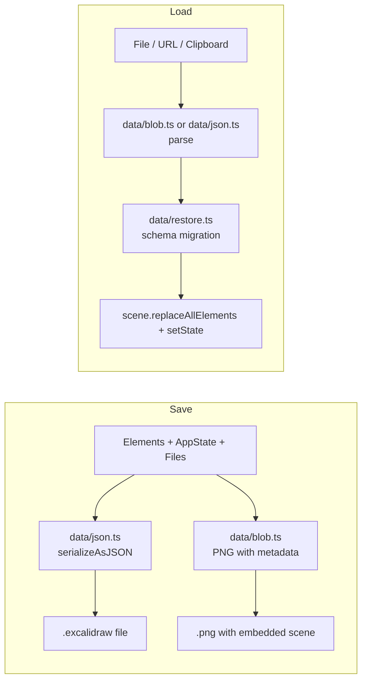
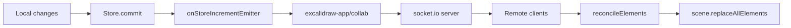
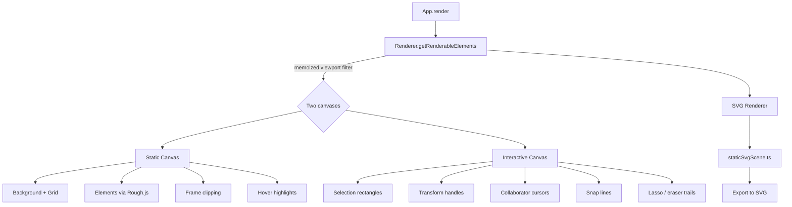
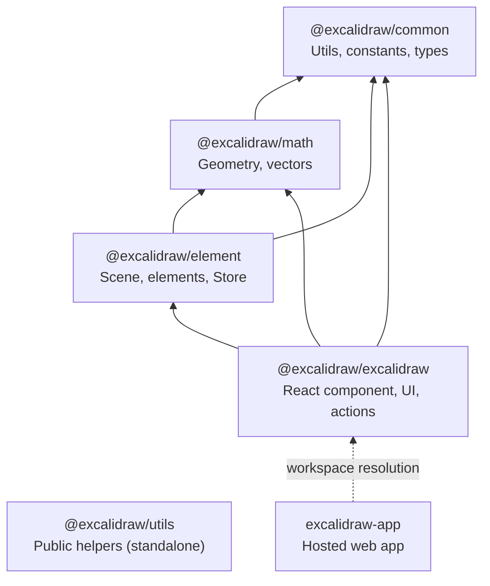

# Architecture

## High-level Architecture

Excalidraw is a monorepo with a layered package architecture. The main orchestrator is `App.tsx`, a ~12,800-line React class component that manages state, events, and rendering coordination. It delegates element storage to `Scene`, user operations to `ActionManager`, and visual output to a two-layer canvas system.

## Data Flow

### User Interaction → Visual Update

### Save / Load

### Collaboration

Collaboration is implemented in `excalidraw-app/collab/` (not in the library package). It uses socket.io for real-time sync, Firebase for persistence, and end-to-end encryption via the Web Crypto API. `reconcileElements()` in `data/reconcile.ts` merges remote and local element arrays using version numbers.

## State Management

Three independent state layers work together:

### AppState (React component state)
- Defined in `packages/excalidraw/types.ts` (~113 fields)
- Covers all UI/editor state: active tool, zoom, scroll, selection, theme, collaborators
- Defaults in `packages/excalidraw/appState.ts`
- `APP_STATE_STORAGE_CONF` maps each field to persistence targets (browser/export/server)

### Scene (element storage)
- `Scene` class in `packages/element/src/Scene.ts`
- Holds the ordered array of `ExcalidrawElement[]`
- Provides lookup maps, selection filtering, non-deleted element views
- Emits `onUpdate` when elements change → triggers re-render

### Store (change tracking)
- `Store` class in `packages/element/src/store.ts`
- Called on every `componentDidUpdate` via `store.commit()`
- Compares current vs previous state to generate deltas
- Emits `DurableIncrement` (→ history recording) and `EphemeralIncrement` (→ collab sync)
- Supports `CaptureUpdateAction` flags to control whether a change is recorded

### Jotai (isolated UI atoms)
- `editor-jotai.ts` creates an isolated Jotai store via `jotai-scope`
- Used for popup/panel state, tunnel contents
- Updated via `editorJotaiStore.set()` + manual `triggerRender()`

## Rendering Pipeline

**Performance optimizations:**
- `ShapeCache` — caches Rough.js generated shapes per element, invalidated on element mutation
- `SnapCache` — caches snap calculation results
- `Renderer.getRenderableElements()` — memoized, only recomputes when scene nonce or viewport changes
- Rendering throttled via `requestAnimationFrame`
- `withBatchedUpdates` wrapper batches multiple `setState` calls into single React render

## Package Dependencies

**Build order:** `common → math → element → excalidraw` (each package depends on the previous ones)

`@excalidraw/utils` is a standalone package with its own dependencies (roughjs, pako, perfect-freehand) — it does NOT depend on `@excalidraw/excalidraw`.

The `excalidraw-app` uses `@excalidraw/excalidraw` via yarn workspace resolution (not an explicit package.json dependency) and adds hosting-specific features: Firebase storage, Sentry error tracking, socket.io collaboration, and PWA support.
