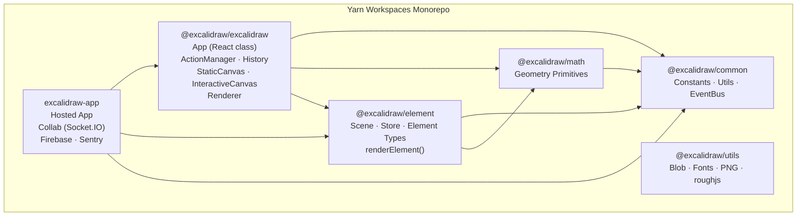

# Excalidraw Monorepo — Architecture

## Table of Contents

1. [High-level Architecture](#1-high-level-architecture)
2. [Data Flow](#2-data-flow)
3. [State Management](#3-state-management)
4. [Rendering Pipeline](#4-rendering-pipeline)
5. [Package Dependencies](#5-package-dependencies)

---

## 1. High-level Architecture

The repository is a Yarn workspaces monorepo (`packageManager: yarn@1.22.22`, root `package.json`).  
It is split into four publishable library packages, one standalone utility package, one hosted application, and an examples directory.

| Workspace | npm name | Role |
|---|---|---|
| `packages/common` | `@excalidraw/common` | Shared constants, utilities, color palette, event bus |
| `packages/math` | `@excalidraw/math` | 2-D geometry primitives (vectors, points, rotations) |
| `packages/element` | `@excalidraw/element` | Element types, Scene, Store, mutation helpers, renderer entry |
| `packages/excalidraw` | `@excalidraw/excalidraw` | React editor component, ActionManager, History, canvas renderers |
| `packages/utils` | `@excalidraw/utils` | Standalone utilities (blob, fonts, PNG chunks, roughjs wrapper) |
| `excalidraw-app` | _(private)_ | Hosted application — collaboration, Firebase persistence, Sentry |
| `examples/*` | _(private)_ | Integration examples |

### Mermaid Diagram



The build order mandated by the root `build:packages` script is:  
`common` → `math` → `element` → `excalidraw`  
(verified in root `package.json` `scripts.build:packages`).

---

## 2. Data Flow

### User interaction → canvas update

```
User input (pointer / keyboard)
        │
        ▼
App event handlers (onPointerDown, onKeyDown, …)
        │   defined in packages/excalidraw/components/App.tsx
        ▼
ActionManager.executeAction(action, source, value)
  ├─ calls action.perform(elements, appState, value, app)
  └─ action returns ActionResult { elements?, appState?, captureUpdate }
        │
        ▼
App.syncActionResult(actionResult)          [withBatchedUpdates]
  ├─ store.scheduleAction(captureUpdate)    → queues snapshot capture
  ├─ scene.replaceAllElements(elements)     → updates Scene element map
  ├─ this.setState(appState)                → schedules React re-render
  └─ scene.triggerUpdate()                  → fires if no React re-render occurred
        │
        ▼
React render cycle
  ├─ <StaticCanvas>   re-renders → calls renderStaticScene()
  └─ <InteractiveCanvas> re-renders → calls renderInteractiveScene()
        │
        ▼
Canvas 2-D context painted (via roughjs / Canvas API)
```

### Collaboration data flow (excalidraw-app)

```
Local element mutation
        │
        ▼
Portal.broadcastScene() / Portal.broadcastElements()
  └─ encryptData(roomKey, payload)
        │ Socket.IO emit
        ▼
Remote peers receive encrypted payload
  └─ decryptData(roomKey, payload)
        │
        ▼
App.syncActionResult({ captureUpdate: CaptureUpdateAction.NEVER, … })
```

Remote updates always use `CaptureUpdateAction.NEVER` so they are never pushed to the undo/redo stacks.

### Persistence (excalidraw-app)

`excalidraw-app/data/firebase.ts` initialises Firebase (`initializeApp`) and uses:

- **Firestore** (`getFirestore`, `doc`, `runTransaction`) — scene document storage.
- **Storage** (`getStorage`, `uploadBytes`) — binary file (image) storage.
- Elements are encrypted with the room key before upload and decrypted after download.

---

## 3. State Management

The editor uses three distinct, complementary state mechanisms.

### 3.1 AppState — React class component state

`AppState` is defined as an interface in `packages/excalidraw/types.ts` and held as `this.state` of the `App` class component (`packages/excalidraw/components/App.tsx`, line 617).

It contains UI and interaction state, including but not limited to:

- `newElement`, `resizingElement`, `multiElement`, `selectionElement` — ephemeral in-progress element state.
- `selectedElementIds`, `selectedGroupIds` — current selection.
- `editingTextElement`, `editingGroupId` — in-place editing state.
- `zoom`, `scrollX`, `scrollY`, `width`, `height` — viewport.
- `theme`, `viewModeEnabled`, `zenModeEnabled`, `gridModeEnabled` — display settings.
- `collaborators` — map of remote user cursors and selections.

`AppState` is mutated exclusively through `this.setState(...)` (React) or via `syncActionResult`. It is never stored in Jotai or in `Scene`.

For canvas rendering, `AppState` is split into two narrower read-only subtypes:

- `StaticCanvasAppState` — props needed by `StaticCanvas` (zoom, scroll, theme, grid, etc.).
- `InteractiveCanvasAppState` — props needed by `InteractiveCanvas` (selection handles, snap lines, etc.).

Both are defined in `packages/excalidraw/types.ts`.

The subset that is tracked for undo/redo diffing is `ObservedAppState` (also in `types.ts`), composed of `ObservedStandaloneAppState` (`name`, `viewBackgroundColor`) and `ObservedElementsAppState` (`selectedElementIds`, `selectedGroupIds`, `editingGroupId`, `selectedLinearElement`, `croppingElementId`, `lockedMultiSelections`, `activeLockedId`).

### 3.2 Elements — Scene

Canvas elements are owned by `Scene` (`packages/element/src/Scene.ts`, class `Scene`).

`Scene` is constructed by `App` (`this.scene = new Scene()`, App.tsx line 825) and holds:

- An ordered map (`SceneElementsMap`) of all elements including deleted ones.
- Filtered accessors: `getNonDeletedElements()`, `getNonDeletedElementsMap()`, `getNonDeletedFramesLikes()`, `getSelectedElements(appState)`.
- Mutation helpers: `mutateElement(element, update)`, `replaceAllElements(elements)`, `insertElements(elements)`.
- A subscriber mechanism: `addCallback(cb)` / `triggerUpdate()` used by `Renderer` and `App` to know when to re-render without a React state change.

Elements are **not** stored in `AppState`. They live solely in `Scene` and are passed as props to canvas components.

### 3.3 ActionManager — action registry and dispatcher

`ActionManager` is constructed by `App` with four constructor arguments (App.tsx line 819–824):

```
this.actionManager = new ActionManager(
  this.syncActionResult,        // updater fn — the action result handler
  () => this.state,             // getAppState
  () => this.scene.getElementsIncludingDeleted(),
  this,                         // app reference
);
```

`ActionManager` (`packages/excalidraw/actions/manager.tsx`):

- Maintains `actions: Record<ActionName, Action>` — all registered actions.
- Exposes `registerAction(action)` and `registerAll(actions)`.
- Dispatches keyboard events via `handleKeyDown`, and UI panel events via `executeAction`.
- Every action's `perform()` function returns an `ActionResult`; `ActionManager` passes this to `syncActionResult` (the `updater` fn).

Actions are registered in App's constructor: `this.actionManager.registerAll(actions)` plus explicit `createUndoAction` and `createRedoAction`.

### 3.4 Store and History

`Store` (`packages/element/src/store.ts`) captures observable changes between consecutive snapshots:

- Holds a `StoreSnapshot` (immutable snapshot of elements + `ObservedAppState`).
- `scheduleAction(captureUpdateAction)` queues a macro-action with one of three strategies:
  - `CaptureUpdateAction.IMMEDIATELY` — snapshot diff is computed and emitted immediately.
  - `CaptureUpdateAction.EVENTUALLY` — diff is deferred until the next `IMMEDIATELY`.
  - `CaptureUpdateAction.NEVER` — no snapshot is taken (used for remote/init updates).
- Emits `DurableIncrement | EphemeralIncrement` on `onStoreIncrementEmitter` (public API) and `DurableIncrement` on `onDurableIncrementEmitter` (for History).

`History` (`packages/excalidraw/history.ts`) subscribes to `Store.onDurableIncrementEmitter` and pushes `HistoryDelta` objects (undo/redo entries). `HistoryDelta.applyTo(elements, appState, snapshot)` returns the next `[elements, appState]` pair without modifying the snapshot.

### 3.5 Jotai — scoped UI atoms

`packages/excalidraw/editor-jotai.ts` creates an isolated Jotai scope via `jotai-scope`:

```ts
const jotai = createIsolation();
export const { useAtom, useSetAtom, useAtomValue, useStore } = jotai;
export const EditorJotaiProvider = jotai.Provider;
export const editorJotaiStore = createStore();
```

`EditorJotaiProvider` wraps the entire `<Excalidraw>` component tree (in `packages/excalidraw/index.tsx`). Jotai atoms are used for UI-only state (sidebar open/closed, dialog state, etc.) that does not need to participate in the action/undo pipeline.

---

## 4. Rendering Pipeline

### 4.1 Component tree

```
<Excalidraw>   (packages/excalidraw/index.tsx)
  <EditorJotaiProvider>
    <InitializeApp>
      <App>    (packages/excalidraw/components/App.tsx — React class)
        <StaticCanvas>       (packages/excalidraw/components/canvases/StaticCanvas.tsx)
        <InteractiveCanvas>  (packages/excalidraw/components/canvases/InteractiveCanvas.tsx)
        <NewElementCanvas>   (packages/excalidraw/components/canvases/NewElementCanvas.tsx)
        … UI panels, dialogs, toolbars …
      </App>
```

### 4.2 Static canvas

`StaticCanvas` is a functional React component. On every render it:

1. Resizes the raw `HTMLCanvasElement` to `appState.width × appState.height × scale`.
2. Calls `renderStaticScene(config, isRenderThrottlingEnabled())` from  
   `packages/excalidraw/renderer/staticScene.ts`.

`renderStaticScene` has two paths (line 491–500):

- **Throttled** (`renderStaticSceneThrottled`) — wraps `_renderStaticScene` with `throttleRAF` (request-animation-frame throttle from `@excalidraw/common`) for normal interactive use.
- **Unthrottled** — used when `isRenderThrottlingEnabled()` returns `false` (e.g. during export).

`_renderStaticScene` paints onto the `CanvasRenderingContext2D`:

1. Clears and resets the canvas transform.
2. Optionally draws the grid (`strokeGrid`).
3. Iterates `visibleElements` and calls `renderElement(element, rc, canvas, …)` for each.

### 4.3 Interactive canvas

`InteractiveCanvas` drives `renderInteractiveScene` (from `packages/excalidraw/renderer/interactiveScene.ts`). It paints selection handles, binding highlights, snap lines, laser-pointer trails, and remote collaborator cursors on top of the static layer.

`App.renderInteractiveSceneCallback` (App.tsx line 3521) receives the callback from `<InteractiveCanvas>` and applies state changes (e.g. `selectionNonce`) that trigger selective re-renders.

### 4.4 Element rendering

`renderElement()` is defined in `packages/element/src/renderElement.ts` (line 780).  
It dispatches by element type and uses:

- **roughjs** (`rough.canvas(canvas)` / `rough.canvas(tempCanvas)`) for stroked shapes (rectangle, ellipse, diamond, line, arrow, freedraw) to achieve the hand-drawn appearance.
- The **Canvas 2-D API** directly for text, images, iframes, and embeddable elements.

### 4.5 Renderer helper

`Renderer` (`packages/excalidraw/scene/Renderer.ts`) is constructed by `App` with `this.renderer = new Renderer(this.scene)` (App.tsx line 829).

`Renderer.getRenderableElements({ elements, editingTextElement, newElementId })` filters the scene's non-deleted elements to only those intersecting the current viewport (`isElementInViewport`) and builds a `RenderableElementsMap` passed to canvas components as props.

---

## 5. Package Dependencies

### Dependency graph

```
@excalidraw/common
    ▲
    │           ▲
@excalidraw/math   @excalidraw/common
    ▲
    │
@excalidraw/element  ←─── @excalidraw/common
    ▲                └──── @excalidraw/math
    │
@excalidraw/excalidraw ←── @excalidraw/common
    ▲                  ├── @excalidraw/math
    │                  ├── @excalidraw/element
    │                  ├── jotai + jotai-scope
    │                  ├── roughjs
    │                  └── radix-ui, codemirror, …
    │
excalidraw-app ──────────── @excalidraw/excalidraw
                        ├── @excalidraw/element
                        ├── @excalidraw/common
                        ├── socket.io-client
                        ├── firebase
                        └── @sentry/browser
```

### Per-package responsibility and key external dependencies

| Package | Key external deps | Internal deps |
|---|---|---|
| `@excalidraw/common` | `tinycolor2` | — |
| `@excalidraw/math` | — | `@excalidraw/common` |
| `@excalidraw/element` | — | `@excalidraw/common`, `@excalidraw/math` |
| `@excalidraw/excalidraw` | `roughjs 4.6.4`, `jotai 2.11.0`, `jotai-scope 0.7.2`, `radix-ui 1.4.3`, `@codemirror/* ^6`, `@excalidraw/mermaid-to-excalidraw 2.1.1`, `perfect-freehand 1.2.0`, `nanoid 3.3.3`, `pako 2.0.3` | `@excalidraw/common`, `@excalidraw/math`, `@excalidraw/element` |
| `@excalidraw/utils` | `roughjs 4.6.4`, `perfect-freehand 1.2.0`, `browser-fs-access 0.38.0`, `pako 2.0.3`, `png-chunk-*` | — |
| `excalidraw-app` | `socket.io-client 4.7.2`, `firebase 11.3.1`, `@sentry/browser 9.0.1`, `idb-keyval 6.0.3`, `i18next-browser-languagedetector 6.1.4` | `@excalidraw/excalidraw`, `@excalidraw/element`, `@excalidraw/common` |

### Build tooling (root devDependencies)

| Tool | Version | Purpose |
|---|---|---|
| TypeScript | 5.9.3 | Type checking (`tsc`) |
| Vite | 5.0.12 | Bundling (app and packages) |
| Vitest | 3.0.6 | Unit / integration tests |
| ESLint | via `@excalidraw/eslint-config` | Linting |
| Prettier | 2.6.2 | Formatting |
| Husky | 7.0.4 | Git hooks (`prepare` script) |
| rimraf | ^5.0.0 | Cross-platform clean scripts |
