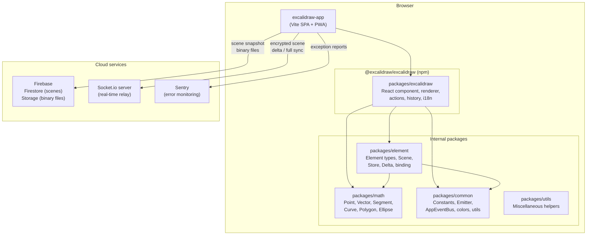
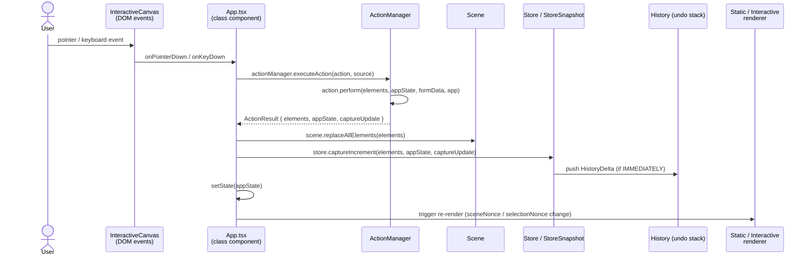
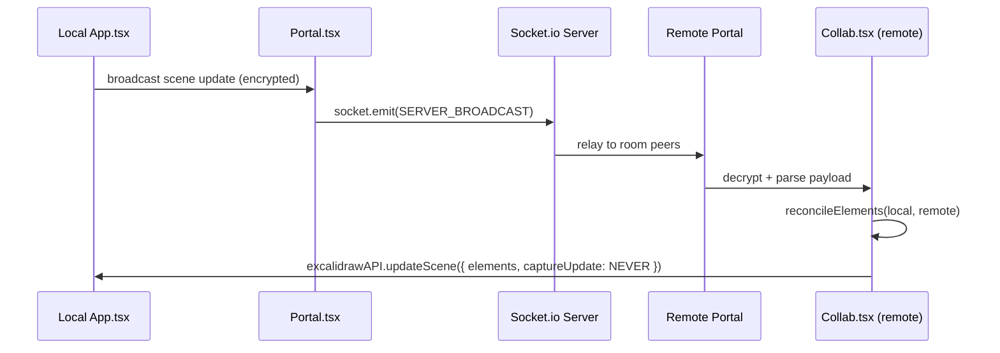
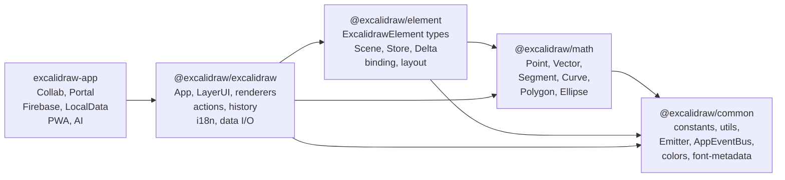

# Architecture

## 1. High-Level Architecture

Excalidraw is a Yarn monorepo. The hosted web app (`excalidraw-app`) depends on the embeddable component
package (`packages/excalidraw`), which in turn depends on three lower-level packages: `element`, `math`,
and `common`. None of the lower-level packages may import from a higher-level package.



### Key boundaries

| Boundary | Rule |
|----------|------|
| `packages/math` | No DOM, no React, no other internal packages |
| `packages/common` | No DOM/React; may import `math` only via re-export |
| `packages/element` | No React; imports `math` and `common` |
| `packages/excalidraw` | React allowed; imports all internal packages |
| `excalidraw-app` | Full browser environment; uses `@excalidraw/excalidraw` public API only |

---

## 2. Data Flow

### 2.1 User Interaction → Scene Update



### 2.2 Collaboration Data Flow



Volatile events (`WS_EVENTS.SERVER_VOLATILE`) are used for ephemeral cursor positions;
non-volatile (`WS_EVENTS.SERVER`) are used for scene mutations persisted across reconnects.

### 2.3 Local Persistence Flow

```
User draws
  → LocalData.saveDebounced() [300 ms debounce]
    → clearAppStateForLocalStorage(appState) → localStorage.setItem
    → FileManager.saveFiles() → idb-keyval (IndexedDB "files-db/files-store")
  → tab-sync broadcast (BroadcastChannel) to other open tabs
```

### 2.4 Import / Export Flow

```
Load file
  loadFromBlob(file) → restoreElements + restoreAppState
    → excalidrawAPI.updateScene({ elements, appState, captureUpdate: NEVER })

Export PNG / SVG
  exportToCanvas(elements, appState, files)
    → renderStaticScene on offscreen canvas
    → canvas.toBlob() / exportToSvg()

Export JSON
  serializeAsJSON(elements, appState, files, "local")
    → JSON.stringify with version + source metadata
```

---

## 3. State Management

### 3.1 AppState

`AppState` (declared in `packages/excalidraw/types.ts`) is the single class-component state object
managed inside `App` via `this.setState()`. It contains:

- **Tool state** — `activeTool`, `preferredSelectionTool`, `newElement`, `editingTextElement`
- **View state** — `scrollX`, `scrollY`, `zoom`, `width`, `height`, `theme`, `viewModeEnabled`, `zenModeEnabled`
- **Interaction state** — `draggingElement`, `resizingElement`, `editingGroupId`, `selectedGroupIds`, `selectedLinearElement`
- **Collaboration state** — `collaborators` (Map), `isLoading`, `errorMessage`
- **UI state** — `openMenu`, `openDialog`, `toast`, `contextMenu`, `activeEmbeddable`, `openSidebar`
- **Element props** — `currentItemStrokeColor`, `currentItemFillStyle`, `currentItemFontFamily`, etc.

`ObservedAppState` is a narrower type covering only fields tracked by the `Store` for delta computation.

### 3.2 Elements and Scene

`Scene` (`packages/element/src/Scene.ts`) is the authoritative in-memory container for elements:

- Maintains `elements: OrderedExcalidrawElement[]` (ordered array) and a parallel `Map<id, element>`.
- Exposes `getNonDeletedElements()`, `getNonDeletedElementsMap()`, `getSelectedElements()`.
- Emits callbacks to subscribers (including the renderer) on any mutation.
- Enforces **fractional index ordering** (`syncInvalidIndices`, `syncMovedIndices`) for stable z-order.
- Soft-delete pattern: elements are marked `isDeleted: true` rather than removed; the renderer only
  draws non-deleted elements. Deleted elements are pruned after `DELETED_ELEMENT_TIMEOUT` (24 h).

### 3.3 Store, Snapshot, and Delta

`Store` (`packages/element/src/store.ts`) bridges the live editing loop to the undo system:

```
Store
 ├── StoreSnapshot  — immutable copy of { elements: Map, appState: ObservedAppState }
 └── captureIncrement(elements, appState, CaptureUpdateAction)
       → computes StoreDelta = ElementsDelta + AppStateDelta
       → pushes HistoryDelta to History when CaptureUpdateAction.IMMEDIATELY
```

`ElementsDelta` and `AppStateDelta` (in `packages/element/src/delta.ts`) record property-level
forward/inverse diffs enabling true undo of collaborative edits without full-snapshot storage.

`CaptureUpdateAction` values (from `packages/element/src/store.ts`):
- `IMMEDIATELY` — undoable right away; used for most user actions.
- `EVENTUALLY` — batched into the next `IMMEDIATELY` capture; used for async multi-step operations.
- `NEVER` — never recorded; used for remote updates, scene init, and collab reconciliation.

### 3.4 ActionManager

`ActionManager` (`packages/excalidraw/actions/manager.tsx`) is a registry + dispatcher:

```ts
class ActionManager {
  actions: Record<ActionName, Action>   // all registered actions
  executeAction(action, source, value)  // dispatch + track event
  renderAction(name, opts)              // render PanelComponent for toolbar/panel use
}
```

Each `Action` declares:
- `perform(elements, appState, formData, app): ActionResult` — pure transformation.
- `ActionResult` returns `{ elements?, appState?, files?, captureUpdate }` or `false` (no-op).
- Optional `keyTest`, `contextItemLabel`, `PanelComponent` for UI binding.
- Optional `trackEvent` config for analytics.

`ActionSource` can be `"ui"`, `"keyboard"`, `"contextMenu"`, `"api"`, or `"commandPalette"`.

### 3.5 Jotai Atom Stores

Two isolated Jotai stores avoid cross-contamination between the embeddable component and the hosted app:

| Store | Location | Holds |
|-------|----------|-------|
| `editorJotaiStore` | `packages/excalidraw/editor-jotai.ts` | `isSidebarDockedAtom`, `activeEyeDropperAtom`, collab UI atoms, editor-local ephemeral state |
| `appJotaiStore` | `excalidraw-app/app-jotai.ts` | App-level atoms: `shareDialogStateAtom`, `activeRoomLinkAtom`, local data atoms |

`jotai-scope` creates the isolation; `useAtom`/`useAtomValue` from each module are scoped to their store.

### 3.6 AppEventBus

`AppEventBus` (`packages/common/src/appEventBus.ts`) is a strongly-typed pub/sub system with:
- `cardinality: "once" | "many"` — one-shot vs repeating events.
- `replay: "none" | "last"` — whether late subscribers receive the last emission immediately.
- `on(name, cb)` / `emit(name, ...args)` / `once(name)` returning a `Promise`.

Used for lifecycle events such as `"editor:mount"`, `"editor:initialize"`, `"editor:unmount"`.

---

## 4. Rendering Pipeline

The rendering system composes **three canvas layers** inside `App.tsx`. Each is a separate `<canvas>` element positioned absolutely on top of the previous.

```
App.tsx
 └── <div.excalidraw>
      ├── LayerUI.tsx          ← HTML overlay (toolbar, panels, dialogs)
      ├── StaticCanvas         ← Layer 1: finalized elements
      ├── NewElementCanvas     ← Layer 2: element being drawn right now
      └── InteractiveCanvas    ← Layer 3: selection, handles, cursors, overlays
```

### 4.1 StaticCanvas

- **Component**: `packages/excalidraw/components/canvases/StaticCanvas.tsx`
- **Renderer**: `packages/excalidraw/renderer/staticScene.ts` → `renderStaticScene()`
- **When it redraws**: when `sceneNonce` or `selectionNonce` changes (React `useEffect`).
- **Uses**: `RoughCanvas` (roughjs) for stroke generation; `renderElement()` from `packages/element/src/renderElement.ts` for individual element drawing.
- **Optimisation**: `isRenderThrottlingEnabled()` gates redraws during rapid pan/zoom.
- **Contents**: all non-deleted elements, grid lines, frame clips.

### 4.2 NewElementCanvas

- **Component**: `packages/excalidraw/components/canvases/NewElementCanvas.tsx`
- **Renderer**: `packages/excalidraw/renderer/renderNewElementScene.ts`
- **When it redraws**: on every render (no memo guard) — driven by `appState.newElement`.
- **Contents**: the single in-progress element being drawn; shown only while a drawing tool is active.

### 4.3 InteractiveCanvas

- **Component**: `packages/excalidraw/components/canvases/InteractiveCanvas.tsx`
- **Renderer**: `packages/excalidraw/renderer/interactiveScene.ts` → `renderInteractiveScene()`
- **When it redraws**: `useEffect` on `sceneNonce`, `selectionNonce`, and `appState` changes.
- **Contents**: selection highlights, transform handles, binding indicators, collaborator cursors,
  follow-mode viewport outline, snapping guides, frame labels.
- **Animation**: `AnimationController` drives RAF-based animations (laser trails, lasso trail) via
  `AnimationFrameHandler` without triggering React re-renders.

### 4.4 Element Rendering Detail

```
renderElement(element, context, rc, appState, …)   [packages/element/src/renderElement.ts]
  ├── ShapeCache.get(element)                        — returns cached RoughJS shape or null
  ├── rc.draw(shape)                                 — RoughJS canvas drawing (roughjs)
  └── (text elements) → measureText + fillText
```

`ShapeCache` stores roughjs `Drawable` objects keyed by element version. Cache is invalidated on
any property change (detected via `element.version` increment).

Coordinate transforms applied per-element:
1. `context.translate(cx, cy)` to element centre
2. `context.rotate(element.angle)`
3. Draw at `(-width/2, -height/2)` relative origin
4. `context.restore()`

### 4.5 SVG Layer

`SVGLayer.tsx` renders an `<svg>` overlay (same dimensions as the canvas) for animated effects that
benefit from SVG's path capabilities: laser pointer trails and lasso selection trails. Paths are
written directly into the SVG DOM by `AnimatedTrail` via `requestAnimationFrame`.

---

## 5. Package Dependencies

### 5.1 Dependency Graph



### 5.2 Third-Party Dependencies (key)

| Package | Used in | Purpose |
|---------|---------|---------|
| `roughjs` | `packages/excalidraw` | Hand-drawn stroke generation for shapes |
| `react` / `react-dom` 19 | `packages/excalidraw`, `excalidraw-app` | UI framework |
| `jotai` + `jotai-scope` | `packages/excalidraw`, `excalidraw-app` | Atom-based state |
| `firebase` 11 | `excalidraw-app` | Firestore (scene persistence), Storage (files) |
| `socket.io-client` 4 | `excalidraw-app` | Real-time WebSocket collaboration |
| `idb-keyval` | `excalidraw-app` | IndexedDB access (file/image storage, library) |
| `@sentry/browser` | `excalidraw-app` | Error monitoring |
| `lodash.throttle` | `packages/excalidraw`, `excalidraw-app` | RAF & time-based throttling |
| `nanoid` | `packages/excalidraw` | Collision-resistant element ID generation |
| `i18next` | `packages/excalidraw` | Internationalisation runtime |
| `i18next-browser-languagedetector` | `excalidraw-app` | Browser locale detection |
| `@excalidraw/laser-pointer` | `packages/excalidraw` | SVG path stroke for laser / lasso trails |
| `clsx` | `packages/excalidraw` | Conditional CSS class assembly |

### 5.3 Internal Module Responsibilities

#### `packages/common/src/`

| Module | Exports |
|--------|---------|
| `constants.ts` | `TOOL_TYPE`, `KEYS`, `EVENT`, `THEME`, `ARROW_TYPE`, `MIME_TYPES`, … |
| `utils.ts` | `debounce`, `throttleRAF`, `arrayToMap`, `cloneJSON`, `sceneCoordsToViewportCoords`, … |
| `emitter.ts` | Generic `Emitter<T>` pub/sub |
| `appEventBus.ts` | `AppEventBus` with cardinality + replay semantics |
| `colors.ts` | `COLOR_PALETTE`, theme color maps |
| `font-metadata.ts` | `FONT_METRICS`, font family constants |

#### `packages/element/src/`

| Module | Exports |
|--------|---------|
| `types.ts` | `ExcalidrawElement` union, all element subtypes, `SceneElementsMap` |
| `Scene.ts` | `Scene` — authoritative element container with subscriber callbacks |
| `store.ts` | `Store`, `StoreSnapshot`, `CaptureUpdateAction` |
| `delta.ts` | `ElementsDelta`, `AppStateDelta`, `StoreDelta` — property-level diffs |
| `mutateElement.ts` | `mutateElement()`, `newElementWith()` |
| `binding.ts` | Arrow-to-shape binding logic |
| `elbowArrow.ts` | Smart elbow arrow routing algorithm |
| `flowchart.ts` | Flowchart auto-connection helpers |
| `renderElement.ts` | Per-element draw dispatch with `ShapeCache` |
| `fractionalIndex.ts` | Stable z-order via fractional indexing |

#### `packages/excalidraw/` (selected)

| Module | Exports |
|--------|---------|
| `components/App.tsx` | `App` class component — central event hub and state owner |
| `components/LayerUI.tsx` | HTML overlay: toolbar, menus, dialogs, sidebar |
| `renderer/staticScene.ts` | `renderStaticScene()` — draws finalized elements to static canvas |
| `renderer/interactiveScene.ts` | `renderInteractiveScene()` — draws selection + ephemeral UI |
| `renderer/renderNewElementScene.ts` | `renderNewElementScene()` — draws in-progress element |
| `actions/manager.tsx` | `ActionManager` class |
| `history.ts` | `HistoryDelta`, undo/redo stack management |
| `data/` | `loadFromBlob`, `serializeAsJSON`, `encryptData`, `decryptData`, `restore*` |
| `i18n.ts` | `t()` translation helper, locale loading |
| `lasso/index.ts` | `LassoTrail` — freehand selection via `AnimatedTrail` |
| `animated-trail.ts` | `AnimatedTrail` base — SVG stroke animations via `AnimationFrameHandler` |
| `animation-frame-handler.ts` | `AnimationFrameHandler` — RAF lifecycle manager |
