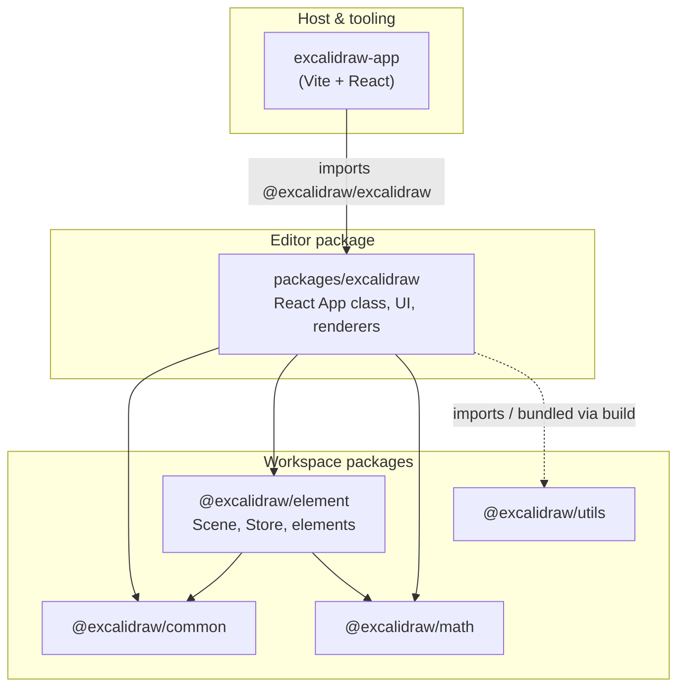
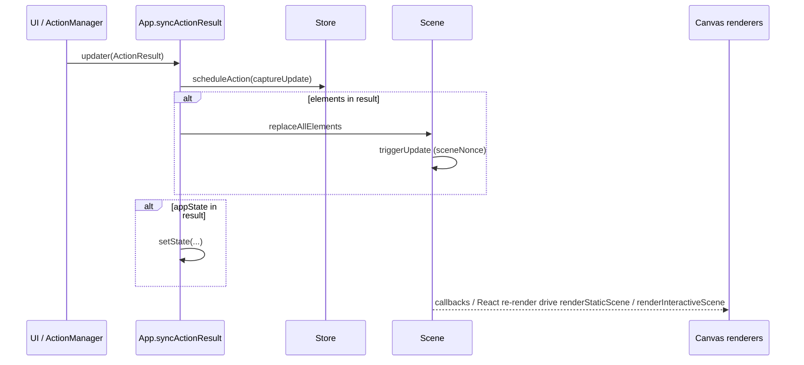

# Excalidraw monorepo — technical architecture

This document describes structure and data flow **as implemented in source**. Paths are relative to the repository root.

---

## High-level architecture

The repository is a **Yarn workspaces monorepo**. The interactive editor lives in `packages/excalidraw`; the full web shell is `excalidraw-app`; shared logic is split across `packages/common`, `packages/element`, `packages/math`, and `packages/utils` (see each `package.json` `name` and `dependencies`).



- **`excalidraw-app`:** Vite application; scripts invoke `vite` (`excalidraw-app/package.json` `scripts`). It resolves `@excalidraw/*` to source via `excalidraw-app/vite.config.mts` `resolve.alias`.
- **`packages/excalidraw`:** Main React class component `App` (`packages/excalidraw/components/App.tsx`) hosts the canvas, `ActionManager`, `Scene`, `Store`, `History`, and `Renderer`.
- **`@excalidraw/element`:** Defines `Scene`, `Store`, `StoreDelta`, element mutation helpers, and re-exports drawing-related APIs used by the editor (`packages/element/src/Scene.ts`, `packages/element/src/store.ts`).

---

## Data flow

End-to-end flow for a **command-style update** (e.g. menu or `executeAction`):

1. **User or API** triggers `ActionManager.executeAction` (`packages/excalidraw/actions/manager.tsx`), which calls `action.perform(elements, appState, value, app)` and passes the result to the **`updater`** callback (the `App` constructor passes `this.syncActionResult` as that updater — `packages/excalidraw/components/App.tsx` constructor).
2. **`ActionResult`** (`packages/excalidraw/actions/types.ts`) may include:
   - `elements` — optional new element array for the scene
   - `appState` — partial React state patch
   - `captureUpdate` — `CaptureUpdateActionType` from `packages/element/src/store.ts` (`IMMEDIATELY` | `NEVER` | `EVENTUALLY`)
   - optional `files`/`replaceFiles` for binary assets
3. **`syncActionResult`** (`packages/excalidraw/components/App.tsx`):
   - calls `this.store.scheduleAction(actionResult.captureUpdate)`
   - if `actionResult.elements` is set: `this.scene.replaceAllElements(actionResult.elements)`
   - if `actionResult.appState` (or related branches): `this.setState(...)` merging into previous `AppState`
   - if nothing marked `didUpdate`, calls `this.scene.triggerUpdate()` to force subscribers to run
4. **`Scene.replaceAllElements`** (`packages/element/src/Scene.ts`) rebuilds internal maps (`elements`, `elementsMap`, `nonDeletedElements`, frames), then **`triggerUpdate()`**, which increments a **`sceneNonce`** and invokes registered callbacks.
5. **`Store`** (`packages/element/src/store.ts`) captures **observed** changes for undo/redo: it schedules macro/micro actions, emits **`onStoreIncrementEmitter`**, and participates in **`History`** (`packages/excalidraw/history` imported from `App.tsx`).

Pointer-driven edits (not shown in full here) follow similar paths: pointer handlers on `App` update `AppState` and/or scene elements, often through batched updates (`withBatchedUpdates` wrapping `syncActionResult` in `App.tsx`).



---

## State management

### `AppState` (React `App` component state)

- **Type:** `AppState` in `packages/excalidraw/types.ts` (`export interface AppState`).
- **Initialization:** `getDefaultAppState()` from `packages/excalidraw/appState.ts`; merged with props and layout in `App` constructor (`packages/excalidraw/components/App.tsx`).
- **Scope:** UI-wide state: tool (`activeTool`), selection (`selectedElementIds`, `selectedGroupIds`), viewport (`scrollX`, `scrollY`, `zoom`), theme, dialogs (`openDialog`), collaboration (`collaborators`), transient drawing (`newElement`, `selectionElement`, `resizingElement`, …), grid, export options, and layout metrics (`width`, `height`, `offsetTop`, `offsetLeft`). The interface is large; see `packages/excalidraw/types.ts` for the authoritative field list.

### `elements` (scene graph)

- **Not** stored only in React state. The **canonical ordered list** lives on **`Scene`** (`packages/element/src/Scene.ts`): private `elements`, `elementsMap`, `nonDeletedElements`, `nonDeletedElementsMap`, frame lists, plus **`sceneNonce`** for render cache invalidation (`getSceneNonce()` / `triggerUpdate()`).
- `App` holds `this.scene = new Scene()` in the constructor (`packages/excalidraw/components/App.tsx`).
- Updates to the document go through **`Scene.replaceAllElements`**, which syncs indices, rebuilds maps, and **`triggerUpdate()`**.

### `Store` and undo/redo

- **`Store`** (`packages/element/src/store.ts`) is constructed with **`new Store(this)`** where `this` is `App` (`packages/excalidraw/components/App.tsx`).
- **`CaptureUpdateAction`** (`packages/element/src/store.ts`) classifies whether a change is **immediately** undoable, **never** recorded (e.g. remote), or **eventually** batched.
- **`Store.commit`** / `scheduleMicroAction` / `scheduleCapture` integrate with **`History`**: implementation is in **`packages/excalidraw/history.ts`**; `App` constructs **`this.history = new History(this.store)`** and registers **`createUndoAction(this.history)`** / **`createRedoAction(this.history)`** on `actionManager` (`packages/excalidraw/components/App.tsx`).
- **`App`** subscribes to **`store.onStoreIncrementEmitter`** for increment handling (`packages/excalidraw/components/App.tsx`; search `onStoreIncrementEmitter` in that file).

### `ActionManager`

- **Class:** `ActionManager` in `packages/excalidraw/actions/manager.tsx`.
- **Construction:** `new ActionManager(this.syncActionResult, () => this.state, () => this.scene.getElementsIncludingDeleted(), this)` (`packages/excalidraw/components/App.tsx`).
- **Registry:** `registerAll(actions)` from `packages/excalidraw/actions/register.ts` plus `createUndoAction` / `createRedoAction`.
- **Behavior:**
  - **`executeAction(action, source, value)`** — loads elements and appState, calls `perform`, passes result to **`updater`** (`manager.tsx`).
  - **`handleKeyDown`** — finds a single matching action via `keyTest`, then `perform` with `source: "keyboard"`.
  - **`renderAction`** — Renders `PanelComponent` for toolbar/UI and wires `updateData` to another `perform` call.
- **`Action` interface:** `name`, `perform`, optional `keyTest`, `predicate`, `PanelComponent`, `trackEvent`, etc. (`packages/excalidraw/actions/types.ts`).

### Jotai (`editorJotai`)

- **`packages/excalidraw/editor-jotai.ts`** uses **`jotai`** + **`jotai-scope`** (`createIsolation`), exports **`EditorJotaiProvider`**, **`editorJotaiStore`**, and re-exports `useAtom` / `atom` primitives.
- **`packages/excalidraw/index.tsx`** wraps the editor tree with **`EditorJotaiProvider`** and uses **`editorJotaiStore`** for imperative API updates (`updateEditorAtom`). This is **additional** to React `AppState` and is used for scoped editor atoms (e.g. sidebar/popup state referenced from `App.tsx`).

---

## Rendering pipeline: React to canvas

### Canvas setup in `App`

- In **`App` constructor** (`packages/excalidraw/components/App.tsx`): `this.canvas = document.createElement("canvas")`, `this.rc = rough.canvas(this.canvas)` (Rough.js), `this.renderer = new Renderer(this.scene)`.
- **`Renderer`** (`packages/excalidraw/scene/Renderer.ts`) holds a reference to **`Scene`** and computes **renderable** elements (viewport filter, memoization) using `renderStaticSceneThrottled` from `../renderer/staticScene`.

### Per-frame preparation in `App.render`

- Each **`App.render()`** (`packages/excalidraw/components/App.tsx`) calls **`this.renderer.getRenderableElements({ sceneNonce, zoom, offsetLeft, offsetTop, scrollX, scrollY, height, width, editingTextElement, newElementId })`** and assigns **`this.visibleElements`** from the result. It also reads **`allElementsMap`** from **`this.scene.getNonDeletedElementsMap()`**. Those values are passed into **`StaticCanvas`** and **`InteractiveCanvas`** as props.

### JSX layer

- **`App` render** composes (`packages/excalidraw/components/App.tsx`):
  - **`StaticCanvas`** — background grid + static elements; receives `canvas`, `rc`, `elementsMap`, `visibleElements`, `appState`, `sceneNonce`, `renderConfig`.
  - **`NewElementCanvas`** — when `this.state.newElement` is set (in-progress shape).
  - **`InteractiveCanvas`** — selection handles, cursors, remote pointers; receives `interactiveCanvas` ref, `renderInteractiveSceneCallback`, pointer handlers.

### `StaticCanvas` → `renderStaticScene`

- **`StaticCanvas`** (`packages/excalidraw/components/canvases/StaticCanvas.tsx`) in `useEffect` calls **`renderStaticScene({ canvas, rc, scale, elementsMap, allElementsMap, visibleElements, appState, renderConfig }, ...)`** (`packages/excalidraw/renderer/staticScene.ts`).
- **`staticScene.ts`** uses **`bootstrapCanvas`**, grid drawing (`strokeGrid`), and **`renderElement`** from `packages/element` (`import { renderElement } from "@excalidraw/element"` in `staticScene.ts`).

### `InteractiveCanvas` → `renderInteractiveScene`

- **`InteractiveCanvas`** (`packages/excalidraw/components/canvases/InteractiveCanvas.tsx`) imports **`renderInteractiveScene`** from `packages/excalidraw/renderer/interactiveScene.ts` and builds **`InteractiveSceneRenderConfig`** (collaborator cursors, selection, etc.) in `useEffect`.

### Summary chain

```text
React <App> state
  → props to StaticCanvas / InteractiveCanvas
  → useEffect hooks
  → renderStaticScene / renderInteractiveScene
  → Canvas 2D API + roughjs (rc) + element renderElement()
```

---

## Package dependencies

Derived from **`package.json` `dependencies`** in each package (root `package.json` `workspaces` lists `excalidraw-app`, `packages/*`, `examples/*`).

| Package | Depends on (internal) | Notes |
|---------|------------------------|--------|
| `@excalidraw/common` | *(none)* | Third-party e.g. `tinycolor2` (`packages/common/package.json`) |
| `@excalidraw/math` | `@excalidraw/common` | `packages/math/package.json` |
| `@excalidraw/element` | `@excalidraw/common`, `@excalidraw/math` | `packages/element/package.json` |
| `@excalidraw/utils` | *(no `@excalidraw/*` deps in package.json)* | Built separately; editor imports resolved via build alias (`scripts/buildPackage.js`) |
| `@excalidraw/excalidraw` | `@excalidraw/common`, `@excalidraw/element`, `@excalidraw/math`, plus UI libs | **Does not** list `@excalidraw/utils` in `dependencies`; source imports `@excalidraw/utils/*` |
| `excalidraw-app` | *(no `@excalidraw/excalidraw` in `dependencies`)* | Imports `@excalidraw/excalidraw` from **`App.tsx`** via Yarn workspace + **`excalidraw-app/vite.config.mts`** `resolve.alias` to `../packages/excalidraw` (see `excalidraw-app/package.json` vs imports in `excalidraw-app/App.tsx`) |

**Build graph (root scripts):** `build:packages` runs `common` → `math` → `element` → `excalidraw` (`package.json` `build:packages`); `utils` is not in that chain.

**TypeScript paths:** `tsconfig.json` `paths` map `@excalidraw/common|element|excalidraw|math|utils` to `packages/*/src` (or `packages/excalidraw` entry).

---

## Source index

| Topic | Primary files |
|-------|----------------|
| `App` class, scene, store, canvas, actionManager | `packages/excalidraw/components/App.tsx` |
| `ActionManager` | `packages/excalidraw/actions/manager.tsx`, `packages/excalidraw/actions/types.ts` |
| `AppState` / defaults | `packages/excalidraw/types.ts`, `packages/excalidraw/appState.ts` |
| `Scene` | `packages/element/src/Scene.ts` |
| `Store`, `CaptureUpdateAction` | `packages/element/src/store.ts` |
| `Renderer` | `packages/excalidraw/scene/Renderer.ts` |
| Static canvas | `packages/excalidraw/components/canvases/StaticCanvas.tsx`, `packages/excalidraw/renderer/staticScene.ts` |
| Interactive canvas | `packages/excalidraw/components/canvases/InteractiveCanvas.tsx`, `packages/excalidraw/renderer/interactiveScene.ts` |
| Jotai | `packages/excalidraw/editor-jotai.ts`, `packages/excalidraw/index.tsx` |
| Undo/redo | `packages/excalidraw/history.ts`, `packages/excalidraw/actions/actionHistory.ts` |

---

## Binary files and scene payloads

- When **`ActionResult`** includes **`files`**, **`syncActionResult`** calls **`addMissingFiles`** / **`addNewImagesToImageCache`** on `App` (`packages/excalidraw/components/App.tsx`). This path is separate from element-array replacement but participates in the same render cycle once state and caches update.
